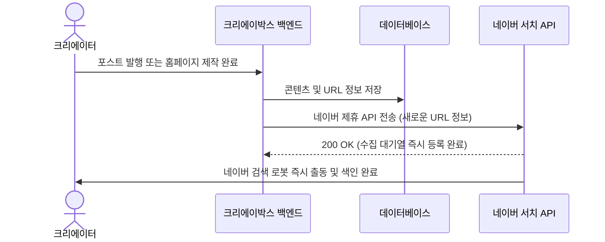

# 네이버 서치어드바이저 수집요청 제휴 API 도입 가이드

네이버 서치어드바이저(Webmaster Tool)에서 제공하는 **수집요청 제휴 API**의 혜택, 비즈니스 가치, 심사 절차 및 연동 개발 방안에 대한 정식 가이드라인 문서입니다.

---

## 1. 개요 및 플랫폼 기여 가치
일반적인 검색 엔진 최적화(SEO) 체계는 네이버 검색 로봇(Yeti)의 자동 크롤링 주기에 의존합니다. 하지만 이 방식은 신규 발행된 콘텐츠가 검색 결과에 색인(Index)되기까지 상당 시간(수일~수주일)이 소요될 수 있습니다.

**네이버 수집요청 제휴 API**는 크리에이박스 백엔드와 네이버 검색 시스템을 API로 직결하여, 콘텐츠가 탄생하는 즉시 색인을 요청하여 실시간으로 검색 결과에 노출하도록 지원하는 특권적인 연동 기술입니다.

---

## 2. 제휴 API 승인 시 결정적 혜택

### ⚡ ① 검색 색인 반영의 "실시간화" (Real-Time Indexing)
- **도입 전**: 네이버 로봇이 방문하여 사이트맵과 RSS를 긁어갈 때까지 수동 대기
- **도입 후**: 사용자가 글 작성을 완료하거나 새 홈페이지를 개설하자마자 즉시 수집을 요청하여, **수분 내에 검색 색인 및 반영 완료**

### 📈 ② 일일 수집 한도의 "무제한급 확장" (SaaS형 확장성 확보)
- **도입 전**: 웹마스터 도구 UI를 통한 일일 수집 요청 한도가 **하루 최대 50건 내외**로 한정되어 대규모 플랫폼 운영에 부적합
- **도입 후**: 하루에 수천~수만 건 이상의 대규모 URL에 대해 프로그래밍 방식(API)으로 제한 없이 실시간 자동 수집 요청이 가능하여 플랫폼의 지속적인 성장을 안전하게 뒷받침

### 🏆 ③ 크리에이터 유입 만족도 & SEO 시너지 극대화
- 크리에이박스를 이용하는 작가나 크리에이터들이 **"글을 올리자마자 네이버 검색 최상단 영역에 실시간 노출되는 쾌감"**을 직접 경험하게 되어 플랫폼 만족도와 락인(Lock-In) 효과 극대화
- 대외 공개용 스튜디오, 10대 대분류 기획 시리즈 및 55대 상세 분야 포스트의 SEO 랭킹 선점에 절대적으로 유리한 발판 마련

---

## 3. 네이버 심사 및 승인(ON) 획득 가이드

네이버 검색팀은 스팸성 사이트에 API 권한이 남용되는 것을 방지하기 위해 엄격한 **콘텐츠 유용성 및 독창성 검토**를 거쳐 스위치를 `ON` 상태로 활성화해 줍니다.

### 📌 승인 확률을 높이기 위한 핵심 체크리스트
1. **콘텐츠 독창성 (Originality)**
   - 타 사이트에서 단순 복사한 글이 아닌, 크리에이박스 내 AI 도구 및 에디터로 생산한 독자적이고 유익한 가치 중심 콘텐츠 유지
2. **기술적 SEO의 올바른 구현**
   - 현재 구현 완료된 동적 사이트맵(`sitemap.xml`)과 HTML 내 `canonical`, `og:tags` 등 핵심 메타 태그의 무결성 보존
3. **스팸 및 악성 링크 배제**
   - 기계적인 자동 생성 스팸 글로 인해 검색 결과 저해가 일어나지 않도록, 품질 필터링 가동 프로세스 확립

---

## 4. 향후 시스템 개발 연동 설계안 (Technical Spec)

네이버 제휴 심사 승인 완료 시, 크리에이박스 백엔드 스택에 다음과 같은 수집 전송 파이프라인을 탑재하여 자동화를 구현합니다.

### 🔄 데이터 송신 아키텍처



### 🛠️ 연동 API 규격 (참고 예시)
네이버가 제공하는 syndication/ping 엔드포인트 또는 웹마스터 API를 활용합니다:

- **Endpoint**: `https://api.naver.com/xml/engine/syndication/request` (또는 승인 시 전달되는 개별 API 게이트웨이 주소)
- **HTTP Method**: `POST`
- **Headers**:
  - `Content-Type: application/xml`
  - `Authorization: Bearer [네이버 제휴 발급 API 토큰]`
- **Body Payload (XML 예시)**:
  ```xml
  <?xml version="1.0" encoding="utf-8"?>
  <syndication xmlns="http://webmastertool.naver.com/schemas/syndication/2.0">
    <id>https://creaibox.com/sitemap.xml</id>
    <title>크리에이박스 콘텐츠 신규 발행</title>
    <updated>2026-07-07T14:27:00Z</updated>
    <entry>
      <title>신규 생성 콘텐츠 타이틀</title>
      <link href="https://creaibox.com/studio/writing/creaibox/post-12345"/>
      <id>https://creaibox.com/studio/writing/creaibox/post-12345</id>
      <updated>2026-07-07T14:27:00Z</updated>
      <author>
        <name>크리에이박스 유저</name>
      </author>
    </entry>
  </syndication>
  ```

---

## 5. 관리 조언
- 네이버 제휴 API 승인이 완료되는 즉시, 상기 개발 사양에 맞춘 비동기 핑(Ping) 전송 모듈 개발에 착수하는 것을 추천합니다.
- 정기적으로 네이버 서치어드바이저의 "리포트 및 진단" 탭을 모니터링하여, 오류 없이 수집 색인이 잘 이루어지고 있는지 점검해야 합니다.
