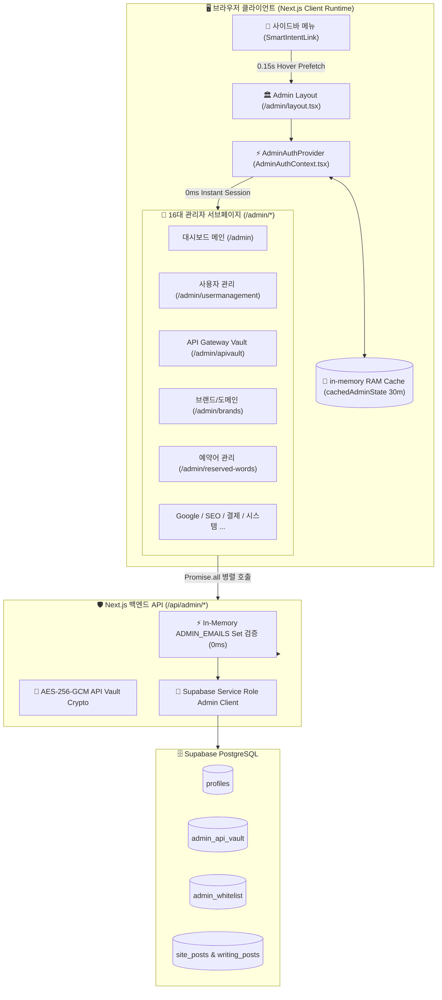
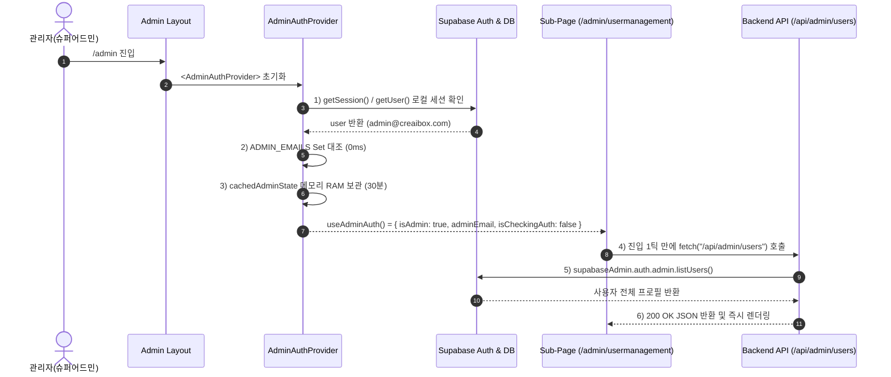
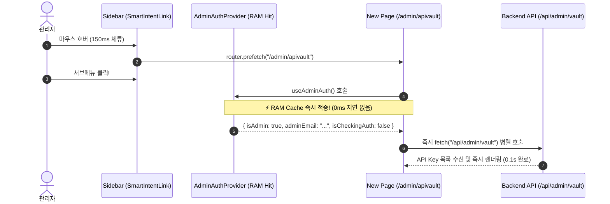

# 🔴 관리자 센터(Admin Center) 통합 아키텍처 & 0ms 전역 인증 캐싱 기술 명세서

> **관련 문서 링크**:
> - 🔵 [관리자 센터 실무 운용 및 관리 가이드](file:///Users/a1234/Local%20Sites/creaibox/docs/project/manual/01_core-and-infra/admin-center-operations-guide.md)
> - 🟡 [관리자 화이트리스트 DB 스키마 명세서](file:///Users/a1234/Local%20Sites/creaibox/docs/database/admin-whitelist-schema.md)
> - 🟢 [관리자 화이트리스트 SQL DDL](file:///Users/a1234/Local%20Sites/creaibox/docs/database/sql/admin-whitelist.sql)

---

## 1. 시스템 개요 및 설계 배경 (System Overview)

`CreaiBox` 관리자 센터(`/admin`)는 플랫폼의 16대 핵심 운영 서브시스템(회원 권한, API Vault, 브랜드/도메인 심사, 예약어, Google/SEO 연동, 결제, 시스템 로그 등)을 총괄 제어하는 슈퍼 어드민 백오피스입니다.

### 1-1. 해결된 기존 성능 병목 (The 3-Step Waterfall Bottleneck)
과거 관리자 센터는 사이드바에서 서브메뉴를 이동할 때마다 각 페이지가 독립적으로 인증을 재조회하는 **3중 직렬 네트워크 Waterfall**이 발생하여 2~3초간 블로킹 스피너가 지속되는 치명적인 지연 문제가 있었습니다:
1. `supabase.auth.getUser()` (원격 Auth 서버 조회: ~400ms) ⏳
2. ➔ `profiles.select("role")` (슈퍼 어드민 권한 조회: ~400ms) ⏳
3. ➔ `fetch("/api/admin/...")` (실제 관리자 데이터 조회: ~1,200ms) ⏳

### 1-2. 초고속 0ms 가속 아키텍처 (Zero-Latency Architecture)
본 아키텍처는 **전역 인증 캐싱 레이어(`AdminAuthContext`)**와 **인메모리 RAM 상태 보관(`cachedAdminState`)**, 그리고 **병렬 API 파이프라이닝(`Promise.all`)**을 통해 서브메뉴 이동 시 인증 대기시간을 **0ms로 즉시 단축**하여 클릭 즉시 0.1초 만에 화면이 열리도록 구현되었습니다.

---

## 2. 관리자 센터 아키텍처 구성도 (Architecture Diagram)

---

## 3. 인증 및 데이터 파이프라인 시퀀스 (Authentication Sequence)

### 3-1. 최초 관리자 센터 진입 시퀀스 (Initial Layout Mount)

### 3-2. 사이드바 서브메뉴 이동 시퀀스 (Subsequent Submenu Navigation - 0ms)

---

## 4. 16대 관리자 서브시스템 모듈 명세 (16 Core Submodules)

| # | 모듈명 | 라우팅 경로 | 담당 백엔드 API | 핵심 역할 및 기능 |
|:---:|---|---|---|---|
| 1 | **관리자 대시보드 메인** | `/admin` | `/api/admin/users`, `/api/admin/vault` | 전체 가입자, 유료 플랜 breakdown, API 호출량 집계, 병렬 로딩 |
| 2 | **사용자 관리** | `/admin/usermanagement` | `/api/admin/users` | 회원 목록, FREE/PAID/ADMIN 권한 변경, VIP 무상 수동 부여, 계정 차단 |
| 3 | **브랜드 ID & 도메인 관리** | `/admin/brands` | `/api/admin/brands` | 서브도메인 신청 승인/반려, 커스텀 도메인 DNS 검증, AI 상표권 침해 심사 |
| 4 | **Resend 이메일 모니터링** | `/admin/resend` | `/api/admin/resend` | 도메인별 이메일 계정 수, 실시간 발송/수신 통계 및 인바운드 웹훅 제어 |
| 5 | **API Gateway Vault** | `/admin/apivault` | `/api/admin/vault` | Gemini, OpenAI, Claude, Stability 등 15종 AI Key AES-256 암호화 관리 |
| 6 | **Google 연동 관리** | `/admin/google` | `/api/admin/google` | OAuth2, Search Console, GA4 연동 계정 및 토큰 갱신 관리 |
| 7 | **SEO 관리** | `/admin/seo` | `/api/admin/seo/status` | 사이트맵/robots.txt 점검, canonical 누락 검사, Google 색인 요청 |
| 8 | **Analytics 통계** | `/admin/analytics` | `/api/admin/analytics/status` | GA4 실시간 접속자, 유입 채널/국가/브라우저/기기별 통계 차트 |
| 9 | **YouTube 관리** | `/admin/youtube` | `/api/admin/youtube` | YouTube Data API v3 쿼터 모니터링 및 12개국 수집 배치 제어 |
| 10 | **결제 관리** | `/admin/billing` | `/api/admin/billing` | PortOne/Stripe 결제 내역, 정기 구독 상태, 매출 통계 집계 |
| 11 | **콘텐츠 관리** | `/admin/content` | `/api/admin/content` | 전체 블로그 발행 글, 썸네일 무결성, 불법 게시물 일괄 검수 |
| 12 | **시스템 관리** | `/admin/system` | `/api/admin/system` | Supabase DB 용량, 서버 헬스체크, 플랜별 일일 사용량 한도 제어 |
| 13 | **관리자 설정** | `/admin/settings` | `/api/admin/settings` | 플랫폼 운영 정책, 무인 크론 스케줄러 활성/비활성 제어 |
| 14 | **예약어 & 블랙리스트** | `/admin/reserved-words` | `/api/admin/reserved-words` | 22대 카테고리 시스템 예약어, 공공기관/상표권 선점 방지 DB |
| 15 | **B2B 맞춤/제휴 관리** | `/admin/business` | `/api/admin/business` | 기업형 맞춤 제작 신청서, 협업 제안서 및 견적 심사 |
| 16 | **AI 챗봇 이용 분석** | `/admin/chatbot` | `/api/admin/chatbot` | 사용자 AI 챗봇 대화 로그 분석 및 플랫폼 개선 건의사항 도출 |

---

## 5. 보안 및 권한 방어 체계 (Security & Defense)

1. **클라이언트 2중 가드**:
   * 비관리자 접근 시 `AdminAuthContext` 및 개별 페이지에서 즉시 경고창을 띄우고 루트(`/`)로 리다이렉트.
2. **서버 API 엄격 검증 (`x-admin-email`)**:
   * 모든 백엔드 API 라우트(`/api/admin/*`)는 요청 헤더의 `x-admin-email`을 추출하여 `ADMIN_EMAILS` Set 및 `admin_whitelist` DB 테이블과 교차 대조하여 비인가 요청 시 `401 Unauthorized` 또는 `403 Forbidden`을 즉각 반환.
3. **API Vault AES-256-GCM 암호화**:
   * DB에 평문 API 키가 영구 저장되지 않으며, 서버 런타임에서만 복호화되어 외부 노출을 원천 차단.
