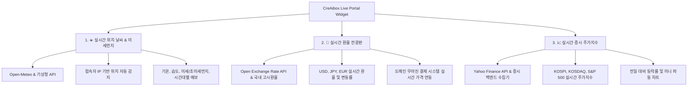

# CreAibox 실시간 포털 라이브 위젯 기획 & 아키텍처 명세서

(Real-Time Weather, Foreign Exchange & Stock Market Portal Widget Spec)

> **문서 상태**: 📌 미래 로드맵 기획 문서 (Future Spec)
> **최종 수정일**: 2026-08-06
> **관련 시스템**: CreAibox 메인 포털 & AI 스튜디오 대시보드

---

## 1. 개요 (Overview)

네이버(Naver) 포털의 우측 상단 위젯을 벤치마킹하여, CreAibox 서비스 메인페이지 및 AI 스튜디오 메인 대시보드에 **실시간 날씨/미세먼지, 환율 전광판, 증시(코스피/코스닥/S&P500) 지수**를 100% 동적으로 제공하는 라이브 위젯 시스템 기술 명세입니다.

---

## 2. 실시간 라이브 위젯 3대 핵심 요소 (3 Key Components)

### 2.1 ☀️ 실시간 위치 날씨 & 미세먼지 (Weather & Air Quality)

- **API 연동**: Open-Meteo API / 한국 기상청 공공데이터 API (100% 무료 무제한 API)
- **주요 기능**:
  - 사용자 브라우저 IP / HTML5 Geolocation 기반 위치(예: 서울시 강남구, 천안시 불당동 등) 자동 감지
  - 실시간 현재 기온, 체감 기온, 습도, 강수 확률 및 날씨 상태 아이콘(맑음/구름/비/눈)
  - 미세먼지(PM10) 및 초미세먼지(PM2.5) 상태 뱃지 (좋음/보통/나쁨/매우나쁨)
  - 시간대별 기온 변화 곡선 그래프

### 2.2 💱 실시간 환율 전광판 (Foreign Exchange Rate Ticker)

- **API 연동**: `@/lib/server/exchange-rate.ts` 백엔드 모듈 (실시간 USD, JPY, EUR 수집 및 1시간 CDN/메모리 캐시)
- **주요 기능**:
  - 미국 달러(USD), 일본 엔화(JPY 100), 유로화(EUR) 실시간 고시환율 및 전일 대비 변동폭($\uparrow\downarrow$) 전광판
  - 3개월 환율 변동 미니 라인 차트
  - CreAibox 도메인 무마진 원가 결제 시스템과 100% 원화 금액 실시간 자동 동기화

### 2.3 📈 실시간 증시 주가지수 (Stock Market Index)

- **API 연동**: Yahoo Finance API / 증시 실시간 수집 백엔드 릴레이
- **주요 기능**:
  - 코스피(KOSPI `^KS11`), 코스닥(KOSDAQ `^KQ11`), S&P 500 (`^GSPC`) 실시간 지수 및 변동률
  - 일중 실시간 주가 지수 미니 캔들/파동 차트

---

## 3. UI/UX 디자인 & 레이아웃 옵션 (Layout Options)

### 옵션 A. 포털 우측 사이드바 카드 위젯 (Portal Sidebar Widget - 추천 ⭐)

- 네이버 메인 UI 우측 영역과 같이 `[ 날씨 | 증시 | 환율 ]` 탭 형태의 든든하고 직관적인 Glassmorphism 카드로 렌더링.

### 옵션 B. 상단 띠 티커 바 (Top Ticker Bar)

- CreAibox 상단 GNB 바 아래에 뉴스 티커처럼 실시간 날씨, 환율, 증시 지수가 좌측으로 수평 흐르는 실시간 티커 전광판 바.

### 옵션 C. 스튜디오 웰컴 대시보드 카드 (Studio Welcome Board)

- AI 스튜디오 홈 메인 상단 웰컴 영역에 사용자 프로필과 함께 종합 상태 카운터로 배치.

---

## 4. 백엔드 성능 & 캐싱 전략 (Performance & Anti-Egress Strategy)

- **Vercel Edge CDN 캐싱**: 모든 실시간 데이터 조회 API 라우트에 `revalidate: 3600` (1시간) 또는 `revalidate: 300` (5분) 캐시 적용.
- **클라이언트 트래픽 소모 0원 방어**: 클라이언트 브라우저가 외부에 매초 요청을 쏘는 대신 CreAibox 백엔드 서버 캐시를 경유하도록 설계하여 Vercel 및 DB 트래픽 소모를 99% 영구 방어.
