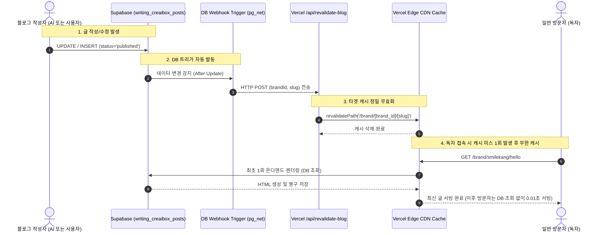

# [Architecture Specification] On-Demand Revalidation & Supabase Webhook Pipeline

> **문서 분류**: 아키텍처 기술 명세서 (Architecture Spec)
> **연관 실무 매뉴얼**: `docs/project/manual/on-demand-revalidation-webhook-manual.md` (실제 Supabase 세팅 방법 및 실무자 가이드는 매뉴얼을 참조하세요)
> **연관 데이터베이스 DDL**: `docs/database/sql/webhook-revalidate-blog.sql` (Supabase 실행용 순수 SQL 스크립트)
> **관련 모듈**: `src/app/api/revalidate-blog/route.ts`, `docs/database/sql/webhook-revalidate-blog.sql`, Vercel Edge Cache
> **시스템 레이어**: Supabase Database ↔ Vercel Next.js App Router (Cache Layer)

---

## 1. 아키텍처 개요 (Overview)
초기 플랫폼에서는 Vercel Global Edge CDN의 Time-based ISR (60초 폴링) 방식을 사용했으나, 다중 테넌트(고객사) 블로그 확장에 따른 트래픽 폭증 및 데이터베이스 요금 폭탄을 방어하기 위해 **"무한 캐시 + 온디맨드 DB 트리거 무효화 (Method B)"** 아키텍처로 스케일업(Scale-up) 하였습니다.

* **Before (ISR 60s)**: 누군가 방문하면 60초마다 무조건 DB를 조회하여 최신 글이 있는지 확인. (트래픽 비례 서버/DB 부하 증가)
* **After (Infinite Cache + Webhook)**: 캐시 수명을 무한대(`revalidate = false`)로 설정하여 트래픽 조회 부하를 0으로 만들고, 글이 작성/수정/삭제되는 순간에만 데이터베이스 트리거가 Vercel API를 호출하여 해당 페이지의 캐시만 정밀 타격하여 삭제.

## 2. 데이터 흐름도 (Data Flow Sequence)

## 3. 핵심 모듈 상세

### 3.1. 무한 캐시 설정 (Next.js 14)
- **적용 파일**: `src/app/blog/page.tsx`, `src/app/brand/[brand_id]/page.tsx` 등 모든 블로그 라우트
- **설정값**: `export const revalidate = false;` (캐시 수명 무한대)

### 3.2. 온디맨드 무효화 API (`src/app/api/revalidate-blog/route.ts`)
- **역할**: 외부(또는 DB)에서 POST 요청을 받으면 `revalidatePath` 함수를 통해 Vercel Edge Cache를 삭제.
- **파라미터**: `brandId`, `slug`, `categoryIds`
- **동작**: 파라미터로 넘어온 브랜드 홈, 상세 글, 카테고리 목록의 캐시만 선택적으로 지워서(Targeted Invalidation) 시스템 충격을 최소화함.

### 3.3. Supabase Webhook DDL (`docs/database/sql/webhook-revalidate-blog.sql`)
- **역할**: 애플리케이션 소스 코드를 수정하지 않고도, DB 레이어에서 100% 누락 없이 갱신 이벤트를 포착.
- **pg_net 확장**: 비동기 HTTP POST 요청을 보내어 데이터베이스 트랜잭션 지연(Lock)을 방지.

## 4. 백엔드 유지보수 주의사항
1. **로컬 테스트 시**: 트리거에 하드코딩된 API 주소(`https://creaibox.com/api/revalidate-blog`)를 `https://로컬ngrok주소/api/revalidate-blog` 로 임시 변경해야 로컬에서도 캐시 무효화 테스트가 가능합니다.
2. **테이블 스키마 변경 시**: `brand_id` 또는 `slug` 컬럼명이 변경되면 Webhook 함수의 JSON Payload 구성 부분도 반드시 함께 수정해야 합니다.

## 5. 글로벌 적용 범위 (Global Application Scope)
이 아키텍처(Method B: 무한 캐시 + 0.01초 광속 서빙)는 애플리케이션 내 다음 5가지 영역에 **100% 동일하게 영구 적용**되어 있습니다.
1. **크리에이박스 메인 블로그** (`/blog`)
2. **테넌트 서브도메인 블로그** (`*.creaibox.com`)
3. **독립 도메인 블로그** (`downhubs.com`, `golfgosu.net` 등)
4. **AI 웹사이트 빌더로 제작된 홈페이지 및 모든 서브페이지** (`/clients/dynamic-renderer/...`)
5. **향후 생성될 모든 신규 고객사 커스텀 사이트 및 템플릿**
