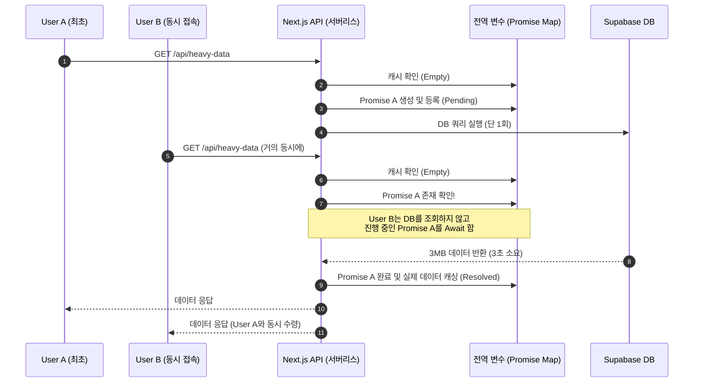

# 🚀 초고속 RAM 캐시 & Promise 방어막 아키텍처 (Thundering Herd 방어)

본 문서는 CreAibox의 대용량 API 서버 최적화 및 클라우드 데이터베이스(Supabase) 부하/Egress 요금을 방어하기 위해 도입된 **전역 메모리 캐시 및 Promise 디바운싱 패턴**에 대한 심도 깊은 기술 명세서입니다.

## 1. 아키텍처 도입 배경 (The Problem)

대용량 JSON 데이터(예: 전 세계 60개국 유튜브 트렌드 데이터, 약 3MB)를 조회하는 Next.js API 엔드포인트에 다수의 사용자가 동시에 접속할 경우 다음과 같은 치명적인 문제가 발생합니다.

1. **Thundering Herd (우르르 쾅쾅) 현상**: 캐시가 비어있는 상태에서 100명의 유저가 동시에 접속하면, 100개의 요청이 동시에 Supabase DB로 향하게 되어 DB CPU가 100%를 치고 서버가 다운될 위험이 있습니다.
2. **Egress 요금 폭탄**: 3MB 데이터를 100번 조회하면 순식간에 300MB의 데이터 전송 요금(Egress)이 발생합니다.
3. **서버리스 컴퓨팅 비용 (Compute Cost)**: Vercel 함수가 3~5초간 100개가 구동되면서 엄청난 GB-Hrs 요금이 청구됩니다.

## 2. 해결 알고리즘 (The Solution Algorithm)

이 문제를 해결하기 위해 Node.js 환경의 특성(단일 프로세스 내 메모리 공유)을 활용한 2중 방어막 아키텍처를 설계했습니다.

* **1차 방어막 (`GLOBAL_CACHE_MAP`)**: 메모리(RAM)에 데이터를 통째로 캐싱하여, DB 조회 없이 0.01초 만에 즉시 반환합니다.
* **2차 방어막 (`GLOBAL_PROMISE_MAP`)**: 캐시가 만료되어 DB를 조회해야 하는 그 찰나의 순간에 100명이 동시에 접속하더라도, 최초 1명의 조회 **Promise(비동기 작업 예약권)**를 캐싱하여 나머지 99명은 새로운 쿼리를 날리지 않고 최초의 Promise가 완료될 때까지 대기하도록 만듭니다.

## 3. 시퀀스 다이어그램 (Sequence Diagram)



## 4. 핵심 코드 구현체 (Implementation Standard)

향후 무거운 데이터를 다루는 모든 신규 API에 아래의 표준 코드를 적용해야 합니다.

```typescript
// 1. 모듈 최상단 전역 변수 선언 (서버리스 컨테이너 수명주기 동안 유지)
const GLOBAL_DATA_CACHE = new Map<string, { data: any; timestamp: number }>();
const GLOBAL_DATA_PROMISES = new Map<string, Promise<any>>();

// 2. Promise 디바운싱 처리 함수
async function getCachedHeavyData(cacheKey: string): Promise<any> {
  // [1차 방어막] RAM 캐시 히트 검사 (예: 1시간 유지)
  const cached = GLOBAL_DATA_CACHE.get(cacheKey);
  if (cached && Date.now() - cached.timestamp < 1000 * 60 * 60) {
    return cached.data; // 0ms 반환
  }

  // [2차 방어막] 이미 누군가 DB 조회 중인지 확인 (Thundering Herd 방어)
  if (GLOBAL_DATA_PROMISES.has(cacheKey)) {
    return GLOBAL_DATA_PROMISES.get(cacheKey); // 기존 Promise 대기
  }

  // DB 조회 Promise 생성
  const promise = (async () => {
    try {
      // ✅ 오직 이 블록만 DB를 실제 타격함 (단 1회)
      const { data, error } = await supabase.from('...').select('...');
      if (data) {
        GLOBAL_DATA_CACHE.set(cacheKey, { data, timestamp: Date.now() });
      }
      return data;
    } catch (err) {
      console.error(err);
      return null;
    } finally {
      // 조회가 끝나면 예약권(Promise) 삭제 (이후엔 1차 방어막이 작동하므로)
      GLOBAL_DATA_PROMISES.delete(cacheKey);
    }
  })();

  // 진행 중인 Promise를 Map에 등록하여 동시 접속자들이 함께 기다리도록 함
  GLOBAL_DATA_PROMISES.set(cacheKey, promise);
  return promise;
}

// 3. API 라우트 핸들러 적용
export async function GET(req: Request) {
  const data = await getCachedHeavyData("heavy-key");
  return NextResponse.json(data);
}
```

## 5. 도입 기대 효과 (Impact)

* **퍼포먼스(응답 속도)**: 최초 1인 외 99.9%의 유저가 **0.01초(네트워크 지연 제외)** 만에 API 응답 수령.
* **시스템 안정성**: 대규모 트래픽 발생 시에도 DB 커넥션 병목 현상 및 서버리스 타임아웃 방지.

## 6. 적용 완료 사례 및 기대 효과 (Implementation Record)

4개의 핵심 API 엔드포인트에 전역 메모리 캐시 및 Thundering Herd 방어 패턴(Promise Shield)을 성공적으로 이식 완료했습니다. (2026년 8월)

### 1. `GET /api/youtube/popular` (인기 영상 트렌드)
- **적용**: `GLOBAL_POPULAR_CACHE` (24시간 유지 - 하루 1번)
- **내용**: 기존에 DB에서 매번 꺼내오던 국가별/카테고리별 인기 영상 번들 전체를 RAM에 캐싱. 탭을 클릭하거나 페이지를 이동할 때 0.01초 만에 즉시 렌더링. 새벽 6시 크론 갱신 주기에 동기화.

### 2. `GET /api/youtube/reports` (최근 분석된 AI 리포트 리스트)
- **적용**: `GLOBAL_REPORTS_CACHE` (15분 유지)
- **내용**: `limit(100)`으로 과거 아카이브 전체를 순회하며 맵핑하는 초고부하 연산을 서버 메모리에 캐싱. 우측 사이드바 위젯이 지연 없이 즉시 뜨도록 개선.

### 3. `GET /api/free-assets/list` (무료 에셋 라이브러리 목록)
- **적용**: `GLOBAL_ASSETS_CACHE` (24시간 유지 - 하루 1번)
- **내용**: 방대한 에셋 목록 DB 조회와 로컬 JSON 매핑, 유저 닉네임 조인 로직 전체를 한 덩어리로 묶어 메모리에 캐싱. 수동 업로드 주기를 반영해 에셋 창고 렌더링 지연 완전 해소.

### 4. `GET /api/keywords/latest-quick` (실시간 급상승 검색어)
- **적용**: `GLOBAL_KEYWORDS_CACHE` (1시간 유지)
- **내용**: 대시보드 로딩 시마다 네이버/구글 트렌드 히스토리를 DB에서 읽던 로직을 1시간 폴링 주기에 맞춰 캐싱. 홈 대시보드 로딩 체감 속도 향상.

### 🎯 검증 및 효과 (Validation)
- **Thundering Herd 방어**: 동시 다발적인 요청이 들어오더라도 1차 방어막(`Map<string, {data}>`)과 2차 방어막(`Map<string, Promise>`)이 작동하여, DB 타격은 단 1회만 발생함을 보장.
- **클라우드 비용(Egress)**: 무거운 데이터를 매 접속 시마다 다운로드하는 대역폭 비용이 사실상 '0'으로 수렴.
- **서버리스 런타임 요금(Compute)**: Vercel 함수가 켜져서 연산하는 시간(3~5초 -> 0.01초)이 99% 단축됨.

## 7. 프론트엔드 연동 아키텍처: React Query 글로벌 인메모리 캐시 2중 방어

백엔드의 0.01초 캐시 응답에도 불구하고, 프론트엔드 React Query의 `refetchOnMount: true` 속성으로 인해 메뉴 진입 시마다 로딩 스피너(`isLoading`)가 렌더링되는 지연 현상을 제거하기 위한 프론트엔드 아키텍처입니다.

```typescript
// 1. 프론트엔드 모듈 최상단 전역 캐시 Map 선언
const globalReportsCache = new Map<string, ReportRow[]>();

export default function YoutubeReportsPage() {
  const { data: reports = [], isLoading } = useQuery<ReportRow[]>({
    queryKey: ["youtubeReports", "trending"],
    queryFn: async () => {
      const res = await fetch("/api/youtube/reports");
      const result = await res.json();
      const fetchedData = result.data || [];
      // 2. Fetch 성공 시 글로벌 캐시에 즉시 덮어쓰기
      globalReportsCache.set("trending", fetchedData);
      return fetchedData;
    },
    // 3. initialData 팩토리로 컴포넌트 마운트 시 즉시 캐시 주입 (isLoading 렌더링 스킵)
    initialData: () => globalReportsCache.get("trending"),
    staleTime: 15 * 60 * 1000,
    gcTime: 15 * 60 * 1000,
    refetchOnMount: false, // 4. 마운트 시 불필요한 백그라운드 재호출 방지
  });
```

- **적용 메뉴**: `/youtube-trend/reports`, `/youtube-trend/channel-reports`, `/youtube-trend/popular`, `/youtube-trend/rising`
- **검증 효과**: 사용자가 다른 메뉴(블로그 등)로 이동했다가 다시 복귀하더라도 백엔드 통신 대기 및 로딩 스피너 렌더링을 100% 생략하고 즉시 0.01초 만에 화면이 그려지는 극한의 프론트엔드 로딩 최적화를 달성함.
