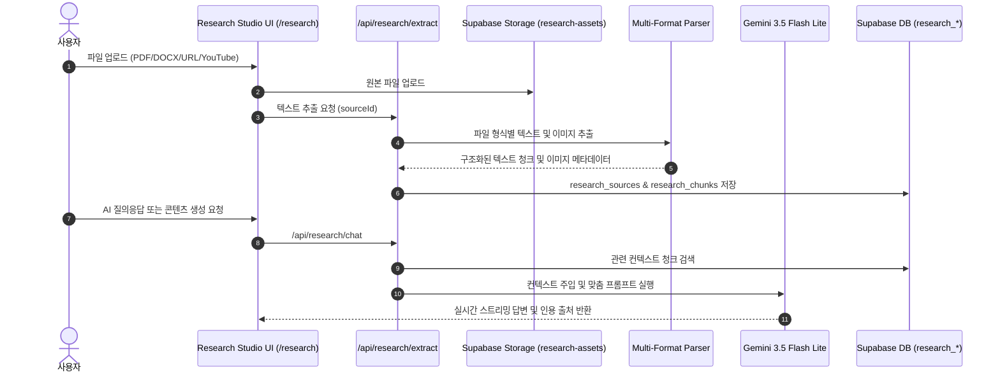

# [Architecture Specification] Research Studio Architecture (자료 분석 스튜디오)

> **문서 분류**: 아키텍처 기술 명세서 (Architecture Spec)
> **연관 실무 매뉴얼**: `docs/project/manual/01_core-and-infra/research-studio-guide.md`
> **연관 DB 스키마**: `docs/database/research-studio-schema.md`
> **연관 실행 SQL**: `docs/database/sql/research-studio-schema.sql`

---

## 1. 아키텍처 개요 (Overview)
Research Studio는 PDF, DOCX, PPTX, Excel, 이미지, YouTube, 웹페이지 등 다양한 포맷의 외부 원본 자료를 파싱/추출하고, 이를 바탕으로 RAG(Retrieval-Augmented Generation) 기반의 AI 질의응답 및 맞춤형 콘텐츠(블로그, 요약본, 스크립트)를 자동 생성하는 데이터 인텔리전스 엔진입니다.

## 2. 핵심 파이프라인
1. **스토리지 파이프라인 (`research-assets`)**:
   - 업로드된 문서는 `{projectId}/{sourceId}/{timestamp}-{slug}.webp` 형식으로 WebP 압축(최대 1600px, 품질 80) 후 안전하게 격리 보관.
2. **청킹 및 인덱싱**:
   - 추출된 대용량 텍스트는 시맨틱 청크 단위로 분할하여 `research_chunks` 테이블에 저장, RAG 질의 시 고속 검색 지원.
3. **콘텐츠 생성 연결**:
   - 추출된 자료는 원클릭으로 Writing Studio(블로그 원고) 또는 Video Studio(영상 대본)로 전달 가능.
