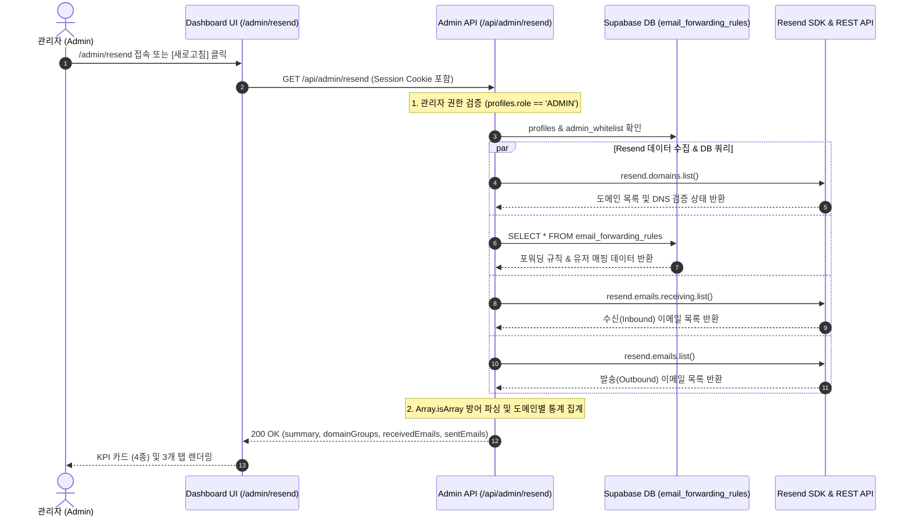

# Resend 이메일 & 도메인 통합 모니터링 시스템 아키텍처 (`docs/arch/resend-email-monitoring-architecture.md`)

## 1. 개요 (Overview)
본 문서는 CreAibox 관리자 센터(`/admin/resend`) 내 구축된 **Resend 이메일 계정, 등록 도메인 검증 상태, 실시간 메일 수신(Inbound) 및 발송(Outbound) 이력 통합 모니터링 시스템**의 기술 아키텍처 명세서입니다.

---

## 2. 데이터 흐름 & 시퀀스 다이어그램 (Sequence Diagram)



---

## 3. 백엔드 API 명세 (`GET /api/admin/resend`)

### 3.1 요청 (Request)
- **Endpoint**: `/api/admin/resend`
- **Method**: `GET`
- **Authentication**: 관리자 세션 쿠키 (`@/utils/supabase/server`) 및 `profiles.role === "ADMIN"`

### 3.2 응답 구조 (Response Schema)
```json
{
  "success": true,
  "summary": {
    "totalDomains": 1,
    "totalEmailRules": 1,
    "totalReceived": 20,
    "totalSent": 20
  },
  "domainGroups": [
    {
      "domainName": "creaibox.com",
      "status": "verified",
      "rulesCount": 1,
      "rules": [
        {
          "id": "rule_uuid",
          "emailAddress": "ceo@creaibox.com",
          "aliasPrefix": "ceo",
          "forwardTo": "user@gmail.com",
          "isActive": true,
          "createdAt": "2026-08-05T00:00:00Z",
          "ownerEmail": "owner@creaibox.com",
          "ownerNickname": "CreAibox개발자"
        }
      ]
    }
  ],
  "receivedEmails": [
    {
      "id": "email_id",
      "from": "sender@naver.com",
      "to": ["ceo@creaibox.com"],
      "subject": "테스트 이메일",
      "createdAt": "2026-08-05T11:40:00Z"
    }
  ],
  "sentEmails": [
    {
      "id": "email_id",
      "from": "ceo@creaibox.com",
      "to": ["user@gmail.com"],
      "subject": "[전달: ceo@creaibox.com] 테스트 이메일",
      "status": "delivered",
      "createdAt": "2026-08-05T11:40:01Z"
    }
  ]
}
```

---

## 4. 핵심 회복력 및 파싱 방어 로직 (Resilience & Defense Pattern)

Resend Node.js SDK 응답 구조가 버전별로 `{ data: [...] }` 또는 `{ data: { data: [...] } }` 형태로 변동될 가능성에 대비하여 모든 API 응답 수집부에 `Array.isArray` 2단계 언팩 방어 로직을 적용했습니다.

```typescript
// Resend 수신(Inbound) 이메일 목록 안전 추출 파이프라인
let receivedEmails: any[] = [];
try {
  const receivingRes = await resend.emails.receiving.list();
  const rawInbound = (receivingRes as any)?.data;
  if (Array.isArray(rawInbound)) {
    receivedEmails = rawInbound;
  } else if (Array.isArray(rawInbound?.data)) {
    receivedEmails = rawInbound.data;
  } else {
    receivedEmails = [];
  }
} catch (inboundErr: any) {
  console.warn("Resend inbound emails fetch warning:", inboundErr?.message);
}
```

---

## 5. 비용 및 트래픽 제어 (Egress & Cost Control)

1. **Supabase Egress 0.001MB 방어**:
   - DB 조회는 `email_forwarding_rules` 테이블 1개만 수집하며 메인 이메일 본문(`content`)을 DB에 별도 쌓지 않으므로 트래픽 소모가 제로에 가깝습니다.
2. **Resend API 조회 비용 0원**:
   - 수신/발송 내역 조회 API(`resend.emails.receiving.list`, `resend.domains.list`)는 Resend 무상 조회 권한으로 실행됩니다.
3. **수동 요청 기반(On-Demand) 호출**:
   - 무분별한 백그라운드 5초 간격 폴링을 금지하고, 페이지 마운트 1회 + 관리자 `[ 새로고침 ]` 클릭 시에만 조회가 수행됩니다.
