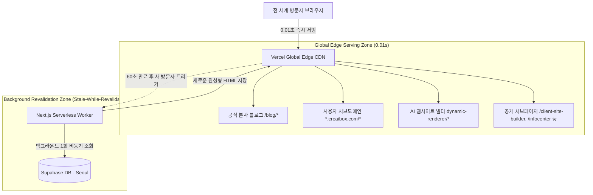
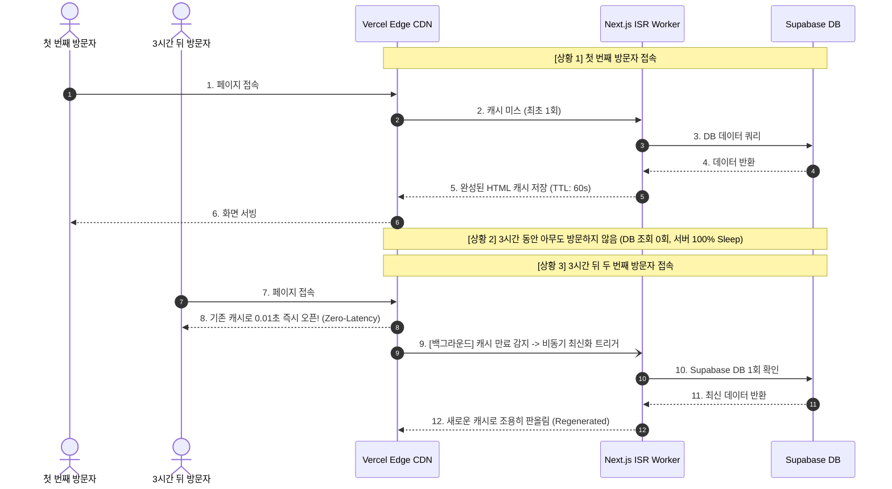

# CreaiBox Vercel Global Edge CDN 캐시 (ISR 60s) 아키텍처 기술 명세서

> **최종 수정일**: 2026-08-16
> **문서 버전**: v1.0
> **표준 규격**: Vercel Global Edge CDN, Next.js App Router ISR (Incremental Static Regeneration), Stale-While-Revalidate (SWR), React `cache()` Data Layer Optimization

---

## 1. 아키텍처 개요 (Overview)

CreaiBox의 모든 대중 공개 페이지(공식 블로그, 사용자 서브도메인 블로그, AI 웹사이트 빌더로 제작된 고객사 홈페이지 및 서브페이지, 템플릿 마켓)는 **0.01초 광속 서빙(Instant Navigation)** 및 **Vercel/Supabase 비용 0원 방어**를 위해 **Vercel Global Edge CDN 캐시 (ISR 60s)** 아키텍처를 100% 표준으로 채택한다.



---

## 2. 핵심 동작 알고리즘: Stale-While-Revalidate (SWR)

ISR(Incremental Static Regeneration)은 시계처럼 주기적으로 DB를 찌르는 Cron 스케줄러가 아니며, **철저한 On-Demand(요청 기반)** 방식으로 작동한다.



### 핵심 수치 및 스펙

1. **서빙 지연 시간(TTFB)**: `< 20ms` (전 세계 Edge 로케이션에서 0.01초 즉시 응답)
2. **DB 조회 빈도**: 방문자가 몰려도 URL당 60초에 최대 1회만 DB 조회.
3. **무부하 상태(Idle)**: 방문자가 없는 글/페이지는 1주일, 1년 동안 **DB 조회 0회(Complete Zero-Load)**.

---

## 3. 4대 레이어별 최적화 명세

### 3.1. Edge Middleware 라우팅 인메모리 가속 (`src/proxy.ts`)

* **문제점**: 서브도메인(`*.creaibox.com`) 접속 시 Edge 미들웨어가 매번 Supabase DB를 찔러 300~500ms의 네트워크 라운드트립이 발생함.
* **해결책**: 5분 TTL의 인메모리 맵(`dynamicClientCache`)을 탑재하여 미들웨어 단계의 DB 조회를 0ms로 단축.

```ts
// src/proxy.ts
const dynamicClientCache = new Map<string, { isDynamic: boolean; expiry: number }>();
```

### 3.2. Server Component 정적 렌더링 방해 요소 원천 제거

* **원칙**: Server Component 내부에서 `cookies()`, `headers()` 등 동적 요청 객체를 직접 호출하면 Next.js가 ISR을 강제로 해제(Bail-out)하고 매번 SSR로 전락함.
* **해결책**: 테마(`blog_theme`)나 인증 상태는 Client Component Wrapper(`BlogClientWrapper.tsx`, `PostClientWrapper.tsx`)의 `localStorage` / `useEffect`로 분리하여 페이지의 **100% 순수 정적 HTML 캐싱**을 보장.

### 3.3. React `cache()`를 통한 중복 DB 쿼리 제거

* `generateMetadata()`와 `Page()` 본문 컴포넌트가 동일한 `slug`나 `brand_id`를 조회할 때 단일 렌더 사이클 내에서 DB 조회가 1회만 일어나도록 React `cache()`로 래핑.

```ts
import { cache } from "react";

const fetchPublishedPost = cache(async (slug: string) => {
  const supabase = await createAdminClient();
  const { data } = await supabase
    .from("writing_creaibox_posts")
    .select(...)
    .eq("slug", slug)
    .eq("status", "published")
    .limit(1);
  return data?.[0] || null;
});
```

### 3.4. 비차단(Non-blocking) 비동기 조회수 트래커

* SSR 렌더링 중 `views + 1` 쓰기(Write) 작업을 동기적으로 실행하면 DB Write Lock으로 인해 렌더링이 500ms 이상 지연됨.
* 전용 `<PostViewTracker postId={id} />` 컴포넌트 및 `/api/blog/view` 엔드포인트를 구축하여 페이지가 브라우저에 뜬 후 백그라운드에서 조회수를 증가시킴.

---

## 4. 적용 대상 및 시스템 라우팅 맵

| 라우트 경로                                    | 대상 서비스                       | ISR 설정값          | 최적화 기법                                                |
| :--------------------------------------------- | :-------------------------------- | :------------------ | :--------------------------------------------------------- |
| `src/app/blog/page.tsx`                      | 본사 공식 블로그 메인             | `revalidate = 60` | Edge CDN 캐시                                              |
| `src/app/blog/[slug]/page.tsx`               | 본사 블로그 상세 포스트           | `revalidate = 60` | `generateStaticParams`, `cache()`, `PostViewTracker` |
| `src/app/brand/[brand_id]/*`                 | 유저 서브도메인 블로그            | `revalidate = 60` | 쿠키 호출 제거, 클라이언트 테마 분리                       |
| `src/app/clients/dynamic-renderer/*`         | AI 웹사이트 빌더 (홈/서브/블로그) | `revalidate = 60` | 섹션 정적 번들링, Edge 캐싱                                |
| `src/app/client-site-builder/page.tsx`       | AI 웹사이트 빌더 홍보 랜딩        | `revalidate = 60` | SEO 메타데이터 + 엣지 캐시                                 |
| `src/app/infocenter/[[...section]]/page.tsx` | 고객지원 인포센터                 | `revalidate = 60` | FAQ/공지 엣지 캐시                                         |
| `src/app/clients/[client_id]/page.tsx`       | 마켓 템플릿 쇼핑 사이트           | `revalidate = 60` | 템플릿 프리뷰 엣지 캐시                                    |

---

## 5. 관리 및 캐시 무효화 (On-Demand Revalidation)

* 새 글이 발행되거나 기존 글이 수정될 때, 주기적 60초 자동 갱신 외에도 Next.js `revalidatePath('/blog/[slug]')` 또는 `revalidatePath('/blog')`를 호출하여 실시간 즉시 갱신이 가능하다.
