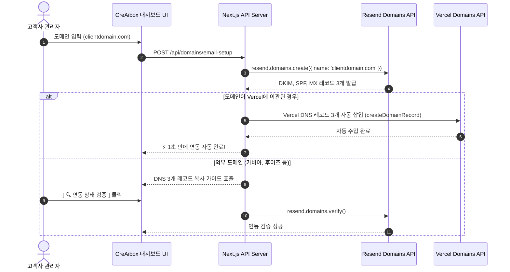

# 📧 CreAibox 커스텀 도메인 이메일 시스템 설계서 (Custom Domain Email System Spec)

본 문서는 크리에이박스(CreAibox) 및 멀티 브랜드(Downhubs 등), 그리고 B2B 고객사(커스텀 도메인 보유 기업)에게 커스텀 도메인 기반 이메일 수발신 서비스(`ceo@creaibox.com`, `contact@clientdomain.com`)를 제공하기 위한 전체 시스템 아키텍처 및 기술 명세서입니다.

---

## 1. 🎯 개요 및 비즈니스 목표

1. **자사 대표 이메일 구축 (`ceo@creaibox.com`)**:
   - 리눅스 메일 서버 구축 없이 100% 무료/고효율로 자사 도메인 커스텀 이메일 수발신 환경 구축.
2. **서비스 가입 유저 커스텀 이메일 부여 (`username@downhubs.com`)**:
   - 서비스 이용자 전원에게 고유 도메인 이메일 계정 및 웹 수발신/포워딩 서비스 무료 제공으로 강력한 락인(Lock-in) 효과 창출.
3. **B2B 고객사 커스텀 도메인 메일 솔루션 (`contact@clientdomain.com`)**:
   - 고객사 소유 도메인의 1초 자동 이메일 수발신 인프라 제공 (B2B SaaS 프리미엄 유료 구독 모듈).

---

## 2. 🏛️ 시스템 전체 아키텍처 (System Architecture)

```mermaid
flowchart TD
    subgraph Client["사용자 / 고객사 (Client Layer)"]
        Sender["외부 이메일 발신자"]
        UserWebUI["CreAibox 웹 대시보드 UI (/studio/email)"]
        UserGmail["고객사 개인 Gmail (client@gmail.com)"]
    end

    subgraph Resend["Resend Cloud Infrastructure"]
        ResendInbound["Resend Inbound Mail Engine"]
        ResendOutbound["Resend Outbound Mail API (SMTP)"]
        ResendDomainAPI["Resend Domains API"]
    end

    subgraph CreAiboxBackend["CreAibox Next.js Backend & Vercel"]
        VercelDNS["Vercel DNS API (Auto Record Injection)"]
        WebhookHandler["Inbound Mail Webhook (/api/webhooks/email)"]
        SendAPI["Outbound Mail API (/api/email/send)"]
    end

    subgraph SupabaseDB["Supabase Database"]
        EmailsTable["public.user_emails (이메일 수발신 보관함)"]
        DomainsTable["public.custom_domains (도메인 DNS 상태)"]
    end

    %% Inbound Flow
    Sender -->|발송: user@client.com| ResendInbound
    ResendInbound -->|Webhook (JSON)| WebhookHandler
    WebhookHandler -->|Insert| EmailsTable
    WebhookHandler -->|Forward (Optional)| UserGmail

    %% Outbound Flow
    UserWebUI -->|메일 작성 & 전송| SendAPI
    SendAPI -->|API Call| ResendOutbound
    ResendOutbound -->|전송| Sender

    %% Domain Provisioning Flow
    UserWebUI -->|도메인 등록 요청| VercelDNS
    VercelDNS -->|DNS 자동 주입| ResendDomainAPI
```

---

## 3. 🔑 핵심 기술 요소 및 연동 구조

### 3.1 DNS & 네임서버 (Vercel DNS vs Cloudflare DNS)
- **Vercel DNS 유지 방식 (기본 권장)**:
  - 현재 `creaibox.com`은 Vercel 네임서버(`ns1.vercel-dns.com` 등)를 이용 중.
  - 네임서버 이전 없이 Vercel DNS 대시보드에 **Resend MX/TXT(DKIM/SPF) 레코드만 추가**하여 연동.
- **Vercel Domains API 자동 연동 (`Zero-Touch Injection`)**:
  - 고객사가 도메인을 저희 Vercel로 이관했거나 CreAibox에서 등록한 경우, 백엔드가 `Vercel Domains API` (`createDomainRecord`)를 직접 호출하여 **Resend 인증 레코드를 백그라운드 1초 만에 자동 주입**.

### 3.2 이메일 수발신 인프라 (Resend API)
- **발신 (Outbound)**:
  - 도메인 1개만 Resend에 인증해 두면, 앞의 아이디(`ceo@`, `contact@`, `user123@`)를 동적으로 무제한 지정하여 전송 가능.
  - `resend.emails.send({ from: 'user@downhubs.com', to: 'receiver@gmail.com', subject, html })`
- **수신 (Inbound & Webhook)**:
  - Resend Inbound Catch-all (`*@downhubs.com`) 수신기를 통해 들어오는 이메일을 CreAibox `/api/webhooks/email` 로 전송.
  - 백엔드가 수신자 이메일 주소를 분석하여 해당 유저의 Supabase `user_emails` 테이블에 `INSERT`.

---

## 4. 💼 B2B 고객사 커스텀 도메인 처리 프로세스



---

## 5. 💰 요금 및 비용 구조 (Pricing & Cost Efficiency)

| 플랜 | 도메인 등록 한도 | 월간 발송 제공량 | 비용 | 비고 |
| :--- | :--- | :--- | :--- | :--- |
| **Resend Free** | 무제한 (0원) | 월 3,000건 | **0원 (100% 무료)** | 서비스 초기 런칭 0원 구동 |
| **Resend Pro** | 무제한 (0원) | 월 50,000건 | **월 $20 (약 2.7만원)** | 전체 유저/고객사 통합 사용 |

- **B2B SaaS 마진율**:
  - Resend Pro ($20/월 = 2.7만원) 구독 하나로 50개 고객사 커스텀 이메일 서비스 제공.
  - 고객사당 월 2만 원 유료 옵션 부과 시 ➔ 월 100만 원 매출 발생 (순이익 마진율 97% 이상).

---

## 5.1 🛡️ 위험 관리 및 남용 방지 시스템 (Risk Control & Anti-Abuse)

무분별한 헤비 전송(일 수천~수만 건) 및 스팸 발송으로 인한 비용 폭탄과 도메인 평판 하락을 방지하기 위한 3대 안전장치입니다.

### 1) 고객사 플랜별 일일/월간 쿼터(Quota Throttling) 제한
- **무료/스탠다드 고객사**: 일 50건 / 월 1,000건
- **프로 고객사**: 일 300건 / 월 5,000건
- API 호출 시 Supabase DB 카운트(`today_send_count`)를 즉시 검증하여 쿼터 초과 시 발송을 자동 차단.

### 2) 추가 쿼터 팩 (Add-on Package) 모듈
- 대량 발송 요구 고객사 대상 `이메일 1,000건 추가 팩 (3,000원)` 추가 결제 상품 제공으로 헤비 유저일수록 매출 상승 구조 유도.

### 3) 헤비 전송 고객사 전용 API 키 입력 (BYOK: Bring Your Own Key)
- 일 수천~수만 건 대량 마케팅 메일을 발송하는 엔터프라이즈 고객사는 본인의 Resend 계정 API 키를 직접 입력하도록 지정하여 비용 부담 이관 및 자사 계정 평판 100% 보호.

---

## 6. 🗄️ 데이터베이스 스키마 설계 (`Supabase`)

> **📌 백엔드 최적화 정책**: 메일 본문, 첨부파일, HTML 텍스트는 Supabase DB에 일체 저장하지 않습니다 (`Zero Mail Storage`).
> CreAibox DB에는 메일 텍스트를 저장하지 않음으로써 DB 용량 낭비를 100% 방지하고 개인정보 유출 위험을 원천 차단합니다. DB에는 오직 도메인별 일일 발송 쿼터 제한 카운터만 최소 단위(숫자)로 관리합니다.

```sql
-- public.domain_send_quotas (일일 발송 쿼터 카운터 - 텍스트/메일 저장 0%)
create table if not exists public.domain_send_quotas (
  domain_id varchar(100) primary key,
  today_date date default CURRENT_DATE,
  today_send_count integer default 0,
  updated_at timestamp with time zone default now()
);
```

---

## 7. 🔮 단계별 구축 완료 상태 (Implementation Status)

1. **Phase 1 (자사 이메일 구축 & Resend Domain Verified) [완료 ✅]**:
   - `creaibox.com` Resend 도메인 인증 완료 (`Verified ✅`) 및 Vercel DNS API 자동 레코드 5개 주입 완료.
2. **Phase 2 (사용자/고객사 포워딩 관리 UI & 백엔드 Webhook) [완료 ✅]**:
   - `EmailForwardingManager.tsx` UI 탑재 및 `/api/email-forwarding` CRUD API 완료.
   - Resend Inbound Webhook (`/api/webhooks/resend-inbound`) 무상태 포워딩 엔진 구축 완료.
3. **Phase 3 (B2B 1초 무인 DNS 연동 자동화 모듈) [완료 ✅]**:
   - Vercel Domains API + Resend SDK 결합 모듈 (`src/lib/server/resend-email.ts` & `src/lib/server/vercel-domains.ts`) 탑재 완료.
