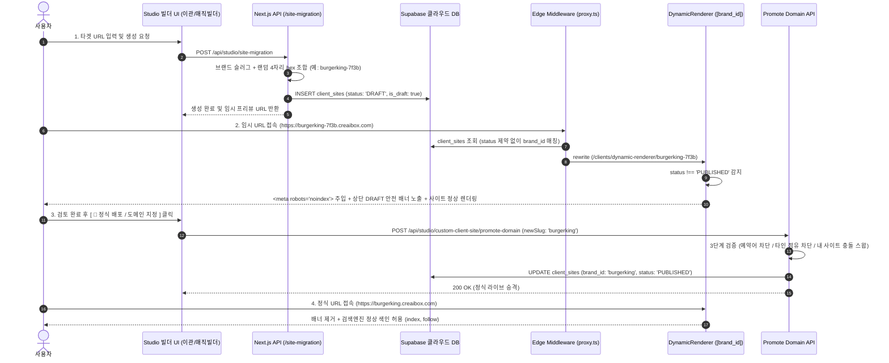

# 2단계 초안/라이브 배포 및 도메인 승격 아키텍처 명세서 (Two-Step Draft/Publish & Domain Promotion Architecture)

**문서 버전**: v1.17  
**최종 업데이트**: 2026년 8월 14일  
**관련 시스템**: `client_sites`, `DynamicRendererPage`, `proxy.ts`, `promote-domain/route.ts`, `MigrationTab`, `AiMagicBuilderTab`

---

## 1. 아키텍처 개요 및 설계 목적

본 시스템은 사용자가 타사 웹사이트를 이관(Migration)하거나 SNS 기반 AI 매직 빌더로 웹사이트를 생성할 때, **상표권 침해, 사칭 오해, 구글/네이버 중복 콘텐츠(Duplicate Content) 검색 페널티를 0%로 완벽 차단**하기 위해 설계된 **「2단계 배포 (Two-Step Deployment) 파이프라인」**입니다.



---

## 2. 세부 컴포넌트 스펙

### 2.1 임시 프리뷰 서브도메인 생성기 (`route.ts`, `ai-magic-builder/route.ts`)
* **규칙**: `[클린브랜드명]-[랜덤4자리hex]` (예: `burgerking-snxz`, `mcdonalds-9e41`)
* **기본값**: `status: 'DRAFT'`, `extra_configs: { target_slug: 'burgerking', is_draft: true }`
* **2중 DB Fallback 안전망**: DB CHECK 제약조건 상태에 구애받지 않고 항상 안전하게 삽입되도록 Fallback Insert 로직 내장.

### 2.2 검색엔진 차단 및 렌더링 엔진 (`dynamic-renderer/[brand_id]/page.tsx`)
* **SEO 차단**:
  ```ts
  export async function generateMetadata({ params }: PageProps): Promise<Metadata> {
    const isPublished = site?.status === "PUBLISHED";
    return {
      title: site?.company_name || "웹사이트",
      robots: isPublished
        ? { index: true, follow: true }
        : { index: false, follow: false, nocache: true }, // 🛡️ Zero SEO Risk for Drafts
    };
  }
  ```
* **상단 안전 띠 배너**:
  - `status !== 'PUBLISHED'`인 경우 상단에 `[ ⚠️ 본 사이트는 AI 이관 테스트 및 미리보기 모드입니다. (비공개 초안 • 검색엔진 노출 100% 차단 중) | 🚀 정식 배포하기 ]` 스티키 배너 자동 렌더링.

### 2.3 프록시 라우팅 (`src/proxy.ts`)
* 기존의 `status: 'ACTIVE'` 하드코딩 필터를 제거하고, `client_sites`에 등록된 모든 `DRAFT`, `PUBLISHED`, `INACTIVE` 사이트가 정상적으로 `dynamic-renderer`로 라우팅되도록 보장.

### 2.4 3단계 도메인 승격 및 스왑 파이프라인 (`promote-domain/route.ts`)
1. **시스템 예약어 검증**: `admin`, `api`, `studio`, `login`, `signup`, `auth`, `app`, `www`, `root`, `creaibox` 등 30개 이상의 핵심 시스템 키워드 등록 원천 차단.
2. **타인 소유권 검증**: 타 회원이 이미 등록한 도메인은 변경 불가 (`409 Conflict`).
3. **내 사이트 간 충돌 해결 (스왑)**: 본인이 이전에 테스트로 만든 사이트가 도메인을 점유하고 있을 경우, 기존 사이트 주소를 임시 주소로 자동 스왑하고 현재 사이트를 정식 도메인으로 승격.

---

## 3. 관련 데이터베이스 변경 내역

* `docs/database/sql/alter-client-sites-status-check.sql`:
  ```sql
  ALTER TABLE public.client_sites DROP CONSTRAINT IF EXISTS client_sites_status_check;
  ALTER TABLE public.client_sites ADD CONSTRAINT client_sites_status_check CHECK (status IN ('DRAFT', 'PUBLISHED', 'ACTIVE', 'INACTIVE'));
  ```
