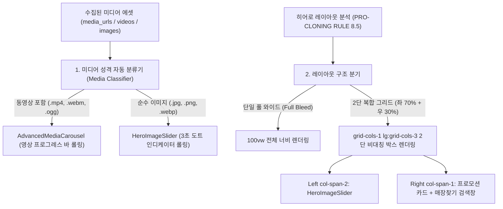
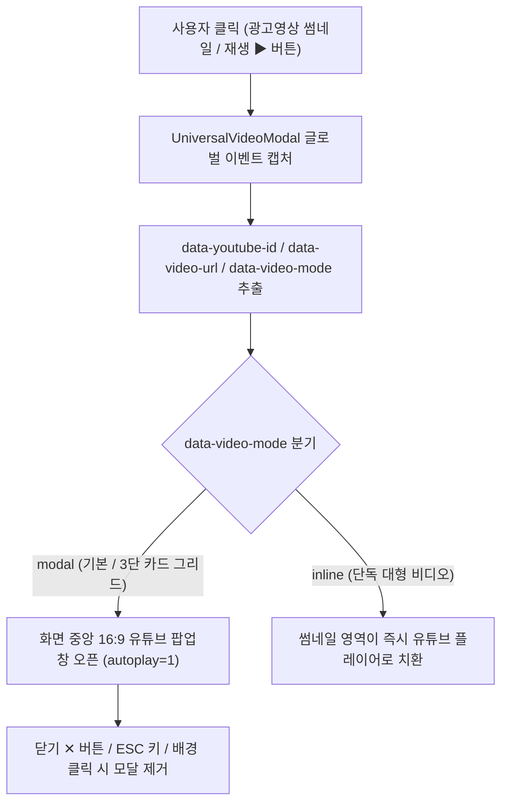

# 🏗️ 히어로 슬라이더 및 인터랙티브 비디오 듀얼 플레이어 아키텍처 명세서 (Hero Slider & Interactive Video Architecture)

## 📌 1. 시스템 개요 및 배경 (Overview)

웹사이트 이관 및 AI 빌더 구동 시, 원본 사이트의 상단 히어로 섹션과 비디오 홍보 섹션의 미디어 성격(영상 vs 순수 이미지) 및 레이아웃 구조(풀 와이드 vs 2단 분할 그리드)를 정밀하게 재현하기 위한 전문 프론트엔드/백엔드 아키텍처 명세서입니다.

---

## 🧭 2. 미디어 자동 분기 및 히어로 렌더링 파이프라인

---

### 🖼️ 2.1 사진 전용 고화질 슬라이더 컴포넌트 (`HeroImageSlider.tsx`)

* **소스 파일**: [`src/app/clients/dynamic-renderer/components/HeroImageSlider.tsx`](file:///Users/a1234/Local%20Sites/creaibox/src/app/clients/dynamic-renderer/components/HeroImageSlider.tsx)
* **주요 스펙**:
  1. **3초 자동 롤링**: `autoPlayInterval = 3000`ms 주기로 다음 슬라이드로 부드러운 페이드 전환 (`transition-opacity duration-700`).
  2. **원형 도트(Pagination Dots) + 재생/일시정지 토글**: 활성 슬라이드는 가로 타원(`w-6 bg-white`), 비활성은 원형 점(`w-2 bg-white/50`), 일시정지(`Pause`) 및 재생(`Play`) 토글 인터랙션 내장.
  3. **유연한 부모 컨테이너 크기 적응**: 100vw 전체 화면뿐만 아니라 `lg:col-span-2` 내부에서도 모서리 라운딩(`rounded-3xl`)과 종횡비(`aspect-[16/10]`)에 100% 맞춰 렌더링.

---

### 📐 2.2 2단 복합 히어로 레이아웃 보존 규칙 (`PRO-CLONING RULE 8.5`)

* **적용 파일**: [`src/app/api/studio/site-migration/route.ts`](file:///Users/a1234/Local%20Sites/creaibox/src/app/api/studio/site-migration/route.ts)
* **규칙 정의**:
  - 버거킹처럼 상단이 `[ 좌측 70%: 슬라이더 ] + [ 우측 30%: 2개 배너/검색 카드 ]`로 구성된 경우, 슬라이더를 화면 전체로 강제 확장하지 않고 `grid grid-cols-1 lg:grid-cols-3` 2단 레이아웃을 생성하여 원본의 시각적 위치와 크기를 1:1로 완벽 보존.

---

## 🎬 3. 인터랙티브 유튜브/비디오 듀얼 플레이어 아키텍처

---

### 🎥 3.1 글로벌 비디오 모달 컴포넌트 (`UniversalVideoModal.tsx`)

* **소스 파일**: [`src/app/clients/dynamic-renderer/components/UniversalVideoModal.tsx`](file:///Users/a1234/Local%20Sites/creaibox/src/app/clients/dynamic-renderer/components/UniversalVideoModal.tsx)
* **마운트 위치**: [`src/app/clients/dynamic-renderer/[brand_id]/[[...slug]]/layout.tsx`](file:///Users/a1234/Local%20Sites/creaibox/src/app/clients/dynamic-renderer/%5Bbrand_id%5D/%5B%5B...slug%5D%5D/layout.tsx)
* **동작 메커니즘**:
  1. **글로벌 이벤트 위임**: `document.addEventListener("click")`을 통해 `custom_html` 내부의 모든 비디오 트리거(`[data-youtube-id]`, `[data-video-url]`, `a[href*="youtube.com"]`)를 100% 감지.
  2. **모달 팝업 모드 (`data-video-mode="modal"`)**: 화면 전체에 다크 딤드(`bg-black/80 backdrop-blur-md`)를 깔고, 중앙에 16:9 고화질 유튜브 `<iframe>` 또는 `<video>`를 자동 재생(`autoplay=1`).
  3. **인라인 모드 (`data-video-mode="inline"`)**: 클릭한 컨테이너 내부의 썸네일을 유튜브 `<iframe>`으로 즉시 교체하여 제자리 재생.
  4. **안전한 종료**: `ESC` 키 이벤트 리스너, 배경 딤드 클릭, 우측 상단 `✕` 닫기 버튼을 통해 언제든 즉시 종료 및 음소거.

---

### 📜 3.2 광고영상 AI 복제 프롬프트 규칙 (`PRO-CLONING RULE 9`)

* 원본 사이트의 광고영상(TV-CF)이나 홍보 영상 섹션을 수집할 때:
  1. 원본 HTML에서 실제 YouTube ID(11자리) 및 비디오 URL을 유실 없이 추출.
  2. 카드 형태 그리드는 `data-youtube-id="..."`, `data-video-mode="modal"`, 중앙 재생(▶) 오버레이를 적용하여 클릭 시 팝업이 뜨도록 생성.
  3. 단독 대형 비디오 영역은 `data-video-mode="inline"`으로 지정하여 인라인 재생 지원.

---

## 📐 4. 초광폭 가로폭(1536px) 및 3열 비대칭 벤토 그리드 아키텍처

### 4.1 초광폭 가로폭 동기화 (`PRO-CLONING RULE 10`)
* **규격 표준**: `max-w-screen-2xl (1536px)` / `max-w-[1440px]`, `px-4 md:px-8 xl:px-12`.
* 구식 `max-w-7xl (1280px)` 고정으로 인해 발생하는 양옆 여백 과다 및 카드 왜곡 현상을 원천 방어하여, 대화면 모니터에서 원본과 100% 동일한 광폭 레이아웃 렌더링.

### 4.2 3열 비대칭 벤토 그리드 (`PRO-CLONING RULE 7.5`)
* **문제점**: 4개 요소(텍스트 2개 + 사진 2개)를 `grid-cols-2`로 나눌 경우 4번째 카드가 아래로 튕겨 나가 화면 전체를 뒤덮는 심각한 레이아웃 왜곡 발생.
* **해결 구조**: `grid grid-cols-1 md:grid-cols-3 gap-6 items-stretch`
  - **1열 (좌측)**: `flex flex-col gap-6 justify-between` ➡️ 텍스트 카드 2개 세로 스택
  - **2열 (중앙)**: `SMART QSR` 카드 (상단 텍스트 + 하단 이미지)
  - **3열 (우측)**: `수상실적` 카드 (상단 텍스트 + 하단 이미지)
  - 세 열이 바닥으로 밀리지 않고 나란히 1:1:1 비율로 배치.

---

## 📱 5. 스마트폰 디바이스 목업 프레임 아키텍처 (`SmartphoneMockup.tsx` & `PRO-CLONING RULE 11`)

* **소스 파일**: [`src/app/clients/dynamic-renderer/components/SmartphoneMockup.tsx`](file:///Users/a1234/Local%20Sites/creaibox/src/app/clients/dynamic-renderer/components/SmartphoneMockup.tsx)
* **스마트폰 디바이스 렌더링 스펙**:
  1. **아이폰 Pro 베젤 프레임**: `w-[280px] md:w-[330px] aspect-[9/18.5] rounded-[44px] border-[8px] border-[#262626] bg-[#1a1a1a] shadow-2xl`
  2. **다이나믹 아일랜드 노치**: 상단 카메라 홀 및 렌즈 반사광 디테일
  3. **내부 스크린 렌더러**: 앱 주문/이벤트 스크린샷 100% 핏 렌더링
  4. **주변 레이아웃**: 부드러운 베이지 카드(`bg-[#F5EADC] rounded-3xl`) + 둥근 해시태그 배지 4개 + QR코드 + 구글플레이/앱스토어 버튼 2개 1:1 완벽 구성.

---

## 🔗 6. 자사몰 내부 서브페이지 상대경로 보존 아키텍처 (`CRITICAL RULE 2`)

* **더미 링크(`#`) 원천 금지**: 모든 배너 카드, 메뉴 링크, 버튼에 `href="#"` 또는 `href="javascript:void(0)"` 사용을 엄격히 차단.
* **상대경로 매핑**: 원본 링크가 절대 도메인(`https://www.burgerking.co.kr/story/esgbusiness`)이더라도 도메인을 제거한 `/story/esgbusiness` 상대경로로 변환.
* **효과**: 방문자가 외부 타사 사이트로 이탈하지 않고, 내 자사몰(`http://burgerking4.localhost:3000/...`) 안에서 `SmartIntentLink` 0.01초 초고속 서브페이지 탐색을 완벽하게 수행.

---

## 🎨 7. 15대 소셜 미디어 풀컬러 브랜드 배지 아키텍처 (`SocialMediaIcons.tsx` & `PRO-CLONING RULE 12`)

* **소스 파일**: [`src/app/clients/dynamic-renderer/components/SocialMediaIcons.tsx`](file:///Users/a1234/Local%20Sites/creaibox/src/app/clients/dynamic-renderer/components/SocialMediaIcons.tsx)
* **지원 플랫폼**: Instagram, YouTube, Facebook, X/Twitter, Threads, TikTok, KakaoTalk/Channel, Naver Blog, Naver Cafe, Daangn, Brunch, LinkedIn, Discord, Telegram, GitHub, WhatsApp (16종 + Fallback)
* **주요 스펙**:
  1. **URL 자동 감지 (`detectPlatformFromUrl`)**: 소셜 링크 URL 패턴을 분석하여 플랫폼을 100% 자동 매칭.
  2. **공식 브랜드 Hex 및 그라디언트 탑재**: 각 사 공식 RGB 컬러 및 인스타그램 그라디언트 적용.
  3. **마이크로 애니메이션**: `hover:scale-115 hover:shadow-lg transition-all duration-200`
  4. **푸터 연동**: 기본 `Footer.tsx` 및 AI 생성 커스텀 푸터에서 흑백 회색 아이콘 대신 생생한 컬러 배지 출력.

### 📊 15대 소셜 미디어 & 커뮤니케이션 풀스펙 라인업 규격 표

| 번호 | 플랫폼명 (Platform) | 도메인 감지 패턴 (Domain Regex/Keywords) | 공식 브랜드 배경색 (Official Brand Color) | 아이콘 렌더링 방식 (Icon Format) |
| :--- | :--- | :--- | :--- | :--- |
| **1** | 📸 **Instagram** | `instagram.com` | `bg-gradient-to-tr from-[#f9ce34] via-[#ee2a7b] to-[#6228d7]` | 공식 카메라 벡터 SVG |
| **2** | 🔴 **YouTube** | `youtube.com`, `youtu.be` | `bg-[#FF0000]` | 공식 재생 버튼 벡터 SVG |
| **3** | 📘 **Facebook** | `facebook.com`, `fb.com` | `bg-[#1877F2]` | 공식 f 벡터 SVG |
| **4** | ✖️ **X (구 트위터)** | `twitter.com`, `x.com` | `bg-[#000000]` | 공식 X 심볼 벡터 SVG |
| **5** | 🧵 **Threads** | `threads.net` | `bg-[#101010]` | 공식 Threads 골뱅이 SVG |
| **6** | 🎵 **TikTok** | `tiktok.com` | `bg-[#010101]` | 공식 음표 심볼 SVG |
| **7** | 🟡 **KakaoTalk** | `kakao.com`, `pf.kakao.com` | `bg-[#FEE500]` (텍스트: `#191919`) | 공식 카카오 말풍선 SVG |
| **8** | 🟢 **Naver Blog** | `blog.naver.com` | `bg-[#03C75A]` | 네이버 공식 볼드 'N' |
| **9** | 🌿 **Naver Cafe** | `cafe.naver.com` | `bg-[#2DB400]` | 네이버 카페 볼드 'C' |
| **10** | 🥕 **당근마켓 (Karrot)** | `daangn.com`, `karrotmarket` | `bg-[#FF6F0F]` | 당근마켓 토끼/스마일 SVG |
| **11** | ✍️ **Brunch** | `brunch.co.kr` | `bg-[#00C4C4]` | 브런치 공식 타이포 'B' |
| **12** | 💼 **LinkedIn** | `linkedin.com` | `bg-[#0A66C2]` | 링크드인 'in' 벡터 SVG |
| **13** | 👾 **Discord** | `discord.gg`, `discord.com` | `bg-[#5865F2]` | 디스코드 클라이드 마스크 SVG |
| **14** | ✈️ **Telegram** | `t.me`, `telegram.me` | `bg-[#229ED9]` | 텔레그램 종이비행기 SVG |
| **15** | 🐙 **GitHub / 💬 WhatsApp**| `github.com` / `whatsapp.com`, `wa.me` | `bg-[#24292F]` / `bg-[#25D366]` | 깃허브 옥토캣 / 왓츠앱 수화기 SVG |
| **-** | 🌐 **기타 웹사이트 (Fallback)** | *Unmatched URL* | `bg-slate-700` | 모던 글로벌 웹 SVG |

---

## 🏛️ 8. 헤더 좌측 브랜드 로고 무손실 추출 및 타이포그래피 안전망 아키텍처 (`PRO-CLONING RULE 5.4`)

* **문제점**: 버거킹처럼 상단 로고가 일반 이미지 파일(`.png`)이 아닌 인라인 벡터 `<svg>` 또는 CSS 스프라이트로 구현된 경우, 이미지 추출기가 이를 놓쳐 헤더 좌측이 투명/빈칸으로 유실되는 현상 발생.
* **3단계 로고 방어 메커니즘**:
  1. **1단계 (인라인 SVG 및 이미지 100% 추출)**: 원본 헤더의 `<svg>` 벡터 코드를 1:1 무손실 추출하여 좌측 로고 컨테이너에 직접 삽입.
  2. **2단계 (브랜드 컬러 타이포그래피 로고 Fallback)**: CSS 스프라이트나 복잡한 JS 렌더링으로 추출이 불가능할 경우, 빈칸으로 남기지 않고 브랜드 시그니처 폰트와 고유 색상(`text-[#D4200C] font-black text-2xl uppercase`)을 적용한 타이포그래피 로고(`<a href='/' class='...'>BURGER KING</a>`)를 즉시 렌더링.
  3. **3단계 (파비콘 및 브랜드 심볼 매칭)**.

---

## 🧩 9. 웹사이트 이관 완벽 복제 「총 15종 인터랙티브 컴포넌트 팩」 기술 명세서 (`PRO-CLONING RULE 13`)

| 번호 | 컴포넌트 파일 | 섹션 타입 (`section_type`) | 주요 입력 데이터 구조 (`content_data`) | 제공 인터랙션 및 렌더링 스펙 |
| :--- | :--- | :--- | :--- | :--- |
| **1** | [`InteractiveAccordion.tsx`](file:///Users/a1234/Local%20Sites/creaibox/src/app/clients/dynamic-renderer/components/InteractiveAccordion.tsx) | `faq_accordion` | `{ items: [{ question: "...", answer: "..." }] }` | 부드러운 아코디언 토글, 180도 화살표 회전 |
| **2** | [`InfiniteLogoMarquee.tsx`](file:///Users/a1234/Local%20Sites/creaibox/src/app/clients/dynamic-renderer/components/InfiniteLogoMarquee.tsx) | `logo_marquee` | `{ logos: [{ name: "...", logoUrl: "..." }] }` | 무한 좌/우 로고 롤링 스트림 (마우스 오버 일시정지) |
| **3** | [`InteractiveTabs.tsx`](file:///Users/a1234/Local%20Sites/creaibox/src/app/clients/dynamic-renderer/components/InteractiveTabs.tsx) | `category_tabs` | `{ tabs: [{ id: "...", label: "...", items: [...] }] }` | 카테고리별 탭 전환 및 카드 페이드 교체 |
| **4** | [`AnimatedCounter.tsx`](file:///Users/a1234/Local%20Sites/creaibox/src/app/clients/dynamic-renderer/components/AnimatedCounter.tsx) | `animated_counter` | `{ stats: [{ value: 50000, suffix: "+", label: "..." }] }` | 스크롤 감지 0부터 목표 수치까지 부드러운 카운트업 |
| **5** | [`TestimonialCarousel.tsx`](file:///Users/a1234/Local%20Sites/creaibox/src/app/clients/dynamic-renderer/components/TestimonialCarousel.tsx) | `testimonial_carousel` | `{ testimonials: [{ name: "...", review: "...", rating: 5 }] }` | 별점(⭐), 프로필, 추천사 좌우 슬라이드 캐러셀 |
| **6** | [`BeforeAfterSlider.tsx`](file:///Users/a1234/Local%20Sites/creaibox/src/app/clients/dynamic-renderer/components/BeforeAfterSlider.tsx) | `before_after_slider` | `{ beforeImage: "...", afterImage: "..." }` | 마우스/터치 드래그 듀얼 레이어 실시간 비교 |
| **7** | [`PricingTable.tsx`](file:///Users/a1234/Local%20Sites/creaibox/src/app/clients/dynamic-renderer/components/PricingTable.tsx) | `pricing_table` | `{ plans: [{ name: "...", monthlyPrice: 29000, features: [...] }] }` | 월간/연간 스위치, 인기 배지, 체크리스트 비교표 |
| **8** | [`LocationMapCard.tsx`](file:///Users/a1234/Local%20Sites/creaibox/src/app/clients/dynamic-renderer/components/LocationMapCard.tsx) | `location_map` | `{ companyName: "...", address: "...", phone: "..." }` | 지도 임베드 + 주소 복사 + 카카오맵/네이버지도 길찾기 |
| **9** | [`UniversalVideoModal.tsx`](file:///Users/a1234/Local%20Sites/creaibox/src/app/clients/dynamic-renderer/components/UniversalVideoModal.tsx) | `video_modal` | `data-video-url`, `data-video-mode` | 16:9 유튜브 팝업 모달 & 제자리 인라인 자동재생 |
| **10** | [`SmartphoneMockup.tsx`](file:///Users/a1234/Local%20Sites/creaibox/src/app/clients/dynamic-renderer/components/SmartphoneMockup.tsx) | `app_download` | `{ image: "...", qrCode: "...", appStoreLink: "..." }` | 아이폰 Pro 디바이스 프레임 + 둥근 해시태그 배지 |
| **11** | [`SocialMediaIcons.tsx`](file:///Users/a1234/Local%20Sites/creaibox/src/app/clients/dynamic-renderer/components/SocialMediaIcons.tsx) | `social_icons` | `{ socials: [{ platform: "instagram", url: "..." }] }` | 15대 공식 브랜드 컬러 배지 자동 감지 렌더링 |
| **12** | [`HeroImageSlider.tsx`](file:///Users/a1234/Local%20Sites/creaibox/src/app/clients/dynamic-renderer/components/HeroImageSlider.tsx) | `hero_slider` | `{ slides: [{ imageSrc: "...", headline: "..." }] }` | 3초 자동 페이드 슬라이더 + 원형 도트 + 재생/일시정지 |
| **13** | [`AdvancedMediaCarousel.tsx`](file:///Users/a1234/Local%20Sites/creaibox/src/app/clients/dynamic-renderer/components/AdvancedMediaCarousel.tsx) | `advanced_media_carousel` | `{ items: [{ media_url: "...", title: "..." }] }` | 비디오 재생 시간 동기화 프로그레스 바 캐러셀 |
| **14** | [`AdvancedContentCarousel.tsx`](file:///Users/a1234/Local%20Sites/creaibox/src/app/clients/dynamic-renderer/components/AdvancedContentCarousel.tsx) | `advanced_content_carousel` | `{ items: [{ image: "...", title: "...", link: "..." }] }` | 텍스트+이미지 복합 카드 5초 자동 롤링 캐러셀 |
| **15** | [`DynamicConsultationForm.tsx`](file:///Users/a1234/Local%20Sites/creaibox/src/app/clients/dynamic-renderer/components/DynamicConsultationForm.tsx) | `consultation_form` | `{ fields: [...], form_title: "상담 신청" }` | 동적 유효성 검사 및 실시간 접수 폼 |

