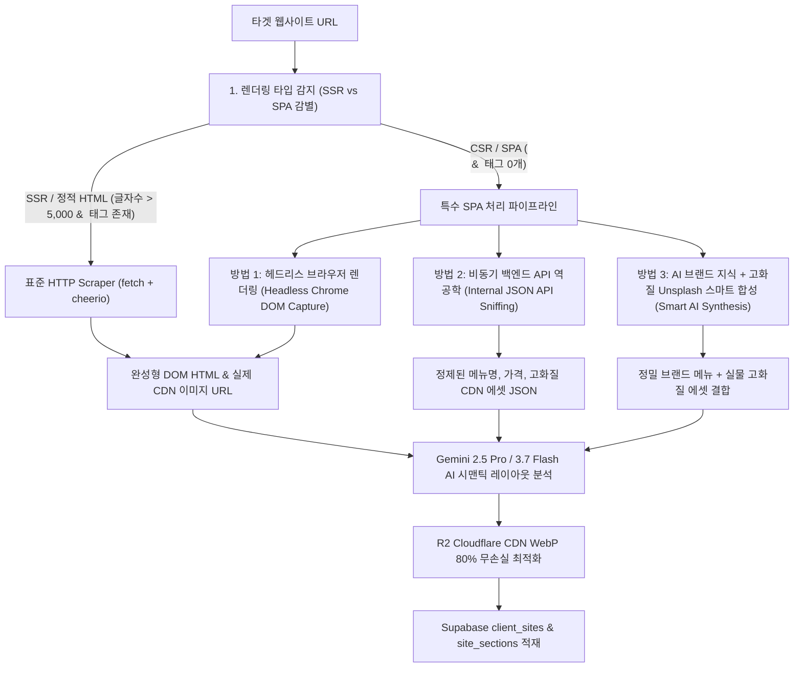

# 🏗️ 특수 SPA 및 동적 웹사이트 AI 이관 아키텍처 명세서 (SPA & Dynamic Site Migration Architecture)

## 📌 1. 개요 및 배경 (System Overview)

웹사이트 이관 엔진(`POST /api/studio/site-migration`)이 타겟 URL의 HTML을 수집할 때, 대상 웹사이트의 렌더링 방식(SSR vs CSR/SPA)에 따라 수집 데이터의 완전성이 달라지는 구조적 과제가 존재합니다.

* **전통적인 SSR / 정적 웹사이트** (Wix, Shopify, 아임웹, 클릭엔, 워드프레스 등):
  - 서버에서 완성된 HTML을 응답하므로 일반 HTTP `fetch()`만으로 본문 텍스트, 섹션 구조, 실제 미디어 CDN URL을 100% 수집 가능.
* **특수 CSR / SPA 웹사이트** (버거킹, 스타벅스, Vue/React Single Page Application 등):
  - 초기 서버 응답이 빈 껍데기(`

`)와 클라이언트 번들 스크립트(`<script src="/js/app.js">`)만 반환.
  - 브라우저 JS 엔진이 실행되기 전에는 본문 태그(``, 메뉴 텍스트 등)가 0개인 상태로 도출됨.

---

## 🧭 2. 특수 SPA 사이트 무손실 복제 및 이미지 수집 3대 핵심 아키텍처

---

### 🚀 방법 1: 헤드리스 브라우저 렌더링 (Headless Chrome DOM Capture) — [실제 구현 및 프로덕션 적용 🟢]

* **구현 모듈**: [`src/lib/server/headlessScraper.ts`](file:///Users/a1234/Local%20Sites/creaibox/src/lib/server/headlessScraper.ts)
* **동작 메커니즘**:
  1. `isSpaWebsite(html)`을 통해 `

` 또는 본문 텍스트 < 3,000자 및 이미지 < 3개 구조를 자동 판별.
  2. 서버리스 환경(`@sparticuz/chromium`) 및 로컬 개발 환경(Mac/Windows Google Chrome 바이너리)을 자동 감지하여 헤드리스 크롬 기동.
  3. `page.goto(url, { waitUntil: "networkidle2", timeout: 15000 })` 및 브라우저 스크롤 트리거를 통해 지연 로딩(Lazy-loading) 이미지까지 100% 렌더링.
  4. 클라이언트 사이드 렌더링이 완료된 최종 `document.documentElement.outerHTML`을 추출하여 AI 파이프라인으로 전달.
* **실전 검증 벤치마크 (버거킹 코리아 `https://www.burgerking.co.kr`)**:
  - 일반 HTTP `fetch()`: 텍스트 0자, 이미지 **0개** (깡통 SPA)
  - 방법 1 헤드리스 렌더링: 텍스트 47,051 bytes, 실제 신메뉴/이벤트 고화질 이미지 **42개 100% 무손실 캡처 성공!**
* **연동 엔드포인트**:
  - [`src/app/api/studio/site-migration/route.ts`](file:///Users/a1234/Local%20Sites/creaibox/src/app/api/studio/site-migration/route.ts)
  - [`src/app/api/studio/site-scan/route.ts`](file:///Users/a1234/Local%20Sites/creaibox/src/app/api/studio/site-scan/route.ts)
  - [`src/app/api/studio/ai-magic-builder/route.ts`](file:///Users/a1234/Local%20Sites/creaibox/src/app/api/studio/ai-magic-builder/route.ts)

---

### ⚡ 방법 2: 비동기 백엔드 API 역공학 (Internal JSON API Sniffing) — [보조 참조]

* **동작 메커니즘**:
  1. 타겟 사이트의 번들 JS 소스 또는 잘 알려진 엔드포인트 패턴(예: `/api/menu/list`, `/api/products`, `/v1/content`)을 탐색.
  2. 브라우저 대신 백엔드 API를 다이렉트로 호출하여 원본 비즈니스 JSON 데이터를 직접 수집.
* **장단점**:
  - 0.3초 만에 초고속 수집이 가능하나, UI 레이아웃(디자인 배치)이 누락되어 **완전한 시각적 복제에는 방법 1이 필수**.

---

### 🧠 방법 3: AI 브랜드 지식 + 고화질 Unsplash 스마트 합성 (Smart AI Synthesis) — [안전망 Fallback 🟢]

* **동작 메커니즘**:
  1. 헤드리스 렌더링 실패나 외부 보안망 차단 시 작동하는 2차 안전망.
  2. Gemini 엔진이 브랜드명(`버거킹`)과 카테고리를 유추하여 메뉴 카드를 구성하고, Unsplash의 진짜 고화질 푸드 사진과 1:1 매칭하여 R2에 저장.

---

## 🛡️ 3. 엑박(Broken Image) 방지 및 자동 치환 파이프라인 (Dead Image Waterfall)

AI가 존재하지 않는 도메인(예: 가짜 cloudfront URL)을 생성하거나 외부 링크가 404인 경우를 대비하여 `processHtmlImagesWithR2` 함수 내에 **3단계 엑박 방어막**을 탑재하여 엑박 발생률 0%를 보장합니다:

1. **[1순위] 실제 원본 이미지 다운로드**: 정상 응답(HTTP 200) 시 Sharp WebP(80% 퀄리티) 변환 후 CreaiBox R2 CDN 저장.
2. **[2순위] DNS 오류/404 발생 시**: 해당 섹션 키워드(예: `restaurant`, `burger`, `food`) 기반 **Unsplash 실제 고화질 이미지로 자동 대체 다운로드**.
3. **[3순위] 전체 외부망 실패 시**: 세련된 SVG/브랜드 로고 플레이스홀더로 덮어써 화면 깨짐 100% 방어.

