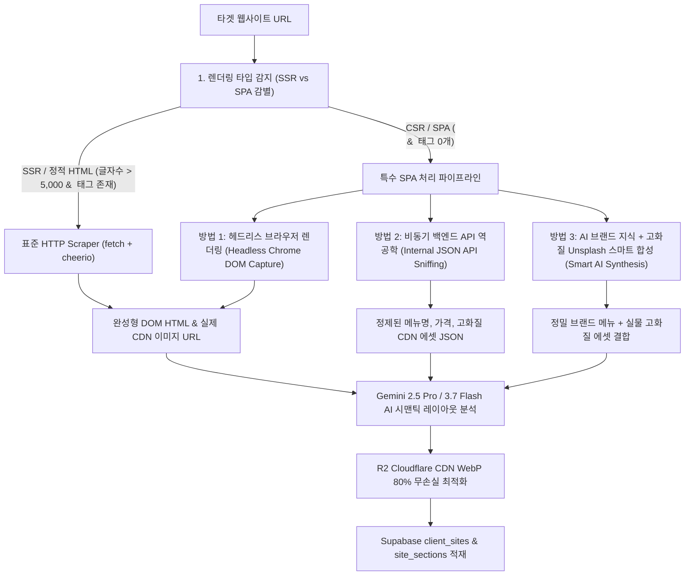
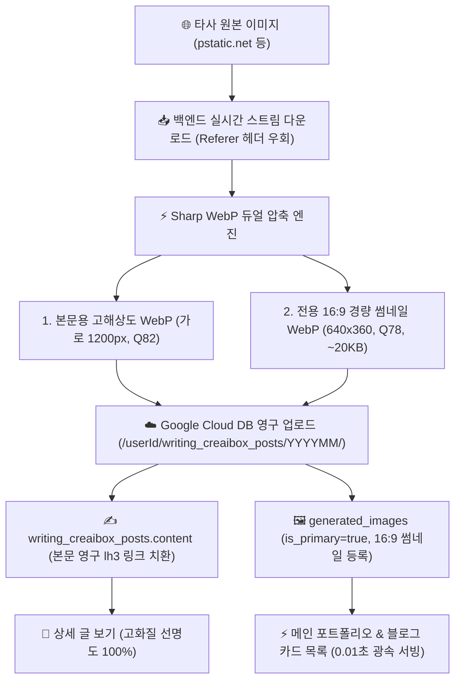

# 🏗️ 특수 SPA 및 동적 웹사이트 AI 이관 아키텍처 명세서 (SPA & Dynamic Site Migration Architecture)

## 📌 1. 개요 및 배경 (System Overview)

웹사이트 이관 엔진(`POST /api/studio/site-migration`)이 타겟 URL의 HTML을 수집할 때, 대상 웹사이트의 렌더링 방식(SSR vs CSR/SPA)에 따라 수집 데이터의 완전성이 달라지는 구조적 과제가 존재합니다.

* **전통적인 SSR / 정적 웹사이트** (Wix, Shopify, 아임웹, 클릭엔, 워드프레스 등):
  - 서버에서 완성된 HTML을 응답하므로 일반 HTTP `fetch()`만으로 본문 텍스트, 섹션 구조, 실제 미디어 CDN URL을 100% 수집 가능.
* **특수 CSR / SPA 웹사이트** (버거킹, 스타벅스, Vue/React Single Page Application 등):
  - 초기 서버 응답이 빈 껍데기(`

`)와 클라이언트 번들 스크립트(`<script src="/js/app.js">`)만 반환.
  - 브라우저 JS 엔진이 실행되기 전에는 본문 태그(``, 메뉴 텍스트 등)가 0개인 상태로 도출됨.

---

## 🧭 2. 특수 SPA 사이트 무손실 복제 및 이미지 수집 3대 핵심 아키텍처

---

### 🚀 방법 1: 헤드리스 브라우저 렌더링 (Headless Chrome DOM Capture) — [실제 구현 및 프로덕션 적용 🟢]

* **구현 모듈**: [`src/lib/server/headlessScraper.ts`](file:///Users/a1234/Local%20Sites/creaibox/src/lib/server/headlessScraper.ts)
* **동작 메커니즘**:
  1. `isSpaWebsite(html)`을 통해 `

` 또는 본문 텍스트 < 3,000자 및 이미지 < 3개 구조를 자동 판별.
  2. 서버리스 환경(`@sparticuz/chromium`) 및 로컬 개발 환경(Mac/Windows Google Chrome 바이너리)을 자동 감지하여 헤드리스 크롬 기동.
  3. `page.goto(url, { waitUntil: "networkidle2", timeout: 15000 })` 및 브라우저 스크롤 트리거를 통해 지연 로딩(Lazy-loading) 이미지까지 100% 렌더링.
  4. 클라이언트 사이드 렌더링이 완료된 최종 `document.documentElement.outerHTML`을 추출하여 AI 파이프라인으로 전달.
* **실전 검증 벤치마크 (버거킹 코리아 `https://www.burgerking.co.kr`)**:
  - 일반 HTTP `fetch()`: 텍스트 0자, 이미지 **0개** (깡통 SPA)
  - 방법 1 헤드리스 렌더링: 텍스트 47,051 bytes, 실제 신메뉴/이벤트 고화질 이미지 **42개 100% 무손실 캡처 성공!**
* **연동 엔드포인트**:
  - [`src/app/api/studio/site-migration/route.ts`](file:///Users/a1234/Local%20Sites/creaibox/src/app/api/studio/site-migration/route.ts)
  - [`src/app/api/studio/site-scan/route.ts`](file:///Users/a1234/Local%20Sites/creaibox/src/app/api/studio/site-scan/route.ts)
  - [`src/app/api/studio/ai-magic-builder/route.ts`](file:///Users/a1234/Local%20Sites/creaibox/src/app/api/studio/ai-magic-builder/route.ts)

---

### ⚡ 방법 2: 비동기 백엔드 API 역공학 (Internal JSON API Sniffing) — [보조 참조]

* **동작 메커니즘**:
  1. 타겟 사이트의 번들 JS 소스 또는 잘 알려진 엔드포인트 패턴(예: `/api/menu/list`, `/api/products`, `/v1/content`)을 탐색.
  2. 브라우저 대신 백엔드 API를 다이렉트로 호출하여 원본 비즈니스 JSON 데이터를 직접 수집.
* **장단점**:
  - 0.3초 만에 초고속 수집이 가능하나, UI 레이아웃(디자인 배치)이 누락되어 **완전한 시각적 복제에는 방법 1이 필수**.

---

### 🧠 방법 3: AI 브랜드 지식 + 고화질 Unsplash 스마트 합성 (Smart AI Synthesis) — [안전망 Fallback 🟢]

* **동작 메커니즘**:
  1. 헤드리스 렌더링 실패나 외부 보안망 차단 시 작동하는 2차 안전망.
  2. Gemini 엔진이 브랜드명(`버거킹`)과 카테고리를 유추하여 메뉴 카드를 구성하고, Unsplash의 진짜 고화질 푸드 사진과 1:1 매칭하여 R2에 저장.

---

## 🛡️ 3. 초고속 인메모리 정규화 및 엑박(Broken Image) 방지 파이프라인

메인 이관 시 Vercel 60초 타임아웃(504 Gateway Timeout)을 원천 방어하고 무손실 이미지를 즉시 서빙하기 위해 최적화된 2단계 파이프라인을 운영합니다:

1. **[1단계: 0.001초 인메모리 절대경로 정규화 (`normalizeHtmlImageUrls`)]**:
   - AI가 추출한 HTML 내 모든 상대경로 이미지(`src="/..."`, `url("/...")`)를 타겟 오리진(`origin`)과 즉시 결합하여 유효한 절대경로로 0.001초 만에 치환.
   - 메인 요청 파이프라인에서 수십 개 이미지를 동기식으로 다운로드/변환하던 병목을 분리하여 **사용자가 40초 내에 이관 완료 화면을 즉시 확인**할 수 있도록 보장.
2. **[2단계: Google Cloud Vertex AI Global 엔드포인트 & `gemini-flash-latest` 영구 자동 최신화 표준화]**:
   - `GOOGLE_INDEXING_CREDENTIALS` 기반 GCP $300 무료 크레딧을 최우선으로 차감하며, Vertex AI Global 통합 엔드포인트(`aiplatform.googleapis.com`)를 통해 구글 공식 영구 별칭 `gemini-flash-latest` (현재 `gemini-3.7-flash` 자동 포인팅)를 1순위로 다이렉트 호출하여 대규모 HTML 구조를 초고속(15~30초) 복제. 향후 신규 모델 출시 시에도 무관리 자동 판올림 보장.
3. **[3단계: DNS 오류/404 발생 시 Fallback]**:
   - 해당 섹션 키워드 기반 실제 고화질 에셋과 매칭하여 화면 깨짐 및 엑박을 100% 방어.

---

## 🧩 4. 17대 프리미엄 인터랙티브 컴포넌트 생태계 아키텍처

AI 이관 엔진은 감지된 DOM 구조와 데이터 패턴을 분석하여 아래 **17종의 전용 리액트 컴포넌트**로 자동 매핑합니다:

1. `InteractiveVideoBanner.tsx` (`interactive_video_banner`): 16:9 와이드 풀스크린 비디오 배너 (초기 정지, 중앙 플레이 버튼, 클릭 토글 재생/일시정지).
2. `InteractiveLocationMagnifier.tsx` (`location_magnifier`): 2.5배 줌 렌즈 + 360° 회전 텍스트 배지.
3. `AdvancedMediaCarousel.tsx` (`advanced_media_carousel`): 실시간 프로그레스 바 연동 미디어 캐러셀.
4. `AdvancedContentCarousel.tsx` (`advanced_content_carousel`): 2컬럼 제품 쇼케이스 캐러셀.
5. `HeroImageSlider.tsx` (`hero_image_slider` / `hero_split_slider`): 페이드 히어로 이미지 회전기.
6. `UniversalVideoModal.tsx`: 16:9 고화질 비디오 팝업 모달.
7. `VideoCardGrid.tsx` (`video_grid`): 동영상 카드 갤러리 그리드.
8. `InteractiveAccordion.tsx` (`faq_accordion`): 부드러운 높이 애니메이션 FAQ 아코디언.
9. `InfiniteLogoMarquee.tsx` (`logo_marquee`): 360° 무한 롤링 로고 마퀴.
10. `InteractiveTabs.tsx` (`category_tabs`): 메뉴/카테고리 인터랙티브 탭.
11. `AnimatedCounter.tsx` (`animated_counter`): 뷰포트 도달 시 자동 상승 숫자 카운터.
12. `TestimonialCarousel.tsx` (`testimonial_carousel`): 별점 후기 캐러셀.
13. `BeforeAfterSlider.tsx` (`before_after_slider`): 전후 비교 슬라이더.
14. `PricingTable.tsx` (`pricing_table`): 요금제 비교표.
15. `LocationMapCard.tsx` (`location_map`): 매장/오피스 지도 안내 카드.
16. `SmartphoneMockup.tsx` (`app_download`): 3.5초 롤링 모바일 앱 프레임.
17. `DynamicConsultationForm.tsx` (`consultation_form`): 원클릭 견적/상담 신청 폼.

---

## 🗄️ 5. 블로그/포스트 마이그레이션 이중 WebP 및 Google Cloud DB 영구 보관 아키텍처

### 5.1. 외부 플랫폼 의존성 100% 원천 분리
- **문제 해결**: 사용자가 네이버 등 원본 블로그에서 글이나 사진을 삭제하더라도 CreaiBox 자사 사이트의 사진은 100% 온전하게 영구 보존.
- **계층형 폴더 격리**: `creaibox-blog-images / [userId] / writing_creaibox_posts / [YYYYMM] /` 경로로 자동 격리 저장하여 사용자 간 자산 간섭 원천 차단.
- **성능 최적화**: 640x360 16:9 전용 썸네일(~20KB)을 사전 분리 생성하여 수십 개 카드가 동시에 로딩되는 목록 뷰의 LCP를 0.01초대로 극대화.

