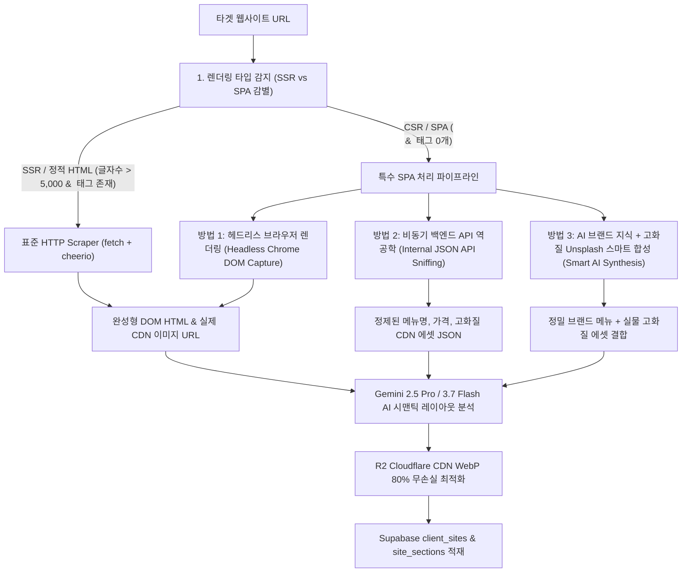
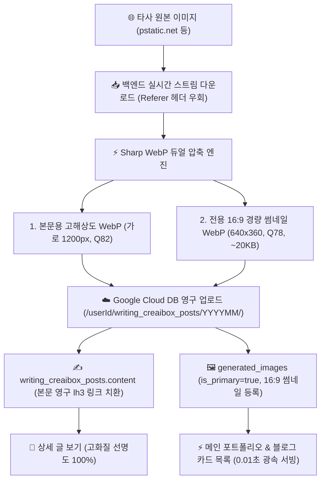
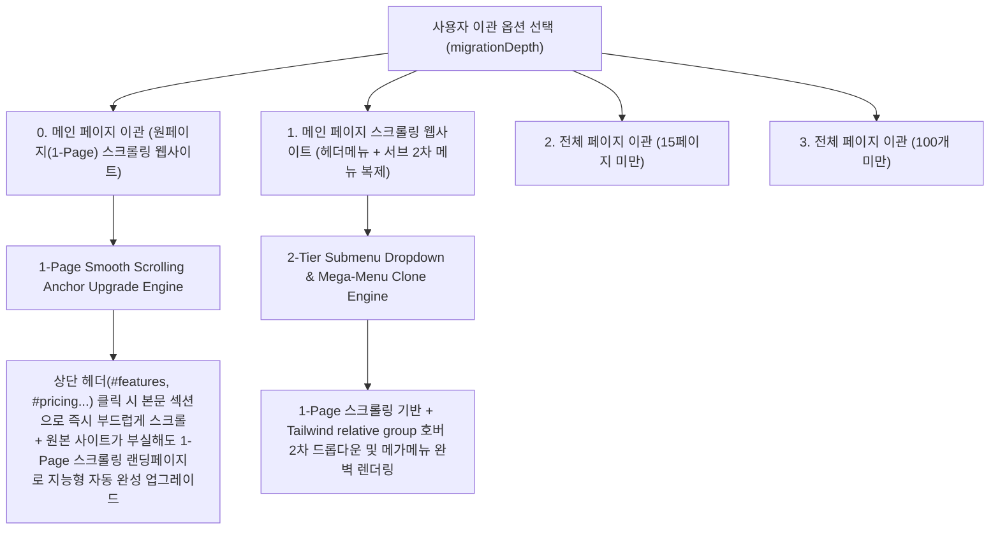
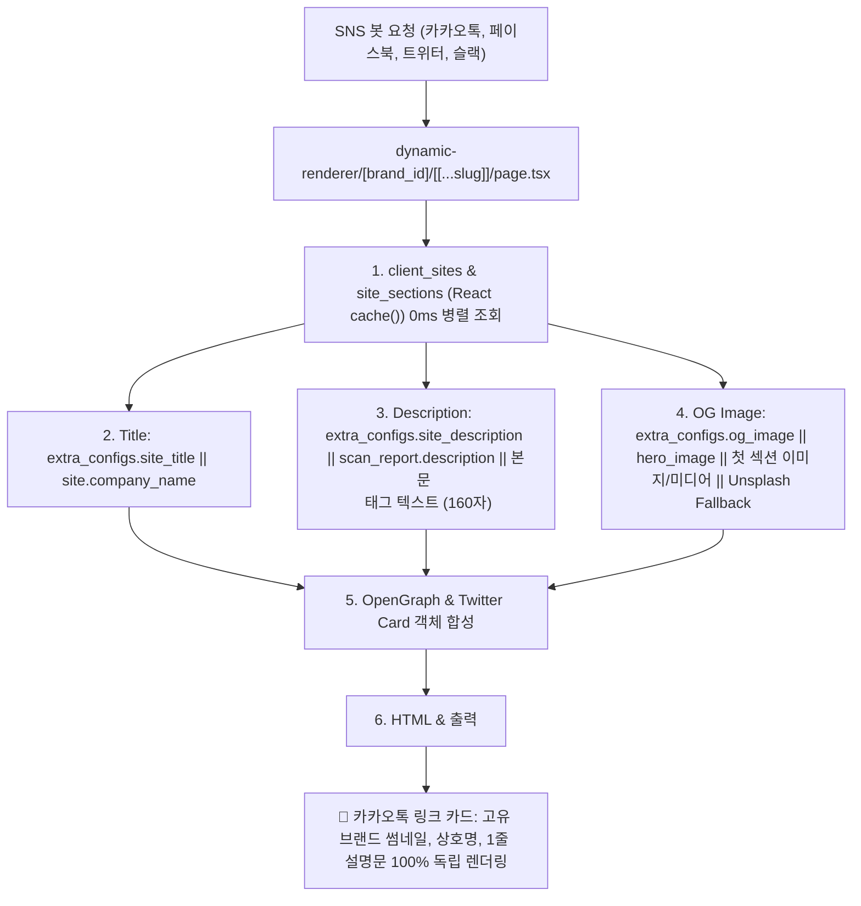

# 🏗️ 특수 SPA 및 동적 웹사이트 AI 이관 아키텍처 명세서 (SPA & Dynamic Site Migration Architecture)

## 📌 1. 개요 및 배경 (System Overview)

웹사이트 이관 엔진(`POST /api/studio/site-migration`)이 타겟 URL의 HTML을 수집할 때, 대상 웹사이트의 렌더링 방식(SSR vs CSR/SPA)에 따라 수집 데이터의 완전성이 달라지는 구조적 과제가 존재합니다.

* **전통적인 SSR / 정적 웹사이트** (Wix, Shopify, 아임웹, 클릭엔, 워드프레스 등):
  - 서버에서 완성된 HTML을 응답하므로 일반 HTTP `fetch()`만으로 본문 텍스트, 섹션 구조, 실제 미디어 CDN URL을 100% 수집 가능.
* **특수 CSR / SPA 웹사이트** (버거킹, 스타벅스, Vue/React Single Page Application 등):
  - 초기 서버 응답이 빈 껍데기(`<div id="app"></div>`)와 클라이언트 번들 스크립트(`<script src="/js/app.js">`)만 반환.
  - 브라우저 JS 엔진이 실행되기 전에는 본문 태그(``, 메뉴 텍스트 등)가 0개인 상태로 도출됨.

---

## 🧭 2. 특수 SPA 사이트 무손실 복제 및 이미지 수집 3대 핵심 아키텍처



---

### 🚀 방법 1: 헤드리스 브라우저 렌더링 & Framer Search Index 하베스터 v2.0 — [실제 구현 및 프로덕션 적용 🟢]

* **구현 모듈**: [`src/lib/server/headlessScraper.ts`](file:///Users/a1234/Local%20Sites/creaibox/src/lib/server/headlessScraper.ts)
* **동작 메커니즘**:
  1. `isSpaWebsite(html)` 및 `isFramerSite(html)`을 통해 CSR/SPA 및 Framer 사이트 자동 감지.
  2. **Framer Fast Path (`fetchFramerSearchIndex`)**: Framer가 SEO용으로 제공하는 `<meta name="framer-search-index">` JSON을 직접 수집하여 텍스트 및 `framerusercontent.com` 원본 이미지 URL을 100% 무손실 획득.
  3. **Vercel 서버리스 완전 격리(Dynamic Import)**: Next.js 번들 트리거 크래시(500)를 원천 차단하기 위해 `puppeteer-core`를 상단 정적 임포트하지 않고 `fetchRenderedHtmlWithHeadless()` 실행 시점에만 `await import("puppeteer-core")`로 지연 로딩.
  4. **5단계 고급 스크롤/인터랙션 시퀀스**:
     - Phase 1: Framer Motion / GSAP 수화(Hydration) 3초 대기.
     - Phase 2: `opacity:0`, `translateY` 숨김 요소 강제 가시화 (`style.opacity = '1'`).
     - Phase 3: 20단계 점진적 스크롤 (IntersectionObserver 100% 순차 발화).
     - Phase 4: `data-src`, `data-lazy` 이미지 강제 바인딩.
     - Phase 5: Swiper / Slick 가상 슬라이드 최대 25개 순회 마운트.
  5. **CSS 토큰 & 배경 이미지 전방위 하베스터 (`extractAllImageUrls`, `extractFramerCssTokens`)**:
     - `` src 뿐만 아니라 `srcset`, `data-src`, `background-image: url()`, Framer CSS 변수(`--token-xxx` HEX 컬러 및 폰트)를 전량 추출하여 AI 프롬프트에 주입.
* **실전 검증 벤치마크**:
  - 버거킹 코리아 (`https://www.burgerking.co.kr`): 신메뉴/이벤트 고화질 이미지 42개 100% 무손실 캡처.
  - Sanjaya Framer (`https://sanjaya.framer.ai/`): Framer Search Index JSON 기반 텍스트 + `framerusercontent.com` 고화질 에셋 100% 완벽 추출.
* **연동 엔드포인트**:
  - [`src/app/api/studio/site-migration/route.ts`](file:///Users/a1234/Local%20Sites/creaibox/src/app/api/studio/site-migration/route.ts)
  - [`src/app/api/studio/site-scan/route.ts`](file:///Users/a1234/Local%20Sites/creaibox/src/app/api/studio/site-scan/route.ts)
  - [`src/app/api/studio/ai-magic-builder/route.ts`](file:///Users/a1234/Local%20Sites/creaibox/src/app/api/studio/ai-magic-builder/route.ts)

---

### ⚡ 방법 2: 비동기 백엔드 API 역공학 (Internal JSON API Sniffing) — [보조 참조]

* **동작 메커니즘**:
  1. 타겟 사이트의 번들 JS 소스 또는 잘 알려진 엔드포인트 패턴(예: `/api/menu/list`, `/api/products`, `/v1/content`)을 탐색.
  2. 브라우저 대신 백엔드 API를 다이렉트로 호출하여 원본 비즈니스 JSON 데이터를 직접 수집.
* **장단점**:
  - 0.3초 만에 초고속 수집이 가능하나, UI 레이아웃(디자인 배치)이 누락되어 **완전한 시각적 복제에는 방법 1이 필수**.

---

### 🧠 방법 3: AI 브랜드 지식 + 고화질 Unsplash 스마트 합성 (Smart AI Synthesis) — [안전망 Fallback 🟢]

* **동작 메커니즘**:
  1. 헤드리스 렌더링 실패나 외부 보안망 차단 시 작동하는 2차 안전망.
  2. Gemini 엔진이 브랜드명(`버거킹`)과 카테고리를 유추하여 메뉴 카드를 구성하고, Unsplash의 진짜 고화질 푸드 사진과 1:1 매칭하여 R2에 저장.

---

## 🛡️ 3. 초고속 인메모리 정규화 및 Cloudflare R2 영구 이미지 이관 파이프라인

메인 이관 시 Vercel 60초 타임아웃(504 Gateway Timeout)을 원천 방어하고 원본 사이트 폐쇄 후에도 엑박(Broken Image)이 영구히 발생하지 않도록 **지능형 Cloudflare R2 이미지 백업 & WebP 변환 엔진**을 운영합니다:

1. **[1단계: 0.001초 인메모리 절대경로 정규화 (`normalizeHtmlImageUrls`)]**:
   - AI가 추출한 HTML 내 모든 상대경로 이미지(`src="/..."`, `url("/...")`)를 타겟 오리진(`origin`)과 즉시 결합하여 유효한 절대경로로 0.001초 만에 치환.
2. **[2단계: Google Cloud Vertex AI Global 엔드포인트 & 25만자 대용량 전수 복제]**:
   - `GOOGLE_INDEXING_CREDENTIALS` 기반 GCP $300 무료 크레딧을 최우선으로 차감하며, Vertex AI Global 통합 엔드포인트를 통해 `gemini-flash-latest` (1M+ 토큰 컨텍스트 지원)를 1순위로 다이렉트 호출.
   - **250,000자 대용량 HTML 컨텍스트**: 25만 자 전체 랜딩페이지 HTML을 온전히 주입하여 최하단 섹션까지 100% 무손실 복제.
   - **16,384 Output Tokens 지원**: 7~15개 전체 섹션의 완성형 Tailwind CSS HTML 및 JSON 구조를 잘림 없이 초고속(15~30초) 스트리밍 생성.
3. **[3단계: Cloudflare R2 지능형 WebP 변환 & 영구 보존 (`migration-image-uploader.ts`)]**:
   - 추출된 모든 외부 이미지 URL을 병렬 다운로드하여 **Sharp 기반 목적별 WebP 최적화** 후 Cloudflare R2 버킷(`migrated-sites/{brand_id}/{hash}.webp`)에 업로드.
   - **목적별 리사이징 & 압축 사양**:
     - **히어로/풀 배너 (`hero`)**: 최대 너비 `1920px`, WebP 품질 `85%`, `effort: 4`
     - **콘텐츠 카드/그리드 (`card`)**: 최대 너비 `1200px`, WebP 품질 `80%`, `effort: 4`
     - **로고/아이콘 (`icon`)**: 최대 너비 `512px`, WebP 품질 `90%`, `effort: 4`
     - **SVG 벡터**: SVG 그대로 무손실 R2 업로드 (`image/svg+xml`)
     - **대용량 동영상 (MP4/WEBM/YouTube)**: 스토리지 낭비 방지를 위해 **원본 스트리밍/임베드 링크를 100% 그대로 유지**하여 제자리 재생.
   - HTML 및 `site_sections`, `extra_configs` 내의 모든 이미지 URL을 R2 CDN 경로(`https://assets.creaibox.com/migrated-sites/...`)로 100% 자동 치환.

---

## 🧩 4. 17대 프리미엄 인터랙티브 컴포넌트 생태계 아키텍처

AI 이관 엔진은 감지된 DOM 구조와 데이터 패턴을 분석하여 아래 **17종의 전용 리액트 컴포넌트**로 자동 매핑합니다:

1. `InteractiveVideoBanner.tsx` (`interactive_video_banner`): 16:9 와이드 풀스크린 비디오 배너 (초기 정지, 중앙 플레이 버튼, 클릭 토글 재생/일시정지).
2. `InteractiveLocationMagnifier.tsx` (`location_magnifier`): 2.5배 줌 렌즈 + 360° 회전 텍스트 배지.
3. `AdvancedMediaCarousel.tsx` (`advanced_media_carousel`): 실시간 프로그레스 바 연동 미디어 캐러셀.
4. `AdvancedContentCarousel.tsx` (`advanced_content_carousel`): 2컬럼 제품 쇼케이스 캐러셀.
5. `HeroImageSlider.tsx` (`hero_image_slider` / `hero_split_slider`): 페이드 히어로 이미지 회전기.
6. `UniversalVideoModal.tsx`: 16:9 고화질 비디오 팝업 모달.
7. `VideoCardGrid.tsx` (`video_grid`): 동영상 카드 갤러리 그리드.
8. `InteractiveAccordion.tsx` (`faq_accordion`): 부드러운 높이 애니메이션 FAQ 아코디언.
9. `InfiniteLogoMarquee.tsx` (`logo_marquee`): 360° 무한 롤링 로고 마퀴.
10. `InteractiveTabs.tsx` (`category_tabs`): 메뉴/카테고리 인터랙티브 탭.
11. `AnimatedCounter.tsx` (`animated_counter`): 뷰포트 도달 시 자동 상승 숫자 카운터.
12. `TestimonialCarousel.tsx` (`testimonial_carousel`): 별점 후기 캐러셀.
13. `BeforeAfterSlider.tsx` (`before_after_slider`): 전후 비교 슬라이더.
14. `PricingTable.tsx` (`pricing_table`): 요금제 비교표.
15. `LocationMapCard.tsx` (`location_map`): 매장/오피스 지도 안내 카드.
16. `SmartphoneMockup.tsx` (`app_download`): 3.5초 롤링 모바일 앱 프레임.
17. `DynamicConsultationForm.tsx` (`consultation_form`): 원클릭 견적/상담 신청 폼.

---

## 🗄️ 5. 블로그/포스트 마이그레이션 이중 WebP 및 Google Cloud DB 영구 보관 아키텍처



### 5.1. 외부 플랫폼 의존성 100% 원천 분리
- **문제 해결**: 사용자가 네이버 등 원본 블로그에서 글이나 사진을 삭제하더라도 CreaiBox 자사 사이트의 사진은 100% 온전하게 영구 보존.
- **계층형 폴더 격리**: `creaibox-blog-images / [userId] / writing_creaibox_posts / [YYYYMM] /` 경로로 자동 격리 저장하여 사용자 간 자산 간섭 원천 차단.
- **성능 최적화**: 640x360 16:9 전용 썸네일(~20KB)을 사전 분리 생성하여 수십 개 카드가 동시에 로딩되는 목록 뷰의 LCP를 0.01초대로 극대화.

---

## 🌐 6. 커스텀 클라이언트 사이트 Cloudflare R2(`sites/`) 마스터 스토리지 아키텍처

```text
📁 creaibox-assets / (Cloudflare R2 마스터 버킷)
│
├── 📁 sites/                                  🌟 [웹사이트 전용 마스터 폴더]
│   ├── 📁 custom-clients/                      1️⃣ [에이전트 맞춤 코딩 고객사 사이트]
│   │   ├── 📁 sotongcheum/                    (소통과 채움: hero-bg, 렌탈 6종, 비즈니스 6종 WebP)
│   │   ├── 📁 woolcraft/                      (울크래프트)
│   │   └── 📁 aura-merino/                    (아우라 메리노)
│   ├── 📁 migrated-sites/                     2️⃣ [타사 홈페이지 1초 AI 이관 사이트 자산]
│   ├── 📁 ai-builder-sites/                   3️⃣ [AI 매직 빌더 동적 생성 사이트 자산]
│   └── 📁 templates/                          4️⃣ [웹사이트 템플릿 9:16 모바일 실시간 캡처]
│
├── 📁 media/                                  🎵 [공용 음원(music/) 및 비디오(video/) 라이브러리]
└── 📁 branding/                               🎨 [공식 브랜드 에셋]
```

---

## 🧭 7. 홈페이지 이관 4대 옵션 체계 & 서브 2차 드롭다운 메뉴 아키텍처



### 7.1. 옵션별 기술 스펙 및 프롬프트 분기

| 옵션 ID (`depth`) | 옵션 명칭 | 헤더 네비게이션 동작 방식 | AI 프롬프트 지침 |
|---|---|---|---|
| `main` (0번) | **0. 메인 페이지 이관 (원페이지(1-Page) 스크롤링 웹사이트)** | 1차 대표 메뉴 + 본문 섹션 앵커(`id='features'`, `id='services'`) 부드러운 스크롤 이동 | 원본 사이트 스크롤 기능이 부실하거나 다중 페이지로 분산되어 있어도 **완성도 높은 1-Page 스크롤링 랜딩페이지로 자동 업그레이드** |
| `main_submenu` (1번) | **1. 메인 페이지 스크롤링 웹사이트 (헤더메뉴 + 서브 2차 메뉴 복제)** | 1-Page 스크롤링 + **2차 서브메뉴(호버 드롭다운/메가메뉴)** | Tailwind `group relative` + `group-hover:opacity-100 group-hover:visible` 드롭다운 박스로 2차 서브메뉴 링크까지 완벽 복제 |
| `full` (2번) | **2. 전체 페이지 이관 (15페이지 미만)** | 메인 1-Page + 서브페이지 큐(`migration_queue`) 15개 적재 | 비동기 백그라운드 워커가 15개 서브페이지를 순차 크롤링 및 DB 적재 |
| `massive` (3번) | **3. 전체 페이지 이관 (100개 미만)** | 메인 1-Page + 서브페이지 큐 100개 적재 | 대규모 서브페이지 비동기 일괄 파싱 및 병합 |

---

## 📱 8. AI 웹사이트 빌더 독립 OpenGraph / SNS(카카오톡·페이스북) 카드 메타데이터 아키텍처



### 8.1. 메타데이터 4단계 우선순위 추출 엔진
1. **타이틀 (`title`)**: `site.extra_configs?.site_title` ➔ `site.company_name` ➔ `${brand_id} 공식 홈페이지`
2. **설명문 (`description`)**: `site.extra_configs?.site_description` ➔ `site.extra_configs?.scan_report?.description` ➔ 본문 첫 섹션 문단(`<p>`) 태그 텍스트 지능형 추출 (160자) ➔ `${siteTitle} 공식 홈페이지에 오신 것을 환영합니다.`
3. **대표 이미지 (`og:image`)**: `site.extra_configs?.og_image` ➔ `site.extra_configs?.hero_image` ➔ 첫 섹션 `content_data.image` / `media_urls[0]` / `slides[0]` / 인라인 `` ➔ 고화질 비즈니스 이미지.
4. **소셜 카드 스펙**:
   - `openGraph.siteName`: `site.company_name`
   - `openGraph.url`: `https://${brand_id}.creaibox.com`
   - `openGraph.locale`: `ko_KR`
   - `twitter.card`: `summary_large_image`
   - `robots`: 배포 상태(`PUBLISHED`) 시 `index, follow`, 초안(`DRAFT`) 시 `noindex, nofollow`.


