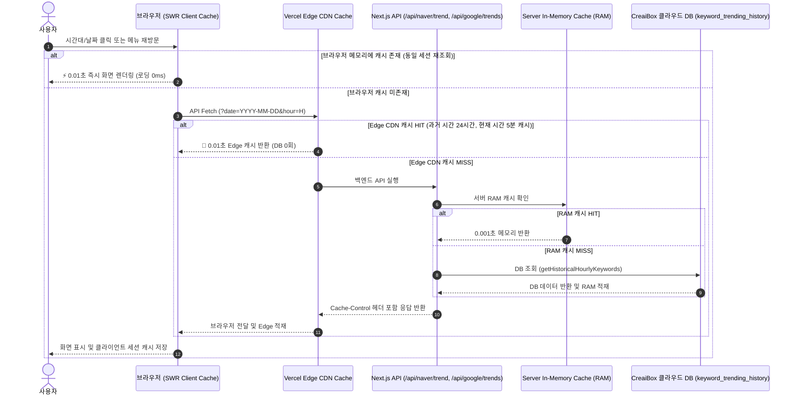

사이드

# 키워드 트렌드 분석 스튜디오 (Keyword Trend Studio)

> **문서 분류**: 아키텍처 기술 명세서 (Architecture Spec)
> **연관 실무 매뉴얼**: `docs/project/manual/06_trend-and-marketing/keyword-precision-tool-architecture-manual.md`
> **연관 DB 스키마**: `docs/database/keyword-trending-history-schema.md`
> **연관 실행 SQL**: `docs/database/sql/keyword_trending_history.sql`

---

이 문서는 키워드 트렌드 분석 스튜디오 모듈의 현재 아키텍처 및 연동 흐름에 대해 설명하는 상시 운영용 문서입니다.

---

## 1. 목적 (Purpose)

* 콘텐츠(텍스트 블로그, 유튜브 영상, AI 음원 앨범) 제작에 앞서 타겟 검색어의 검색량, 클릭률(CTR), 난이도, 형태소 분석 및 최근 트렌드를 종합 분석하여 높은 노출 성과를 기대할 수 있는 전략 기획을 돕습니다.

---

## 2. 주요 기능 (Main Features)

1. **키워드 대량 조회 (`bulk`)**: 최대 50개의 키워드 검색량, CPC, 클릭률, 의도, 난이도를 한 번에 일괄 조회.
2. **연관 키워드 발굴 (`related`)**: 시드 키워드 조합을 통한 연관 롱테일 키워드 목록 발굴 및 다운로드.
3. **형태소 분석기 (`morphology`)**: 한글 텍스트 본문 내 핵심 명사 빈도 밀도 분석 및 형태소 구조 시각화.
4. **실시간 순위 추적 (`rank`)**: Naver, Google, YouTube에서의 특정 URL 타겟 키워드 랭킹 상시 변동 기록.
5. **트렌드 급상승 분석 (`rising`)**: 지난 24시간 동안 소셜/검색 유입 폭증어 수집 및 트렌드 실시간 모니터링.
6. **유튜브 키워드 분석 (`youtube`)**: 유튜브 검색량, CTR 예측치 계산 및 동영상 전용 태그 제안 조합.
7. **SEO 경쟁 분석 (`seo`)**: 상위 노출 3개 경쟁 문서의 평균 글자수, 권장 이미지 수, 키워드 배치 체크리스트 제공.
8. **AI 키워드 전략 생성 (`strategy`)**: 타겟 오디언스 및 어조 필터링을 반영하여 AI 제목, 개요, 태그 일괄 기획서 생성.
9. **자동 콘텐츠 연결 (`workflow`)**: 발굴된 키워드를 블로그 작성, 쇼츠 대본, 음원 작곡 에디터 연동 파이프라인으로 다이렉트 전송.
10. **트렌드 대시보드 (`dashboard`)**: 추적 현황, 예상 유입량 추이(SVG 차트) 및 채널별 점유율을 종합 모니터링.

---

## 3. UI 구조 (UI Structure)

* **홈 화면**: `/studio/keyword/page.tsx`
  - 전반적인 통계 상태, 10개 핵심 도구 네비게이션 카드 및 빠른 추천 키워드로 구성.
* **상세 분석 화면**: `/studio/keyword/[section]/page.tsx`
  - useParams 동적 라우팅을 기반으로 `section`에 상응하는 독립 컴포넌트를 레이아웃에 탑재.
  - 뒤로 가기 브레드크럼 및 메인 카드로 일관된 UX 제공.

---

## 4. 실시간 급상승 키워드 0.01초 광속 캐싱 & 아카이빙 아키텍처

실시간 급상승 키워드(`/studio/keyword/realtime`)는 고빈도 트래픽과 시간대별 조회를 완벽 방어하기 위해 **"3-Tier Multi-Layer Cache Pipeline"**을 적용합니다.

### 시간대별 캐시 동작 규칙
1. **과거 날짜/시간대 (예: 어제 17시, 2시간 전 15시)**:
   - 과거 수집 데이터는 변하지 않는 불변(Immutable) 데이터이므로 **24시간 장기 Edge 캐시(`s-maxage=86400`)**가 적용되어 DB 조회가 영구히 0회가 됩니다.
2. **현재 시간대 (예: 오늘 17시 현재)**:
   - 1시간 크론 수집 주기에 맞춰 **5분 단위 단기 Edge 캐시(`s-maxage=300`)**가 적용되며, 크론 실행 시점에 최신 데이터로 자동 갱신됩니다.
3. **클라이언트 브라우저 (SWR 세션 캐시)**:
   - 사용자가 날짜/시간(17시 ➜ 16시 ➜ 15시 ➜ 다시 17시)을 바꿀 때, 이미 한 번 눌러본 시간대는 브라우저가 메모리에서 **0.01초 만에 로딩 화면 없이 즉각 화면을 전환**합니다. 로그 및 관심 키워드 폴더 저장을 위한 `keyword_tracking`, `keyword_favorites` 테이블 연동이 계획되어 있습니다.

---

## 5. 데이터베이스 연동 구조 (Database Structure)

* **현재 상태**: 로컬 클라이언트 단의 고효율 시뮬레이터(Seed 계산기 및 난수 변동) 방식으로 동작하여 네트워크 오버헤드가 없으며, 반응 속도가 빠릅니다.
* **확장 계획**: 추후 사용자별 순위 추적 로그 및 관심 키워드 폴더 저장을 위한 `keyword_tracking`, `keyword_favorites` 테이블 연동이 계획되어 있습니다.

---

## 6. 컴포넌트 구조 (Component Structure)

* **경로**: `src/app/studio/keyword/[section]/components/`
  - [BulkSearch.tsx](<file:///Users/a1234/Local%20Sites/creaibox/src/app/studio/keyword/[section]/components/BulkSearch.tsx>)
  - [RelatedKeywords.tsx](<file:///Users/a1234/Local%20Sites/creaibox/src/app/studio/keyword/[section]/components/RelatedKeywords.tsx>)
  - [MorphologyAnalyzer.tsx](<file:///Users/a1234/Local%20Sites/creaibox/src/app/studio/keyword/[section]/components/MorphologyAnalyzer.tsx>)
  - [RankTracker.tsx](<file:///Users/a1234/Local%20Sites/creaibox/src/app/studio/keyword/[section]/components/RankTracker.tsx>)
  - [RisingTrends.tsx](<file:///Users/a1234/Local%20Sites/creaibox/src/app/studio/keyword/[section]/components/RisingTrends.tsx>)
  - [YoutubeKeywords.tsx](<file:///Users/a1234/Local%20Sites/creaibox/src/app/studio/keyword/[section]/components/YoutubeKeywords.tsx>)
  - [SeoCompetitor.tsx](<file:///Users/a1234/Local%20Sites/creaibox/src/app/studio/keyword/[section]/components/SeoCompetitor.tsx>)
  - [AiStrategy.tsx](<file:///Users/a1234/Local%20Sites/creaibox/src/app/studio/keyword/[section]/components/AiStrategy.tsx>)
  - [AutoWorkflow.tsx](<file:///Users/a1234/Local%20Sites/creaibox/src/app/studio/keyword/[section]/components/AutoWorkflow.tsx>)
  - [TrendDashboard.tsx](<file:///Users/a1234/Local%20Sites/creaibox/src/app/studio/keyword/[section]/components/TrendDashboard.tsx>)
