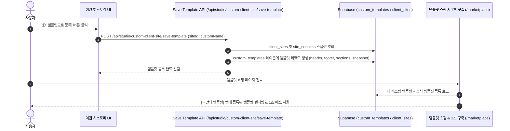

# CreaiBox 커스텀 템플릿 변환 & 마켓플레이스 연동 시스템 아키텍처 명세서 (Custom Templates Architecture)

관련 문서:
- 🔵 [서비스 실무 매뉴얼](file:///Users/a1234/Local%20Sites/creaibox/docs/project/manual/custom-templates-manual.md)
- 🟡 [DB 스키마 명세서](file:///Users/a1234/Local%20Sites/creaibox/docs/database/custom-templates-schema.md)
- 🟢 [순수 실행 SQL DDL](file:///Users/a1234/Local%20Sites/creaibox/docs/database/sql/custom-templates.sql)

---

## 1. 시스템 개요
이관 히스토리나 내 사이트 관리 목록에서 검증된 고품질 웹사이트의 **디자인 구조(헤더, 푸터, 본문 섹션 레이아웃, 컬러 팔레트)**를 원클릭으로 추출하여 `custom_templates` 레지스트리에 등록하고, **[템플릿 쇼핑 & 1초 구축]** 및 **[AI 홈페이지 매직 빌더]**에서 새로운 브랜드의 베이스 템플릿으로 재사용할 수 있도록 지원하는 파이프라인입니다.

---

## 2. 데이터 흐름도

