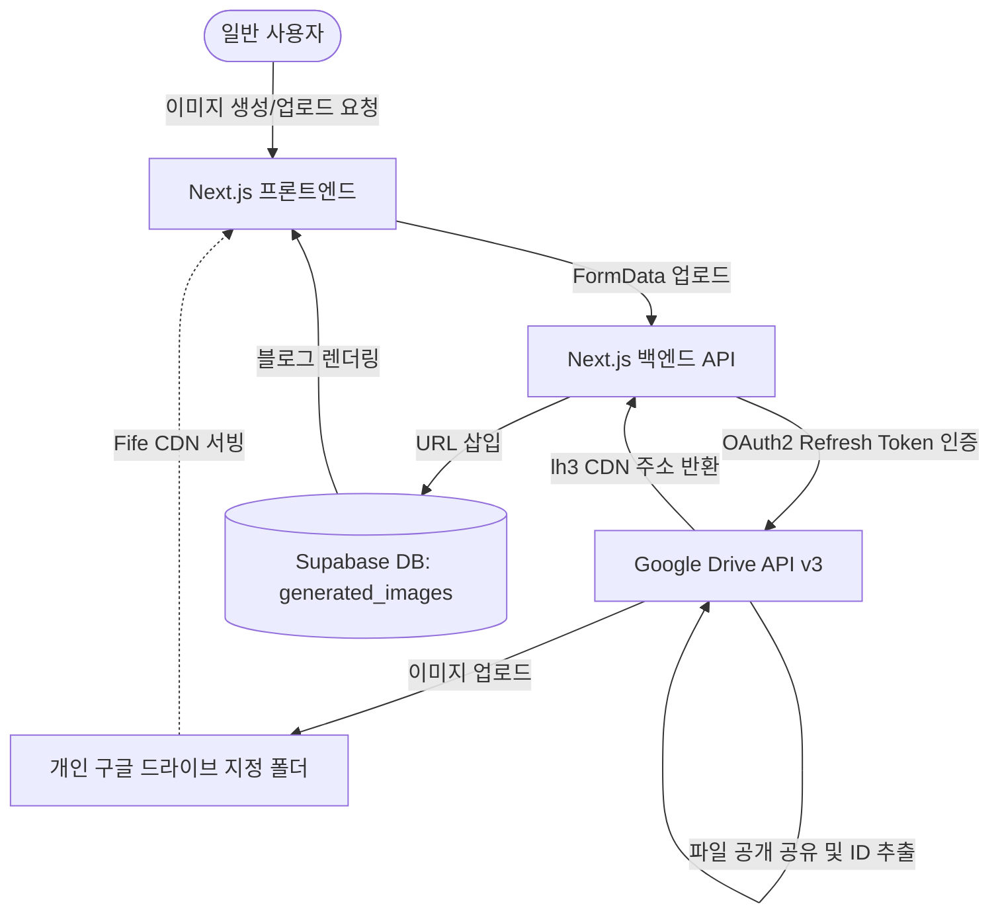

# Google Drive OAuth 2.0 이미지 스토리지 연동 가이드

이 문서는 Supabase Storage 대신 개인 **구글 드라이브 20TB 공간**을 활용하여 블로그 포스트의 AI 생성 썸네일 및 수동 첨부 이미지를 업로드하고 고속 CDN을 통해 서비스하는 아키텍처 및 세부 설정 가이드입니다.

---

## 1. 아키텍처 개요 (Architecture Overview)

개인 구글 계정(구글 원 20TB 요금제 등)의 용량을 활용하기 위해 서비스 계정(JWT) 대신 **사용자 위임 권한 방식(OAuth 2.0)**을 채택했습니다.



### 1-1. 핵심 기술 포인트
* **개인 20TB 공간 우회 활용 (Bypass Quota Limit)**: 서비스 계정(JWT)은 가상 계정이라 용량이 0MB입니다. 따라서 구글 클라우드에서 **OAuth 2.0 클라이언트 ID**를 생성하고, 사용자(20TB 드라이브 소유주)의 **Refresh Token**을 발급받아 Next.js 서버에 주입함으로써 사용자 본인의 이름으로 이미지를 업로드하도록 구현했습니다.
* **Fife 고속 CDN 서빙 (`lh3.googleusercontent.com`)**: 일반 `drive.google.com/uc?id=` 공유 링크는 브라우저 쿠키 체크/제3자 쿠키 차단/CORS 차단(CORP: `same-site` 제한)으로 인해 웹페이지에서 이미지 엑박(Broken Image)을 유발합니다. 이를 해결하고자 구글이 공식 서빙하는 고속 CDN 주소 체계인 `https://lh3.googleusercontent.com/d/[FILE_ID]` 포맷을 사용하여 리다이렉트 없이 즉시 이미지 200 OK 로드가 가능하도록 해결했습니다.
* **안정적인 Supabase 백업 Fallback**: 구글 API 네트워크 장애 또는 토큰 만료 등의 긴급 상황에 대비하여, 업로드 실패 시 기존 **Supabase Storage(`generated-images` 버킷)**로 자동 백업 업로드되도록 복원 메커니즘을 적용했습니다.

---

## 2. 구글 클라우드 및 OAuth2 신규 구축 방법 (Setup Steps)

새로운 프로젝트로 이전하거나 자격 증명을 갱신할 때 아래 3가지 단계를 통해 간단하게 재구축할 수 있습니다.

### [1단계] Google Cloud Console 설정
1. **[Google Cloud Console 사용자 인증 정보](https://console.cloud.google.com/apis/credentials)**에 접속합니다.
2. **프로젝트 선택**을 완료한 뒤, 상단 **`+ 사용자 인증 정보 만들기`** ➡️ **`OAuth 클라이언트 ID`**를 클릭합니다.
   * *동의 화면을 구성하라는 팝업이 뜨면 `OAuth 동의 화면` ➡️ `외부(External)`로 만든 뒤 필수 입력값(앱 이름, 이메일)만 적고 활성화(테스트 단계 유지)합니다.*
3. **애플리케이션 유형**으로 **`웹 애플리케이션(Web Application)`**을 선택합니다.
4. **승인된 리디렉션 URI** 란에 아래의 주소를 등록합니다. (토큰 발급 대행 도구)
   * `https://developers.google.com/oauthplayground`
5. **만들기**를 누르고 생성된 **클라이언트 ID**와 **클라이언트 보안 비밀번호(Client Secret)**를 복사하여 기록합니다.

### [2단계] OAuth 2.0 Playground에서 Refresh Token 획득
1. **[Google OAuth Playground](https://developers.google.com/oauthplayground/)** 사이트에 접속합니다.
2. 오른쪽 위의 **톱니바퀴 아이콘 (OAuth 2.0 configuration)**을 클릭합니다.
3. 맨 하단의 **`Use your own OAuth credentials`**를 체크하고, 방금 발급받은 **클라이언트 ID**와 **클라이언트 보안 비밀번호**를 입력합니다.
4. 왼쪽 **Step 1** 목록의 입력창에 아래 Drive API 권한 스코프를 입력하고 **`Authorize APIs`**를 클릭합니다.
   * `https://www.googleapis.com/auth/drive`
5. 연동하려는 20TB 공간의 구글 계정으로 로그인한 뒤 **권한 허용(Allow)**을 선택합니다.
6. Playground 화면의 **Step 2**로 넘어오면, **`Exchange authorization code for tokens`** 버튼을 눌러 하단에 생성된 **`Refresh token`** 값을 안전하게 복사합니다.

### [3단계] 구글 드라이브 폴더 생성 및 ID 획득
1. 구글 드라이브에서 이미지를 모아둘 새 폴더를 생성합니다. (예: `creaibox-blog-images`)
2. 폴더 안으로 더블클릭해 진입한 뒤 주소창의 URL 맨 뒤 문자열을 복사합니다.
   * `https://drive.google.com/drive/folders/[이_부분이_폴더_ID입니다]`

---

## 3. 환경 변수 구성 (`.env.local`)

프로젝트 루트의 `.env.local` 파일에 발급받은 자격 증명 4가지 항목을 작성합니다. (이 정보는 Git 저장소에 절대 업로드되지 않아야 합니다.)

```env
# GCP OAuth2 & Google Drive 이미지 저장소 설정
GCP_OAUTH_CLIENT_ID="발급받은_OAuth_클라이언트_ID"
GCP_OAUTH_CLIENT_SECRET="발급받은_클라이언트_보안_비밀번호"
GCP_OAUTH_REFRESH_TOKEN="발급받은_OAuth_리프레시_토큰"
GDRIVE_FOLDER_ID="구글_드라이브_폴더_ID"
```

---

## 4. 소스 코드 아키텍처 연동 매핑

구현되어 작동 중인 핵심 코드 파일 경로입니다.

* **[src/lib/google-drive.ts](file:///Users/a1234/Local%20Sites/creaibox/src/lib/google-drive.ts)**:
  * Google OAuth2 클라이언트 초기화 및 리프레시 토큰 교환 담당.
  * `uploadToGoogleDrive` 함수를 통해 웹 버퍼 데이터를 구글 드라이브로 직접 스트리밍하고 전체 공개 권한 및 `lh3` CDN 단독 URL을 추출합니다.
* **[src/app/api/image-upload/route.ts](file:///Users/a1234/Local%20Sites/creaibox/src/app/api/image-upload/route.ts)**:
  * Tiptap 에디터 및 이미지 스튜디오 수동 사진 업로드 요청을 받아 Sharp를 통해 WebP 포맷 최적화 압축을 진행한 뒤 구글 드라이브로 라우팅합니다.
* **[src/app/api/image-studio/generate/route.ts](file:///Users/a1234/Local%20Sites/creaibox/src/app/api/image-studio/generate/route.ts)**:
  * 인공지능(Gemini/OpenAI) 이미지 생성 엔진 완료 시 즉시 구글 드라이브 API 모듈을 호출하여 저장합니다.

---

## 5. 유지보수 및 문제 해결 (Troubleshooting)

### 5-1. 리프레시 토큰의 영구 설정 (만료 방지)
* **문제 상황**: Google Cloud 인증 플랫폼의 기본 게시 상태인 **"테스트 중(Testing)"** 모드에서는 구글 보안 정책상 발급받은 Refresh Token이 **7일(일주일) 뒤에 자동으로 만료**되어 다시 토큰을 재발급해야 하는 번거로움이 생깁니다.
* **해결 방법 (신규 Google 인증 플랫폼 UI 기준)**:
  1. Google Cloud 콘솔의 왼쪽 사이드바 메뉴에서 세 번째 메뉴인 **`대상` (Audience)**으로 이동합니다.
  2. **`게시 상태`** 섹션의 **`앱 게시`** 버튼을 클릭합니다.
  3. **"프로덕션으로 푸시하시겠어요?"**라는 확인 팝업창이 나타나면 **`확인`**을 클릭합니다.
  4. 게시 상태가 **`프로덕션 단계`**로 전환되었는지 확인합니다.
* **참고 (인증/검토 제출 여부)**:
  > [!IMPORTANT]
  > 콘솔 상단에 **"앱을 인증해야 합니다. 정보를 구성한 후 검토를 위해 앱을 제출하세요."** 또는 **"앱을 검증해야 합니다..."**와 같은 노란색 경고 창이 나타나더라도, **실제 검토 제출(인증)을 진행하실 필요가 전혀 없습니다.**
  > 
  > * **이유**: 이 앱은 일반 사용자가 직접 구글 로그인을 수행하는 구조가 아니라, 서버 내부에서 관리자(본인)의 Refresh Token을 사용해 관리자 계정 권한으로만 드라이브에 접근하는 방식이기 때문입니다.
  > * **결과**: `프로덕션 단계` 상태로 변경만 해두면 리프레시 토큰의 7일 만료 기한 제한이 해제되며, 구글 측에 검토(Verification)를 제출하여 승인받지 않더라도 토큰이 영구적으로 만료되지 않고 정상 동작합니다. 따라서 해당 경고창은 안심하고 무시하셔도 됩니다.

### 5-2. 업로드 속도 개선
* Sharp 라이브러리를 통해 서버 측에서 WebP 압축(화질 72%) 후 업로드하므로 원본(몇 MB) 대비 구글 드라이브 사용량 및 업로드 지연시간이 현격히 적어 최적의 속도를 유지합니다.

