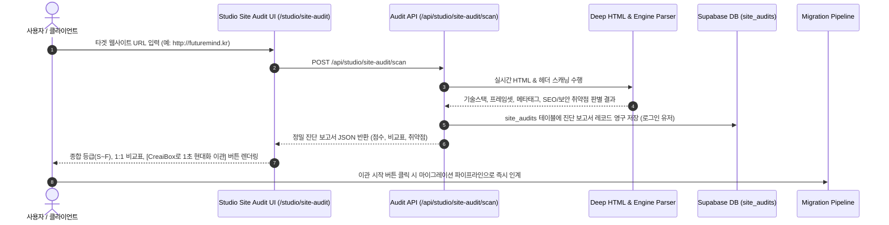

# CreaiBox AI 웹사이트 정밀 진단 시스템 아키텍처 명세서 (Site Audit Architecture)

관련 문서:
- 🔵 [서비스 실무 매뉴얼](file:///Users/a1234/Local%20Sites/creaibox/docs/project/manual/site-audit-manual.md)
- 🟡 [DB 스키마 명세서](file:///Users/a1234/Local%20Sites/creaibox/docs/database/site-audits-schema.md)
- 🟢 [순수 실행 SQL DDL](file:///Users/a1234/Local%20Sites/creaibox/docs/database/sql/site-audits.sql)

---

## 1. 시스템 개요 및 목적
`AI 웹사이트 정밀 진단 시스템`은 사용자가 입력한 모든 외부 웹사이트의 소스 코드, HTML 태그, HTTP 응답 헤더, DNS 및 프레임셋 구조를 심층 크롤링·분석하여 다음 5대 영역을 진단합니다:
1. **개발 프로그램 & 엔진 자동 판별** (Figma Site, WordPress, Wix, Imweb, Pure HTML/Frameset, Next.js 등)
2. **도메인 & 프레임셋 포워딩 취약점 검출** (주소창 고정 포워딩, SSL 미적용 등)
3. **검색엔진(SEO) 및 소셜 메타태그 최적화 점수**
4. **CreaiBox 초격차 1:1 비교 분석표 자동 도출**
5. **원클릭 현대화 이관 솔루션 파이프라인 연계**

---

## 2. 진단 파이프라인 아키텍처

---

## 3. 핵심 분석 알고리즘

### 3.1. 고정 프레임셋(Frameset) 포워딩 판별
- 정규식 `<frameset[\s\S]*?>` 및 `<frame[\s\S]*?src=["']([^"']+)["']>`를 감지하여 도메인 업체(가비아, 후이즈 등)의 고정 포워딩 여부를 100% 감지.
- 프레임 내부의 실제 호스팅 주소(`frame_src`)를 자동 추출.

### 3.2. 개발 엔진 및 기술 스택 시그니처 매칭
- **CreaiBox Native Site**: `*.creaibox.com`, `localhost`, `Powered by CreaiBox`, `creaibox-assets` 감지 시 **Next.js React (CreaiBox 정식 초고속 웹)** 엔진으로 자동 식별
- **Figma Site**: `figma.site`, `figma-iframe`
- **Imweb**: `imweb.me`, `imweb-section`, `cdn.imweb.me`
- **Wix**: `wixsite.com`, `wix-sdk`, `wix-warmup-data`
- **WordPress**: `wp-content`, `wp-includes`, `wp-json`
- **Cafe24**: `cafe24.com`, `cafe24cdn`
- **Next.js / Vercel**: `_next/static`, `__NEXT_DATA__`
- **Pure Frameset**: 본문 없이 프레임셋만 존재하는 레거시 사이트

### 3.3. CreaiBox 네이티브 사이트 전용 처리 및 Strict Zero Fake Data 원칙
- CreaiBox 정식 사이트일 경우 타겟 사이트 상태를 외부 구형 사이트처럼 깎아내리지 않고 Vercel Global Edge CDN, 딥링크 라우팅 등 이미 갖춰진 인프라를 정상 표기하며, 불필요한 '이관하기' 버튼 대신 `[ CreaiBox 정식 라이브 사이트 관리하기 ]` 버튼을 렌더링.
- **Strict Zero Fake Data 원칙 준수**: CreaiBox 배포 사이트라 할지라도 고객사가 개별 등록하지 않은 항목(전용 파비콘, 서치콘솔 소유권 메타태그)은 임의로 '완료' 처리하지 않고 `⚠️ 미등록`으로 정직하게 표기하여 스튜디오 관리 화면에서 보완할 수 있도록 안내.
- **브랜드 커스텀 이메일**: 점수 평가 항목에서 제외하고 순수 참고/부가 혜택으로 분리 안내.
