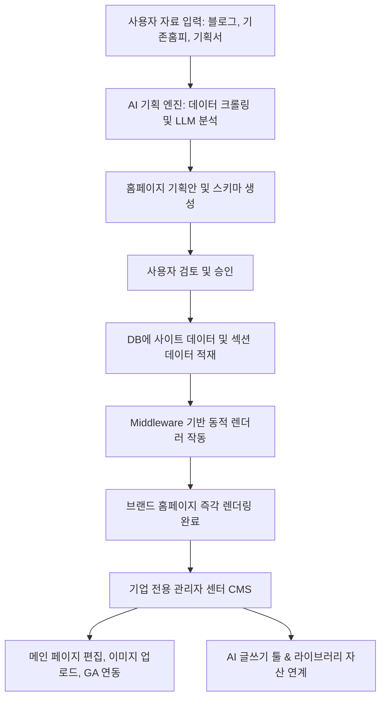

# CreAibox AI 홈페이지 빌더 & CMS 서비스 기획 제안서 (확정안)

본 제안서는 사용자가 블로그 주소나 기존 기획안 등의 소스 데이터를 입력하면 AI가 비즈니스 구조를 자동으로 기획 및 생성하고, 이를 기업 전용 관리자 센터(CMS)에서 유지보수할 수 있는 **"AI 기반 B2B 홈페이지 자동 빌더 시스템"**에 대한 기술 설계 및 아키텍처 방안입니다.

---

## 1. 아키텍처 비전 (Vision)

기존에 수동으로 폴더를 분리하던 방식(`src/app/clients/[client_name]`)을 넘어, **Dynamic Database-Driven Headless CMS**와 **AI 기획 엔진**을 결합한 클라우드 SaaS형 빌더 구조로 확장합니다.

---

## 2. 핵심 시스템 구성 요소 (인터뷰 합의안 반영)

### 2-1. AI 기획 엔진 (AI Planner) - [1단계 기획 ➡️ 2단계 생성 방식]
1.  **자료 수집 및 LLM 분석**: 사용자가 입력한 블로그 및 기존 사이트 URL에서 본문을 파싱하고, 비즈니스 성격에 맞춰 홈페이지 구조, 카피 문구, 서비스 상세 내용을 기획서(JSON) 형태로 도출합니다.
2.  **기획안 검토 & 편집**: 즉시 홈페이지를 개설하기 전, 사용자 대시보드 상에 **기획안(섹션 구조, 카드 개수, 타이틀 문구)을 먼저 시각적으로 제공하여 사용자가 직접 수정하고 승인**할 수 있는 징검다리 단계를 제공합니다.
3.  **홈페이지 최종 빌드**: 기획서가 승인 완료되면 DB에 데이터가 삽입되고 실제 서비스 템플릿으로 연동되어 즉시 사이트가 활성화됩니다.

### 2-2. 동적 템플릿 렌더러 (Dynamic Template Engine) - [워드프레스식 카테고리/선언적 테마 방식]
*   **카테고리별 템플릿 레지스트리**: 템플릿을 워드프레스처럼 카테고리(예: 비즈니스, 포트폴리오, 레스토랑/푸드, 교육/학원, 매거진/블로그 등)별로 분류하여 탐색할 수 있는 통합 카테고리 레지스트리를 설계합니다. 사용자는 사이트 개설 시 이 템플릿 스토어 화면에서 직접 카테고리별 템플릿을 선택합니다.
*   **선언적 JSON 테마 스키마 (Declarative JSON Themes)**: 매번 템플릿마다 독립된 React 페이지 코드를 통째로 작성하는 방식이 아닌, 색상 팔레트(Primary/Secondary/Bg/Accent), 레이아웃 구조(그리드 수, 히어로 정렬 방식), 폰트 스타일(Google Fonts), 컴포넌트별 배치 정보를 **선언적 JSON 파일(예: `templates/agency_standard.json`)**로 미리 정의하는 아키텍처를 수립합니다.
*   **컴포넌트 데이터 규격(Schema) 검증**: 각 템플릿 JSON이 요구하는 섹션별(Hero, ServiceCard, Portfolio, Form 등) 데이터 규격을 엄격하게 정의합니다. AI가 크롤링 데이터를 기획하고 적재할 때와 사용자가 CMS에서 수정할 때, 데이터의 구조적 누락이나 깨짐을 사전에 차단하기 위한 스키마 검증(Zod 등 활용) 단계를 탑재하여 높은 안정성을 유지합니다.
*   **AI 플러그앤플레이(Plug & Play) 확장성**: 새로운 디자인 테마 템플릿을 계속해서 추가하고 싶을 때 복잡한 코드 수정 없이, 제미나이(AI)나 개발자가 규격에 맞는 **JSON 설정 데이터와 CSS 테마 클래스 셋**만 작성하여 레지스트리에 추가하면 즉시 템플릿 선택기 및 동적 렌더러에 추가 적용됩니다.

### 2-3. 기업 전용 관리자 센터 (Corporate CMS) - [CreAibox 자산 원클릭 바인딩]
*   **에셋 라이브러리 연동**: 사용자가 CreAibox 스튜디오(음악, 영상, 비주얼)에서 제작하여 보관 중인 개인 에셋 목록을 CMS 내 'CreAibox 에셋 보관함'을 통해 실시간으로 노출합니다. 이를 통해 마음에 드는 이미지/음악/영상 자산을 원클릭으로 내 홈페이지의 히어로 배경이나 배너 카드로 바인딩할 수 있습니다.
*   **AI 마케팅 에디터 탑재**: 기업용 블로그 포스트 및 공지사항 작성 시, 기존 CreAibox AI 글쓰기 API를 가져와 **대화형/마케팅 초안 작성용 AI 에디터를 CMS 내에 인라인으로 탑재**하여 업무 효율을 제공합니다.

### 2-4. 문의 관리 및 접수 알림 시스템 (Inquiry & Push Notification)
*   **문의 DB 적재**: 일반 방문자가 독립 홈페이지(예: `sotongcheum.com` 등)의 신청 폼을 작성하면 `site_posts` 테이블에 `post_type = 'inquiry'`로 안전하게 적재됩니다.
*   **상태값 및 메모 관리**: 기업 CMS의 '문의 및 상담 관리' 메뉴에서 유입된 문의 내역의 상세 내용을 확인하고, **'접수 / 상담중 / 완료'** 등의 상태 변경 및 전용 내부 상담 메모를 기록할 수 있습니다.
*   **즉각적인 알림 발송**: 문의글이 등록되는 즉시, 홈페이지 소유자의 이메일 및 플랫폼 내부 알림 센터로 알림 푸시를 자동 발송합니다.

### 2-5. 애널리틱스 및 통계 분석 (Analytics)
*   **구글 애널리틱스(GA4) 연동**: 사용자가 자신의 GA4 측정 ID(`G-XXXXX`)를 입력하면 홈페이지 렌더링 시 Google Tag 추적 스크립트가 자동으로 주입되도록 설계합니다.
*   **로컬 트래픽 통계 시각화**: 플랫폼 레벨에서도 DB 방문 로그 데이터를 통해 **일간 방문자 수(PV, UV) 및 유입 경로 등의 기본 분석 지표**를 추적 및 적재하고, 이를 기업용 CMS 대시보드 내에 미려한 차트 형태로 시각화하여 제공합니다.

### 2-6. 구글 드라이브 기반 클라이언트 격리형 스토리지 (Isolated Google Drive Storage)
*   **클라이언트 전용 폴더 자동 생성**: 사용자가 홈페이지를 개설하거나 CMS 에디터에서 이미지/로고 등을 직접 업로드할 때, 구글 드라이브 루트 폴더(`GDRIVE_FOLDER_ID`) 하위에 클라이언트의 고유 식별자(`user_id` 및 `brand_id`)로 명명된 독립 폴더를 자동으로 생성합니다.
*   **월별 및 소스별 파일 격리**: 폴더 구조 오염을 방지하기 위해 클라이언트 전용 폴더 아래에 `client-site-builder`라는 소스 타입(sourceType) 폴더를 생성하고, 그 하위에 `YYYYMM` 형식의 연월 폴더(예: `202606`)를 생성하여 에셋들을 안전하게 보관합니다.
*   **WebP 최적화 및 CDN 링크 발급**: 업로드된 이미지 파일들은 Next.js API 라우트 내에서 `sharp` 모듈을 통해 고성능 WebP 포맷(압축률 92%)으로 자동 변환된 뒤 구글 드라이브로 전송됩니다. 이후 해당 파일의 읽기 권한을 전체 공개("reader", "anyone")로 자동 부여하여, 브라우저가 초고속으로 이미지를 불러올 수 있는 Google CDN 주소(`https://lh3.googleusercontent.com/d/{fileId}`)를 획득해 DB(`site_sections` 또는 `site_posts` 등)에 실시간 바인딩합니다.

### 2-7. 요금제 및 권한 관리 (Business Plan Membership Restriction)
*   **비즈니스(Business) 요금제 이상 권한 제한**: AI 홈페이지 제작 및 CMS 빌더 기능은 플랫폼 내 `membership_level`이 `business`, `enterprise`, 혹은 관리자 권한(`admin` / `ADMIN` 등)인 계정에만 활성화 및 제공됩니다.
*   **하위 요금제 안내 및 업그레이드 유도 UI**: `free`, `creator`, `pro` 요금제 사용자가 사이트 빌더 메뉴에 진입할 경우, 기능을 비활성화 처리하고 "비즈니스 요금제 전용 기능 - 도입 문의하기" 가이드 뷰 및 상담 문의 모달을 렌더링하여 비즈니스 전환을 유도합니다.
*   **백엔드 API 단 권한 검증**: 프론트엔드 UI 통제 외에도 홈페이지 생성, 섹션 수정, 이미지 업로드 등의 모든 백엔드 API 라우트에서 Supabase 유저 세션의 `membership_level`을 엄격히 조회하여, 권한이 없는 요청에 대해 `403 Forbidden` 에러를 반환해 보안을 확립합니다.

---

## 3. 데이터베이스 스키마 모델 설계

Supabase 상에 신설할 수 있는 관계형 데이터베이스(RD) 모델 설계 제안입니다.

### 3-1. `client_sites` (기업 홈페이지 마스터)
| 컬럼명 | 타입 | 제약 조건 | 설명 |
| :--- | :--- | :--- | :--- |
| `id` | uuid | PRIMARY KEY, Default gen_random_uuid() | 사이트 고유 키 |
| `profile_id` | uuid | REFERENCES profiles(id) ON DELETE CASCADE | 소유자 프로필 ID (회원 계정) |
| `brand_id` | text | UNIQUE, NOT NULL | 서브도메인 브랜드명 (예: `sotongcheum`) |
| `custom_domain` | text | UNIQUE | 외부 연동 개인 독립 도메인 (예: `sotongcheum.com`) |
| `template_id` | text | NOT NULL, Default 'service_1' | 적용한 템플릿 코드 (`service_1`, `food_1` 등) |
| `company_name` | text | NOT NULL | 회사/기관 공식 한글명 |
| `phone` | text | | 대표 연락처 |
| `address` | text | | 주소 |
| `status` | text | Default 'ACTIVE' | 사이트 운영 상태 (`ACTIVE`, `INACTIVE`) |
| `extra_configs` | jsonb | Default '{}' | SNS 링크, 사업자번호, GA4 측정 ID 등 설정값 |
| `created_at` | timestamp | Default now() | 생성 일시 |

### 3-2. `site_sections` (메인 페이지 동적 섹션 콘텐츠)
| 필드명 | 타입 | 제약 조건 | 설명 |
| :--- | :--- | :--- | :--- |
| `id` | uuid | PRIMARY KEY, Default gen_random_uuid() | 섹션 고유 키 |
| `site_id` | uuid | REFERENCES client_sites(id) ON DELETE CASCADE | 소속 홈페이지 ID |
| `section_type` | text | NOT NULL | 섹션 종류 (`hero`, `services`, `rental`, `portfolio`, `contact`) |
| `sort_order` | integer | Default 0 | 렌더링 정렬 순서 |
| `title` | text | | 섹션 큰 제목 |
| `subtitle` | text | | 섹션 작은 제목/설명 |
| `content_data` | jsonb | Default '{}' | 섹션 하위 요소(카드 썸네일 URL, 불릿 리스트, 뱃지 등) 정보 |

### 3-3. `site_posts` (홈페이지 게시판 및 문의 내역)
| 필드명 | 타입 | 제약 조건 | 설명 |
| :--- | :--- | :--- | :--- |
| `id` | uuid | PRIMARY KEY, Default gen_random_uuid() | 게시글 고유 키 |
| `site_id` | uuid | REFERENCES client_sites(id) ON DELETE CASCADE | 소속 홈페이지 ID |
| `post_type` | text | NOT NULL | 게시글 구분 (`notice` 공지, `board` 일반게시글, `inquiry` 문의글) |
| `title` | text | NOT NULL | 제목 |
| `content` | text | NOT NULL | 본문 또는 상세 문의 내용 |
| `author_name` | text | | 작성자 이름/닉네임 |
| `is_pinned` | boolean | Default false | 상단 고정 여부 (공지용) |
| `views` | integer | Default 0 | 조회수 |
| `extra_data` | jsonb | Default '{}' | 문의유형, 자녀학년, 예산, 희망일 등 유연한 포맷 데이터 |
| `created_at` | timestamp | Default now() | 작성 일시 |
| `updated_at` | timestamp | Default now() | 수정 일시 |

---

## 4. 단계별 개발 로드맵 (Roadmap)

### 🚀 Phase 1: AI 분석 및 기획안 미리보기 MVP (1~2주)
*   블로그 주소를 입력받아 LLM이 이를 B2B 학원/대행/푸드 등으로 분류하고, 맞춤형 타이틀과 상세 카피(JSON 구조)를 출력하는 기획 마법사 페이지 개발.
*   사용자 화면에 기획안 승인/반려 인터페이스 구현.

### 🚀 Phase 2: 동적 템플릿 엔진 & 마스킹 라우터 고도화 (2주)
*   `src/app/clients/[client_name]/page.tsx`를 공통 동적 렌더러로 변경하여, DB의 `site_sections` 테이블 정보를 기반으로 화면을 렌더링하도록 템플릿 엔진 개발.
*   기존의 `clientSites.ts` 정적 레지스트리를 유지하되, 필요 시 DB에서 동적 클라이언트를 캐싱하는 하이브리드 미들웨어 도입.

### 🚀 Phase 3: 기업 전용 관리자 센터(CMS) 및 AI 라이팅 결합 (3~4주)
*   대시보드 내에 "사이트 디자인/텍스트 편집기" 및 "고객 상담문의 관리 테이블" 신설.
*   에셋 라이브러리 이미지 연동 및 기존 CreAibox AI 글쓰기 API를 가져와 "기업 브로그용 포스팅 AI 도구" 가동.

### 🚀 Phase 4: GA 분석 & 로그 추적 및 상용 배포 (1주)
*   사용자 개별 GA4 트래픽 추적 스크립트 주입 모듈 및 어드민 내 미니 통계 대시보드 오픈.
*   독립 도메인(CNAME/A레코드)을 손쉽게 연결할 수 있는 Vercel Domains API 연동 및 최종 프로덕션 가동.
