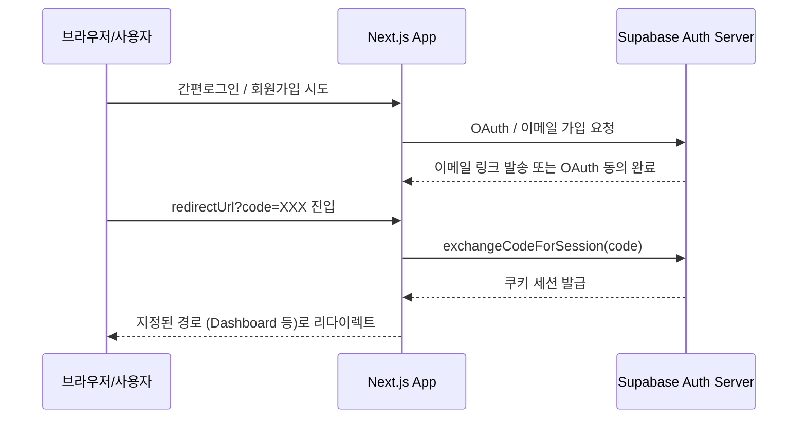

# Supabase 연동 및 인증 흐름 (Supabase Integration)

`CreAibox`는 데이터 저장, 사용자 인증 및 관리, 영속화 스토리지를 제어하기 위해 Supabase BaaS를 전면 채용하고 있습니다.

---

## 1. Supabase 인스턴스 팩토리

클라이언트 컴포넌트와 서버 컴포넌트/API 라우트의 실행 맥락에 따라 인스턴스 생성 헬퍼가 이원화되어 있습니다.

### 1-1. 브라우저 클라이언트 (`utils/supabase/client.ts`)
* **역할**: 클라이언트 컴포넌트(React Hydration 이후)에서 인증 세션 조회 및 사용자 상호작용 DB 수정용.
* **패키지**: `@supabase/ssr` 내 `createBrowserClient` 사용.
* **환경 변수**:
  - `process.env.NEXT_PUBLIC_SUPABASE_URL`
  - `process.env.NEXT_PUBLIC_SUPABASE_ANON_KEY`

### 1-2. 서버 클라이언트 (`utils/supabase/server.ts`)
* **역할**: Next.js Server Components, Server Actions, API Route Handlers, Middleware에서 호출.
* **패키지**: `@supabase/ssr` 내 `createServerClient` 사용.
* **쿠키 관리**: Next.js `headers`의 `cookies` 인스턴스를 통해 쿠키 세션을 연동하여 헤더의 인증 토큰을 투명하게 주입하고 기록.

### 1-3. 서비스 롤(Service Role) 관리 클라이언트
* **패키지/파일**: `src/lib/server/get-free-gemini-key.ts`
* **변수명**: `supabaseAdmin`
* **용도**: RLS(행 수준 보안) 우회가 필요한 백엔드 관리 작업 (예: 공용 API 금고 복제, 가입자 어드민 제어).
* **환경 변수**: `process.env.SUPABASE_SERVICE_ROLE_KEY` 사용 (절대 클라이언트에 노출되어선 안 됨).

---

## 2. 사용자 인증 흐름 (Auth Flow)

### 2-1. 콜백 처리 라우트 (`app/auth/callback/route.ts`)
* OAuth 간편 로그인(구글 등) 또는 이메일 인증 절차 후 유입되는 `code` 파라미터를 인터셉트합니다.
* `supabase.auth.exchangeCodeForSession(code)`를 통해 임시 권한 코드를 영구 회원 세션 쿠키로 스왑하고, 브라우저에 세션을 안착시킨 후 타겟 페이지(`/` 또는 `/login?error_msg=...`)로 보냅니다.

### 2-2. 클라이언트 렌더링 최적화 (`waitForAuthenticatedUser` 헬퍼)
* **파일**: `src/lib/queries/manuscripts.ts`
* **목적**: 클라이언트가 마운트되는 시점과 Supabase Auth 세션이 복원(Restore)되는 속도 간의 미세한 타이밍 어긋남 방지.
* **작동 방식**: 최대 4회(`AUTH_RETRY_ATTEMPTS`) 동안 350ms 간격으로 지연 대기하며 `supabase.auth.getSession()` 및 `getUser()` 세션을 폴링해 사용자를 안전하게 반환합니다.
