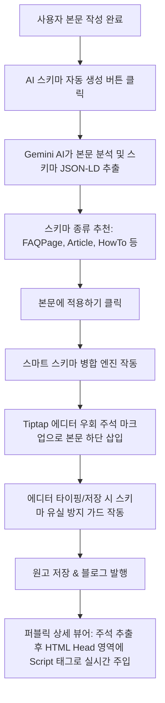

# AI 구조화 스키마(JSON-LD) 생성 및 관리 엔진 기술 명세서

본 문서는 크리에이박스(CreAiBox) 스튜디오 에디터 내에 구현된 **AI 구조화 스키마 자동 생성 및 다중 병합 엔진**의 작동 원리, 아키텍처 설계 사상, 개발자 참고 가이드 및 사용자 교육 자료를 기술합니다.

---

## 1. 아키텍처 개요 (Architecture Overview)

구조화 데이터(Structured Data, JSON-LD)는 구글/네이버 등의 검색 수집 로봇이 사이트 콘텐츠의 의미를 한눈에 이해하고, 검색 결과 페이지에 풍부한 Rich Snippet(예: 질문/답변 확장 메뉴, 리뷰 별점, 제품 정보 등)을 렌더링하기 위해 주입하는 기계용 글로벌 웹 표준 데이터 규격입니다.

크리에이박스의 AI 스키마 엔진은 **글 작성 완료 단계에서 작성된 본문을 바탕으로 스키마 마크업을 AI가 실시간 분석 및 추천하고, 본문에 비가시적으로 심어주어 구글과 네이버 검색 상위 노출(SEO)을 자동화**합니다.



---

## 2. 핵심 설계 및 기술적 우회 기법 (Core Technologies)

### ① Tiptap 에디터 HTML 살균(Sanitization) 우회 기법
* **문제점**: 
  리치 텍스트 에디터인 Tiptap은 보안 및 텍스트 렌더링 품질을 위해 허용되지 않는 HTML 태그(예: `<script type="application/ld+json">`)가 본문에 유입되면 강제로 정화(Sanitize)하여 삭제해 버립니다.
* **해결법 (비가시 주석 래퍼 기법)**:
  Tiptap이 해석하지 못하고 그대로 보존하는 HTML 주석(`<!-- ... -->`) 태그로 스키마 코드를 래핑하여 에디터 내에 삽입합니다.
  ```html
  <!-- CREAIBOX_SCHEMA_START
  {
    "@context": "https://schema.org",
    "@type": "FAQPage",
    "mainEntity": [...]
  }
  CREAIBOX_SCHEMA_END -->
  ```
  이 주석 래퍼는 에디터 본문 뒤에 껌딱지처럼 안전하게 달라붙어 훼손되지 않으며, 독자가 읽는 본문 레이아웃에는 투명하게 숨겨집니다.

### ② 에디터 `onUpdate` 시 스키마 유실 방지 가드 (State Retention Loop)
* **문제점**:
  에디터에서 글을 쓰거나 포커스가 아웃될 때마다 Tiptap은 최신 HTML 본문을 부모 데이터 상태인 `content`에 0.5초마다 덮어씁니다. 이때 Tiptap 에디터 인스턴스 영역 밖의 보이지 않는 주석 데이터는 누락되기 십상이었습니다.
* **해결법**:
  [UniversalBlogEditor.tsx](file:///Users/a1234/Local%20Sites/creaibox/src/components/writing/editor/UniversalBlogEditor.tsx) 의 `onUpdate` 루틴에서 부모 상태인 `content` 에 기존 스키마 주석이 이미 달려있는지를 정규식으로 감지한 후, 사용자가 타자를 치고 수정하는 순간마다 그 스키마를 HTML 끝에 실시간으로 다시 병합(Keep-alive)하여 상태를 보존해 줍니다.

---

## 3. 스마트 스키마 병합 엔진 (Smart Schema Upsert Merger)

하나의 글에 `Article`(기사 정보)과 `FAQPage`(질문/답변 목록) 등 여러 종류의 스키마를 동시에 삽입하고 싶어 하는 작성자 요구사항을 만족시키기 위해 **동일 유형 덮어쓰기 및 타 유형 병렬 적재** 엔진을 적용했습니다.

### 작동 메커니즘
1. **타입 수집**: 사용자가 [본문에 적용하기]를 클릭하면, 원고 본문 맨 뒤의 모든 주석 블록을 찾아 `@type`을 기준으로 파싱하여 메모리 상의 Map에 분류 적재합니다.
2. **Upsert(업서트) 연산**:
   * **새로 적용할 스키마 유형과 동일한 유형이 존재하면**: 기존 값을 덮어씁니다(Update).
   * **다른 유형의 스키마라면**: 기존 스키마를 지우지 않고 옆에 새롭게 덧붙여 누적합니다(Insert).
3. **일괄 정화 및 주입**: 본문 하단에 남아있던 모든 구버전 스키마 주석 블록들을 정규식으로 싹 청소한 후, Map에 누적 보존된 스키마 세트 전체를 다시 이쁘게 조립하여 본문 뒤에 일괄 주입합니다.

---

## 4. 다중 스키마 통합 미리보기 엔진 (Multi-Schema Preview List)

스키마 편집기 하단에 탑재된 검색 결과 미리보기 영역은 실시간 데이터 상태를 가시화하여 관리자 오해를 없애줍니다.

* **적용 대기 중 (주황색 배지 - Pending)**:
  AI를 가동하여 생성은 마쳤으나 아직 [본문에 적용하기] 버튼을 누르지 않아, 원고 상태에 공식적으로 반영되지 않고 에디터 메모리에 임시 캐싱되어 있는 스키마입니다.
* **장착 완료 (녹색 배지 - Active in Body)**:
  [본문에 적용하기]를 클릭하여 원고 본문 하단 주석 블록 내에 성공적으로 삽입 완료된 스키마입니다. (적용 완료 즉시 임시 편집 코드가 청소되며 배지가 녹색으로 자동 갱신됩니다.)

---

## 5. 퍼블릭 상세 뷰어의 렌더링 파이프라인

데이터베이스(Supabase)에 주석 형태로 최종 저장된 스키마 데이터는, 실제 독자가 조회하는 퍼블릭 블로그 페이지([src/app/blog/[slug]/page.tsx](file:///Users/a1234/Local%20Sites/creaibox/src/app/blog/%5Bslug%5D/page.tsx))에 이르러 본래의 기능을 발휘합니다.

```typescript
// 1. 본문에 포함된 비가시 주석 스키마를 정규식으로 찾아 추출합니다.
const customSchemas: string[] = [];
const schemaRegex = /<!--\s*CREAIBOX_SCHEMA_START([\s\S]*?)CREAIBOX_SCHEMA_END\s*-->|<script type="application\/ld\+json">([\s\S]*?)<\/script>/gi;
let match;
while ((match = schemaRegex.exec(post.content || "")) !== null) {
  const rawSchema = (match[1] || match[2] || "").trim();
  if (rawSchema) {
    customSchemas.push(rawSchema);
  }
}

// 2. 추출된 JSON 코드를 기계가 읽을 수 있도록 HTML 헤더(<head>) 영역에 <script> 태그 형태로 동적으로 꽂아 넣습니다.
return (
  <>
    {customSchemas.map((schemaText, index) => (
      <script
        key={`custom-schema-${index}`}
        type="application/ld+json"
        dangerouslySetInnerHTML={{ __html: schemaText }}
      />
    ))}
    ...
  </>
);
```

이 기법을 통해 **포스팅 본문 가독성은 티 없이 깨끗하게 유지하면서, 소스코드 단에는 검색 크롤러 맞춤형 구조화 마크업이 구글과 네이버 양대 포털 규격에 완벽히 매칭되어 기동**되는 SEO 최적화 아키텍처가 구현되었습니다.
