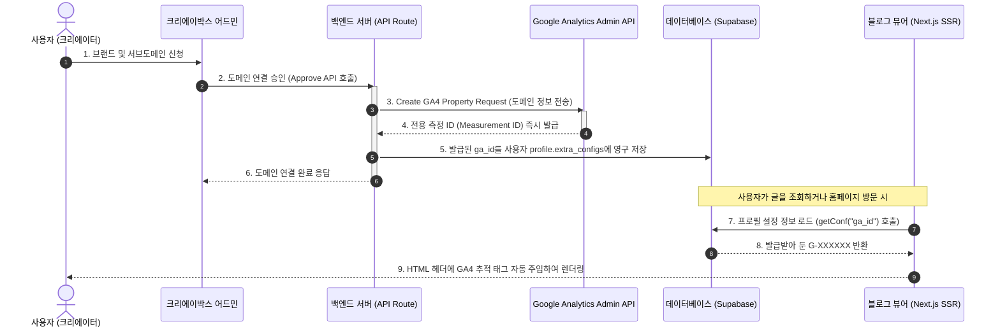

# 구글 애널리틱스(GA4) 자동 발급 및 셋팅 시스템 아키텍처 가이드

본 문서는 올인원 생성형 AI 콘텐츠 스튜디오 **크리에이박스(CreAibox)** 플랫폼이 제공하는 핵심 기술이자 자동화 마케팅 기능인 **구글 애널리틱스(GA4) 자동 발급 시스템**의 동작 원리와 비즈니스 가치에 대해 기술합니다. 나중에 홍보 및 사용자 교육/가이드 자료로 활용하실 수 있도록 설계되었습니다.

---

## 🌟 1. 서비스 개요 (기존의 페인 포인트와 해결책)

### ❌ 기존 방식의 고충 (Traditional Approach)
개인 블로그나 마케팅용 독립 도메인 웹사이트를 구축한 뒤 방문자 분석을 시작하려면 다음과 같은 복잡한 수동 단계를 거쳐야 했습니다:
1. 구글 애널리틱스(GA4) 웹사이트 접속 및 로그인
2. 신규 속성(Property) 및 데이터 스트림(Web Stream) 생성
3. 복잡한 추적 코드(`gtag.js`) 또는 측정 ID(`G-XXXXXXXXXX`) 직접 복사
4. 자체 웹사이트 소스 코드의 `<head>` 영역에 개발자가 수동으로 스크립트 삽입 및 배포
5. 소유권 인증을 위해 구글 서치콘솔에 별도 등록 및 인증코드 파싱 작업 수행

이 과정에서 HTML 코드를 잘못 만져 웹사이트 레이아웃이 깨지거나, 수집 ID를 오타로 잘못 입력하여 방문 데이터 유실이 일어나는 **휴먼 에러(Human Error)**가 번번이 발생했습니다.

### ⭕ 크리에이박스의 해결책 (CreAibox Automation)
크리에이박스는 사용자가 브랜드 독립 도메인 연결을 신청하고 어드민(관리자)이 승인하는 순간, **구글 클라우드 애널리틱스 관리자 API(Google Analytics Admin API)**와 결합하여 **단 1초 만에 전용 프로퍼티 개설, ID 발급, 태그 인젝션 및 서치콘솔 자동 인증 연동을 100% 무인 자동 처리**합니다.

---

## ⚙️ 2. 시스템 아키텍처 및 동작 흐름 (Data Flow)

아래 다이어그램은 브랜드 생성 및 도메인 연동 시 구글 애널리틱스가 자동으로 프로퍼티를 발급하여 웹사이트 렌더링에 실어 나르는 전체 수명 주기(Lifecycle)를 도식화한 것입니다.



---

## 💻 3. 핵심 소스 코드 구현 상세

### 3.1. 백엔드 자동 발급 API 핸들러
* **파일 위치**: [route.ts](file:///Users/a1234/Local%20Sites/creaibox/src/app/api/admin/brands/approve/route.ts#L114-L124)
* **로직**: 관리자가 브랜드를 승인하는 트랜잭션 도중, 구글 애널리틱스 어드민 API로부터 전송받은 신규 `measurementId` 값을 데이터베이스의 프로필 설정 객체(`extra_configs`)에 브랜드 전용 키 형태로 삽입합니다.

```typescript
// 1. 브랜드 연결 승인 시 자동으로 GA4 속성을 발급하여 설정 저장
const nextExtraConfigs = {
  ...(targetProfile.extra_configs || {}),
  brand_ids: brand_ids,
  [`ga_id_${requestedId}`]: measurementId, // 브랜드 도메인별 고유 GA ID 자동 주입
};

// 2. 단일 브랜드 사용자 호환성을 위해 기본 ga_id에도 할당
if (requestedId === primary_brand_id) {
  nextExtraConfigs.ga_id = measurementId;
}
```

### 3.2. 프론트엔드 수동 수정 방지 및 안내 UI
* **파일 위치**: [page.tsx](file:///Users/a1234/Local%20Sites/creaibox/src/app/studio/writing/creaibox/blog-management/page.tsx#L1345-L1354)
* **로직**: 사용자가 환경 설정에서 중요 시스템 값인 `ga_id`를 임의로 조작하여 분석 수집이 단절되는 것을 방지하기 위해, 입력란을 **Disabled(읽기 전용)** 처리하고 정교한 시스템 설명 툴팁 텍스트를 제공합니다.

```tsx
<div className="space-y-1.5">
  <label className="pl-1 text-xs font-black uppercase tracking-wider text-zinc-400">
    Google Analytics (GA4) ID
  </label>
  <input
    type="text"
    value={gaId}
    disabled
    placeholder="자동 발급 및 연동 대기 중"
    className="w-full rounded-2xl border border-zinc-800 bg-zinc-950/60 px-5 py-4 text-xs font-bold font-mono text-zinc-500 outline-none cursor-not-allowed select-none transition-colors"
  />
  <p className="text-xs text-zinc-300 pl-1 leading-relaxed mt-1">
    해당 ID는 브랜드 신청 승인(도메인 연동) 시점에 크리에이박스 백엔드가 <b>Google Analytics Admin API를 직접 호출하여 도메인별 전용 분석 프로퍼티를 자동 개설하고 주입한 값</b>입니다. 시스템 관리에 의해 자동으로 추적 스크립트 셋팅이 완료되었으므로 수동 변경이 불가합니다.
  </p>
</div>
```

---

## 🚀 4. 비즈니스적 핵심 가치 및 기대 효과

1. **원클릭 고객 경험 (Zero-Setup Experience)**:
   * 마케팅 지식이 부족한 크리에이터나 소상공인도 도메인만 승인되면 즉시 전문 웹 로그 분석 인프라를 무상으로 획득하게 됩니다.
2. **구글 서치콘솔과의 시너지(연동 패스)**:
   * 사이트가 개설될 때 본인 구글 계정과 연결된 GA4 코드가 이미 웹 헤더에 로드되어 있으므로, **구글 서치콘솔에 등록할 때 메타태그나 CNAME DNS 레코드 조작 없이 "구글 애널리틱스 연동 인증" 버튼 클릭 한 번으로 즉시 인증 통과**가 가능합니다.
3. **완벽한 데이터 격리 및 멀티테넌시**:
   * 각 브랜드 및 서브 도메인별로 완전히 분리된 전용 분석 프로퍼티가 신설되므로, 도메인 간의 유입 분석 데이터가 꼬이거나 섞이지 않아 고품질 마케팅 리포트를 제공할 수 있습니다.
