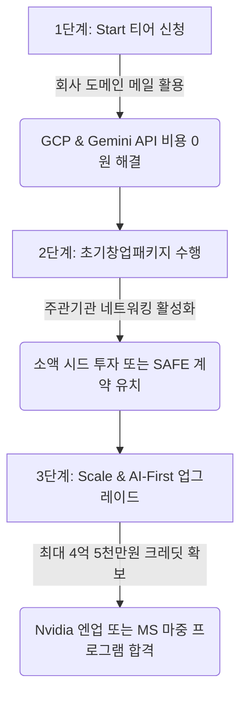

# 🚀 CreAibox 구글 스타트업 프로그램 & 창업 지원 제도 가이드

본 문서는 CreAibox 서비스의 GCP 클라우드 인프라 비용 및 Gemini API 사용 요금을 절감하고, 정부 지원 사업과 연계하여 대규모 무상 사업화 자금을 조달하기 위한 가이드라인입니다.

---

## 1. Google for Startups Cloud Program (구글 글로벌 직접 신청)

구글 본사에서 직접 심사하며, 개발자용 API(Gemini, Vertex AI 등) 사용 요금 및 GCP 인프라 비용 차감을 지원하는 프로그램입니다.

### 🟢 1단계: Start 티어 (초기 창업용)
* **지원 자격**:
  * 창업 5년 이내의 법인 또는 개인 사업자
  * 자사 도메인 이메일 계정(예: `admin@creaibox.com`) 및 공식 활성 웹사이트(`creaibox.com`) 소유 필수
  * 과거 Google Cloud 스타트업 크레딧 수혜 이력 없음 ($5,000 이하)
* **지원 혜택**: **$2,000 (약 260만 원)**의 Google Cloud 및 Firebase 크레딧 (2년 유효)
* **승인 가능성**: **99% (매우 높음)**. 모바일 앱 출시 여부와 상관없이 웹/SaaS 플랫폼으로 즉시 신청 가능.

### 🟡 2단계: Scale 티어 및 AI-First 특화 혜택 (투자 유치 후 연계)
* **지원 자격**:
  * 창업 10년 이내의 스타트업
  * VC, 엑셀러레이터 등으로부터 **시드(Seed) ~ 시리즈 A 규모의 지분 투자(Equity Funding)** 또는 **SAFE(조건부지분인수계약)** 계약 유치 필수
  * AI가 서비스의 핵심 모델 및 인프라(Gemini API 등)로 작동하는 AI-First 기술 서비스 증명
* **지원 혜택**: **최대 $350,000 (약 4억 5,000만 원)** 크레딧 지원 및 구글 1:1 기술 엔지니어링 멘토링
* **신청 전략**: 우선 즉시 승인되는 **Start 티어**를 통해 초기 비용을 방어하고, 사업 진행 중 소액 투자를 유치한 즉시 **Scale/AI-First 업그레이드**를 제출하여 크레딧 확보.

---

## 2. 정부 지원 연계형 글로벌 기업 협업 프로그램 (창업진흥원 주관)

중소벤처기업부와 글로벌 테크 대기업이 연계하여 최대 2억 원의 사업화 자금을 무상 출연금으로 제공하는 정부 주도 스타트업 지원 사업입니다.

| 프로그램명 | 협업 기업 | 지원 분야 및 적합성 | 주요 지원 혜택 |
| :--- | :--- | :--- | :--- |
| **창구 프로그램** | Google Play | 모바일 앱 및 게임 분야 (현재 웹 기반인 CreAibox는 안드로이드 하이브리드 앱 등록/런칭이 요구됨) | 최대 2억 원의 사업화 자금 + 구글플레이 성장 패키지 & 글로벌 진출 마케팅 지원 |
| **엔업(N-Up) 프로그램** | NVIDIA | AI 기술 특화 분야 (**CreAibox의 AI 텍스트/영상 생성 아키텍처에 가장 부합**) | 최대 2억 원의 사업화 자금 + NVIDIA GPU 크레딧 & 기술 세미나 지원 |
| **마중(MaJung) 프로그램** | Microsoft | B2B, AI 및 Cloud/SaaS 분야 (모바일 앱 없이 웹 상태 그대로 지원 가능하여 서류 통과 유리) | 최대 2억 원의 사업화 자금 + MS Azure 클라우드 크레딧 지원 |
| **정글(JungGle) 프로그램** | Amazon AWS | Cloud 인프라 및 SaaS 분야 (앱 출시 요건 없음) | 최대 2억 원의 사업화 자금 + AWS 크레딧 지원 |

---

## 🎯 CreAibox 맞춤형 창업 지원 로드맵

1. **즉시 실행**: `@creaibox.com` 이메일 대표 계정 개설 후, 구글 스타트업 공식 페이지를 통해 **Start 티어 ($2,000)**를 다이렉트로 접수합니다.
2. **투자 매칭**: 초기창업패키지 사업을 진행하면서 매칭된 주관기관(AC/VC)을 통해 **1,000만 원 ~ 3,000만 원 규모의 시드 투자나 SAFE 계약**을 한 차례 유치합니다.
3. **스케일업**: 투자가 완료되는 즉시 구글 **AI-First Scale 티어**로의 크레딧 업그레이드 신청을 제출하고, 차기 연도 **엔업(N-Up) 혹은 마중(MaJung) 프로그램**에 지원하여 무상 사업화 자금을 쓸어 담습니다.
