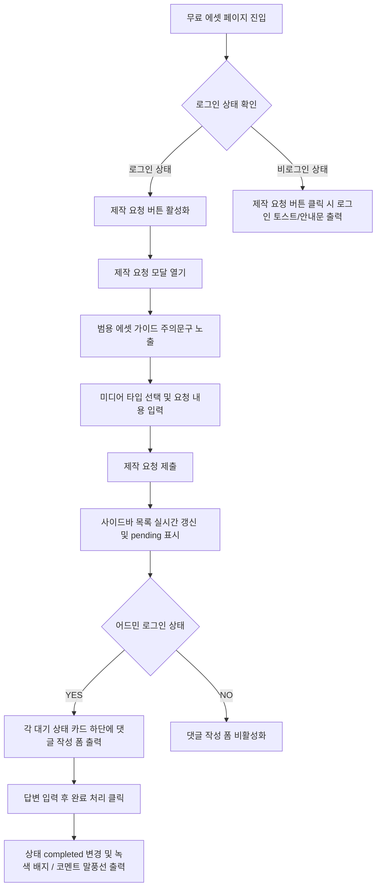

# Free Asset Requests Page Specification

## 1. Page Endpoint
* **경로**: `/studio/library/free-assets`
* **설명**: 무료 에셋 라이브러리 메인 페이지에 신규 UI 영역으로 내장됨.

---

## 2. Interactive UI Flow

---

## 3. Detailed Component Spec

### 3-1. "이미지 제작 요청" 버튼
* **위치**: "무료 에셋 나눔하기" 버튼의 바로 왼쪽.
* **디자인**: 어두운 다크 그레이 배경의 아웃라인 보더 스타일로 구성하여 메인 "무료 에셋 나눔하기" 파란색 버튼을 해치지 않으면서 조화를 이룸 (`border border-zinc-700 bg-zinc-800 hover:bg-zinc-700 text-zinc-300`).
* **아이콘**: Lucide-react의 `ImagePlus` 또는 `Wand2` 아이콘을 사용하여 시각적 메타포 강화.

### 3-2. 제작 요청 작성 모달
* **가이드 영역**: 모달 본문 상단에 연한 빨강/주황색의 경고 박스 노출.
  * *"개인 목적의 사적인 세부 이미지 제작은 불가능하며, 누구나 함께 쓸 수 있는 범용 에셋에 한해서만 제작을 지원합니다."*
* **분류 셀렉터**: `media_type` 선택 드롭다운 (이미지, 일러스트, 벡터, 비디오, GIF 등).
* **요청 상세 작성 영역**: 플레이스홀더를 통해 구체적인 묘사를 유도 ("예: 푸른 가을 하늘 아래 끝없이 펼쳐진 황금빛 밀밭 이미지").

### 3-3. 우측 현황 Aside 패널
* **기본 구조**: 스크롤이 가능한 컨테이너(`max-h-[80vh] overflow-y-auto`) 형태로, 최신 요청들이 카드형 UI로 위에서 아래로 나열됨.
* **카드 개별 레이아웃**:
  * 상단: 미디어 대분류 배지 + 작성자 닉네임 + 요청 시간 + 상태 배지
  * 중단: 사용자가 기입한 상세 요청 설명 텍스트
  * 하단: 관리자 답변(있는 경우). 관리자 답변은 어두운 말풍선 카드(`bg-zinc-900 border border-zinc-800 text-zinc-400 p-3 rounded-lg`) 형태로 렌더링됨.

---

## 4. UI/UX Loading Performance
* 페이지 최초 진입 시, 무료 에셋 리스트와 이미지 제작 요청 사이드바는 동시에 API로 데이터 조회를 개시하지만 서로 블로킹하지 않음 (Loading-Free & Instant Rendering).
* 사이드바 데이터가 로딩되는 동안은 회색 펄스 애니메이션이 가동되는 스켈레톤 카드가 노출되어 사용자가 페이지 내 다른 버튼을 자유롭게 인터랙션할 수 있도록 함.
