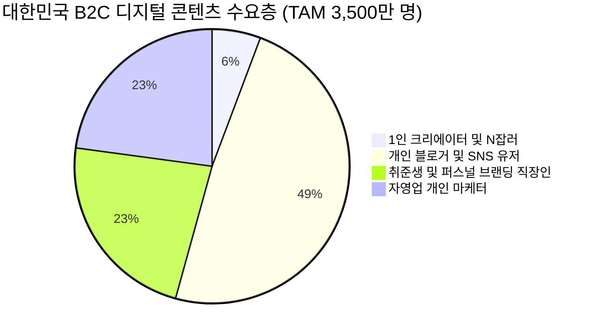
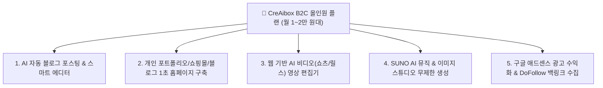
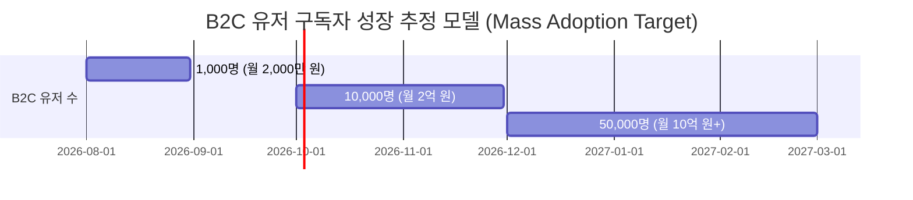

# 🎨 2. CreAibox B2C 일반 국민 & 크리에이터 전용 올인원 AI 스튜디오 사업계획서

### (B2C Executive Business Plan: Empowering 3,500 Million Creators & Individuals with All-in-One AI Studio)

> **"복잡한 편집 툴 없이 누구나 1초 만에 블로그 글쓰기, 개인 홈페이지, AI 영상, 음원 제작을 올인어로 끝내는 대중화 AI 스튜디오"**

---

## 📌 1. 사업 개요 및 핵심 비전 (Executive Summary)

* **사업명**: CreAibox B2C 대중화 AI 콘텐츠 & 1인 미디어 제작 생태계
* **타깃 고객**: 일반 국민, 1인 블로거, 유튜버/인스타그램 크리에이터, 취준생, 개인 포트폴리오 제작자, N잡러 및 소상공인 인플루언서
* **핵심 혁신 명제**:
  > **"Adobe(편집) + WordPress(웹사이트) + ChatGPT(글쓰기) + Suno(음악)를 한곳에 모아, 월 1~2만 원대 파격적인 요금으로 일반 대중에게 제공하는 올인원 AI 디지털 놀이터"**
  >
* **비즈니스 포지셔닝**:
  기존의 비싸고 파편화된 개별 AI/디자인 툴 시장을 전면 통합하여, **대한민국 일반 국민 3,500만 명을 대상으로 매달 안정적인 Massive SaaS 구독 수입을 창출하는 대중적 Cash Cow 사업 모델**.

---

## 📊 2. B2C 시장 환경 및 타깃 분석 (B2C Market Analysis)

### 2.1 국내 B2C 크리에이터 & 개인 디지털 시장 규모 (Fact Check)

1. **대한민국 1인 미디어 및 콘텐츠 크리에이터 수**: 약 **200만 명 이상** (유튜브, 블로그, 인스타그램, 틱톡 채널 운용자)
2. **블로그 라이브 채널 (네이버/티스토리/커스텀)**: 약 **1,700만 개 이상**
3. **디지털 포트폴리오 & 1인 브랜드 잠재 수요 (TAM)**: 대한민국 10~50대 인구 약 **3,500만 명**

### 2.2 B2C 개인 고객들이 겪는 3대 고통 (User Pain Points)

| 구분                              | 기존 B2C 유저가 겪는 현실적 고통                                    | CreAibox B2C 올인원 파괴적 솔루션                           |
| :-------------------------------- | :------------------------------------------------------------------ | :---------------------------------------------------------- |
| **비싼 파편화 구독료**      | Adobe(6만) + ChatGPT(3만) + 호스팅(1만) ➔ **월 10만 원 부담** | **CreAibox 하나로 월 1~2만 원대에 통합 해결**         |
| **높은 기술 진입장벽**      | 프리미어 프로, 워드프레스 코딩 학습에 수개월 소요                   | **AI 가이드를 통해 1초 만에 글/웹/영상 완성**         |
| **수익화 실패 & 중도 포기** | SEO(검색 노출) 지식 부재로 블로그/유튜브 방문자 0명                 | **DoFollow SEO 1초 색인 + 애드센스 자동 수익화 지원** |

---

## 💥 3. CreAibox B2C 파괴적 가치 제안 (B2C Disruptive Value Proposition)

### 3.1 5대 올인원 핵심 서비스

1. **1초 AI 자동 글쓰기 & 스마트 에디터**:
   * 키워드 하나만 입력하면 DoFollow SEO 최적화 포스팅이 100% 자동 완성 및 발행.
2. **개인 포트폴리오 & 1인 사이트 1초 무료 구축**:
   * 취준생 포트폴리오, 개인 블로그, 1인 쇼핑몰을 코딩 0개로 1초 만에 제작.
3. **웹 기반 AI 비디오(영상) 편집기**:
   * 유튜브 쇼츠, 인스타 릴스 전용 자막, 음성(TTS), 효과음을 1초 만에 자동 편집.
4. **이미지 & SUNO AI 뮤직 스튜디오**:
   * 저작권 걱정 없는 전용 BGM 및 고화질 마케팅 이미지를 1초 만에 생성.
5. **구글 애드센스 수익화 & 백링크 자동화**:
   * 개인 사용자가 작성한 글이 검색엔진 상위에 노출되어 애드센스 광고 수입을 올릴 수 있도록 지원.

---

## 💰 4. B2C 수익 모델 및 재무 성장 모델 (B2C Revenue & Scale Model)

### 4.1 B2C 다단계 요금제 구조 (B2C Subscription Tiers)

1. **Free Plan (0원)**: 1초 홈페이지 체험, 기본 AI 글쓰기 5건 무상 제공.
2. **Starter Plan (월 14,900원)**: 개인 블로거/취준생용 (AI 글쓰기 100건, 개인 웹사이트 1개, 이미지/영상 기본).
3. **Pro Plan (월 29,900원)**: 전문 크리에이터/인플루언서용 (AI 글쓰기 무제한, AI 쇼츠 영상 무제한, SUNO AI 뮤직, DoFollow SEO 핑).

---

## 🛣️ 5. B2C 대중화 마케팅 로드맵 (Actionable Mass Marketing Roadmap)

* **Phase 1 [초기 유저 락인]**: "월 1만 원대로 끝내는 대한민국 최초의 올인원 AI 스튜디오" 무료 체험 캠페인 진행.
* **Phase 2 [크리에이터 앰버서더 프로젝트]**: 유튜버, 블로거 100명 대상 CreAibox 무료 플랜 지원 및 수익 인증 후기 확산.
* **Phase 3 [모바일 앱 & 글로벌 확장]**: iOS/Android 앱 출시 및 다국어 지원으로 글로벌 B2C AI 플랫폼으로 도약.

---

*최종 문서 작성일: 2026년 7월 25일 | CreAibox Executive Strategy Document #2 (B2C)*
