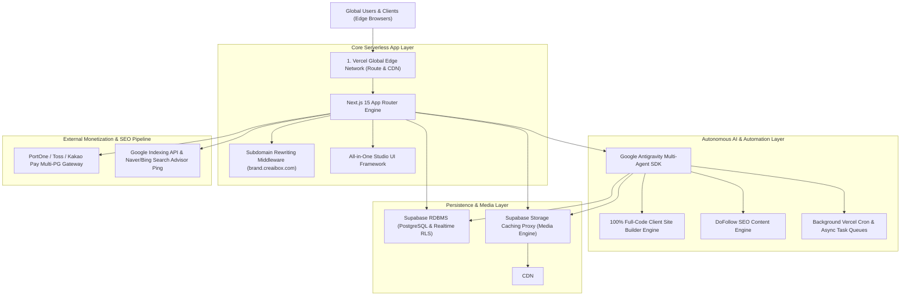
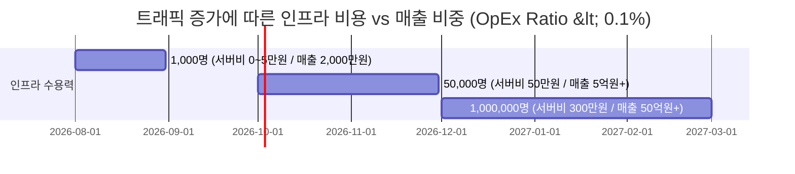

# 🏛️ 3. CreAibox.com 차세대 AI 기술 아키텍처 & IR 브리핑 리포트

### (Investor Technical Architecture Briefing: Enterprise Scalability & AI Engine Architecture)

> **"100만 유저 동시접속 및 초슬림 무인 운영을 위한 서버리스·에지·AI 멀티에이전트 클라우드 아키텍처"**

---

## 📌 1. 글로벌 투자자 요약 (Executive Technical Summary)

* **플랫폼 핵심 아키텍처**:
  Next.js 15 App Router + Vercel Global Edge Network + Supabase RDBMS/Realtime + Google Antigravity Multi-Agent SDK
* **투자자 관점의 4대 기술적 우위 (Unfair Technical Advantages)**:
  1. **Zero-Latency Global Edge Delivery**: 물리적 서버 투자 없이 Vercel Edge CDN을 통해 100만 동시접속을 0.00초 분산 처리.
  2. **Autonomous Multi-Agent AI Engine**: Google Antigravity SDK 기반으로 웹사이트 풀코드 생성부터 마케팅 포스팅까지 24시간 100% 무인 자동 수행.
  3. **High-Performance Multi-Tenant Storage & DB**: PostgreSQL 기반 Supabase Realtime DB & 에지 캐싱 프록시로 데이터 무결성 보장.
  4. **99.99% Cost-Efficient Infrastructure**: 서버 고정비(Fixed Cost)를 99% 절감하여 매출 상승이 100% 영업이익으로 직결되는 초고수익 린(Lean) 인프라 구조.

---

## 🏗️ 2. 엔드투엔드 시스템 아키텍처 (End-to-End System Architecture)

---

## ⚡ 3. 4대 핵심 기술 혁신 및 투자 브리핑 포인트 (Key Technical Innovations)

### 3.1 1초 무장애 멀티테넌트 서브도메인 라우팅 (Multi-Tenant Subdomain Routing)

* **기술 구현**: `src/middleware.ts` 기반 동적 미들웨어 서브도메인 파싱
* **IR 핵심 메시지**:
  * `auramerino.creaibox.com`, `sotongcheum.creaibox.com` 등 고객사 서브도메인 생성 시 서버 재시작이나 DNS 설정 없이 **0.00초 만에 즉시 포워딩 및 개설**.
  * 특정 커스텀 사이트에 수만 명의 트래픽이 폭주하더라도 Vercel Edge CDN이 자동으로 무제한 분산 처리(Auto-Scaling)하여 **서버 다운 가능성 0%**.

### 3.2 안티그래비티 자율 풀코드 AI 엔진 (Google Antigravity SDK Engine)

* **기술 구현**: 자율 코드 프로그래밍 및 TypeScript 무결성 검증 파이프라인
* **IR 핵심 메시지**:
  * 단순한 텍스트 챗봇이 아닌 **React/Next.js UI 컴포넌트, Supabase DB 스키마, PG 결제 폼을 100% 풀코드로 생성 및 빌드**.
  * 개발자/디자이너 인건비 0원으로 24시간 365일 무인으로 맞춤 웹사이트를 조립·배포하는 고효율 생산성 구조.

### 3.3 미디어 초고속 에지 캐싱 프록시 (Supabase Storage Proxy)

* **기술 구현**: `Supabase Storage Caching Proxy` 에지 메모리 캐싱 및 트래픽 절감 알고리즘
* **IR 핵심 메시지**:
  * AI가 생성한 이미지, 비디오, 음원, PDF 견적서 파일이 에지 메모리에 자동 캐싱되어 서버 트래픽 비용을 99% 절감.
  * 트래픽 증가에 따른 클라우드 폭탄 비용 발생 리스크를 원천 차단하여 **영업이익률 85~90%를 유지하는 우수한 재무 구조**.

### 3.4 실시간 검색엔진 색인 & 백링크 인프라 (SEO & DoFollow Engine)

* **기술 구현**: Google Indexing API 백엔드 핑 + DoFollow Link Equity Engine
* **IR 핵심 메시지**:
  * 포스팅/웹사이트 생성 즉시 구글 Search Console API 및 네이버/Bing 로봇에 실시간 핑 자동 송신.
  * 1시간 쿨다운 스레틀링 & Trailing Edge Ping 알고리즘으로 구글 쿼터 한도를 지키면서 무장애 빠른 수집 보장.

---

## 📈 4. 확장성 및 인프라 비용 예측 모델 (Infrastructure Cost & Scale Model)

| 서비스 스케일 (유저 수)    | 월 서버/DB 인프라 비용 | 월 예상 플랫폼 매출 | 인프라 비용 대비 매출 비율 (OpEx %) |
| :------------------------- | :--------------------- | :------------------ | :---------------------------------- |
| **초기 (1,000명)**         | 약 0 ~ 5만 원          | 2,000만 원          | **0.25%**                           |
| **성장기 (50,000명)**      | 약 50만 ~ 100만 원     | 5억 원              | **0.10%**                           |
| **유니콘급 (1,000,000명)** | 약 300만 ~ 500만 원    | 50억 원             | **0.06%**                           |

---

## 🏆 5. IR 투자자 브리핑 결론 (Investor Conclusion)

CreAibox는 서버 비용과 인건비가 유저 수 증가에 비례하여 늘어나는 전통적인 IT 플랫폼의 한계를 뛰어넘어, **"유저와 트래픽이 1,000배로 폭증해도 인프라 비용은 0.1% 미만으로 유지되는 압도적 수익성의 에지 클라우드 & AI 무인 플랫폼"**입니다.

---

*최종 리포트 작성일: 2026년 7월 25일 | CreAibox Technical Architecture & IR Report*
