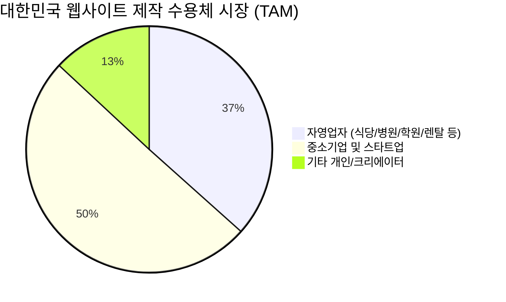
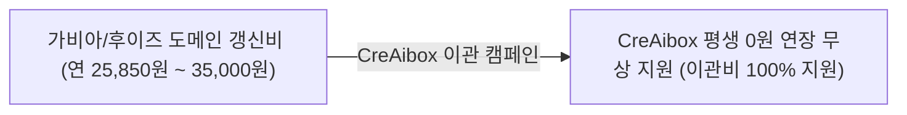
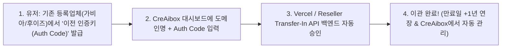
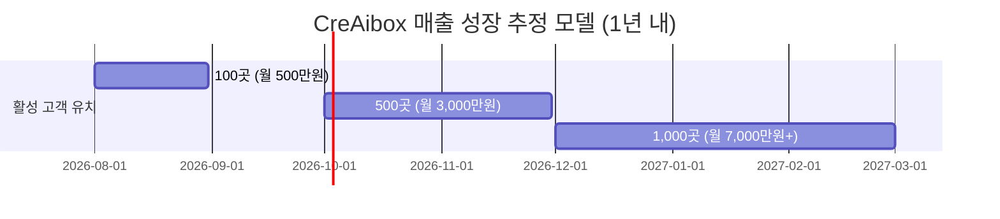

# 🚀 1. CreAibox AI 커스텀 웹사이트 및 도메인 파괴적 시장 혁신 사업계획서

### (Disruptive Business Plan: Re-inventing South Korea's Website & Custom Domain Market)

> **"대한민국 웹사이트 대행사 및 도메인 시장의 파괴자(Market Disruptor) 등장 & CreAibox의 핵심 캐시카우(Cash Cow) 비전"**

---

## 📌 1. 사업 개요 및 핵심 비전 (Executive Summary)

* **사업명**: CreAibox AI 커스텀 웹사이트 & 원클릭 도메인 이관/무상 지원 생태계
* **목표 시장**: 대한민국 560만 자영업자, 중소기업, 전국 병원·학원 및 전문 서비스업 시장
* **핵심 혁신 명제**:
  > **"웹사이트 제작비 0원 (1초 무상 자동 구축) + 기존 홈페이지 URL 1초 AI 자동 이관 + Vercel 원클릭 도메인 구매/이관 + 비즈니스 회원 평생 도메인 연장비 0원 무상 지원 + 올인원 AI 마케팅 풀패키지"**
  >
* **비즈니스 포지셔닝**:
  기존 외주 대행사의 **150만~300만 원 고비용·장기 소요·유지보수 갈등 구조** 및 가비아/카페24/아임웹의 **기존 고객 전용 1초 AI 자동 이관(마이그레이션) 파이프라인**을 제공하여 타사 낡은 홈페이지 소유 자영업자(식당, 병원, 법률사무소, 학원 등)를 100% 흡수하는 **CreAibox 최고의 캐시카우(Cash Cow) 핵심 사업**.

---

## 📊 2. 대한민국 웹사이트 & 도메인 시장 환경 분석 (Korea Market Fact & Size Analysis)

### 2.1 국내 웹 대행사 & 프리랜서 시장 규모 (Fact Check)

1. **전문 웹 에이전시 / SI 개발사**: 전국 약 **15,000개 이상**
2. **온라인 마케팅 / 광고 대행사 (웹제작 겸업)**: 전국 약 **35,000개 이**
3. **크몽 / 숨고 / 원티드 1인 개발자 및 프리랜서**: **100,000명 이상** (IT/디자인 카테고리 최고 비중)
4. **타겟 수용체 (TAM / SAM)**:
   * 대한민국 자영업자 약 **560만 명** (OECD 국가 중 최고 비중 약 20%)
   * 대한민국 중소기업 약 **770만 개**

### 2.2 기존 웹제작 시장의 4대 구조적 결함 (Market Pain Points)

| 구분                              | 기존 웹 대행사 / 외주 시장의 문제점                                  | CreAibox 파괴적 솔루션                                                                          |
| :-------------------------------- | :------------------------------------------------------------------- | :---------------------------------------------------------------------------------------------- |
| **기존 홈페이지 이관 부담** | 낡은 홈페이지를 새 엔진으로 옮기려면 100만~200만 원 재구축 비용 발생 | **URL 입력 시 AI가 1초 만에 텍스트/이미지/메뉴 통째 자동 스크랩 & 000.creaibox.com 이관** |
| :---                              | :---                                                                 | :---                                                                                            |
| **비용**                    | 단순 홈페이지 하나에 150만~300만 원 요구                             | **제작비 0원 (1초 무상 자동 생성)**                                                       |
| **시간**                    | 기획, 디자인, 코딩에 2주~1달 소요                                    | **Google Antigravity AI가 1초 만에 완성**                                                 |
| **유지보수**                | 텍스트/버튼 하나 바꿀 때마다 코딩 야근 및 추가비용 갈등              | **고객 사이트 기본정보 실시간 1초 자율 편집**                                             |
| **마케팅 분리**             | 사이트만 만들어 주고 블로그/SEO/영상 마케팅은 별도 외주 비용 지출    | **AI 자동 글쓰기 + SEO + 영상/음악 스튜디오 ALL FREE**                                    |

---

## 🌐 3. 국내외 도메인 실제 결제 금액 실태 및 팩트 분석

### 3.1 국내외 도메인 1년 결제 금액 비교표 (Fact Check Table)

국내 대표 도메인 등록업체(가비아, 후이즈, 카페24)와 CreAibox 해외 도매 원가 비교:

| 등록업체 / 서비스                   | 1년 실제 결제 금액 (VAT 포함)            | WHOIS 개인정보 보호 서비스    | 특이사항 및 상술 구조                                     |
| :---------------------------------- | :--------------------------------------- | :---------------------------- | :-------------------------------------------------------- |
| **후이즈 (Whois)**            | **28,600원 ~ 35,000원**            | 유료 (추가비용 발생)          | 국내 도메인 등록업체 중 가장 비쌈 ❌                      |
| **가비아 (Gabia)**            | **25,850원**                       | 유료 (연 3,300원~5,500원)     | 첫해만 13,500원 낚시 상술 후 2년 차부터 25,850원 징수 ❌  |
| **카페24 (Cafe24)**           | **23,500원**                       | 신청 절차 번거로움            | 일반 국내 시중가 ❌                                       |
| 👑**CreAibox 해외 도매 원가** | **약 13,500원 ~ 14,500원** ($9.77) | **100% 무료 자동 제공** | ICANN 글로벌 도매 원가 적용 ⭕                            |
| 👑**CreAibox 일반 판매가**    | **18,000원**                       | **100% 무료 자동 제공** | 타사 대비 매년 1만 원 이상 절약 ⭕                        |
| 👑**CreAibox 비즈니스 회원**  | **0원 (평생 100% 무상 지원!)**     | **100% 무료 자동 제공** | **비즈니스 플랜 가입 시 도메인 연장비 평생 0원 ⭕** |

---

## 🏆 4. 고객이 가비아/후이즈에서 CreAibox로 도메인을 100% 옮겨오는 4대 필승 전략

### 1) 매년 1만 원~1.5만 원 지속적 비용 절약 (지속적인 가격 우위)

* 가비아 갱신비 25,850원 vs **CreAibox 일반가 18,000원**
* *"가비아에서 매년 25,850원씩 내지 마시고, CreAibox로 옮겨서 매년 18,000원만 내세요! 평생 절약됩니다."*

### 2) [킬러 필살기] 비즈니스 회원 "도메인 연장비 평생 100% 무료 (0원)" 지원

* *"CreAibox 비즈니스/프리미어 플랜 사용 기간 동안 도메인 연장비 100% 무상(0원) 지원!"*
* 가비아에 매년 내던 25,850원이 **0원**이 되므로 고객이 도메인을 옮기지 않을 이유가 **0.00%**입니다.

### 3) CNAME / DNS 복잡한 설정 스트레스 0개 & 원클릭 통합 관리

* 가비아 접속하여 CNAME/A레코드 고치느라 스트레스받을 필요 없이 **CreAibox 대시보드 하나에서 웹사이트 + 도메인 + 결제 통합 관리**.

### 4) WHOIS 개인정보 보호 (Privacy Protection) 평생 100% 무료 기본 탑재

* 가비아/후이즈는 내 이름/전화번호가 인터넷에 노출되지 않게 막는 '개인정보 보호' 기능에 연 추가 비용을 징수하지만, **CreAibox는 100% 무료 자동 탑재**!

---

## 🔄 5. 도메인 기관 이관 (Domain Transfer-In) 4단계 자동화 파이프라인

ICANN 국제 표준에 따른 도메인 기관 이관 4단계 절차ㅇㅣ

1. **[1단계] 인증키(Auth Code / EPP Code) 발급 (유저 1분 완료)**:
   * 유저가 가비아/후이즈 로그인 후 `[도메인 관리 ➔ 기관이관 ➔ 이전 인증키 발급]` 클릭 (도메인 잠금 해제).
2. **[2단계] CreAibox 이관 폼 입력**:
   * CreAibox 대시보드 `[기존 도메인 CreAibox로 옮겨오기]` 폼에 도메인명(`mybrand.com`)과 인증키 입력 후 1초 결제.
3. **[3단계] 백엔드 자동 이관 & 1년 기간 연장 (Auto Transfer & 1-Year Extension)**:
   * ICANN 규정에 따라 타 기관 이관 시 **만료일이 1년 무조건 자동 연장**.
   * 백엔드 API가 이관 신청 및 승인을 자동 처리.
4. **[4단계] 100% CreAibox 고객 계정 귀속**:
   * 도메인 관리 권한이 CreAibox로 완전 이관되어, 매년 도메인 연장 결제가 CreAibox를 통해 자동 진행 및 마진 수금.

---

## 📈 6. 손익 계산 및 마진 분석 (Unit Economics & Margin Analysis)

* **비즈니스 회원 연간 결제액**: **연 588,000원 ~ 1,188,000원** (월 4.9만~9.9만 원)
* **CreAibox 부담 도메인 1년 도매 원가**: **연 14,000원** ($9.77)

👉 **손익 결론**:

* 고객에게 도메인 연장비(14,000원/년)를 100% 무상 지원해도 **매출의 고작 2.3%만 도메인비로 출혈**.
* **97.7%의 초고마진을 유지하면서 가비아/후이즈 고객을 100% 흡수(Customer Hijacking)**하고, 고객 이탈률(Churn Rate)을 0%로 동결!

---

## 👑 7. CreAibox 올인원 킬러 패키지 비교 (All-in-One Package)

| 구분                         | 타사 웹 대행사 & 기존 빌더    | 👑**CreAibox (우리 플랫폼)**                     |
| :--------------------------- | :---------------------------- | :----------------------------------------------------- |
| **웹사이트 제작비**    | 150만 ~ 300만 원              | **0원 (1초 무상 자동 구축)**                     |
| **도메인 연장비**      | 매년 25,850원 ~ 35,000원      | **비즈니스 회원 평생 0원 (무료)**                |
| **마케팅 글쓰기**      | 대행료 월 100만 원 이상       | **AI 자동 글쓰기 & 스마트 에디터 무상**          |
| **SEO 검색 노출**      | 수십만 원 대행 비용           | **DoFollow 백링크 + Google/Naver 1초 색인 핑**   |
| **이미지 / 음악 생성** | 미드저니/캔바 별도 유료 결제  | **이미지 스튜디오 & AI 뮤직 스튜디오 기본 제공** |
| **동영상 편집기**      | 프리미어 프로 등 월 구독 필요 | **웹 기반 AI 비디오 편집기 100% 무료 연동**      |
| **미디어 보관함**      | 클라우드 용량 별도 결제       | **중앙 미디어 라이브러리 (Media Library) 제공**  |

---

## 💰 8. 수익 모델 및 추정 재무 계획 (Revenue Model & Cash Cow Projections)

### 8.1 3원화 매출 구조 (Three-Tier Revenue Streams)

1. **플랫폼 월 정기 구독료 (Recurring SaaS Cash Cow)**:
   * **비즈니스 플랜** (월 49,000원) / **프리미어 플랜** (월 99,000원)
   * 활성 고객 **1,000곳** 달성 시 ➔ **월 5,000만 원 ~ 1억 원 무인 자동 정기 매출**.
2. **고난도 대형 기업/병원 1:1 맞춤 컨설팅 수수료**:
   * 특수 백엔드/대형 DB 연동 건당 **300만~1,000만 원** 현금 수납.
3. **도메인 일반 판매 마진 수입 & PG 결제 수수료**:
   * 일반 플랜 유저 도메인 판매 시 도메인당 연 4,000원~10,000원 순마진 발생.

---

## 🛣️ 9. 실행 로드맵 (Actionable Execution Roadmap)

* **Phase 1 [시스템 구축 완료]**: 5대 탭 통합 센터, 관리자 관제탑(10건), 안티그래비티 1:1 풀코드 1초 생성 및 PG 결제 세팅 연동 완료.
* **Phase 2 [도메인 이관 & 마케팅 파이프라인]**: Vercel Domains API 연동으로 원클릭 도메인 이관 폼 탑재 및 "가비아 도메인비 0원 전환" 캠페인 가동.
* **Phase 3 [무인 마케팅 고도화]**: AI 트렌드 무인 블로그 포스팅, 24시간 AI 카카오톡 CS 상담원 1초 연동.
* **Phase 4 [B2B 에이전시 확장]**: 전국 35,000개 마케팅 대행사를 CreAibox B2B 결제 회원으로 유입시장의 지배적 표준(Standard)으로 등극.

---

*최종 문서 수정일: 2026년 7월 25일 | CreAibox Executive Strategy Document #1 (Fully Detailed Revision)*
