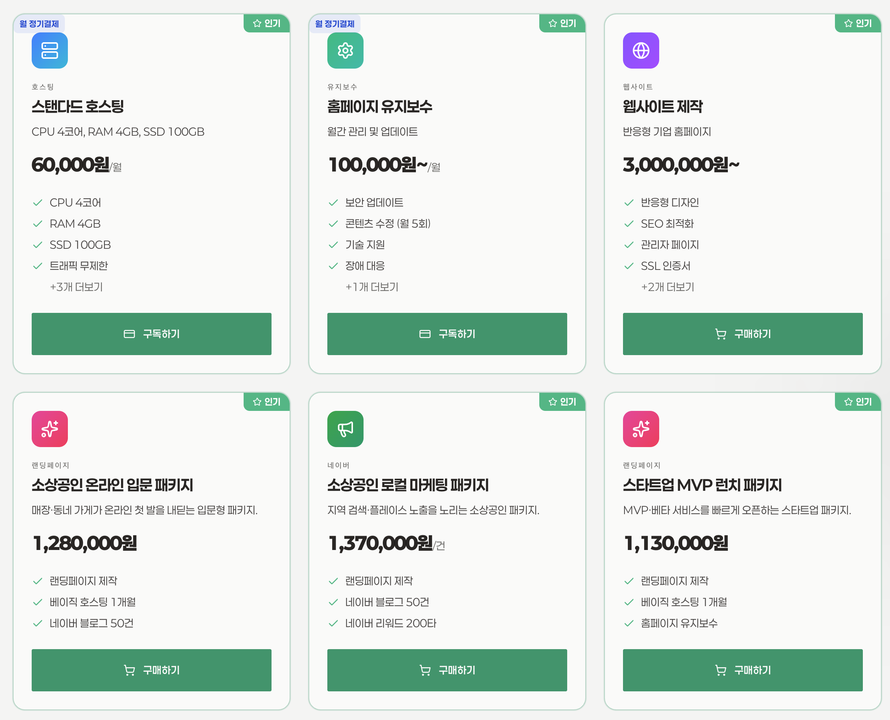
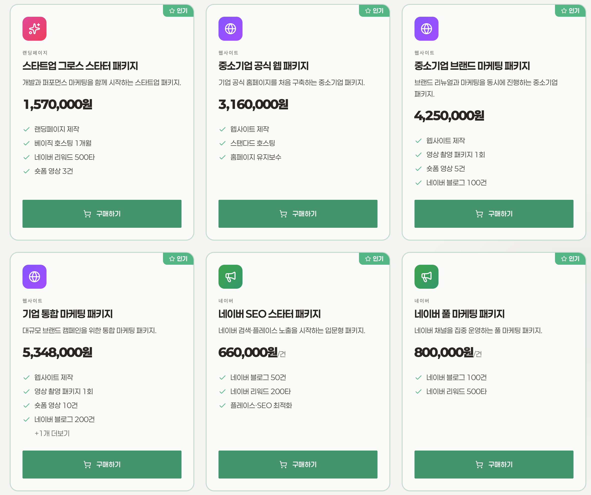
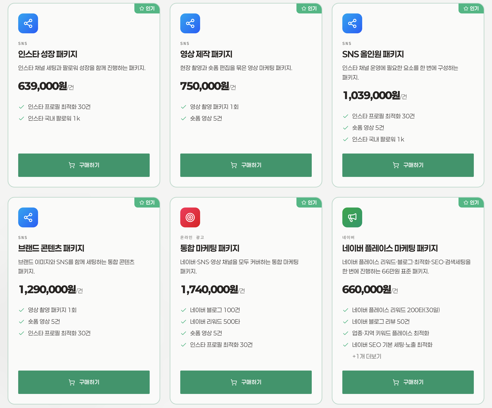

# 국내 CreAibox 경쟁사 및 웹 에이전시 분석

**작성일**: 2026년 8월 11일
**목적**: 국내 웹빌더 및 프리미엄 웹 에이전시 시장 분석을 통해 CreAibox의 차별화 및 비즈니스 타겟팅 전략 수립

---

## 1. GoldTreeDev (골드트리데브)

* **웹사이트**: https://goldtreedev.com/
* **포지셔닝**: "개발과 마케팅, 하나의 팀" (디지털 통합 에이전시)

### 📊 비즈니스 모델 및 타겟 고객

- **주요 타겟**: 고품질의 홈페이지 및 웹앱이 필요한 스타트업, 중소/중견기업, 프랜차이즈, 병원 등 B2B 고객.
- **핵심 서비스**:
  1. **맞춤형 개발**: 홈페이지 제작, 웹앱 개발, SaaS, MVP 개발, 쇼핑몰 제작.
  2. **마케팅 및 SEO**: 네이버/구글 SEO, AI 검색(GEO) 최적화, 퍼포먼스 마케팅(메타, 키워드 광고), 콘텐츠 마케팅.
- **특징**: 단순히 예쁜 디자인만 납품하는 템플릿형 에이전시가 아니라, 기획부터 개발, 런칭 후 마케팅(그로스 해킹)까지 한 팀에서 책임진다는 것을 강력한 세일즈 포인트로 내세우고 있습니다. 10년 이상의 경력팀으로 어필하고 있습니다.

### 💻 기술 스택 (Tech Stack) 아키텍처

- **프론트엔드 프레임워크**: `Next.js` (React 기반)
- **스타일링 및 UI**: `Tailwind CSS`, `Sora` & `IBM Plex Mono` (고급 트렌디 폰트 조합)
- **성능 최적화**: 정적 사이트 생성(SSG) 및 점진적 정적 재생성(ISR)을 통해 번개같은 로딩 속도와 완벽한 Technical SEO를 달성했습니다.
- **분석 요약**: CreAibox가 AI로 1초 만에 뽑아내는 결과물과 **완전히 동일한 최정상급 모던 웹 기술 스택**을 사용하고 있습니다.

### 🏆 주요 포트폴리오

- [바리뷰 : www.bariview.com](https://www.bariview.com/) : 리뷰 사이트 AI 가 관리하는 스마트 리뷰 시스템(금나무개발 대표)
- **티볼리 (TIVOLI)**: 파스타 프랜차이즈 홈페이지 (https://tivoli.goldtreedev.com/)
- 샹츠마라 공식 홈페이지 (프랜차이즈)
- 금나무의원 (병원/의료)
- aness 실시간 통역 웹앱 (SaaS/웹앱)
- 바리뷰 인공지능 배달 리뷰 (AI 서비스)
- 코아 하우스 쇼핑몰 (이커머스)
- 등 다수의 기업 및 브랜드 사이트 맞춤 개발
- [탭탭크라우드](https://crowd.taptap.company/) crowd.taptap.company
- [coahouse.kr](https://coahouse.kr/) 코아 하우스 쇼핑몰
- [daison.kr](https://daison.kr/) 다이손 음식물처리기
- 금나무 스토어 쇼핑몰 : [ref.goldtreedev.com/references/ecommerce](https://ref.goldtreedev.com/references/ecommerce)
- [ayl.kr](https://ayl.kr/)
- [xn--989a51aq6h8sfumdnwejxlc9m5a404c.com](https://xn--989a51aq6h8sfumdnwejxlc9m5a404c.com/) 닭걀즉석계란말이김밥.com

### 💰 서비스 가격 및 수익 모델 분석 (Pricing & Revenue)

- **고단가 프리미엄 전략**: 서비스 소개서(services) 기준, 일반적인 저가형 템플릿 빌더와 달리 기획/디자인/프론트엔드/백엔드/SEO까지 풀스택으로 맞춤 개발을 진행하므로 **건당 수백만 원에서 수천만 원에 이르는 고단가 제작 비용**을 청구합니다.
- **구독형 유지보수 및 호스팅 리테이너 (월 과금 모델)**:
  - 단발성 웹사이트 제작으로 끝나지 않고 매월 안정적인 서버 호스팅 및 유지보수 명목으로 고정적인 리테이너 수익을 창출합니다.
  - **웹 호스팅 요금제 (월 정기결제)**:
    - **베이직 호스팅**: 월 30,000원 (CPU 2코어, RAM 2GB, SSD 50GB)
    - **스탠다드 호스팅**: 월 60,000원 (CPU 4코어, RAM 4GB, SSD 100GB)
    - **프리미엄 호스팅**: 월 120,000원 (CPU 8코어, RAM 8GB, SSD 200GB)
    - 이 외에도 퍼포먼스 마케팅 대행, 지속적인 SEO 관리 등으로 추가적인 고액의 리테이너 수익 구조를 갖추고 있습니다.
- **CreAibox와의 비즈니스 모델 비교**:
  - **GoldTreeDev**: '인력(Human) 기반'의 하이엔드 맞춤 제작. 소수의 고단가 클라이언트(Enterprise/B2B)를 대상으로 깊게 개입하여 높은 객단가와 월 리테이너를 취하는 구조.
  - **CreAibox**: 'AI 기반'의 자동화 생성. 18,000원이라는 파격적인 도매가(무료에 가까운 솔루션)로 다수의 롱테일 시장(소상공인, 초기 스타트업, 1인 크리에이터)을 순식간에 장악하는 **박리다매 및 생태계(SaaS) 플랫폼 구조**.
  - **💡 향후 확장 인사이트**: CreAibox가 기본 시장을 완전히 장악한 후, VIP 고객이나 중견 기업을 대상으로 '엔터프라이즈 맞춤형 AI 커스텀 서비스' 또는 '전담 매니저 배정 프리미엄 플랜'을 출시할 때 이들의 고단가 프라이싱 전략을 적극 차용할 수 있습니다.

### 💡 CreAibox 시사점 및 경쟁 우위 전략

1. **압도적인 가격과 속도 경쟁력**: GoldTreeDev 같은 프리미엄 에이전시가 Next.js와 Tailwind로 수백~수천만 원을 받고 몇 달에 걸쳐 제작하는 퀄리티의 웹사이트를, **CreAibox는 단 18,000원의 도메인 비용만으로 AI가 즉시 생성**해냅니다.
2. **시장 파괴적 비즈니스 모델**: 이들과 똑같은 프론트엔드 결과물을 내놓으면서도 제작비가 '0원'에 수렴하므로, 에이전시에 외주를 맡기기 부담스러운 소상공인이나 초기 스타트업 시장을 완전히 싹쓸이할 수 있습니다.
3. **파트너십 유도**: 오히려 이런 프리미엄 에이전시들을 'CreAibox 웹 파트너'로 포섭하여, 그들이 단순 반복적인 홈페이지 외주 작업은 CreAibox AI로 즉시 찍어내어 수익률을 극대화(마진율 90% 이상)하도록 B2B 영업을 전개할 수 있습니다.
