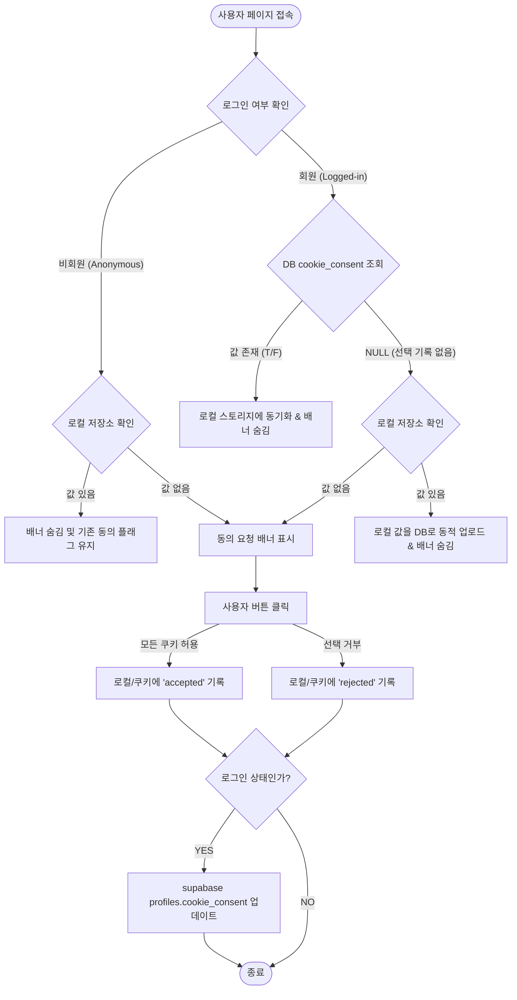

# 크리아이박스 쿠키 동의(Cookie Consent) 시스템 가이드 및 백서

본 문서는 크리아이박스(CreAibox)에 도입된 쿠키 사용 동의 시스템의 아키텍처, 법적/기술적/마케팅 관점의 배경지식, 그리고 데이터베이스 동기화 사양을 정리한 가이드 문서입니다.

---

## 1. 쿠키 동의(Cookie Consent)의 3가지 핵심 관점

### ① 법적 리스크 및 규제 준수 (Legal & Regulatory Compliance)
* **글로벌 규제 대응 (GDPR / CCPA)**:
  * 유럽연합의 **GDPR(일반개인정보보호법)**과 미국 캘리포니아의 **CCPA(소비자프라이버시법)**는 사용자의 명시적인 사전 동의 없이 추적성 쿠키(마케팅/분석용)를 브라우저에 심는 것을 엄격히 불법으로 규정하고 있습니다.
  * 규정 위반 시 **기업 글로벌 매출의 최대 4%** 또는 **2천만 유로(약 300억 원)**에 달하는 천문학적인 벌금이 부과될 수 있습니다.
* **구글 애드센스(Google AdSense) 필수 조건**:
  * 구글은 유럽 지역 트래픽에 광고를 게재하기 위해 사이트가 **구글 인증 동의 관리 플랫폼(CMP)** 또는 규격에 맞는 쿠키 동의 시스템을 의무적으로 갖출 것을 규정하고 있습니다. 미준수 시 애드센스 승인이 거절되거나 광고 게재가 차단됩니다.
* **리스크 방어**:
  * 크리아이박스는 Vercel 글로벌 호스팅망을 활용하므로 글로벌 유저의 유입에 대비해 합법적이고 투명한 동의 체계를 구축하여 법적 고소 및 서비스 제재 리스크를 원천 예방합니다.

### ② 기술적 동작의 설계 (Technical Operation)
* **스크립트 제어 메커니즘**:
  * **동의 완료 전**: 웹사이트 구동에 필수적인 기능(로그인 세션 등)을 위한 쿠키만 최소한으로 허용하고, 구글 애널리틱스(GA4) 및 광고 픽셀 등의 추적 스크립트는 실행을 중단/보류시킵니다.
  * **동의 완료 후**: 사용자가 선택한 허용 플래그에 맞춰 스크립트 잠금을 해제하고 브라우저 쿠키를 정상적으로 심어 분석을 시작합니다.
* **상태 식별 기법**:
  * 역설적이게도 "사용자가 쿠키에 동의했는가?"라는 상태 정보 자체도 브라우저 로컬 저장소(`localStorage`의 `creaibox_cookie_consent` 키)와 만료일 1년의 쿠키(`cookie_consent`)에 기록하여 판단합니다.

### ③ 마케팅 및 데이터 분석 (Marketing & Analytics)
* **리타게팅 마케팅 활성화**:
  * 크리아이박스를 한 번 방문했던 사용자가 다른 사이트나 SNS(페이스북, 인스타그램 등)를 볼 때 광고를 다시 노출시키는 **리타게팅 광고**를 수행하려면 마케팅 쿠키 추적 허용이 전제되어야 합니다.
* **정교한 통계 획득**:
  * 합법적인 통계 분석 동의를 획득하여 유입 경로별 가입 전환율(네이버 검색, SNS 광고, 지인 추천 등)을 깨짐 없이 정확하게 추적할 수 있습니다.

---

## 2. 크리아이박스 쿠키 동의 시스템 아키텍처

구현된 시스템은 사용자의 로그인 여부(비회원/회원)에 따라 저장 대상과 로직을 분리하여 **성능 최적화**와 **기기 간 영속성**을 모두 보장합니다.

---

## 3. 세부 구현 사양 (Files & Database)

### 1) 데이터베이스 스키마 마이그레이션
회원의 동의 상태를 영구 저장하기 위해 `profiles` 테이블에 `cookie_consent` 필드를 신설했습니다.
* **SQL 마이그레이션 파일**: [2026-07-06-add-cookie-consent.sql](file:///Users/a1234/Local%20Sites/creaibox/docs/database/sql/migrations/2026-07-06-add-cookie-consent.sql)
* **스키마 필드**:
  * `cookie_consent` (BOOLEAN):
    * `NULL`: 아직 동의 여부를 선택하지 않은 상태 (최초 진입)
    * `TRUE`: 쿠키 사용 및 트래킹을 동의한 상태 (`accepted`)
    * `FALSE`: 쿠키 사용을 거부한 상태 (`rejected`)

### 2) 배너 컴포넌트 개발
* **경로**: [CookieConsentBanner.tsx](file:///Users/a1234/Local%20Sites/creaibox/src/components/common/CookieConsentBanner.tsx)
* **비주얼 가이드**: 
  * 전체 사이트의 톤앤매너에 맞게 크리아이박스의 핵심 디자인 시스템 컬러인 다크 네이비 테마(`#000B30/95` 배경) 및 얇은 블루 라인 보더와 백드롭 블러(`backdrop-blur-md`) 효과를 적용했습니다.
  * 사용자의 조작 흐름을 깨지 않도록 우측 하단에서 부드럽게 미끄러지듯 솟아오르는 슬라이드 모션(CSS `animate-in slide-in-from-bottom`)으로 노출됩니다.
* **주요 액션**:
  * **"모든 쿠키 허용"**: `localStorage`에 `"accepted"` 저장, `document.cookie`에 만료 1년의 플래그 저장, 로그인 중일 경우 DB `profiles.cookie_consent`를 `true`로 저장 및 팝업 닫기.
  * **"선택 거부"**: `localStorage`에 `"rejected"` 저장, `document.cookie`에 동일 플래그 저장, 로그인 중일 경우 DB `profiles.cookie_consent`를 `false`로 저장 및 팝업 닫기.

### 3) 글로벌 마운트 레이아웃 통합
* **경로**: [layout.tsx](file:///Users/a1234/Local%20Sites/creaibox/src/app/layout.tsx)
* 루트 레이아웃 바디 최하단에 배치하여 사이트 내 모든 공개/작업용 하위 페이지 진입 시 자동으로 쿠키 동의 상태가 판단되고 배너가 적재적소에 활성화되도록 구조화했습니다.

---

## 4. 검증 및 수동 관리 방법

### 1) 브라우저 쿠키/로컬 저장소 확인법
1. 개발자 도구(`F12` 또는 `Cmd + Option + I`)를 엽니다.
2. **Application** 탭으로 이동합니다.
3. 좌측 사이드바에서 **Storage** 밑에 있는 **Local Storage** 및 **Cookies** 탭을 확장해 `https://creaibox.com` (또는 로컬호스트 주소)를 클릭합니다.
4. **키(Key)** 값이 다음과 같이 세팅되었는지 검증합니다:
   * **LocalStorage**: `creaibox_cookie_consent` ➡️ `"accepted"` 또는 `"rejected"`
   * **Cookies**: `cookie_consent` ➡️ `accepted` 또는 `rejected`

### 2) 테스트를 위해 배너를 다시 띄우고 싶을 때
* 위 1번의 개발자 도구 저장소 확인 탭에서 `creaibox_cookie_consent` 로컬스토리지 값과 `cookie_consent` 쿠키 값을 **삭제(Delete)**하고 페이지를 새로고침하면 쿠키 동의 배너가 다시 깔끔하게 슬라이드인 됩니다.
