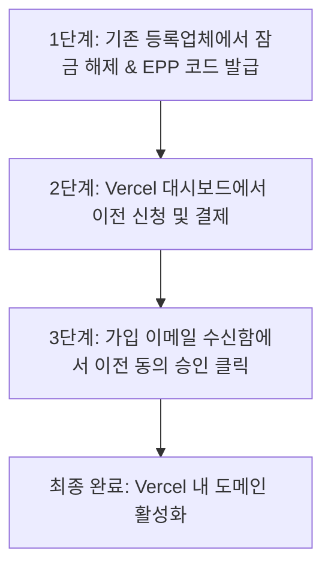

# 타사 도메인을 Vercel로 기관 이전(Domain Transfer)하는 가이드

본 문서는 블루호스트(Bluehost) 등 외부 도메인 등록 대행업체에서 관리 중인 도메인을 **Vercel**로 이전(Transfer In)하여 일괄 관리하고 비용을 절감하기 위한 상세 가이드입니다.

---

## 💡 Vercel로 도메인을 이전하는 이유
1. **비용 절약**: 블루호스트(연간 약 $22+) 등 마크업이 높은 호스팅사의 도메인 유지비 대비 **Vercel(연간 약 $12~14)**은 거의 절반 가격으로 저렴합니다.
2. **관리 단일화**: Vercel 대시보드 내에서 크리아이박스 배포 웹사이트와 도메인, SSL 인증서, 네임서버 설정을 한 곳에서 한눈에 관리할 수 있습니다.
3. **만료일 보존**: 이전 시 발생하는 Vercel 측 비용 결제는 단순 수수료가 아니라 **만료일을 자동으로 +1년 더 연장**해 줍니다.

---

## 🛠️ 도메인 이전 3단계 절차

### 1단계. 기존 등록업체(예: Bluehost)에서 이전 준비
도메인을 다른 곳으로 전송하기 위해 보호 장치를 해제하고 인증용 비밀번호를 얻어야 합니다.

1. **도메인 관리 콘솔 로그인**: 블루호스트 등 현재 도메인이 등록된 사이트에 로그인합니다.
2. **도메인 잠금 해제(Domain Unlock)**: 
   - 도메인 설정 또는 `Security` 탭으로 이동합니다.
   - `Domain Lock` 설정을 찾아 **OFF(잠금 해제)** 상태로 바꿉니다. (잠겨 있으면 타사에서 도메인을 가져가지 못합니다.)
3. **인증 코드(Auth Code / EPP Code) 발급**:
   - `Transfer` 또는 `Move & Access` 메뉴로 이동합니다.
   - **[Request Authorization Code]** (또는 EPP Code 요청) 버튼을 누릅니다.
   - 화면에 표시되거나 가입된 이메일로 전송된 알파벳/숫자 조합의 **인증 코드를 복사**해 둡니다.

---

### 2단계. Vercel 대시보드에서 이전 신청 및 결제
Vercel에 도메인을 가져오겠다고 요청하는 단계입니다.

1. **Vercel 대시보드 접속**: [vercel.com](https://vercel.com)에 로그인 후 해당 프로젝트 또는 팀 계정의 **Domains** 메뉴로 이동합니다.
2. **도메인 추가**:
   - 우측 상단의 **[Add]** 버튼을 누르고 **[Transfer In Domain]**을 선택합니다.
3. **도메인명 및 인증 코드 입력**:
   - 이전할 도메인 주소(예: `guidenara.com`)를 입력합니다.
   - 1단계에서 복사한 **인증 코드(Auth/EPP Code)**를 붙여넣고 진행합니다.
4. **결제 진행**:
   - Vercel의 도메인 1년 갱신 비용(약 $12~14 내외)을 결제합니다. 이 결제가 완료되면 Vercel이 기존 대행업체로 정식 이전 요청을 보냅니다.

---

### 3단계. 이메일 최종 승인 (★ 매우 중요)
도메인 소유권을 가진 주인의 이메일 인증이 완료되어야 이전이 즉시 진행됩니다.

1. **이전 동의 이메일 확인**:
   - 도메인을 구매할 때 등록했던 **소유자(Registrant) 이메일 주소**의 편지함(혹은 스팸함)을 엽니다.
   - 기존 등록업체(블루호스트 등)로부터 **"Domain Transfer Request for [도메인명]"** 이라는 제목의 메일이 도착합니다.
2. **이전 승인(Approve) 클릭**:
   - 이메일 본문 안에 있는 **`Approve Transfer`** 또는 **`Confirm`** 링크를 클릭하여 최종 이전을 승인해 줍니다.
   
> [!IMPORTANT]
> * **이메일 승인을 할 경우**: 승인 버튼을 누른 후 **5분~10분 이내**에 Vercel로 이전이 즉시 완료됩니다.
> * **이메일 승인을 하지 않을 경우**: 기존 등록 대행사 정책에 따라 이전 요청이 자동 보류되다가 **영업일 기준 약 5~7일** 후에 자동 강제 양도됩니다. (빠른 적용을 위해 이메일 승인을 적극 권장합니다.)

---

## ❓ 자주 묻는 질문 (FAQ)

### Q. 이미 만료(Expired)된 도메인도 바로 이전할 수 있나요?
**아닙니다.** 만료된 도메인은 잠금 해제나 인증 코드 발급이 제한되며, 타사 이전 요청 시 기존 등록 대행사가 강제로 요청을 반려(Reject)합니다. 따라서 **반드시 기존 등록업체에서 1년 연장 결제를 먼저 하여 도메인을 활성화(Active)한 뒤에 이전을 진행**해야 합니다.

### Q. 이전하면 기존에 쓰던 이메일이나 연동된 네임서버가 끊기나요?
이전 진행 시 Vercel DNS가 기본으로 활성화됩니다. 이전 완료 전 Vercel이 기존 DNS 레코드(Zone File)를 백업하여 올릴 수 있는 화면을 제공하므로, 특수한 메일 서버(MX 레코드) 등을 쓰고 계셨다면 기존 DNS 레코드 정보를 캡처하거나 백업해 두었다가 Vercel 도메인 설정에 동일하게 등록해 주시면 중단 없이 사용 가능합니다.
