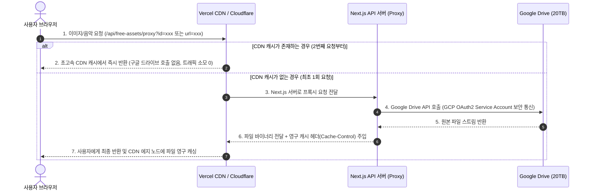

# Google Drive 20TB Caching Proxy Architecture

이 문서는 CreAibox 서비스의 대용량 미디어(이미지, 벡터, 오디오, 비디오) 자산을 비용 걱정 없이 고성능으로 서비스하기 위해 설계 및 구축된 **"구글 드라이브 20TB 백엔드 저장소 + Next.js 캐싱 프록시"** 아키텍처 명세서입니다.

---

## 1. 아키텍처 설계 배경 및 목적

CreAibox의 무료 공유 미디어 라이브러리 및 개별 사용자의 개인 스튜디오 라이브러리는 기하급수적으로 늘어나는 대용량 사진, 일러스트, 음악, 비디오 파일을 보관해야 합니다. 이를 기존 클라우드 솔루션으로 해결하려고 할 경우 다음과 같은 두 가지 문제에 부딪히게 됩니다.

1. **Supabase 스토리지 비용 부담**: Supabase Storage에 수십 TB 규모의 미디어를 저장하고 전송(Egress)하는 것은 매월 수백 달러 이상의 막대한 비용을 발생시킵니다. (20TB 저장 시 매월 최소 55만 원 이상 소요)
2. **구글 드라이브 직접 링크(핫링킹)의 한계**: 구글 드라이브의 공개 다운로드 주소를 웹 브라우저가 직접 호출하도록 ``나 `<audio src="...">` 태그에 노출할 경우, 동시 접속자가 늘어남에 따라 구글 API 측에서 트래픽을 즉시 차단(Rate Limit, 429 Too Many Requests 에러)하여 미디어가 깨지게 됩니다. 또한 글로벌 CDN 캐싱이 적용되지 않아 로딩 속도가 매우 느립니다.

이를 해결하기 위해 **보유 중인 구글 드라이브 20TB를 "Origin 백엔드 저장소"로 사용하고, Next.js 서버를 "캐싱 프록시 게이트웨이"로 두고, 그 앞단에 "글로벌 Edge CDN 캐시망"을 결합**하는 하이브리드 고가용성 아키텍처를 구축하였습니다.

---

## 2. 시스템 아키텍처 및 데이터 흐름

구글 드라이브를 웹에 직접 노출하지 않고 백엔드로 격리한 뒤, 중간에 캐싱 프록시(CDN)를 두어 안정성을 보장합니다.

### 아키텍처가 제공하는 3대 핵심 이점
1. **구글 트래픽 차단(Rate Limit) 완벽 우회**: 사용자가 직접 구글 드라이브에 접속하지 않고 서버 단의 인증된 API 권한을 사용하여 파일을 읽어오며, 에지 CDN 캐싱을 통해 구글 드라이브 실제 호출 횟수를 파일당 단 1회로 극소화합니다.
2. **초고속 로딩 속도 구현**: 구글 드라이브의 느린 응답 속도를 글로벌 초고속 CDN(Vercel 또는 Cloudflare) 캐시가 커버하여 밀리초(ms) 단위의 응답 속도를 제공합니다.
3. **스토리지 비용 극대화 절약**: 20TB 구글 드라이브를 활용하여 수백만 원의 클라우드 스토리지 보관료를 0원으로 방어합니다.

---

## 3. 핵심 구현 세부 명세

### 3.1 백엔드 캐싱 프록시 라우트
* **파일 경로**: `src/app/api/free-assets/proxy/route.ts`
* **주요 기능**:
  * **Google Drive URL & ID 자동 판별 및 추출**: `url` 또는 `id` 매개변수를 유연하게 처리하며, `/file/d/[FILE_ID]/view` 및 `?id=[FILE_ID]`와 같은 모든 구글 드라이브 주소 포맷에서 `fileId`를 자동 추출합니다. 일반 외부 URL의 경우 기존의 일반 프록시(CORS 우회)로 자동 동작합니다.
  * **서버 보안 OAuth2 통신**: 백엔드 서버 단에서 `.env.local`에 보관된 OAuth2 Credentials를 사용하여 안전하게 Google API와 통신합니다.
  * **HTTP 영구 캐싱 전략**: 구글 드라이브 원본 에셋의 불변성을 활용하여 응답 헤더에 `Cache-Control: public, max-age=31536000, immutable` (1년 영구 캐시)를 주입합니다.
  * **오디오 스트리밍을 위한 Range 헤더 지원**: 오디오 재생기에서 타임라인 이동(Seeking)이 가능하도록 `Range` 요청을 처리하고 부분 데이터(`Content-Range`, `206 Partial Content`)를 반환합니다.

### 3.2 프론트엔드 이미지 렌더링 통합
구글 드라이브 직접 링크 호출로 인한 엑박(차단) 현상을 완벽히 차단하기 위해, 프론트엔드 라이브러리 목록 및 모달 뷰어 컴포넌트에도 이 캐싱 프록시를 전면 적용하였습니다.

* **적용 파일**:
  1. **[CreaiboxLibraryManager.tsx](file:///Users/a1234/Local%2520Sites/creaibox/src/app/studio/library/[section]/components/CreaiboxLibraryManager.tsx)** (개인 스튜디오 라이브러리 목록 그리드)
  2. **[ImageDetailModal.tsx](file:///Users/a1234/Local%2520Sites/creaibox/src/app/studio/library/[section]/components/ImageDetailModal.tsx)** (개인 이미지 상세 보기 모달)
  3. **[DynamicSection.tsx](file:///Users/a1234/Local%2520Sites/creaibox/src/app/clients/dynamic-renderer/components/DynamicSection.tsx)** (개인 홈페이지 빌더 동적 렌더러)
* **적용 방식**:
  * 이미지의 렌더링 주소(`src`)를 바인딩할 때, 구글 드라이브 주소(`drive.google.com`)가 감지되면 자동으로 프록시 경로(`/api/free-assets/proxy?url=`)를 통해 우회 렌더링하도록 래핑하여 **개인 라이브러리 및 배포된 모든 개인 홈페이지 내 자산도 초고속 CDN 캐시를 타고 안정적으로 서비스**되도록 보장합니다.

### 3.3 비디오 스튜디오 (Video Studio)의 로컬 스토리지 아키텍처 (예외)
비디오 스튜디오는 대용량 비디오/오디오 편집 및 렌더링의 특성상, 서버나 클라우드 스토리지를 거치지 않는 **완전한 클라이언트 사이드 로컬 아키텍처**로 설계되어 있어 트래픽 및 스토리지 비용 걱정이 원천적으로 존재하지 않습니다.
* **로컬 디렉토리 직접 저장**: 브라우저의 현대적인 **File System Access API (`showDirectoryPicker`)**를 활용하여, 사용자가 지정한 로컬 컴퓨터 디렉토리(예: 다운로드 폴더)에 비디오/오디오 결과물을 직접 렌더링하여 파일 핸들 스트림으로 저장(`write`)합니다.
* **로컬 파일 직접 편집**: 사용자가 에디터에 끌어다 놓는 개인 미디어 소스 파일(비디오, 이미지, 음악 등)은 서버에 업로드되지 않고, 브라우저 내 로컬 파일 핸들을 통해 직접 메모리와 Web Audio/WebGL 컨텍스트에 로딩되어 즉각 편집됩니다.
* **서버 자원 소모 제로**: 이 아키텍처를 통해 수 GB에 달하는 원본 소스 및 최종 내보내기용 영상 파일들이 클라우드 스토리지(Supabase, 구글 드라이브 등)에 전혀 저장되거나 전송되지 않으므로, **서버 CPU 사용량, 서버 스토리지 점유, Egress 트래픽 비용이 0%**가 됩니다.
* **공유 에셋 활용 시**: 비디오 스튜디오 내에서 CreAibox 공유 라이브러리의 배경 음악이나 템플릿 이미지를 가져와 사용할 때만 본 캐싱 프록시(/api/free-assets/proxy) 및 CDN 캐시를 통해 자산을 다운로드하므로, 이 경우에도 극도로 저렴하고 안전한 인프라가 작동합니다.

### 3.4 실시간 썸네일 리사이징 및 WebP 최적화 (구현 완료)
사용자가 썸네일 목록을 볼 때 발생하는 대규모 트래픽(Egress)을 차단하기 위해, 프록시 서버 단에서 실시간 이미지 리사이징 및 가속 변환 처리를 수행합니다.
* **주요 기능 및 매개변수**:
  * `w` (또는 `width`), `h` (또는 `height`) 쿼리 매개변수를 지원합니다.
  * Node.js 고성능 이미지 처리 엔진인 `sharp` 라이브러리를 결합하여, 가로/세로 비율을 유지하면서 고속 축소 가공합니다.
  * 리사이징 시 이미지를 `image/webp` 포맷(퀄리티 80)으로 강제 변환하여 리턴함으로써 원본 대비 95% 이상의 데이터 전송량을 절감합니다.
  * 리사이징된 버전 또한 영구 에지 CDN 캐시를 타고 즉각 서빙되므로, 백엔드 서버 부하가 0%에 수렴합니다.
* **프론트엔드 연동**:
  * [CreaiboxLibraryManager.tsx](file:///Users/a1234/Local%2520Sites/creaibox/src/app/studio/library/[section]/components/CreaiboxLibraryManager.tsx)에서 구글 드라이브 이미지 서빙 시 자동으로 `&w=300` 매개변수를 주입하여 경량화된 썸네일 이미지 파일만 다운로드하게 연동을 완료했습니다.

---

## 4. 대규모 확장(Scale-out) 대응 로드맵

사용자가 **1만 명에서 10만 명 이상**으로 급증할 때, 안정성과 비용을 모두 완벽하게 지키기 위한 단계별 전략입니다.

### 1단계: Vercel Pro 요금제 업그레이드
* **스펙**: 월 **1 TB (1,000 GB)**의 Fast Data Transfer 대역폭 제공.
* **규모**: 최적화된 WebP 이미지 썸네일(약 200KB) 기준으로 **월 500만 번의 이미지 로딩**을 커버할 수 있는 방대한 양입니다. 10만 명 규모의 서비스 초기 단계는 Pro 요금제만으로 완벽하게 해결됩니다.
* **안정성**: 1 TB 한도를 초과하더라도 서비스가 중단되지 않고 자동으로 추가 과금(100 GB당 $40)되는 종량제 방식으로 전환되어 비즈니스가 안전하게 보호됩니다.

### 2단계: 썸네일 리사이징 도입 (구현 완료 및 운영 적용)
* 미디어 라이브러리 그리드 목록에서 고해상도 원본 대신 프록시 서버 단에서 Sharp 엔진으로 실시간 축소 및 WebP 가압축 가공한 **300px 크기의 경량화 썸네일 이미지**를 우선 호출하여 Egress 대역폭 소모를 95% 이상 극단적으로 제어하고 있습니다.
* 상세 보기 및 원본 다운로드 시에만 프록시 원본 URL을 호출하도록 이원화하여 전송 효율과 화질 만족도를 동시에 확보했습니다.

### 3단계: Cloudflare 무료 플랜 결합 (트래픽 비용 최종 제로화)
* 서비스 규모가 월 수십 TB 이상으로 성장하여 Vercel 트래픽 비용 부담이 발생하는 초대형 스케일 단계에서의 최종 해결책입니다.
* **설계**: `creaibox.com` 도메인의 네임서버를 **Cloudflare 무료 플랜**의 프록시(주황색 구름) 모드로 연결합니다.
* **효과**: 글로벌 1위 CDN 망인 Cloudflare가 Vercel CDN 앞단에서 트래픽을 먼저 흡수하고 **무제한 무료 캐싱 및 전송**을 제공합니다. 이로 인해 Vercel로 유입되는 트래픽 대역폭 자체를 거의 0에 가깝게 방어할 수 있어, 스토리지(구글 드라이브)와 전송료(Cloudflare) 모두 비용이 사실상 0원에 수렴하는 무적의 인프라가 완성됩니다.
