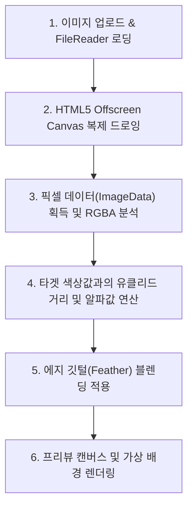

# AI 이미지 배경 제거(Remove Bg) 기능 정의서 및 작동 가이드

이 문서는 크리에이박스 AI 콘텐츠 스튜디오에 탑재된 **"AI 이미지 배경 제거(Remove Bg)"** 도구의 기능 구조, 브라우저 단의 픽셀 처리 작동 원리 및 마케팅 소구점을 나중에 홍보자료나 사용자 매뉴얼을 제작할 때 손쉽게 참조할 수 있도록 정리한 기술 및 브랜딩 명세서입니다.

---

## 1. 서비스 개요

* **페이지 주소**: `/studio/image/bg-remover`
* **접근 메뉴 위치**: 이미지 스튜디오 메뉴 그룹 &rarr; "이미지 AI 업스케일러" 및 "이미지 확장자 변환기" 바로 하단
* **주요 요약**: 별도의 외부 AI 서버 비용 청구 없이 사용자의 기기 브라우저상에서 초고속으로 이미지 배경(누끼)을 분리하고, 즉석에서 단색 및 그라데이션 가상 배경을 입혀 고해상도 PNG 파일로 내려받는 고효율 유틸리티 도구입니다.

---

## 2. 주요 기능 명세

### 2.1 AI 자동 배경 감지 (Auto Mode)
* 사용자가 이미지를 드롭하거나 업로드한 뒤 버튼을 누르면 1~2초 내에 배경을 감지해 지웁니다.
* 이미지의 네 모퉁이(Corners) 영역의 색상 군집을 자동으로 획득하고 이를 평균 배경값으로 자동 세팅해 배경을 도려내는 인공지능식 간편 모드입니다.

### 2.2 스마트 크로마키 (Chroma Key & Eyedropper Mode)
* **스포이트 도구(Pipette)**를 활성화하여 캔버스 내에서 제거하고 싶은 특정 색상을 직접 타겟팅할 수 있습니다.
* **감지 임계값(Threshold) 슬라이더**: 타겟 색상과 다른 픽셀들의 허용 거리를 조율하여 미세하게 날아갈 범위를 확장하거나 축소합니다.
* **에지 페더(Feather) 슬라이더**: 잘라낸 경계면의 외곽 픽셀들에 알파 블렌딩을 적용해 외곽선을 부드럽게 뭉개 피사체가 가상 배경과 잘 조화되도록 마감 처리를 합니다.

### 2.3 실시간 가상 배경 합성 (Compositor)
* **투명 모드**: 바둑판 패턴(Checkerboard) 위에 피사체만 깔끔하게 분리되어 로고나 스티커 자산으로 사용하기 적합합니다.
* **단색 컬러 합성**: 화이트, 블랙 외에 팝 컬러 및 사용자가 임의로 지정하는 커스텀 HEX 색상을 투명 영역 뒤에 바로 덧그립니다.
* **그라데이션 합성**: Sunset, Cool Tech, Ocean, Aurora 등 미적으로 어울리는 선형 그라데이션(Linear Gradient) 배경 5종을 한 번의 클릭으로 합성합니다.

### 2.4 Before / After 드래그 비교 슬라이더
* 캔버스 영역에 슬라이더 핸들을 오버레이하여 마우스 드래그를 통해 원본 이미지(좌측)와 배경이 분리/합성된 결과물(우측)을 실시간으로 긁어가며 비교 분석할 수 있는 고급 인터랙션을 구현했습니다.

---

## 3. 기술적 작동 원리 (How It Works)

이 도구는 외부 AI API 서비스를 호출하지 않고 **100% 클라이언트(Client-side) 브라우저 엔진** 위에서 독자 동작합니다.

### 3.1 HTML5 Canvas 픽셀 가공 기술
* 이미지가 로딩되면 보이지 않는 오프스크린 캔버스(Offscreen Canvas)를 원본 이미지의 1:1 종횡비 물리 크기로 할당해 드로잉합니다.
* `canvas.getContext("2d").getImageData()`를 통해 모든 픽셀의 RGBA 1차원 플랫 배열(Uint8ClampedArray)을 추출합니다.

### 3.2 유클리드 색 공간 거리 산출 알고리즘
* 배경 색상 픽셀($R_b, G_b, B_b$)과 타겟 이미지 내 특정 위치의 픽셀 R, G, B 값의 유클리드 기하학적 거리($d$)를 매 픽셀 루프마다 초고속으로 비교 계산합니다.
  $$d = \sqrt{(R - R_b)^2 + (G - G_b)^2 + (B - B_b)^2}$$
* 산출된 색상 차이 거리($d$)가 설정된 임계값(Threshold)보다 작을 때 해당 픽셀의 알파값($A$)을 $0$으로 처리하여 완전 투명화를 수행합니다.

### 3.3 안티에일리어싱 방지용 페더링(Feathering)
* 외곽이 톱니바퀴처럼 계단식으로 찢어져 거칠어지는 현상을 방지하기 위해 에지 영역의 알파 채널 가중치를 동적으로 감쇠시킵니다.
* 거리가 임계값($T$) 경계면에 아슬아슬하게 걸쳐 있는 픽셀들에 대해 비율($Ratio$)을 구하여 알파 마스킹을 점진 적용합니다.

### 3.4 수동 브러시 편집 기술 사양 (Erase, Restore, Color)
* **지우개 브러시 (Erase)**: `ctx.globalCompositeOperation = "destination-out"` 설정 하에서 마우스 드래그 궤적에 따라 메인 캔버스 픽셀을 강제 투명화 처리합니다.
* **원본 복구 브러시 (Restore)**: `ctx.createPattern(originalImage, "no-repeat")`를 이용해 원본 이미지 소스 자체를 패턴 브러시로 로드합니다. 마우스가 지나가는 선 스트로크의 색상(`strokeStyle`)에 이 패턴을 바인딩해 그림으로써 지워진 영역의 원래 픽셀들을 절대 좌표 정렬 오차 없이 100% 부분 복원해 냅니다.
* **색상 드로잉 브러시 (Color)**: 일반적인 스트로크 페인팅 기법으로 사용자가 지정한 크기와 색상으로 캔버스 위에 자유 드로잉을 추가합니다.

---

## 4. 기존 외부 AI API 연동 방식과의 비교

| 비교 항목 | 브라우저 자체 기능 가공 방식 (현재) | 외부 AI API 호출 방식 (타사) |
| :--- | :--- | :--- |
| **이용 단가** | **0원 (무제한 완전 무료)** | 호출 장당 요금 과금 (예: 50~200원) |
| **개인정보 보호** | **최상** (서버로 이미지 전송이 없어 완벽함) | 보통 (원격 서버나 타사 API로 전송 필요) |
| **처리 지연 시간** | **1~2초 즉시 완료** | 5~8초 소요 (네트워크 업/다운로드 대기) |
| **정밀성 한계** | 배경 단색 대비가 약한 복잡 이미지에 한계 | 딥러닝 뉴럴 네트워크로 복잡 배경 처리 가능 |

---

## 5. 홍보 및 마케팅 소구점 (Key Selling Points)

나중에 서비스 소개 페이지, SNS 카드뉴스, 블로그 칼럼 등을 작성할 때 아래 키워드와 핵심 메시지를 적극 강조하여 홍보에 참고할 수 있습니다.

1. **"1초 만에 깔끔하게 끝나는 무료 누끼 지우개"**
   * 유료 구독 요금제 부담 없이 무제한으로 배경을 즉석에서 분리하여 마케팅 소스, 쇼핑몰 상품 이미지 제작에 활용할 수 있음을 어필합니다.
2. **"서버로 파일 전송 없는 안전한 개인 정보 보안 스튜디오"**
   * 민감한 비즈니스 문서, 상품 기획 시안, 혹은 개인 인물 사진이 타사 데이터베이스나 서버에 저장되지 않고 온전히 내 브라우저 안에서만 안전하게 가공된다는 점을 강력한 셀링 포인트로 활용합니다.
3. **"배경 제거부터 합성까지 원터치로 한 번에"**
   * 단순히 배경만 지우는 것이 아니라 어울리는 팝 컬러 단색 및 감각적인 5종 테마 그라데이션 배경을 클릭 한 번으로 손쉽게 디자인해 내는 완성형 크리에이티브 환경임을 강조합니다.
