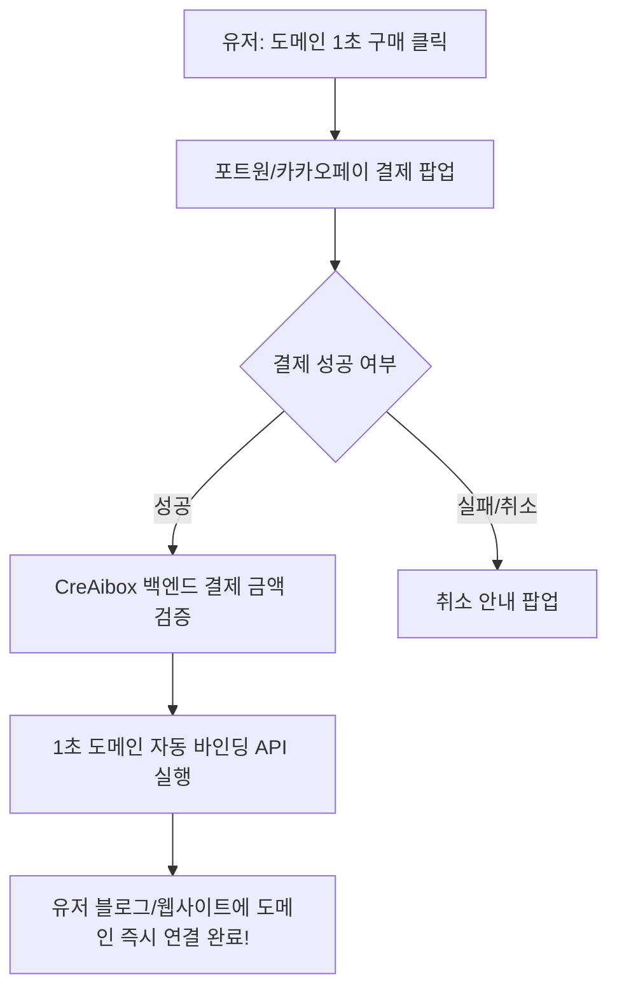

# CreAibox 전자결제(PG) 연동 가이드 (PortOne / 토스페이먼츠 / Stripe)

이 매뉴얼은 CreAibox 서비스에서 **도메인 구매, 요금제 구독(Creator/Pro/Business/Premier), 유료 서비스 결제**를 처리하기 위한 PG 연동 3단계 절차와 코드 연동 방식을 설명합니다.

---

## 1. 🏆 PG사 선택 가이드 (국내 1위 추천: PortOne)

| PG 구분                           | 추천 솔루션                              | 지원 결제수단                                    | 특장점                                                |
| :-------------------------------- | :--------------------------------------- | :----------------------------------------------- | :---------------------------------------------------- |
| **국내 통합 PG (강력추천)** | **포트원 (PortOne / 구 아임포트)** | 카카오페이, 네이버페이, 토스페이, 국내 전 카드사 | 코드 몇 줄로 모든 국내 간편결제 및 카드결제 통합 지원 |
| **국내 간편결제**           | **토스페이먼츠 (Toss Payments)**   | 토스페이, 신용카드, 계좌이체                     | UI가 매우 현대적이고 개발자 문서 우수                 |
| **해외 글로벌 결제**        | **Stripe (스트라이프)**            | 해외 Visa/MasterCard, Apple Pay, Google Pay      | 해외 달러($) 결제 및 해외 구독 전용                   |

---

## 2. ⚡ 포트원 (PortOne) 연동 3단계 (가장 빠른 1분 연동)

### 1단계: 테스트 키 발급 (가입 후 1초 발급, 사업자등록 전 무료 테스트 가능)

1. [포트원 관리자 콘솔(portone.io)](https://portone.io) 접속 후 회원가입
2. **[결제 연동]** ➔ **[가맹점 식별코드 (Store ID)]** 및 **[채널 키 (Channel Key)]** 복사
3. `.env.local` 에 저장:
   ```env
   NEXT_PUBLIC_PORTONE_STORE_ID="store-xxxx-xxxx-xxxx"
   NEXT_PUBLIC_PORTONE_CHANNEL_KEY="channel-key-xxxx-xxxx"
   ```

### 2단계: 프론트엔드 결제 창 연동 (`npm i @portone/browser-sdk`)

```typescript
import * as PortOne from "@portone/browser-sdk";

export async function requestDomainPayment({ domain, amount }: { domain: string; amount: number }) {
  const paymentId = `payment-${Date.now()}`;

  const response = await PortOne.requestPayment({
    storeId: process.env.NEXT_PUBLIC_PORTONE_STORE_ID!,
    channelKey: process.env.NEXT_PUBLIC_PORTONE_CHANNEL_KEY!,
    paymentId,
    orderName: `[CreAibox] ${domain} 도메인 1년 등록`,
    totalAmount: amount,
    currency: "CURRENCY_KRW",
    payMethod: "CARD", // 또는 KAKAO_PAY, EASY_PAY
  });

  if (response.code !== undefined) {
    // 결제 실패 또는 취소
    return { success: false, message: response.message };
  }

  // 3단계 백엔드 검증 API 호출
  const verifyRes = await fetch("/api/payments/verify", {
    method: "POST",
    headers: { "Content-Type": "application/json" },
    body: JSON.stringify({ paymentId, domain }),
  });

  return await verifyRes.json();
}
```

### 3단계: 백엔드 위변조 검증 및 자동 처리 (`/api/payments/verify`)

- 결제된 금액이 실제 도메인 가격(예: 18,186원)과 일치하는지 백엔드에서 포트원 REST API로 재검증한 후, `purchaseDomain(domain)` 자동 실행!

---

## 3. 📝 결제 연동 후 자동 실행 순서



---

*최종 수정일: 2026-07-28 | 작성: CreAibox 개발팀*
