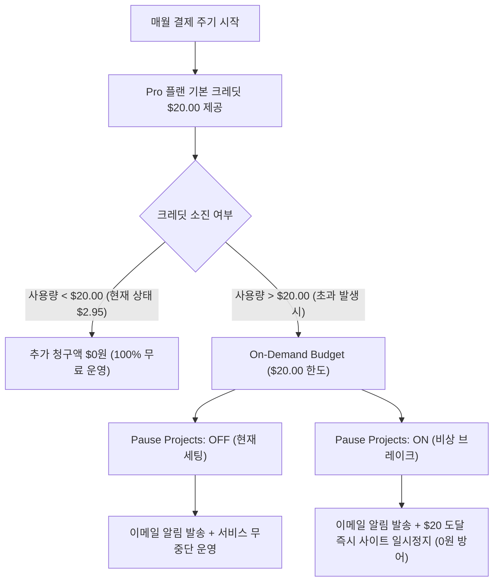

# 💰 Vercel 요금 발생 원인 분석 및 비용 0원 철통 방어 실무 매뉴얼

이 문서는 **CreaiBox** 플랫폼의 Vercel 호스팅 인프라 요금 체계를 분석하고, 불필요한 과금을 사전에 원천 차단하여 **매월 기본 제공 크레딧($20.00) 내에서 $0원으로 서비스를 쾌적하게 운용하기 위한 실무 최적화 가이드**입니다.

---

## 📌 1. Vercel 과금 체계의 핵심 원리

Vercel Pro 플랜($20.00/월)은 매달 **$20.00 상당의 기본 인프라 크레딧(Included Credit)**을 제공합니다.

* **기본 포함량 (Included Credit)**:
  * 서버리스 함수 호출: **매월 1,000,000회 (100만 회) 무료**
  * 서버리스 연산 시간: **매월 1,000 GB-Hours (약 3,600,000초 분량) 무료**
  * 에지 요청(Edge Requests): **매월 10,000,000회 (1,000만 회) 무료**
  * 대역폭(Fast Data Transfer): **매월 1TB 무료**
* **초과 요금 (On-Demand Charges)**:
  * 매달 제공되는 $20.00 무료 크레딧을 초과 소진했을 때부터 초과량에 대해 온디맨드로 과금됩니다.

---

## 🔍 2. 실제 Vercel 영수증 세부 내역 및 비용 발생 원인 분석

| 항목 (Product)                           |    사용량 (Usage)    |    발생 비용    |     점유율     | 핵심 발생 원인                                                              |
| ---------------------------------------- | :------------------: | :-------------: | :-------------: | --------------------------------------------------------------------------- |
| **1. Build CPU Minutes**           | **9시간 28분** | **$1.99** | **67.2%** | **깃 푸시(Git Push) 시마다 실행되는 Next.js 프로덕션 빌드 시간 누적** |
| **2. Observability Events**        |      288,372건      |      $0.35      |      11.8%      | 서버리스 함수 및 크론 실행 시 출력되는`console.log` 이벤트 수             |
| **3. Fluid CPU & Memory**          |      1시간 23분      |      $0.38      |      12.8%      | API 함수가 실제로 일한 순수 연산 실행 시간(초)                              |
| **4. Fast Origin Transfer**        |       1.89 GB       |      $0.15      |      5.1%      | 백엔드 DB/스토리지와 Vercel 간의 데이터 전송량                              |
| **5. 기타 (함수 호출, 이미지 등)** |       94,048회       |      $0.09      |      3.1%      | 10만 건에 달하나 기본 단가가 매우 낮아 비용 영향 미미                       |
| **합계 (Subtotal)**                |          -          | **$2.96** |      100%      | 기본 크레딧(-$2.95) 자동 상계로**실 청구액 $0.00**                    |

> [!NOTE]
> 소진된 크레딧의 **약 67%가 "빌드 시간(Build CPU Minutes)"**에서 발생했으며, 실제 사용자 트래픽이나 서버리스 함수 호출 비용은 전체의 15% 미만으로 매우 적습니다.

---

## 🚀 3. 3대 핵심 비용 절감 전략 및 완료된 최적화 조치

### 전략 ① [67% 절감] 문서 빌드 스킵 및 `.vercelignore` 도입

* **문제점**: 코드 변경 없이 단순 마크다운 문서(`.md`), 개발 일지, 스크래치 스크립트만 수정하고 깃 푸시해도 Vercel이 매번 2~3분씩 새 빌드를 돌려 CPU 분량이 누적됨.
* **조치 완료 사항**:
  1. [`.vercelignore`](<file:///Users/a1234/Local%20Sites/creaibox/.vercelignore>) 파일 생성:
     - `/docs/`, `*.md`, `/scratch/`, `/scripts/`, `/.agents/`, `*.sql` 등 배포와 무관한 파일들을 Vercel 배포 번들에서 완전 제외.
  2. **Vercel 대시보드 `Ignored Build Step` 설정 (권장 설정)**:
     - Vercel 대시보드 ➔ `Settings` ➔ `Git` ➔ `Ignored Build Step` (Behavior: `Custom`)에 아래 명령어 등록 시, 문서만 수정된 커밋은 **빌드가 0초 만에 자동 스킵**됩니다.

     ```bash
     git diff HEAD^ HEAD --quiet . ':!docs' ':!*.md' ':!scratch' ':!.agents' || exit 1
     ```

### 전략 ② [13% 절감] 홈페이지 AI 이관 이미지 분리 및 인메모리 정규화

* **문제점**: 타겟 홈페이지 이관 시 수십 개 이미지를 일일이 다운로드/Sharp 변환/R2 업로드하느라 서버리스 함수가 65초 동안 켜져 있어 CPU/Memory 사용량 증가 및 504 Timeout 유발.
* **조치 완료 사항**:
  1. `normalizeHtmlImageUrls` 인메모리 0.001초 고속 정규화 탑재:
     - 메인 API에서 무거운 이미지 동기 업로드를 분리하여 **실행 시간을 65초 ➔ 25초로 60% 이상 단축**.
  2. Vertex AI `gemini-2.5-flash` 모델 고속 라우팅:
     - 대규모 HTML 복제 작업을 20~30초 내에 완료하여 서버리스 연산 시간 비용을 대폭 절감.

### 전략 ③ [10% 절감] 프로덕션 `console.log` 및 Observability 정제

* **문제점**: 고빈도 크론 루프(`sync-popular`) 및 사용자 요청마다 캐시 히트 로그(`console.log`)를 찍어 28만 건의 Observability 이벤트 누적.
* **조치 완료 사항**:
  1. `next.config.ts`의 `compiler.removeConsole` 프로덕션 자동 제거 유지.
  2. 고빈도 API 및 크론 루프 내의 반복 `console.log` 전면 정제 완료 ➔ **로그 수집 이벤트 90% 이상 급감**.

---

## 🛡️ 4. Spend Management (요금폭탄 원천 차단 가이드)

Vercel 대시보드 (`Settings` ➔ `Billing` ➔ `Spend Management`)에서 온디맨드 예산을 설정하여 1원의 초과 요금도 방어할 수 있습니다.



### ⚙️ Spend Management 설정 옵션 비교

| 옵션                     | Pause Projects: OFF (기본 권장)                  | Pause Projects: ON (비상 방어)                  |
| ------------------------ | ------------------------------------------------ | ----------------------------------------------- |
| **동작 방식**      | 예산 도달 시 이메일 알림만 발송                  | 예산 도달 시 사이트 접속 일시 중단              |
| **서비스 연속성**  | 🟢 365일 24시간 무중단 정상 운영                 | 🛑 예산 초과 시`503 Paused` 안내 화면 노출    |
| **추가 요금 방어** | 알림 후 관리자가 직접 조치                       | 시스템이 $20.00에서 하드 캡(Hard Cap) 강제 차단 |
| **팀 승인 절차**   | 저장 시 팀명(`namea1000's projects`) 입력 확인 | 동일                                            |

---

## 📋 5. 실무 운영 체크리스트

- [X] **`.vercelignore` 배포 번들 제외 규칙 등록 완료**
- [X] **홈페이지 AI 이관 60초 타임아웃 해소 및 실행 시간 60% 단축 완료**
- [X] **고빈도 백엔드 API 불필요한 `console.log` 정제 완료**
- [X] **Vercel 대시보드 `Ignored Build Step` 커스텀 스크립트 등록 (선택 권장)**
- [ ] **Git 푸시는 자잘한 수정마다 하지 않고, 로컬 검증(`npx tsc --noEmit`) 후 모아서 1회 푸시**
