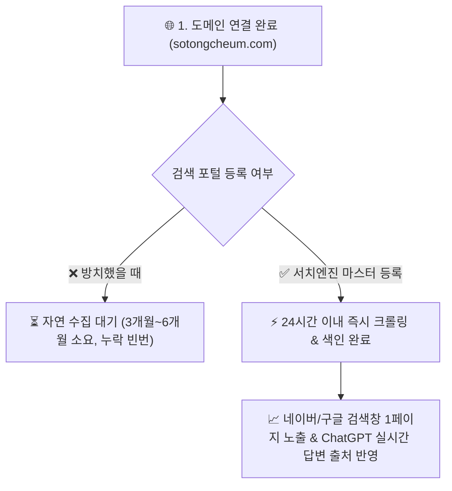
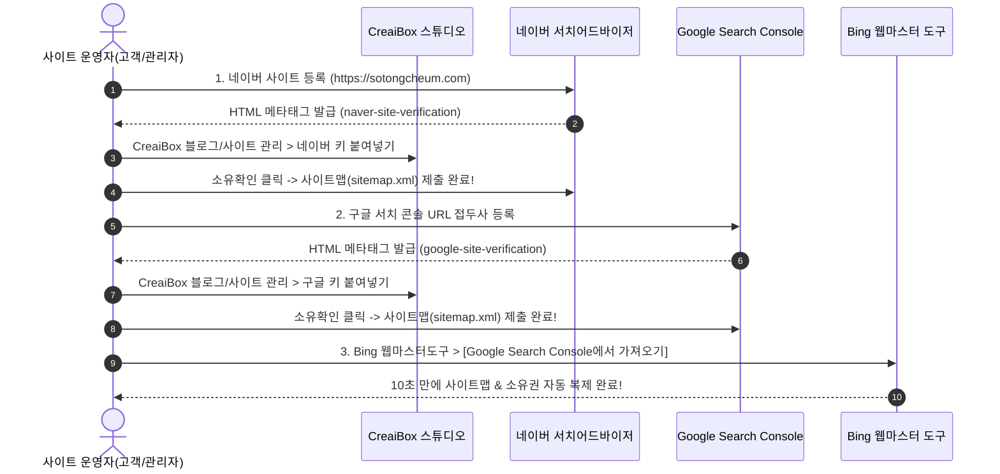

# 📘 [실무 매뉴얼 & 교육 가이드] 도메인 연결 후 검색 포털(네이버/구글/빙) 100% 노출 필수 셋업 가이드

> **문서 분류**: 실무 운영 매뉴얼 & 고객 배포용 교육 가이드 (Diátaxis How-To & Reference)  
> **적용 대상**: `CreaiBox` 독립 커스텀 도메인(`*.com`, `*.kr`, `*.net` 등) 및 브랜드 블로그/AI 고객사 웹사이트를 런칭한 모든 운영자 및 고객사  
> **연관 문서**:
> - 🔴 [도메인 서브도메인 라우팅 아키텍처](file:///Users/a1234/Local%20Sites/creaibox/docs/arch/02_auth-and-domain/blog-subdomains.md)
> - 🔵 [도메인 조회 및 구매 매뉴얼](file:///Users/a1234/Local%20Sites/creaibox/docs/project/manual/02_auth-and-domain/domain-search-and-management-manual.md)

---

## 1. 개요: 도메인 연결 후 왜 이 작업을 반드시 해야 하는가? (WHY)

웹사이트를 제작하고 도메인(`예: sotongcheum.com`)을 성공적으로 연결했다고 해서, 포털 사이트(네이버, 구글, 다음, Bing)가 그 즉시 웹사이트의 존재를 알고 검색창에 띄워주지는 않습니다.



### 1-1. 자연 방치 vs 포털 등록의 치명적인 차이점 비교

| 비교 항목 | ❌ 등록하지 않고 자연 방치했을 때 | ✅ 포털 마스터도구 등록 완료 시 |
|---|---|---|
| **검색 노출 시점** | 최소 1개월 ~ 6개월 이상 소요 (또는 영구 누락) | **등록 후 24시간 ~ 3일 이내 즉시 노출** |
| **신규 글/페이지 수집** | 크롤러가 언제 올지 모름 | **발행 당일 수 시간 내 실시간 색인** |
| **검색 엔진 진단 리포트** | 수집 오류, 404 링크 깨짐 확인 불가 | **수집 현황, 클릭수, 유입 키워드 실시간 확인** |
| **AI 검색(ChatGPT, Copilot)** | 최신 정보가 AI 답변에 인용되지 않음 | **Bing 연동으로 ChatGPT 실시간 검색 소스 채택** |

---

## 2. ❓ "Bing(마이크로소프트 빙)도 꼭 해줘야 하나요?" (2026년 최신 AI 검색 필수)

### 💡 답변: **반드시 해주셔야 합니다! (선택이 아닌 필수)**

과거에는 국내 검색 점유율이 낮아 Bing을 생략하기도 했으나, **현재 2026년 AI 검색 생태계에서는 가장 중요한 필수 포털**로 급부상했습니다:

1. **OpenAI ChatGPT 실시간 웹 검색(SearchGPT)의 원천 데이터**:
   * ChatGPT가 웹을 실시간 검색하여 답변할 때 **Microsoft Bing의 검색 인덱스를 100% 기본 엔진으로 사용**합니다.
   * Bing에 사이트가 등록되어 있어야 ChatGPT 사용자들에게 우리 회사/블로그가 답변 출처로 추천됩니다.
2. **Windows 11 및 Edge 브라우저 기본 검색 엔진 (Microsoft Copilot 탑재)**:
   * 전 세계 수억 대의 PC 및 기업용 업무 환경에서 기본 사용됩니다.
3. **단 10초 만에 1클릭 동기화 완료**:
   * Google Search Console에 등록해 둔 상태라면, Bing 웹마스터 도구에서 **[Google에서 가져오기 (Import)] 버튼 클릭 1번으로 10초 만에 사이트맵과 소유권이 자동 연동**됩니다.

---

## 3. 포털별 4단계 셋업 마스터 로드맵 (HOW-TO)



---

## 4. [1단계] 네이버 서치어드바이저(Search Advisor) 완벽 등록

대한민국 네이버 검색창 웹사이트 영역에 내 사이트를 최우선 노출시키는 핵심 작업입니다.

### 4-1. 사이트 등록 및 메타태그 발급
1. [네이버 서치어드바이저 (searchadvisor.naver.com)](https://searchadvisor.naver.com)에 접속하여 네이버 아이디로 로그인합니다.
2. 상단 메뉴의 **[웹마스터 도구]**를 클릭합니다.
3. **사이트 등록** 입력란에 내 정식 도메인을 입력하고 엔터를 누릅니다:
   * 예: `https://sotongcheum.com` (반드시 `https://` 포함)
4. 사이트 소유확인 방식에서 **`[ HTML 태그 ]`** 라디오 버튼을 선택합니다.
5. 화면에 나오는 녹색 메타태그 코드 중 **`content=" "` 안의 문자열(예: `a1b2c3d4e5f6...`)**을 복사합니다.

### 4-2. CreaiBox 스튜디오에 네이버 인증키 입력 (10초 컷)
1. [CreaiBox 스튜디오](https://creaibox.com)에 로그인합니다.
2. 좌측 메뉴에서 **[크리에이박스 블로그] ➔ [블로그 관리]** (`/studio/writing/creaibox/blog-management`)로 이동합니다.
3. 상단 탭에서 **[SEO 설정]**을 클릭합니다.
4. **`네이버 서치어드바이저 키`** 입력 필드에 복사한 인증 코드를 붙여넣습니다.
5. 우측 하단의 **`[ 설정 저장 ]`** 버튼을 클릭합니다. (0.01초 만에 전 세계 서버 배포 완료)

### 4-3. 네이버 서치어드바이저 소유확인 & 사이트맵 제출
1. 네이버 서치어드바이저 화면으로 돌아와 하단의 **`[ 소유확인 ]`** 녹색 버튼을 누릅니다.
2. *"사이트 소유 확인이 완료되었습니다."* 알림창이 뜨면 등록 완료!
3. 등록된 사이트 목록에서 해당 도메인을 클릭하여 관리 화면으로 들어갑니다.
4. 좌측 메뉴 **[요청] ➔ [사이트맵 제출]** 클릭:
   * 입력창에 `sitemap.xml` 입력 후 **[확인]**
5. 좌측 메뉴 **[요청] ➔ [RSS 제출]** 클릭:
   * 입력창에 `https://sotongcheum.com/feed` 입력 후 **[확인]**

---

## 5. [2단계] Google Search Console (구글 서치 콘솔) 완벽 등록

구글 검색 1페이지 상위 랭킹 및 전 세계 해외 검색 유입을 위한 구글 공식 도구입니다.

### 5-1. 속성 추가 및 소유권 확인
1. [Google Search Console (search.google.com/search-console)](https://search.google.com/search-console)에 접속하여 구글 계정으로 로그인합니다.
2. 속성 추가 팝업에서 우측의 **`[ URL 접두어 ]`** 방식을 선택합니다.
   * URL 입력란: `https://sotongcheum.com` 입력 후 [계속]
3. 소유권 확인 창에서 **`[ HTML 태그 ]`** 옵션을 펼칩니다.
4. `<meta name="google-site-verification" content="구글인증코드문자열" />`이 표시되면, **인증 코드**를 복사합니다.

### 5-2. CreaiBox 스튜디오에 구글 인증키 입력
1. CreaiBox **[블로그 관리] ➔ [SEO 설정]** 탭으로 이동합니다.
2. **`구글 서치 콘솔 인증키`** 입력란에 복사한 코드를 붙여넣고 **[저장]**을 누릅니다.
3. Google Search Console 창으로 돌아와 **`[ 확인 ]`** 버튼을 클릭합니다.

### 5-3. 구글 사이트맵(`sitemap.xml`) 제출
1. 구글 서치 콘솔 좌측 메뉴에서 **[Sitemaps]**를 클릭합니다.
2. **새 사이트맵 추가** 란에 `sitemap.xml`을 입력하고 **[제출]**을 클릭합니다.
3. 상태에 초록색으로 **`성공`**이 표시되면 모든 구글 수집 준비가 완료됩니다.

---

## 6. [3단계] Microsoft Bing 웹마스터 도구 & ChatGPT 연동 (10초 마스터)

### 6-1. Google Search Console 1클릭 자동 가져오기
1. [Bing 웹마스터 도구 (bing.com/webmasters)](https://www.bing.com/webmasters)에 접속합니다.
2. 마이크로소프트, 구글, 또는 페이스북 계정으로 로그인합니다.
3. 사이트 추가 방식에서 좌측의 **`[ Google Search Console에서 사이트 가져오기 (Import) ]`** 버튼을 클릭합니다.
4. 앞서 구글 서치 콘솔을 등록했던 동일한 구글 계정을 선택하고 권한을 승인합니다.
5. 가져올 사이트 목록에서 `https://sotongcheum.com`을 체크하고 **[가져오기]**를 누릅니다.
6. **끝!** 별도의 메타태그 입력 없이 **소유권 인증 + 사이트맵(`sitemap.xml`) 제출이 10초 만에 완벽 복제 연동**됩니다.

---

## 7. [4단계] Google Cloud Console (Indexing API) 자동화 (선택 고급 과정)

CreaiBox에는 글을 발행할 때마다 구글 봇에게 즉시 수집 핑을 날리는 **Google Indexing API 백엔드 엔진**이 탑재되어 있습니다.

| 단계 | 수행 작업 | 설명 |
|:---:|---|---|
| **1** | [Google Cloud Console](https://console.cloud.google.com) 프로젝트 생성 | 새 GCP 프로젝트 생성 후 `Web Search Indexing API` 서비스 활성화 |
| **2** | 서비스 계정(Service Account) 생성 | `roles/owner` 권한의 서비스 계정 생성 및 비공개 키(JSON) 다운로드 |
| **3** | Search Console에 서비스 계정 이메일 등록 | 서비스 계정 이메일(`xxx@iam.gserviceaccount.com`)을 구글 서치콘솔 사용자로 추가 (권한: 소유자) |
| **4** | CreaiBox 관리자 센터 연동 | `/admin/google` 화면에서 서비스 계정 키를 등록하면 글 발행 시 1초 만에 구글 즉시 색인 요청 발송 |

---

## 8. 다중 계정(제작 대행자 + 고객사) 공동 관리 가이드

> **"내가 내 아이디로 먼저 등록하고, 나중에 고객이 본인 아이디로 또 등록해도 되나요?"**

### ✅ 답변: 네, 100% 가능하며 강력히 권장하는 실무 방식입니다!

* **왜 이렇게 해야 하는가?**:
  1. 제작사(대표님)가 사이트 런칭 직후 바로 등록해두어야 **검색 노출 기간을 단 하루라도 앞당길 수 있습니다.**
  2. 추후 고객이 본인 계정으로 유입 통계를 직접 보고 싶어할 때 언제든지 추가 등록이 가능합니다.

### 📌 다중 계정 운영 2가지 실무 방법

| 방식 | 진행 방법 | 특징 |
|---|---|---|
| **방식 1: 각자 소유권 인증** | 제작사가 먼저 인증 완료 후, 추후 고객의 인증 메타태그를 전달받아 CreaiBox에 입력 후 고객 계정에서 [소유확인] 클릭 | 가장 깔끔하며 두 계정 모두 독립적으로 전 권한 보유 |
| **방식 2: 사용자 권한 초대** | 제작사 서치어드바이저/서치콘솔 관리 화면에서 **[설정] ➔ [사용자 관리] ➔ [고객 네이버/구글 이메일 초대]** | 메타태그 변경 없이 클릭 몇 번으로 고객에게 통계 조회 권한 부여 |

---

## 9. 📋 고객 배포용 1장 요약 체크리스트 (Cheatsheet)

고객사에게 사이트를 납품하거나 교육할 때 아래 표를 그대로 출력/전달하여 활용하세요.

```text
========================================================================
    🚀 [CreaiBox] 신규 웹사이트 런칭 후 검색 엔진 등록 체크리스트
========================================================================
사이트 주소: https://________________________ (고객사 도메인)

[  ] 1. 네이버 서치어드바이저 등록 (searchadvisor.naver.com)
     - 사이트 등록 및 HTML 메타태그 복사
     - CreaiBox [블로그 관리] > [SEO 설정]에 네이버 키 입력
     - 소유확인 완료 및 sitemap.xml / feed 제출

[  ] 2. 구글 서치 콘솔 등록 (search.google.com/search-console)
     - URL 접두어 등록 및 HTML 메타태그 복사
     - CreaiBox [블로그 관리] > [SEO 설정]에 구글 키 입력
     - 소유확인 완료 및 sitemap.xml 제출

[  ] 3. 마이크로소프트 Bing & ChatGPT 연동 (bing.com/webmasters)
     - [Google Search Console에서 가져오기] 클릭으로 10초 자동 연동

[  ] 4. 오픈 3일 후 네이버/구글 검색창에 "회사명/브랜드명" 검색 테스트
========================================================================
```
