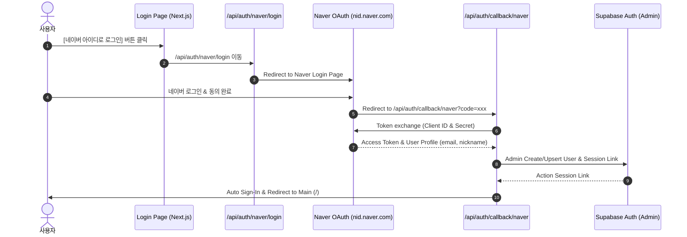

# 🟢 네이버 아이디로 로그인 ("네아로") 연동 & 운용 매뉴얼

본 문서는 CreAibox 메인 서비스 및 클라이언트 커스텀 홈페이지에 **네이버 아이디로 로그인(Naver OAuth 2.0)**을 5분 만에 연동하고 운용하기 위한 표준 가이드라인입니다.

---

## 1. 🔑 발급된 API 키 및 환경변수 세팅

네이버 개발자 센터(`developers.naver.com`)에서 발급받은 키를 프로젝트의 `.env.local` 파일에 탑재합니다.

```ini
# Naver Login (네아로) & Open API Keys
NAVER_CLIENT_ID="ZTMACw6iK7VCdYi3dOMb"
NAVER_CLIENT_SECRET="qB0yyUD0Oa"
```

---

## 2. ⚙️ 네이버 개발자 센터 설정 (Naver Developers Console)

- **URL**: [https://developers.naver.com](https://developers.naver.com)
- **앱 이름**: `CreAibox`
- **사용 API**: `네이버 아이디로 로그인`
- **필수 수집 항목**: `이름`, `이메일 주소`, `별명` (사전 검수 대기 없이 1초 만에 즉시 발급)

### 2.1 서비스 URL & Callback URL 입력 값

| 구 분 | URL 주소 | 용 도 |
| :--- | :--- | :--- |
| **서비스 URL** | `https://creaibox.com` | 대표 서비스 도메인 주소 |
| **서비스 URL (로컬)** | `http://localhost:3000` | 로컬 개발 서버 테스트 도메인 |
| **Callback URL (운영)** | `https://creaibox.com/api/auth/callback/naver` | 네이버 로그인 완료 후 운영 리다이렉트 라우트 |
| **Callback URL (로컬)** | `http://localhost:3000/api/auth/callback/naver` | 로컬 개발 환경 콜백 라우트 |
| **Callback URL (Supabase)** | `http://localhost:3000/auth/callback` | 세션 교환 백엔드 라우트 |

---

## 3. 🚀 시스템 아키텍처 및 로그인 처리 흐름



---

## 4. 🛠️ 소스코드 엔드포인트 명세

- **네이버 로그인 요청 엔드포인트**: [`src/app/api/auth/naver/login/route.ts`](file:///Users/a1234/Local%20Sites/creaibox/src/app/api/auth/naver/login/route.ts)
- **네이버 콜백 & 세션 처리 엔드포인트**: [`src/app/api/auth/callback/naver/route.ts`](file:///Users/a1234/Local%20Sites/creaibox/src/app/api/auth/callback/naver/route.ts)
- **로그인 버튼 화면**: [`src/app/login/page.tsx`](file:///Users/a1234/Local%20Sites/creaibox/src/app/login/page.tsx)
- **회원가입 버튼 화면**: [`src/app/signup/page.tsx`](file:///Users/a1234/Local%20Sites/creaibox/src/app/signup/page.tsx)
