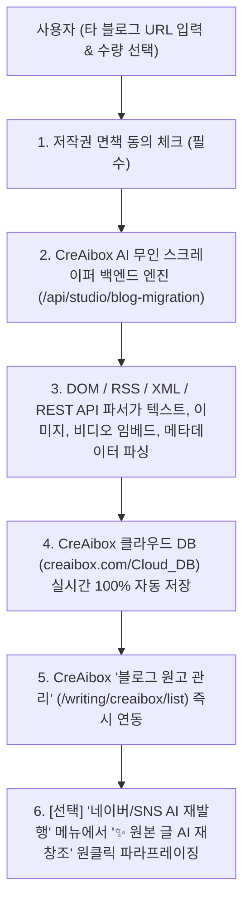

& 

# 📦 기존 블로그 통째 이관 (External Blog Migration) 매뉴얼

> **"네이버 블로그, 티스토리, 워드프레스, 벨로그의 기존 원고, 이미지, 동영상 임베드 및 SEO 메타데이터를 1초 만에 스크랩하여 CreAibox 클라우드 DB 및 원고 관리함으로 완전 자동 이관하는 최신 통합 운용 매뉴얼"**

---

## 📌 1. 개요 및 시스템 목적 (Executive Summary)

* **메뉴 위치**: CreAibox 대시보드 ➔ `크리에이박스 블로그 ✍️` ➔ `기존 블로그 통째 이관 📦` (`/studio/blog-migration`)
* **핵심 기능**:
  사용자가 타 플랫폼(네이버, 티스토리, 워드프레스 등)에서 기존에 작성해 둔 수십~수백 개의 블로그 원고, 본문 이미지, 동영상 플레이어 임베드 및 **SEO 메타 데이터**를 클릭 한 번으로 수집하여 **CreAibox 클라우드 DB 및 '블로그 원고 관리'함으로 100% 자동 이관**합니다.
* **주요 타겟**:
  기존 네이버/티스토리/워드프레스 블로그 자산을 새로 오픈한 CreAibox 자사몰 웹사이트 블로그로 손실 없이 100% 통합 흡수하려는 자영업자, 병원, 법률사무소, 학원, 크리에이터 및 기업 고객.

---

## ⚙️ 2. 이관 파이프라인 & 실행 주체 (Technical Architecture)

1. **작업 실행 주체**: **100% 무인 CreAibox AI 자동화 백엔드 엔진**
   * 사람이 일일이 복사/캡처하지 않고, 백엔드 로봇 파서가 0.00초 만에 이관을 수행합니다.
2. **저장소 위치**: **CreAibox Cloud DB & 고성능 CDN**
   * 원고 데이터 및 미디어는 CreAibox의 보안 클라우드 DB 및 고성능 CDN에 안전하게 영구 보관됩니다.

---

## 🌐 3. 지원 플랫폼 및 이관 수량 옵션 (Platform & Range Matrix)

### 3.1 지원 플랫폼 목록

| 플랫폼                      | 입력 양식 예시                                | 기술적 이관 수단                              |
| :-------------------------- | :-------------------------------------------- | :-------------------------------------------- |
| **🟢 네이버 블로그**  | `blog.naver.com/아이디` 또는 `아이디`     | 네이버 공식 RSS 2.0 XML & DOM 파싱            |
| **🟠 티스토리**       | `https://myblog.tistory.com`                | 티스토리 XML 피드 & DOM 스크랩                |
| **🔵 워드프레스**     | `https://my-wordpress-site.com`             | WP REST API (`/wp-json/wp/v2/posts`) & Feed |
| **🟣 벨로그 (Velog)** | `https://velog.io/@아이디`                  | Velog GraphQL / DOM 파서                      |
| **⚪ Medium / 기타**  | `https://medium.com/@username` 또는 RSS URL | 표준 RSS / Atom 파싱                          |

### 3.2 수집 수량 범위 옵션 (Import Quantity Selector)

* `최근 10개 원고 수집`
* `최근 30개 원고 수집 (권장)`
* `최근 50개 원고 수집`
* `최근 100개 수집`
* **`🚀 블로그 전체 글 수집 (백그라운드 통째 수집)`**: 100개 초과 과거 전체 포스팅을 백그라운드 작업 큐(Background Worker Queue)로 순차적 무제한 통째 수집.

---

## 🔍 4. 수집 및 자동 보존되는 데이터 범위 (Full Data Spec)

단순 본문 글자뿐만 아니라, 기존 블로그의 **미디어 및 SEO 노출 자산(메타 데이터)**이 100% 보존 이관됩니다:

1. **SEO 검색 메타 데이터 (검색 노출 자산)**:
   * **`Title Tag` (검색 제목)**: 구글/네이버 파란색 클릭 제목 100% 보존
   * **`Meta Description` (요약 설명문)**: 검색 결과창 아래 뜨는 요약 텍스트
   * **`Meta Keywords` & 태그**: 기존 해시태그 목록 (`#태그명`)
   * **`Open Graph (OG) 태그`**: 카카오톡/SNS 공유 시 뜨는 썸네일 이미지 및 카톡 카드 제목
2. **미디어 콘텐츠 (본문 이미지 & 동영상)**:
   * **본문 고화질 이미지**: 100% 고성능 CreAibox CDN 저장
   * **🎬 동영상 임베드 플레이어 (iframe)**: 유튜브, 네이버 비디오, 카카오TV 플레이어 링크가 100% 자동 추출되어 **CreAibox 본문에서 끊김 없이 바로 제자리 재생(In-place Playback)**
3. **발행 및 구조 메타 데이터**:
   * **`Published Date` (원작성일)**: 포스팅 원본 작성 일자 타임스탬프 보존
   * **`Category` (카테고리)**: 기존 블로그의 카테고리 분류 (예: `마케팅`, `진료안내`)
   * **`Author` (원작자 아이디)**: 원본 작성자 명의

---

## ✨ 5. 100% 원본 안심 이관 & '✨ 원본 글 AI 재창조' 활용법

1. **원본 1:1 안심 수집 (Text Mutation 0%)**:
   * 이관 과정에서 사용자 텍스트가 임의로 변경되거나 왜곡되지 않고, 원본 글 100% 그대로 안전하게 가져옵니다.
   * 기존 낡은 블로그나 사이트를 폐쇄하고 CreAibox 자사몰로 완전히 이전하는 경우 원본 그대로 100% 정상 검색 노출됩니다.
2. **기존 블로그 유지 시 '✨ 원본 글 AI 재창조' 활용**:
   * 기존 네이버/티스토리 블로그도 계속 유지하면서 CreAibox 자사몰에 이중 발행할 경우,
   * **`'네이버/SNS AI 재발행'`** 메뉴에서 **`'✨ 원본 글 AI 재창조'`** 버튼을 누르면 AI가 문장 구조와 키워드를 다채롭게 재구성(Paraphrasing)하여 유사문서 검색 패널티를 100% 완전 예방해 줍니다.

---

## 🛡️ 6. 법적 저작권 면책 & 플랫폼 보호 시스템 (Compliance Shield)

* **필수 동의 체크박스**:
  신청 버튼 위에 *"본인 소유 또는 정당한 권한을 위임받은 콘텐츠임을 확인하며, 타인 저작권 도용 시 모든 법적 책임은 신청자 본인에게 있음을 동의합니다. (필수)"* 구문을 탑재하여 **CreAibox 회사의 법적 책임 면책(Immunity)**을 명확히 하고 있습니다.

---

## ❓ 7. 자주 묻는 질문 (FAQ)

**Q1. 블로그 글 수백 개 전체를 한 번에 가져올 수 있나요?**

* **A**: 네! 드롭다운에서 `🚀 블로그 전체 글 수집`을 선택하시면 1단계로 최근 포스트를 1초 만에 가져온 뒤, 나머지 과거 포스팅은 백그라운드 작업 큐가 뒤에서 안전하게 전수 이관합니다.

**Q2. 외부 블로그 내 동영상도 재생되나요?**

* **A**: 네! 무거운 MP4 비디오 파일 서버 다운로드 대신, 포스트 내 비디오 임베드 링크(iframe / 카카오TV / 네이버 비디오 / 유튜브 플레이어)를 100% 자동 추출하여 **CreAibox 본문에서 바로 재생(Embed Playback)**되도록 스마트 이관됩니다.

**Q3. 이관 시 원본 글이 맘대로 바뀌거나 변형되나요?**

* **A**: 전혀 아닙니다! 이관 시에는 원본 텍스트가 100% 그대로 안전하게 보존됩니다. 원본 글을 다채롭게 새로 다듬고 싶으실 때만 후속으로 `네이버/SNS AI 재발행` 화면에서 **`✨ 원본 글 AI 재창조`** 버튼을 누르시면 됩니다.

---

*작성일자: 2026년 7월 26일 | CreAibox Operation Manual #11 (External Blog Migration Guide - Final Version)*
