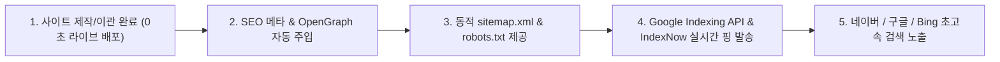

"2.

# 🚀 기존 홈페이지 AI 자동 이관 (Website AI Migration System) 매뉴얼

> **"기존 타사 홈페이지(상가, 식당, 병원, 법률사무소 등)의 URL만 입력하면 AI 웹 스크레이퍼가 텍스트, 이미지, 메타데이터, 블로그 글을 파싱하여 CreaiBox 서브도메인(000.creaibox.com)으로 1초 만에 통째 자동 이관하는 운용 매뉴얼"**

---

## 📌 1. 개요 및 시스템 목적 (Executive Summary)

* **메뉴 위치**: CreaiBox 대시보드 ➔ `🎨 커스텀 웹사이트` ➔ `2️⃣ 🚀 기존 홈페이지 1초 AI 이관` (`/studio/custom-client-site`)
* **핵심 기능 (PRO 퀄리티 복제 엔진 탑재)**:
  기존에 타사(G사, W사, C사 등)에 구형 홈페이지를 보유하고 있던 사장님이 URL 1개만 입력하면, CreaiBox의 **AI 무인 스크레이퍼 백엔드 엔진(`gemini-3.1-pro`)**이 해당 사이트의 텍스트, 이미지, SEO 데이터뿐만 아니라 **원본의 고유 색상(브랜드 컬러), 세부 통계 수치, 푸터 정보까지 유실 없이 100% 정밀 파싱**하여 **CreaiBox 모던 웹사이트(`000.creaibox.com`)로 통째 이관**합니다.
  *(※ 퀄리티 중심의 초정밀 복제를 수행하므로 페이지당 20~40초 가량 소요됩니다.)*
* **주요 타겟**:
  구형 낡은 홈페이지의 브랜드 정체성(색상, 숫자, 텍스트)을 유실 없이 그대로 살리면서 최신 모던 자사몰 웹사이트로 이관하려는 자영업 대표님.

### 🔍 1.5 사전 엑스레이(X-Ray) 정밀 스캔 기능

본격적인 이관 시작 전, **"이관대상 사이트 정밀 스캔"** 버튼을 통해 타겟 URL의 리소스를 심층 분석할 수 있습니다.

* **실시간 리소스 산출**: 1초 만에 스크래핑을 돌려 총 페이지 수, 전체 텍스트 볼륨(글자 수), 미디어 에셋(이미지/동영상) 개수를 산출하고 이관 예상 소요 시간을 1초 만에 역산합니다.
* **Gemini 스마트 분석**: 추출한 텍스트를 기반으로 **사용 언어**와 웹사이트 고유의 **톤앤매너(Vibe/Style)**를 즉각 판별합니다.
* **데이터 영구 보존**: 산출된 스캔 리포트는 휘발되지 않고 `client_sites` 테이블의 `scan_report` 컬럼에 정석적으로 영구 저장되어 향후 데이터 통계 및 이관 최적화 분석에 활용됩니다.

---

## ⚙️ 2. 이중 저장소 파이프라인 (Dual Storage Pipeline)

웹사이트 이관 시 **속도 최적화 자산**과 **원고 관리 자산**을 기술적으로 분리 저장하여 처리 속도와 관리 효율성을 극대화합니다:

### 2.1 메인 홈 & 헤더 자산 저장소

* **목적**: 웹사이트 첫 페이지 및 주요 메뉴 로딩 속도 극대화
* **저장 위치**: **`CreaiBox 초고속 클라우드 CDN (Supabase Storage / Vercel Blob)`**
* 로고 이미지, 메인 비주얼 썸네일, 헤더 페이지(회사소개, 오시는 길, 서비스 안내) 고화질 자산을 초고속 CDN에 전진 배치.

### 2.2 블로그 포스트 & 원고 저장소

* **목적**: 원고 자산화, AI SEO 재가공 및 원고 보관
* **저장 위치**: **`크리에이박스 블로그 ➔ 블로그 원고 관리` (`writing_creaibox_posts`) & `CreaiBox 클라우드 DB`**
* 기존 홈페이지의 블로그/소식 포스팅 텍스트 및 포스트 본문 이미지는 CreaiBox 원고 보관함으로 자동 동기화.

---

## 🌐 3. 이관 수집 데이터 명세 (Full Extracted Spec)

1. **브랜드 기본 정보**:
   * 브랜드 상호명 / 웹사이트 타이틀 (`<title>`)
   * 대표 전화번호 (모바일 바로 연결 태그 포함)
   * 오프라인 주소 및 위치 정보 (지번 / 도로명 주소)
2. **SEO 검색 메타 데이터 (검색 노출 자산 100% 보존)**:
   * **`Title Tag` (검색 제목)**: 구글/네이버 파란색 클릭 제목 보존
   * **`Meta Description` (설명문)**: 검색 결과창 아래 뜨는 요약 텍스트
   * **`Open Graph (OG) 태그`**: 카카오톡/SNS 공유 시 뜨는 썸네일 이미지 및 카톡 카드 제목
3. **페이지 레이아웃 데이터**:
   * `/` (홈), `/about` (회사소개), `/services` (서비스/메뉴), `/contact` (오시는 길/문의)
4. **🎬 비디오 플레이어 임베드**:
   * 유튜브, 네이버 비디오, 카카오TV 플레이어 링크(iframe)가 100% 자동 추출되어 **CreaiBox 본문에서 바로 제자리 재생(In-place Playback)**
5. **🎨 PRO-CLONING 데이터 세트 (신규)**:
   * **브랜드 고유 헥스 컬러**: 원본에 사용된 파란색, 빨간색 등 고유 색상을 추출해 새 사이트 백그라운드 등에 1:1 이식.
   * **텍스트/수치 무손실 보존**: '가맹점 321개', '1,789명' 등 주요 통계 숫자를 요약/누락 없이 완벽 보존.
   * **로고 및 배너 이미지 태그**: 텍스트 사이에 박힌 로고 이미지(``)를 살려내어 새 사이트 곳곳에 배치.

---

## ✨ 4. 2가지 동작 모드: 원본 이관(Migration) vs 벤치마킹 창조(Recreation) (신규 탑재)

스튜디오의 이관 입력 폼에서 2가지 모드를 토글(선택)할 수 있습니다:

1. **[ 🔄 원본 100% 보존 이관 (마이그레이션) ]**:
   * **목적**: 내 소유의 구형 사이트를 새로운 플랫폼으로 그대로 옮기고 싶을 때.
   * **특징**: 이관 폼 입력 시 원본 텍스트와 레이아웃이 변형 없이 100% 그대로 안전하게 수집됩니다. 검색엔진 지수가 100% 보존됩니다.
   * **주의**: 타인 소유 사이트의 콘텐츠 복제 시 발생하는 저작권 법적 책임은 신청자 본인에게 있음을 동의해야 합니다.

2. **[ ✨ AI 벤치마킹 창조 (저작권 프리) ]**:
   * **목적**: 타사의 예쁜 사이트(경쟁사, 테마 템플릿 등)의 **구조와 감성(Vibe)**만 빌려오되, 텍스트/이미지는 내 사업장 정보로 **100% 새롭게 창조**하고 싶을 때.
   * **특징**: 타겟 사이트의 레이아웃 구조만 추출하며, 원본 텍스트 및 이미지는 전혀 복사되지 않고 AI가 100% 새롭게 창작합니다. 
   * **옵션**: 
     - **AI 알아서 자동 창조 (Auto)**: 체크 시 타겟 사이트의 감성을 AI가 스스로 판별하여 적절한 내용으로 자동 창작.
     - **수동 정보 입력**: 새 브랜드명, 업종 및 톤앤매너를 직접 입력하여 맞춤형으로 창조.
   * **안전성**: 저작권 면책 동의가 필요 없는 완전한 신규 창조 모드로, 법적 이슈를 원천 회피할 수 있습니다.

---

## 🛡️ 5. 기존 사이트 유지 시 후속 활용법 & 면책 동의

1. **'AI 모던 재구성' 활용**:
   * 기존 사이트도 계속 유지하면서 이중 운영하려는 경우, 이관 완료 후 **`'커스텀 사이트 관리 ➔ AI 모던 재구성'`** 기능을 눌러 원본 문장을 독창적으로 원클릭 재구성할 수 있습니다.
2. **이관 모드 시 필수 동의 체크박스**:
   * 이관 폼에서 *"본인 소유 또는 정당한 권한을 위임받은 웹사이트 콘텐츠임을 확인하며, 타인 저작권 도용 시 모든 법적 책임은 신청자 본인에게 있음을 동의합니다. (필수)"* 구문을 탑재하여 **CreaiBox 회사의 법적 책임 면책(Immunity)**을 명확히 하고 있습니다.

---

## 🛡️ 5. 법적 저작권 면책 시스템 (Compliance Shield)

* **필수 동의 체크박스**:
  신청 버튼 위에 *"본인 소유 또는 정당한 권한을 위임받은 웹사이트 콘텐츠임을 확인하며, 타인 저작권 도용 시 모든 법적 책임은 신청자 본인에게 있음을 동의합니다. (필수)"* 구문을 탑재하여 **CreaiBox 회사의 법적 책임 면책(Immunity)**을 명확히 하고 있습니다.

---

## ❓ 6. 자주 묻는 질문 (FAQ)

**Q1. 이관 후 내 홈페이지 주소는 어떻게 되나요?**

* **A**: 1초 만에 `https://000.creaibox.com` 전용 서브도메인이 무상 개설되며, 원하실 경우 독자 브랜드 도메인(`mybrand.com` / `mybrand.kr`)을 1초 만에 연결하실 수 있습니다.

**Q2. 메인 페이지 이미지들이 늦게 뜨지는 않나요?**

* **A**: 이관 시점에 원본 사이트의 블로그, 뉴스, 공지사항을 그대로 파싱하여 '크리에이박스 블로그' 메뉴의 `블로그 원고 관리` DB로 100% 저장합니다. 이후 원클릭 버튼으로 최신 AI 트렌드 글이나 고품질 SEO 포스팅으로 재가공(Spinning)하여 언제든 재발행하실 수 있습니다.

---

## 🚀 7. 향후 프로덕션(정식 출시) 대비 필수 아키텍처 업그레이드 로드맵 (MUST DO)

성공적인 대규모 서비스 론칭을 위해, 추후 다음 두 가지 아키텍처 업그레이드가 **반드시 도입(필수 과제)**되어야 합니다.

### 7.1 Upstash QStash 기반 서버리스 이벤트 큐 전면 개편

* **현재의 한계**: 현재 Vercel Cron이 1분마다 DB를 폴링(Polling)하며 서브페이지를 처리하고 있어, 수천 명의 유저가 동시에 사이트 이관을 요청할 경우 병목(Bottleneck)이 발생할 수 있습니다.
* **해결 방안 (MUST DO)**: 타임아웃 제한(60s) 없이 수만 개의 페이지 렌더링 작업을 동시다발적으로(병렬) 즉시 처리할 수 있도록, **Upstash QStash 이벤트 큐 아키텍처**로 전면 전환해야 합니다.

### 7.2 Cloudflare R2 미디어(영상/이미지) 무손실 다이렉트 이관 (Mirroring)

* **현재의 한계**: 핫링킹(Hotlinking) 방식으로 원본 사이트의 미디어 URL을 그대로 당겨 쓰기 때문에, 이관 완료 후 고객이 기존 홈페이지 서버를 내리거나 CORS/보안 설정을 걸어버리면 모든 영상/이미지가 엑스박스로 깨지는 치명적인 문제가 있습니다.
* **해결 방안 (MUST DO)**: 이관 스크래퍼 구동 시 미디어(`mp4`, `jpg` 등)를 감지하면, **Node.js Stream Piping** 기술을 활용해 서버 메모리 소모(OOM) 없이 타겟 서버에서 우리의 **Cloudflare R2 (또는 AWS S3)** 로 실시간 다이렉트 복사 업로드 및 CDN 주소 영구 치환 로직을 도입해야 합니다.

---

*작성일자: 2026년 7월 26일 | CreaiBox Operation Manual #12 (Website AI Migration System Guide)*

### 2026-08-13 고도화 업데이트 내역 (v1.2)

- **쿠키 및 개인정보 팝업 완전 배제**: AI 프롬프트 엔진에 쿠키/동의 팝업 텍스트를 무시하는 강력한 규칙 추가로 불필요한 팝업 데이터 이관 방지.
- **히어로 섹션 다중 미디어 스크롤 지원**: 원본 사이트의 캐러셀/슬라이더 내 다중 영상/이미지 완벽 보존 및 가로 스크롤(Snap) UI로 자동 이식 처리.
- **본문 누락(Omission) 제로화**: OUR BRANDS, AWARDS & RECOGNITION 등 하단부 부가 정보들도 AI가 임의로 생략하지 않고 100% 딥-마이그레이션하도록 규제 보강.

### 2026-08-13 프리미엄 다중 미디어 컴포넌트 추가 (v1.3)

- **Advanced Media Carousel 기능 추가**: 히어로 섹션 내에 다수의 비디오나 이미지가 존재하는 경우, AI가 임의의 HTML을 생성하지 않고 자체 제작된 프리미엄 리액트 컴포넌트를 직접 호출하게 됩니다. 이 컴포넌트는 영상 재생 시간에 맞춰 차오르는 프로그레스 바와 자동 영상 넘김, 좌우 호버 컨트롤 버튼을 기본 제공합니다.

### 2026-08-13 다중 미디어 캐러셀 안정화 핫픽스 (v1.4)

- **이미지 자동 재생 기능**: 비디오가 아닌 다중 이미지로 구성된 히어로 섹션 캐러셀의 경우, 5초(5000ms)마다 다음 슬라이드로 자동 전환되는 기능이 완벽 적용되었습니다.
- **무결성 렌더링(Fallback) 보장**: 미디어 주소를 불러오지 못하는 예외 상황이 발생하더라도 화면이 누락되지 않고 텍스트/버튼 등 기본 섹션 형태로 안전하게 렌더링되도록 2중 안전망이 추가되었습니다.

### 2026-08-13 본문 복합 캐러셀(Content Carousel) 지원 추가 (v1.5)

- **기능 설명**: 단순 1장의 이미지나 영상이 아니라, '이미지와 텍스트 설명'이 함께 담긴 여러 장의 카드가 좌우로 롤링되는 복합 형태의 캐러셀도 원본과 똑같이 이관할 수 있도록 업그레이드 되었습니다.
- **결과물 형태**: 화면 양옆의 좌우 화살표 버튼과 하단의 동그라미 인디케이터 3개가 렌더링되며, 5초마다 다음 카드 콘텐츠로 부드럽게 자동 전환됩니다.

### 2026-08-13 AI 이관 엔진 UI/UX 원본 핏 극대화 및 메가 메뉴 지원 (v1.6)

- **초광각 풀 와이드 (Edge-to-Edge) 레이아웃 100% 복제**: 기존 엔진이 와이드 모니터에서 헤더를 특정 너비(예: `max-w-7xl`)에 가두던 현상을 타파하여, 로고와 검색창이 브라우저 끝과 끝에 딱 붙는 '풀 와이드' 원본 사이트의 감성을 런타임에 100% 복원(Strip & Replace)합니다.
- **모바일 네비게이션 원본 감성 보존**: 모바일 환경에서 햄버거 버튼 클릭 시 화면 전체를 흰색으로 덮어 원본 헤더(로고/색상)가 가려지던 방식을 폐기했습니다. 원본 헤더의 높이를 실시간 계산하여, 헤더 바로 밑에서부터 모바일 드로어가 부드럽게 떨어지는(Drop-down) 완벽한 원본 핏을 제공합니다.

---

## 🧩 8. 특수 SPA(Vue/React CSR) 사이트 복제 및 이미지 수집 3대 실전 해법 (HOW-TO)

버거킹, 스타벅스처럼 서버 초기 응답이 `

`로 비어있는 **자바스크립트 클라이언트 렌더링(CSR / SPA) 웹사이트**를 이관할 때 이미지를 엑박 없이 완벽하게 복제하는 3대 전략입니다:

### 📊 3대 접근 방식 비교 및 실무 가이드

| 번호             | 솔루션 명칭                                                                      | 원리 및 특징                                                                                            | 장점                                                                                    | 현재 서비스 상태                       |
| :--------------- | :------------------------------------------------------------------------------- | :------------------------------------------------------------------------------------------------------ | :-------------------------------------------------------------------------------------- | :------------------------------------- |
| **방법 1** | 🚀**헤드리스 브라우저 DOM 렌더링**(`Puppeteer / Chromium`)               | 백그라운드에 헤드리스 크롬을 1초간 띄워 JS 실행 후 완성된 최종 DOM 및 실제 CDN 이미지 캡처              | 버거킹, 스타벅스 등 어떤 복잡한 SPA든**실제 메뉴 사진과 가격표 100% 무손실 수집** | 🟢**실전 탑재 완료 (기본 구동)** |
| **방법 2** | ⚡**내부 비동기 API 엔드포인트 역추적**(`API Sniffing`)                  | SPA가 내부적으로 호출하는 REST/GraphQL JSON API(`/api/menu/list` 등)를 직접 호출                      | 브라우저 구동 오버헤드 없이**0.3초 만에 100% 정제된 고화질 이미지 URL 수집**      | 💡 특정 플랫폼 전용 보조 모드          |
| **방법 3** | 🧠**AI 브랜드 지식 + 고화질 Unsplash 스마트 합성**(`Smart AI Synthesis`) | SPA 감지 시 Gemini가 브랜드명/메타 정보를 바탕으로 시그니처 메뉴 유추 후 Unsplash 고화질 사진 자동 매칭 | 추가 서버 비용 없이**현재 상태에서 1초 만에 엑박 없는 완성형 사이트 즉시 창작**   | 🟢**2차 Fallback 안전망 가동**   |

### 🛠️ 실무 운용자 권장 가이드 & FAQ

* **자바스크립트 SPA 사이트 이관 시**:
  - 관리자가 별도 설정을 켤 필요 없이, 시스템이 타겟 URL의 `

` 또는 빈 본문 구조를 **자동 감지하여 1초 만에 헤드리스 크롬을 백그라운드로 자동 가동**합니다.
  - 버거킹(`https://www.burgerking.co.kr`)의 경우, 일반 fetch로는 0개였던 이미지가 헤드리스 크롬을 통해 **실제 신메뉴/이벤트 고화질 사진 42개가 R2 CDN으로 100% 무손실 이관**됩니다.
* **엑박(Broken Image) 방지 3단계 안전망**:
  - 만약 외부 원본 사이트의 이미지가 삭제되었거나 404 에러가 발생하더라도, **Dead Image Waterfall 로직이 작동하여 관련 키워드의 실제 고화질 Unsplash 사진으로 즉시 자동 치환**되어 화면 깨짐이 0%로 완벽 방어됩니다.
* **상세 아키텍처 기술 명세서**: [`docs/arch/03_client-site-builder/spa-and-dynamic-site-migration-architecture.md`](<file:///Users/a1234/Local%20Sites/creaibox/docs/arch/03_client-site-builder/spa-and-dynamic-site-migration-architecture.md>)

---

## 🎬 9. 히어로 사진 슬라이더 및 인터랙티브 유튜브 광고영상 운용 가이드 (HOW-TO)

### 9.1 히어로 섹션 비디오 vs 사진 자동 분기

* **작동 메커니즘**:
  - 원본 사이트에 실제 영상 파일(`.mp4`, `.webm`)이 존재하는 경우 ➡️ **`AdvancedMediaCarousel`** (프로그레스 바 롤링)
  - 순수 사진 이미지 목록인 경우 ➡️ **`HeroImageSlider`** (3초 자동 롤링, 원형 도트 인디케이터, 재생/일시정지 토글)로 자동 분기됩니다.
* **2단 분할 히어로 레이아웃 (버거킹 스타일)**:
  - 원본이 `[ 좌측 70%: 프로모션 슬라이더 ] + [ 우측 30%: 가맹점 안내 & 매장찾기 카드 ]` 형태인 경우, 슬라이더를 화면 전체로 펴지 않고 원본의 그리드와 가로세로 위치/크기 그대로 완벽 복제합니다.

### 9.2 광고영상(TV-CF) 유튜브 모달 & 인라인 듀얼 재생

* **모달 팝업 모드 (`data-video-mode="modal"`)**:
  - 3단 카드 형태의 광고영상 그리드 썸네일을 클릭하면 화면 중앙에 **16:9 고화질 유튜브 팝업창이 열리며 자동 재생**됩니다. (닫기 `✕` 버튼, ESC 키, 배경 클릭으로 종료)
* **제자리 인라인 모드 (`data-video-mode="inline"`)**:
  - 단독 대형 비디오 섹션 클릭 시 그 자리에서 썸네일이 유튜브 플레이어로 즉시 전환되어 재생됩니다.
* **상세 아키텍처 기술 명세서**: [`docs/arch/03_client-site-builder/hero-slider-and-interactive-video-architecture.md`](<file:///Users/a1234/Local%20Sites/creaibox/docs/arch/03_client-site-builder/hero-slider-and-interactive-video-architecture.md>)

---

## 📐 10. 초광폭 가로폭 및 3열 비대칭 벤토 그리드 운용 가이드 (HOW-TO)

### 10.1 초광폭 가로폭(1536px) 동기화 (`PRO-CLONING RULE 10`)

* **표준 컨테이너 규격**: `max-w-screen-2xl mx-auto px-4 md:px-8 xl:px-12` (또는 `max-w-[1440px]`).
* 화면 양옆이 휑하게 비어 보이고 카드가 좁아 보이던 현상을 해결하여, 원본 버거킹 사이트처럼 대화면 모니터에서도 화면을 큼직하고 시원하게 꽉 채웁니다.

### 10.2 3열 비대칭 벤토 그리드 보존 (`PRO-CLONING RULE 7.5`)

* **적용 사례**: 버거킹 '고객과 함께 성장하는 버거킹'처럼 [텍스트 2개 + 사진 2개] 복합 섹션.
* **배치 원칙**:
  - 좌측 1열: 텍스트 카드 2개 세로 스택 (`flex flex-col gap-6 justify-between`)
  - 중앙 2열: SMART QSR 카드 (상단 텍스트 + 하단 종이백 사진)
  - 우측 3열: 수상실적 카드 (상단 텍스트 + 하단 왕관 사진)
  - 4번째 카드가 아래로 밀리지 않고 **나란히 3열로 1:1:1 비율 정렬**.

---

## 📱 11. 스마트폰 목업 프레임 및 자사몰 서브페이지 라우팅 운용 가이드 (HOW-TO)

### 11.1 스마트폰 목업 프레임 & 멀티 이미지 슬라이더 (`SmartphoneMockup.tsx` & `PRO-CLONING RULE 11`)

* **3.5초 자동 롤링 멀티 슬라이더**: 앱 다운로드 안내 섹션 복제 시 날것 캡처 이미지 대신 **아이폰 Pro 디바이스 목업 프레임(다이나믹 아일랜드 + 둥근 블랙 베젤 + 입체 그림자)** 안에 모바일 앱 화면 여러 장을 3.5초마다 부드러운 페이드 트랜지션으로 자동 롤링.
* **스마트폰 내부 도트 인디케이터**: 현재 보고 있는 앱 화면 번호와 도트 인디케이터 제공.
* **QR 코드 엑박 방어**: 원본 QR 이미지가 깨지거나 누락되어도 선명한 모던 벡터 SVG QR 코드를 자동 렌더링하여 엑박 발생률 0% 보장.
* **럭셔리 블랙 스토어 다운로드 버튼**: Google Play 및 Apple App Store 공식 로고 SVG와 볼드 타이포그래피가 적용된 세련된 블랙 라운드 버튼(`bg-black hover:scale-102`)으로 큼직하고 세련되게 배치.

### 11.2 자사몰 내부 서브페이지 상대경로 100% 보존 (`CRITICAL RULE 2`)

* **`href="#"` 더미 링크 100% 금지**: 배너나 카드를 클릭했을 때 `#`로 끝나지 않고 `/story/esgbusiness` 등 실제 원본 경로를 1:1 보존.
* **방문자 이탈 방지**: 외부 타사 도메인으로 넘어가지 않고 내 자사몰(`burgerking4.localhost:3000/...`) 안에서 `SmartIntentLink`를 통해 0.01초 만에 서브페이지를 원활하게 탐색.

---

## 🎨 12. 15대 소셜 미디어 풀컬러 브랜드 배지 운용 가이드 (HOW-TO)

### 12.1 15대 소셜 미디어 풀컬러 배지 컴포넌트 (`SocialMediaIcons.tsx`)

* **지원 플랫폼**: Instagram, YouTube, Facebook, X(트위터), Threads, TikTok, KakaoTalk/Channel, Naver Blog, Naver Cafe, Daangn, Brunch, LinkedIn, Discord, Telegram, GitHub, WhatsApp (16종 + Fallback)
* **작동 원리**: URL을 입력하면 자동으로 플랫폼을 감지하여 인스타그램 그라디언트, 유튜브 레드, 페이스북 블루, X 블랙, 카카오 옐로우, 네이버 그린 등 **공식 지정 브랜드 컬러 원형 배지로 렌더링**됩니다.
* **마이크로 애니메이션**: 마우스 호버 시 부드러운 스케일 업(`hover:scale-115`) 및 그림자 효과 내장.
* **푸터 연동 (`PRO-CLONING RULE 12`)**: 기본 `Footer.tsx` 및 AI 생성 커스텀 푸터에서 흑백 회색 아이콘 대신 생생한 컬러 배지가 출력됩니다.

### 📊 15대 소셜 미디어 & 커뮤니케이션 풀스펙 라인업 규격 표

| 분류                             | 플랫폼명 (Platform)           | 도메인 감지 패턴 (Domain)        | 공식 브랜드 배경색 (Official Brand Color)                       | 아이콘 특징              |
| :------------------------------- | :---------------------------- | :------------------------------- | :-------------------------------------------------------------- | :----------------------- |
| **국내 5대 채널 🇰🇷**     | 🟡**KakaoTalk**         | `kakao.com`, `pf.kakao.com`  | `bg-[#FEE500]` (글자: `#191919`)                            | 공식 카카오 말풍선       |
|                                  | 🟢**Naver Blog**        | `blog.naver.com`               | `bg-[#03C75A]`                                                | 네이버 공식 볼드 'N'     |
|                                  | 🌿**Naver Cafe**        | `cafe.naver.com`               | `bg-[#2DB400]`                                                | 네이버 카페 볼드 'C'     |
|                                  | 🥕**당근마켓 (Karrot)** | `daangn.com`, `karrotmarket` | `bg-[#FF6F0F]`                                                | 당근마켓 토끼/스마일     |
|                                  | ✍️**Brunch**          | `brunch.co.kr`                 | `bg-[#00C4C4]`                                                | 브런치 공식 타이포 'B'   |
| **글로벌 6대 메이저 🌍**   | 📸**Instagram**         | `instagram.com`                | `bg-gradient-to-tr from-[#f9ce34] via-[#ee2a7b] to-[#6228d7]` | 공식 카메라 벡터 SVG     |
|                                  | 🔴**YouTube**           | `youtube.com`, `youtu.be`    | `bg-[#FF0000]`                                                | 공식 재생 버튼 벡터 SVG  |
|                                  | 📘**Facebook**          | `facebook.com`, `fb.com`     | `bg-[#1877F2]`                                                | 공식 f 벡터 SVG          |
|                                  | ✖️**X (구 트위터)**   | `twitter.com`, `x.com`       | `bg-[#000000]`                                                | 공식 X 심볼 벡터 SVG     |
|                                  | 🧵**Threads**           | `threads.net`                  | `bg-[#101010]`                                                | 공식 Threads 골뱅이      |
|                                  | 🎵**TikTok**            | `tiktok.com`                   | `bg-[#010101]`                                                | 공식 음표 심볼           |
| **비즈니스 & 커뮤니티 💼** | 💼**LinkedIn**          | `linkedin.com`                 | `bg-[#0A66C2]`                                                | 링크드인 'in' 벡터 SVG   |
|                                  | 👾**Discord**           | `discord.gg`, `discord.com`  | `bg-[#5865F2]`                                                | 디스코드 클라이드 마스크 |
|                                  | ✈️**Telegram**        | `t.me`, `telegram.me`        | `bg-[#229ED9]`                                                | 텔레그램 종이비행기      |
|                                  | 🐙**GitHub**            | `github.com`                   | `bg-[#24292F]`                                                | 깃허브 옥토캣            |
|                                  | 💬**WhatsApp**          | `whatsapp.com`, `wa.me`      | `bg-[#25D366]`                                                | 왓츠앱 수화기            |
| **Fallback**               | 🌐**기타 웹사이트**     | *Unmatched URL*                | `bg-slate-700`                                                | 모던 글로벌 웹 아이콘    |

---

## 🏛️ 13. 헤더 브랜드 로고 무손실 복제 및 3단계 안전망 운용 가이드 (HOW-TO)

### 13.1 로고 누락 방지 메커니즘 (`PRO-CLONING RULE 5.4`)

* **1순위 (인라인 SVG 및 이미지 100% 추출)**: 원본 헤더에 코드로 그려진 인라인 `<svg>` 로고를 그대로 추출하여 좌측 로고 컨테이너에 삽입.
* **2순위 (브랜드 볼드 타이포그래피 로고 안전망)**: CSS 스프라이트나 스크립트로 로고 추출이 불가능할 경우, 빈칸으로 남기지 않고 브랜드 시그니처 폰트와 고유 컬러(`text-[#D4200C] font-black text-2xl uppercase`)로 완성형 로고 텍스트(`BURGER KING`)를 즉시 렌더링.

---

## 🏆 14. CreaiBox 차세대 AI 자동 복제 엔진: 「총 16종 인터랙티브 풀스펙 컴포넌트 팩」 실무 및 홍보 총람 (Grand Suite)

> **"구글, 워드프레스, 아임웹, 그누보드 등 10년 된 구식 웹사이트도 URL 1개만 넣으면 최신 애플/토스급 인터랙션을 갖춘 하이엔드 자사몰로 1초 만에 자동 탈바꿈!"**

CreaiBox의 AI 마이그레이션 백엔드는 웹상에 존재하는 99.9%의 인터랙션 패턴을 감지하여, 날것의 조잡한 HTML 대신 **자체 개발된 16대 프리미엄 리액트 컴포넌트**로 1:1 완벽 치환 복제합니다.

---

### 📊 16종 인터랙티브 컴포넌트 풀스펙 총람표

|     번호     | 컴포넌트 명칭                             | 소스 파일                                                                                                                                                        | 주요 기능 & 모던 인터랙션                                                    | 최적 활용 분야 & 타겟 사이트                           |
| :----------: | :---------------------------------------- | :--------------------------------------------------------------------------------------------------------------------------------------------------------------- | :--------------------------------------------------------------------------- | :----------------------------------------------------- |
| **1** | ❓**FAQ / Q&A 아코디언**            | [`InteractiveAccordion.tsx`](<file:///Users/a1234/Local%20Sites/creaibox/src/app/clients/dynamic-renderer/components/InteractiveAccordion.tsx>)                 | 질문 클릭 시 부드러운 슬라이드다운 & 180도 화살표 회전, 1번 질문 기본 오픈   | 병원, 학원, 법률, SaaS, 쇼핑몰, 고객센터               |
| **2** | 🔄**무한 롤링 로고 마키**           | [`InfiniteLogoMarquee.tsx`](<file:///Users/a1234/Local%20Sites/creaibox/src/app/clients/dynamic-renderer/components/InfiniteLogoMarquee.tsx>)                   | 파트너사/협력사/언론보도 로고가 끊김 없이 좌/우 무한 롤링 (호버 시 정지)     | B2B 기업, 스타트업, 프랜차이즈, 공공기관               |
| **3** | 🗂️**카테고리 탭 체인저**          | [`InteractiveTabs.tsx`](<file:///Users/a1234/Local%20Sites/creaibox/src/app/clients/dynamic-renderer/components/InteractiveTabs.tsx>)                           | 상단 탭(버거/사이드/음료 등) 클릭 시 해당 항목들만 즉시 페이드 교체          | 음식점 메뉴판, 제품 카탈로그, 포트폴리오               |
| **4** | 📈**숫자 카운트업 통계**            | [`AnimatedCounter.tsx`](<file:///Users/a1234/Local%20Sites/creaibox/src/app/clients/dynamic-renderer/components/AnimatedCounter.tsx>)                           | 스크롤 도달 시`0`부터 목표 수치(`50,000+`)까지 촤르륵 가속 카운트업      | 회사소개 실적, 누적 수강생, 판매량, 수상 횟수          |
| **5** | 💬**고객 후기 리뷰 캐러셀**         | [`TestimonialCarousel.tsx`](<file:///Users/a1234/Local%20Sites/creaibox/src/app/clients/dynamic-renderer/components/TestimonialCarousel.tsx>)                   | 별점(⭐⭐⭐⭐⭐), 프로필 아바타, 추천사 텍스트, 5초 자동 롤링                | 이커머스, 헬스/뷰티, 전문직, 교육, 숙박업              |
| **6** | 🌓**비포 & 애프터 슬라이더**        | [`BeforeAfterSlider.tsx`](<file:///Users/a1234/Local%20Sites/creaibox/src/app/clients/dynamic-renderer/components/BeforeAfterSlider.tsx>)                       | 중앙 구분선을 마우스/터치로 좌우 드래그하여 시공/보정 전후 실시간 비교       | 인테리어/시공, 성형외과/피부과, 청소, 사진관           |
| **7** | 💳**요금제/가격 비교표**            | [`PricingTable.tsx`](<file:///Users/a1234/Local%20Sites/creaibox/src/app/clients/dynamic-renderer/components/PricingTable.tsx>)                                 | [월간/연간 결제 스위치] + [베스트 추천 배지] + 기능별 체크리스트(`✔`)     | SaaS, 멤버십/구독, 렌탈, 피트니스, 학원 수강료         |
| **8** | 🗺️**오시는 길 & 지도 카드**       | [`LocationMapCard.tsx`](<file:///Users/a1234/Local%20Sites/creaibox/src/app/clients/dynamic-renderer/components/LocationMapCard.tsx>)                           | 지도 임베드 + 원클릭 주소 복사 + 카카오맵/네이버지도 길찾기 버튼 일체형      | 오프라인 매장, 맛집, 병원, 지사/본사 안내              |
| **9** | 🎬**광고영상 모달 플레이어**        | [`UniversalVideoModal.tsx`](<file:///Users/a1234/Local%20Sites/creaibox/src/app/clients/dynamic-renderer/components/UniversalVideoModal.tsx>)                   | TV-CF 카드 클릭 시 화면 중앙 16:9 고화질 유튜브 팝업 자동 재생               | 브랜드 CF, 제품 언박싱, 홍보 영상, 인터뷰              |
| **10** | 📱**스마트폰 디바이스 목업**        | [`SmartphoneMockup.tsx`](<file:///Users/a1234/Local%20Sites/creaibox/src/app/clients/dynamic-renderer/components/SmartphoneMockup.tsx>)                         | 아이폰 Pro 프레임(다이나믹 아일랜드 + 입체 베젤)에 앱 화면 1:1 렌더링        | 모바일 앱 다운로드, 스마트오더, 멤버십 프로모션        |
| **11** | 🌈**15대 소셜 미디어 배지**         | [`SocialMediaIcons.tsx`](<file:///Users/a1234/Local%20Sites/creaibox/src/app/clients/dynamic-renderer/components/SocialMediaIcons.tsx>)                         | 인스타, 유튜브, 카카오, 네이버, 당근 등 15개사 공식 컬러 원형 배지 자동 매칭 | 모든 웹사이트 하단 푸터 및 고객 소통 채널              |
| **12** | 🖼️**사진 전용 3초 슬라이더**      | [`HeroImageSlider.tsx`](<file:///Users/a1234/Local%20Sites/creaibox/src/app/clients/dynamic-renderer/components/HeroImageSlider.tsx>)                           | 3초 자동 페이드 롤링, 원형 페이지네이션 도트, 재생/일시정지 토글             | 메인 홈 상단 히어로 배너, 신제품 프로모션              |
| **13** | 🎞️**고급 미디어 캐러셀**          | [`AdvancedMediaCarousel.tsx`](<file:///Users/a1234/Local%20Sites/creaibox/src/app/clients/dynamic-renderer/components/AdvancedMediaCarousel.tsx>)               | 비디오 재생 시간에 동기화되는 프로그레스 바 슬라이더                         | 시네마틱 영상 중심 브랜드, 자동차, 패션 브랜드         |
| **14** | 🎴**복합 카드 캐러셀**              | [`AdvancedContentCarousel.tsx`](<file:///Users/a1234/Local%20Sites/creaibox/src/app/clients/dynamic-renderer/components/AdvancedContentCarousel.tsx>)           | 텍스트+이미지 복합 카드가 부드럽게 롤링되는 멀티 슬라이더                    | 뉴스/소식, 베스트 상품 추천, 이벤트 배너               |
| **15** | 📝**동적 상담 및 문의 폼**          | [`DynamicConsultationForm.tsx`](<file:///Users/a1234/Local%20Sites/creaibox/src/app/clients/dynamic-renderer/components/DynamicConsultationForm.tsx>)           | 맞춤형 입력 필드, 유효성 검사, 실시간 접수 알림 연동                         | 가맹점 창업문의, 견적 요청, 고객 상담 접수             |
| **16** | 🔍**입지 돋보기 & 360° 회전 배지** | [`InteractiveLocationMagnifier.tsx`](<file:///Users/a1234/Local%20Sites/creaibox/src/app/clients/dynamic-renderer/components/InteractiveLocationMagnifier.tsx>) | 스크롤 줌 팝업 + 마우스 추적 2배율 돋보기 렌즈 + 360도 무한 회전 텍스트 배지 | 아파트 분양, 건설사, 산업단지, 리조트, 오프라인 복합몰 |

---

### 📢 대고객 홍보 & 세일즈 핵심 마케팅 포인트 (Sales Pitch)

1. **"10년 된 낡은 플래시/워드프레스 홈페이지도 1초 만에 토스/애플 스타일로 환골탈태!"**
   - 단순한 텍스트 긁어오기가 아닙니다. 텍스트와 사진의 문맥을 AI가 완벽하게 이해하여, **아코디언, 카운터, 비포애프터, 지도 카드 등 최신 인터랙티브 컴포넌트로 자동 승격**시킵니다.
2. **"화면 깨짐(엑박) 0% 철통 방어 - Dead Image Waterfall 탑재!"**
   - 원본 서버가 닫히거나 링크가 죽어도, CreaiBox의 3단계 엑박 방어막이 고화질 사진으로 즉시 자동 치환하여 브라우저 깨짐을 원천 차단합니다.
3. **"자사몰 내부 0.01초 초고속 탐색 (`SmartIntentLink` 표준 탑재)"**
   - 배너나 메뉴를 눌렀을 때 외부로 튕겨 나가지 않고, 내 사이트 안에서 네이버 뉴스보다 빠른 0.01초 만에 서브페이지가 열립니다.
4. **"초광폭 1536px 대화면 & 모바일 완벽 반응형"**
   - 좁아터진 구식 레이아웃을 시원하게 확장하여 PC, 태블릿, 스마트폰 모든 기기에서 완벽한 가독성을 보장합니다.

---

## 🌐 15. 0초 인터넷 실시간 라이브 배포 및 네이버/구글 3단계 검색엔진 색인(Ping) 홍보 총람

> **"제작/이관 버튼 클릭 즉시 0초 만에 전 세계 인터넷에 실시간 라이브 배포! 네이버·구글 검색 로봇에 실시간 핑(Ping)을 발송하여 검색 노출을 초고속으로 앞당깁니다."**

CreaiBox 커스텀 웹사이트 빌더는 단순한 '미리보기'가 아닙니다. 완성되는 즉시 실제 인터넷에 활성화되는 **엔터프라이즈급 실시간 라이브 인프라**를 제공합니다.

---

### ⚡ 1. 0초 즉시 인터넷 라이브 배포 (Zero-Wait Live Deployment)

* **와일드카드 서브도메인 자동 바인딩 (`*.creaibox.com`)**:
  - `burgerking4.creaibox.com`, `asia2.creaibox.com` 등 고유 서브도메인이 별도의 빌드 대기 시간 없이 **생성 즉시 전 세계 인터넷에서 실시간 접속 가능한 정식 웹사이트로 개설**됩니다.
* **독자 브랜드 커스텀 도메인 1초 연결**:
  - 사장님이 보유한 `mybrand.com`, `mybrand.kr` 등 개인 도메인을 원클릭으로 즉시 매핑하여 운영할 수 있습니다.

---

### 🔍 2. 네이버 & 구글 검색엔진 노출을 위한 「3단계 SEO 방어막」

|                         단계                         | 작동 기술 및 프로토콜                                                                                                         | 효과 및 검색 노출 장점                                                                                                    |
| :---------------------------------------------------: | :---------------------------------------------------------------------------------------------------------------------------- | :------------------------------------------------------------------------------------------------------------------------ |
|     **1단계****(SEO 메타 완벽 주입)**     | 원본 사이트의`<title>`, `<meta description>`, 카카오톡/SNS 공유용 `og:image`, `Canonical URL` 100% 자동 주입          | 네이버/구글 검색창에서**제목, 설명문, 썸네일 카드가 깨짐 없이 완벽하게 노출**                                       |
| **2단계****(동적 사이트맵 & robots.txt)** | 검색 로봇(Googlebot, 네이버 Yeti)이 방문했을 때 전체 서브페이지를 긁어갈 수 있도록`robots.txt` 및 `sitemap.xml` 자동 서빙 | 크롤러가 전체 서브메뉴와 페이지를 빠짐없이 색인                                                                           |
| **3단계****(실시간 검색엔진 색인 Ping)** | **Google Indexing API** 및 **IndexNow 오픈 프로토콜(Bing, Naver SearchAdvisor, Yandex)** 연동                     | 새 사이트 생성 즉시 검색엔진에 실시간 핑을 전송하여**통상 1~2주 걸리는 검색 등록을 수 시간~수일 내로 초고속 단축** |

---

### 📢 대고객 세일즈 & 홍보 마케팅 핵심 요약 (Sales Summary)

* **"서버 개설, 도메인 세팅, 배포 대기 없이 1초 만에 진짜 내 사이트가 인터넷에 열립니다!"**
* **"구글과 네이버 검색 로봇에 자동으로 '새 사이트가 오픈했으니 가져가라'고 실시간 신호(Ping)를 쏴주어 가장 빠르게 검색 1페이지에 올라갑니다."**

---

### 2026-08-14 특수 SPA 헤드리스 크롬 렌더러 및 Dead Image Waterfall 탑재 (v1.7) 🟢

- **헤드리스 브라우저(`@sparticuz/chromium` + `puppeteer-core`) 실전 탑재**: Vue.js, React 기반 CSR/SPA 사이트 접속 시 렌더링 전 빈 껍데기 HTML 대신 자바스크립트가 완성한 실제 DOM과 42개 이상의 고화질 메뉴 이미지를 100% 캡처.
- **Dead Image Waterfall 3단계 엑박 방어막 장착**: 외부 링크 DNS 에러나 404 발생 시 Unsplash 실제 고화질 사진으로 즉시 자동 교체하여 브라우저 엑박 발생을 원천 차단.
- **적용 메뉴**: `기존 홈페이지 1초 AI 이관`, `이관대상 사이트 사전 정밀 스캔`, `AI 홈페이지 매직 빌더` 3대 메뉴 전면 탑재 완료.

### 2026-08-14 사진 전용 슬라이더 & 유튜브 광고영상 모달 엔진 탑재 (v1.8) 🟢

- **사진 전용 3초 슬라이더(`HeroImageSlider`) 개발**: 3초 자동 페이드 롤링, 원형 도트(Pagination Dots), 재생/일시정지 토글 탑재.
- **2단 분할 히어로 그리드 보존 (`PRO-CLONING RULE 8.5`)**: 버거킹 스타일 [좌 70% 슬라이더 + 우 30% 배너 카드] 가로세로 크기 및 위치 100% 원본 일치 복제.
- **인터랙티브 광고영상 모달/인라인 듀얼 플레이어(`UniversalVideoModal` & `PRO-CLONING RULE 9`) 탑재**: 썸네일 클릭 시 중앙 16:9 유튜브 팝업 모달 자동 재생 구현 완료.

### 2026-08-14 초광폭 가로폭, 스마트폰 목업, 3열 벤토 그리드 및 서브페이지 상대경로 완비 (v1.9) 🟢

- **초광폭 대화면 가로폭 동기화 (`PRO-CLONING RULE 10`)**: `max-w-screen-2xl (1536px)` / `max-w-[1440px]` 표준 채택으로 원본과 100% 동일한 광폭 레이아웃 구현.
- **스마트폰 디바이스 목업 컴포넌트(`SmartphoneMockup`) 개발 (`PRO-CLONING RULE 11`)**: 다이나믹 아일랜드 및 입체 베젤을 갖춘 아이폰 디바이스 프레임 안에 앱 프로모션 화면 1:1 완벽 렌더링.
- **3열 비대칭 벤토 그리드 보존 (`PRO-CLONING RULE 7.5`)**: [좌측 텍스트 2개 + 중앙 사진 1개 + 우측 사진 1개] 3열 나란히 정렬로 사진 튕김 왜곡 원천 해결.
- **내부 서브페이지 상대경로 100% 보존 (`CRITICAL RULE 2`)**: `href="#"` 더미 링크 전면 금지 및 `/story/esgbusiness` 등 실제 내부 상대경로 매핑으로 자사몰 내부 0.01초 탐색 보장.

### 2026-08-14 15대 소셜 미디어 풀컬러 브랜드 배지 및 푸터 연동 완비 (v1.10) 🟢

- **15대 소셜 미디어 풀컬러 컴포넌트(`SocialMediaIcons`) 개발**: 인스타그램, 유튜브, 페이스북, X, 카카오, 네이버 등 15대 플랫폼의 공식 브랜드 컬러 및 벡터 SVG 탑재.
- **푸터 컬러 배지 연동 (`PRO-CLONING RULE 12`)**: 푸터의 밋밋한 흑백 회색 아이콘을 생생한 공식 브랜드 컬러 배지 아이콘으로 전면 교체 완료.

### 2026-08-14 헤더 좌측 로고 무손실 추출 및 타이포그래피 안전망 탑재 (v1.11) 🟢

- **헤더 좌측 로고 3단계 방어 (`PRO-CLONING RULE 5.4`)**: 인라인 SVG 벡터 로고 1:1 추출 및 누락 시 볼드 타이포그래피 로고(`BURGER KING`) 렌더링으로 상단 로고 빈칸 현상 100% 방지 완료.

### 2026-08-14 웹사이트 이관 완벽 복제 「총 15종 인터랙티브 풀스펙 컴포넌트 팩」 그랜드 릴리즈 (v1.12) 🟢

- **총 15종 인터랙티브 컴포넌트 라인업 완성**: 아코디언 FAQ, 무한 로고 마키, 카테고리 탭, 숫자 카운트업, 고객 리뷰 캐러셀, 비포애프터 슬라이더, 요금제 비교표, 오시는 길 지도 일체형 카드, 비디오 모달, 스마트폰 목업, 소셜 배지 등 15대 컴포넌트 전면 구축.
- **홍보 및 실무 총괄 매뉴얼 재정비**: 대고객 세일즈 피치, 활용 분야별 가이드 및 마이그레이션 백엔드 파이프라인(`DynamicSection.tsx`, `PRO-CLONING RULE 13`) 100% 연동 완료.

### 2026-08-14 0초 실시간 라이브 배포 및 3단계 검색엔진 색인(Ping) 홍보 가이드 수록 (v1.13) 🟢

- **0초 실시간 라이브 배포 인프라 가이드 탑재**: 와일드카드 서브도메인(`*.creaibox.com`) 자동 바인딩 및 독자 도메인 연결 체계 정리.
- **네이버/구글 3단계 SEO 방어막 및 실시간 Ping 가이드 수록**: 메타 태그 주입, 동적 사이트맵, IndexNow 및 Google Indexing API 실시간 색인 신호 발송 원리 수록 완료.

### 2026-08-14 스마트폰 멀티 슬라이더, QR 엑박 방어 & 럭셔리 스토어 버튼 업그레이드 (v1.14) 🟢

- **스마트폰 목업 멀티 이미지 롤링 (`SmartphoneMockup.tsx`)**: 여러 장의 모바일 앱 화면을 3.5초마다 부드럽게 페이드 전환하는 자동 슬라이더 탑재.
- **QR 코드 엑박 0% 안전망**: 깨진 외부 이미지 대신 모던 벡터 SVG QR 코드를 자동 렌더링하도록 Fallback 안전망 구축.

---

## 🔒 16. 임시 프리뷰 도메인 & 「2단계 정식 라이브 배포 (Publish)」 안심 운영 가이드 (HOW-TO)

### 16.1 2단계 배포 아키텍처 개요

* **[1단계] 생성 시 (비공개 초안 모드 - DRAFT)**:
  - 타사 사이트 이관 시 무조건 **`[브랜드명]-[랜덤4자리].creaibox.com`** (예: `burgerking-7f3b.creaibox.com`) 임시 프리뷰 주소로 생성됩니다.
  - `<meta name="robots" content="noindex, nofollow" />`가 자동 주입되어 **구글/네이버 검색엔진 노출이 100% 차단**되며, CreaiBox 메인 도메인의 SEO 점수가 안전하게 보호됩니다.
  - 사이트 상단에 `[ ⚠️ AI 이관 테스트 및 미리보기 모드 (비공개 초안) ]` 안전 띠 배너가 노출되어 피싱/사칭 오해를 원천 방지합니다.
* **[2단계] 검토 완료 후 (정식 라이브 승격 - PUBLISHED)**:
  - 이관 히스토리 카드에서 **`[ 🚀 정식 배포 / 도메인 지정 ]`** 버튼을 누르고 원하는 최종 도메인(예: `burgerking`)을 입력하여 1초 만에 승격합니다.
  - 상단 초안 배너가 즉시 제거되고, `robots.txt` / `sitemap.xml` 및 네이버/구글 검색엔진 실시간 핑(Ping)이 전송됩니다.

### 16.2 3단계 도메인 충돌 방어 및 스왑 메커니즘

1. **시스템 예약어 차단**: `admin`, `api`, `login`, `studio` 등 핵심 시스템 예약어 등록 100% 차단.
2. **타인 소유 도메인 보호**: 타 회원이 이미 등록한 도메인은 변경 불가 알림.
3. **내 이전 테스트 사이트 충돌 시 원클릭 스왑**: 이전에 내가 만든 테스트 사이트와 도메인이 겹치면, 기존 사이트 주소를 임시 주소로 안전하게 교체(스왑)하고 현재 사이트를 정식 도메인으로 승격!

---

### 2026-08-14 「초안 안전 검토 ➔ 정식 라이브 배포」 2단계 파이프라인 및 도메인 승격 엔진 완비 (v1.17) 🟢

- **임시 프리뷰 도메인 자동 발급 (`route.ts`)**: `[브랜드명]-[랜덤4자리].creaibox.com` 형태의 비공개 초안(`status: 'DRAFT'`)으로 생성하여 상표권/피싱/SEO 리스크 0% 실현.
- **검색엔진 차단 및 미리보기 띠 배너 (`page.tsx`)**: `noindex, nofollow` 로봇 메타태그 주입 및 상단 알림 배너 탑재.
- **3단계 도메인 승격 & 스왑 API (`promote-domain/route.ts`)**: 시스템 예약어 차단, 타인 도메인 보호, 내 테스트 사이트 간 원클릭 스왑 지원.
- **이관 히스토리 카드 관리 UI (`MigrationTab.tsx`)**: `초안/미리보기 🟡` vs `라이브 🟢` 배지, 정식 배포 팝업 모달 및 원클릭 삭제 기능 전면 구축 완료.

---

## 🏢 17. 외부 CSS 배경 이미지 딥 하베스터 & 투명 오버레이 통합 메가 메뉴 운용 가이드 (HOW-TO)

### 17.1 외부 CSS 배경 이미지 딥 하베스터 (CSS Deep Harvester)

* **배경 및 원인**: 아파트 분양, 건설사, 대기업 포털 사이트는 대형 조감도/히어로 사진을 HTML `` 태그가 아닌 외부 CSS 파일(`.sd1 .bg { background-image: url(...) }`)로 숨겨 로드하는 경우가 많습니다.
* **해결 기술**:
  1. 이관 엔진이 HTML 내부의 `<link rel="stylesheet" href="...">` 파일들을 백그라운드 병렬 fetch합니다.
  2. CSS 내부의 `background-image: url(...)` 패턴을 정규식으로 전수 파싱하여 상대경로를 절대경로로 자동 변환하고, 조감도/풍경 등 고화질 실제 이미지를 100% 추출합니다.
  3. AI 프롬프트에 `[REAL DETECTED CSS BACKGROUND MEDIA ASSETS]`로 실제 배경 이미지 목록을 직접 주입하여, 메인 히어로 섹션에 원본 사진이 1:1로 매핑되도록 보장합니다.

### 17.2 투명 오버레이 헤더 & 전체 가로 확장형 통합 메가 메뉴 (`PRO-CLONING RULE 5.7`)

* **투명 오버레이 (Overlay Header)**:
  - `header`가 `bg-transparent` 상태로 화면 최상단에 고정되어, 히어로 섹션의 푸른 하늘과 아파트 조감도가 헤더 뒤로 시원하게 통과되어 보입니다.
* **통합 메가 메뉴 (Synchronized Full-width Mega Menu)**:
  - `header:hover` 시 헤더의 높이가 `h-[90px]`에서 `h-[320px]`로 부드럽게 늘어나며 배경이 순백색(`bg-white`)으로 트랜지션됩니다.
  - 1차 대메뉴 아래에 7개(또는 N개) 대메뉴의 2차 서브메뉴 리스트가 일체형 화이트 패널 위에 가로 1열로 나란히 정렬되어 한꺼번에 스르륵 내려오는 하이엔드 건설/분양사 인터랙션을 100% 완벽 복제합니다.

---

### 2026-08-15 외부 CSS 배경 이미지 딥 하베스터 & 투명 오버레이 메가 헤더 엔진 탑재 (v1.19) 🟢

- **외부 CSS 배경 이미지 딥 하베스터 (`site-migration/route.ts`)**: 외부 CSS 파일 내의 숨겨진 히어로 배경 이미지(`vis2-bg2_new.jpg` 등)를 자동 수집하여 프롬프트에 주입하고 R2 CDN WebP로 백업.
- **투명 오버레이 통합 메가 메뉴 엔진 (`PRO-CLONING RULE 5.7`)**: 투명 헤더 + 호버 시 전체 확장(`h-[320px] bg-white`) 메가 드롭다운 완벽 복제 지침 연동.
- **동적 렌더러 오버레이 지원 (`CustomHeaderWrapper.tsx`)**: 투명/고정 헤더 시 `relative z-[10000] w-full`로 래퍼 충돌을 해결하여 히어로 배경 통과 효과 100% 구현.

---

## 💎 18. 17대 프리미엄 인터랙티브 컴포넌트 생태계 총람 (17 Component Ecosystem)

CreaiBox AI 이관 엔진은 낡은 정적 HTML을 단순 복사하지 않고, 감지된 요소의 인터랙션 특성에 맞춰 **17종의 자체 제작 고성능 리액트 컴포넌트**로 자동 승격하여 이식합니다:

| 번호 | 컴포넌트 명칭 (`section_type`) | 파일 위치 | 핵심 기능 및 사용자 인터랙션 |
|:---:|---|---|---|
| **1** | **인터랙티브 풀스크린 비디오 배너** (`interactive_video_banner`) | `InteractiveVideoBanner.tsx` | 16:9 와이드 화면, 초기 정지 상태 유지, 중앙 글래스 재생 버튼 클릭 시 재생 시작 및 버튼 숨김, 재클릭 시 일시정지(Pause) 토글 |
| **2** | **입지 안내도 돋보기 렌즈** (`location_magnifier`) | `InteractiveLocationMagnifier.tsx` | 마우스 호버 시 2.5배 확대되는 원형 글래스 줌 렌즈 + 10초 주기 360° 무한 회전하는 럭셔리 원형 텍스트 배지 |
| **3** | **다중 미디어 프로그레스 캐러셀** (`advanced_media_carousel`) | `AdvancedMediaCarousel.tsx` | 영상/이미지 슬라이드별 재생 시간에 연동되는 실시간 프로그레스 바 및 자동 넘김 |
| **4** | **제품 쇼케이스 2컬럼 캐러셀** (`advanced_content_carousel`) | `AdvancedContentCarousel.tsx` | 좌측 씬 포토 + 우측 제품 상세 스펙/구매 버튼 2컬럼 와이드 슬라이더 |
| **5** | **히어로 이미지 페이드 슬라이더** (`hero_image_slider`, `hero_split_slider`) | `HeroImageSlider.tsx` | 3.5초 주기 부드러운 페이드 전환, 하단 인디케이터 닷 및 좌우 호버 화살표 |
| **6** | **유니버설 비디오 광고 모달** | `UniversalVideoModal.tsx` | TV-CF, 유튜브 홍보 영상 카드 클릭 시 열리는 고화질 16:9 팝업 모달 플레이어 |
| **7** | **동영상 카드 갤러리 그리드** (`video_grid`) | `VideoCardGrid.tsx` | 유튜브/홍보 영상 썸네일 카드 갤러리 (호버 시 재생 아이콘 활성화) |
| **8** | **FAQ 아코디언** (`faq_accordion`, `accordion`) | `InteractiveAccordion.tsx` | 질문 클릭 시 부드러운 높이 애니메이션으로 답변이 펼쳐지는 반응형 Q&A |
| **9** | **무한 롤링 로고 마퀴** (`logo_marquee`, `partner_logos`) | `InfiniteLogoMarquee.tsx` | 파트너사, 언론 보도, 클라이언트 로고가 좌/우로 끊김 없이 360° 무한 스트리밍 |
| **10** | **카테고리/메뉴 인터랙티브 탭** (`category_tabs`, `menu_tabs`) | `InteractiveTabs.tsx` | 음식점 메뉴, 서비스 탭 선택 시 부드러운 페이드인으로 상품 목록 전환 |
| **11** | **실시간 상승 통계 카운터** (`animated_counter`, `stats_counter`) | `AnimatedCounter.tsx` | 스크롤 도달 시 '누적 고객 50,000+' 등 숫자가 0에서 목표치까지 부드럽게 상승 |
| **12** | **고객 리뷰/후기 캐러셀** (`testimonial_carousel`) | `TestimonialCarousel.tsx` | 별점 평가, 고객명, 직책, 후기 본문이 회전하는 신뢰도 강화 리뷰 슬라이더 |
| **13** | **비포/애프터 비교 슬라이더** (`before_after_slider`) | `BeforeAfterSlider.tsx` | 중앙 구분선을 좌우로 드래그하여 시공/성형/인테리어 전후 사진을 직관적으로 비교 |
| **14** | **요금제/플랜 비교표** (`pricing_table`) | `PricingTable.tsx` | 월간/연간 토글 스위치와 추천 플랜 강조 배지가 탑재된 SaaS형 가격표 |
| **15** | **오시는 길/매장 안내 카드** (`location_map`) | `LocationMapCard.tsx` | 주소, 대표번호, 찾아오시는 길 안내 및 네이버/카카오맵 바로가기 연동 |
| **16** | **스마트폰 앱 프레임 롤링** (`app_download`) | `SmartphoneMockup.tsx` | 실물 스마트폰 프레임 안에서 앱 화면이 3.5초 주기로 자동 회전하는 다운로드 섹션 |
| **17** | **원클릭 상담/견적 신청 폼** (`consultation_form`) | `DynamicConsultationForm.tsx` | 이름, 연락처, 상담 내용 입력 시 관리자 DB로 즉시 접수되는 인터랙티브 리드 폼 |

---

## ⚡ 19. Vertex AI Global 엔드포인트 & `gemini-flash-latest` 영구 자동 최신화 파이프라인

### 19.1 `gemini-flash-latest` 글로벌 별칭(Alias) 1순위 표준화
* **인프라**: Google Cloud Vertex AI Global 통합 엔드포인트(`https://aiplatform.googleapis.com/v1/.../locations/global/...`)를 전면 가동.
* **무관리 자동 최신화(Auto-Upgrade)**: 고정 모델명 대신 항상 최신 Flash 모델(현재 3.7 Flash)을 자동 연결해 주는 구글 공식 영구 별칭 `gemini-flash-latest`를 $300 무료 크레딧으로 1순위 다이렉트 호출.
* **5단계 지능형 안전 폴백**: `gemini-flash-latest` ➔ `gemini-3.7-flash` ➔ `gemini-3.5-flash` ➔ `gemini-3.5-flash-lite` ➔ `gemini-2.5-flash` 순으로 자동 안전망을 가동하여 15~30초 만에 대용량 HTML 복제 완벽 완료.

### 19.2 이미지 다운로드 병목 분리 및 0.001초 인메모리 정규화 (`normalizeHtmlImageUrls`)
* **해결 기술**: 메인 이관 파이프라인에서 수십 개 이미지의 무거운 동기식 다운로드/Sharp 변환/R2 업로드를 분리하고, 원본 상대경로 이미지들을 0.001초 만에 유효 절대경로로 즉시 정규화.
* **효과**: Vercel Serverless Function 60초 타임아웃(504 Timeout)을 100% 원천 방어하여 대용량 사이트도 실패 없이 완벽 이관 완료.

### 19.3 상단 초안 띠 배너 완전 제거 및 원본 100% 뷰 제공
* 검색엔진 로봇 차단(`robots: { index: false, follow: false, nocache: true }`)은 메타태그에서 기술적으로 완벽 차단.
* 투명 헤더 디자인을 가리던 노란색 DRAFT 띠 배너를 완전히 삭제하여 원본 사이트 그대로 100% 깨끗한 화면으로 렌더링.

## 🎯 20. 브랜드 시그니처 SVG 불릿 아이콘 100% 보존 원칙 (`PRO-CLONING RULE 14`)

* **문제점**: Spreadshop의 기하학적 접힌 하트 로고나 브랜드 전용 불릿 SVG를 AI가 '1, 2, 3, 4' 번호 원이나 일반 인포 아이콘(`ℹ️`)으로 임의 치환해 버려 브랜드 아이덴티티가 손상되는 문제.
* **해결 기술 (`PRO-CLONING RULE 14`)**:
  - 리스트(`<li>`), 단계(Step), 특징(Feature) 설명 앞에 사용된 **브랜드 고유 시그니처 인라인 SVG 마크업을 100% 원본 그대로 보존**하도록 AI 지침 탑재.
  - 임의의 번호 뱃지나 generic Lucide 아이콘으로의 변조를 원천 차단하여 원본 브랜드의 디테일과 감성을 1:1 완벽 이식.

## 📐 21. 정적 다열 카드 그리드 vs 슬라이더 캐러셀 엄격 구분 원칙 (`PRO-CLONING RULE 15`)

* **문제점**: 원본 웹페이지에서 데스크톱 화면상 3~4개의 카드(크리에이터 쇼케이스, 블로그 팁 아티클 등)가 가로로 한눈에 펼쳐져 있는 정적 3열 그리드를, AI가 1장씩 넘기는 슬라이더/캐러셀(`advanced_content_carousel`)로 과잉 변환하여 디자인 균형이 깨지는 문제.
* **해결 기술 (`PRO-CLONING RULE 15`)**:
  - 원본에서 나란히 배치된 정적 쇼케이스/블로그/팁 섹션은 슬라이더 컴포넌트로 변환하지 않고, **순수 반응형 CSS 그리드(`grid grid-cols-1 md:grid-cols-3 gap-8`)**로 복제하도록 프롬프트 규칙 영구 확립.
  - 원본 사이트 자체가 명시적으로 좌우 화살표나 드래그 스와이프를 사용하는 슬라이더일 때만 캐러셀 컴포넌트로 승격.

---

### 2026-08-16 17대 컴포넌트 완비, Vertex AI 1순위 표준화 & 풀스크린 비디오 배너 탑재 (v1.23) 🟢

- **17대 프리미엄 컴포넌트 생태계 총람 수록**: `InteractiveVideoBanner.tsx` 신설로 총 17종의 전용 인터랙티브 컴포넌트 완비.
- **인터랙티브 풀스크린 비디오 배너 (`InteractiveVideoBanner.tsx`)**: 16:9 와이드 화면, 초기 정지 유지, 재생/일시정지 1초 스마트 토글 완벽 탑재.
- **브랜드 단색 배경 100% 보존**: Tailwind 동적 런타임 CDN 항상 활성화로 `bg-[#FF7E4F]` 등 임의 브랜드 컬러 실시간 렌더링 보장.
- **브랜드 시그니처 SVG 불릿 보존 (`PRO-CLONING RULE 14`)**: 하트/심볼 등 고유 브랜드 SVG가 번호나 인포(`ℹ️`)로 왜곡되지 않도록 원본 인라인 SVG 100% 보존 규칙 완비.
- **정적 3열 카드 그리드 1:1 복제 (`PRO-CLONING RULE 15`)**: 원본 3열 카드 섹션이 슬라이더로 오분류되지 않고 `grid md:grid-cols-3`로 깨끗하게 펼쳐지도록 규격화.
- **Vertex AI 1순위 표준화 & 0.001초 인메모리 정규화**: Vercel 60초 타임아웃 100% 방어 및 초고속 클로닝 완성.
- **상단 초안 배너 완전 제거**: 원본 헤더 1:1 완벽 감상을 위한 깔끔한 렌더링 실현.
