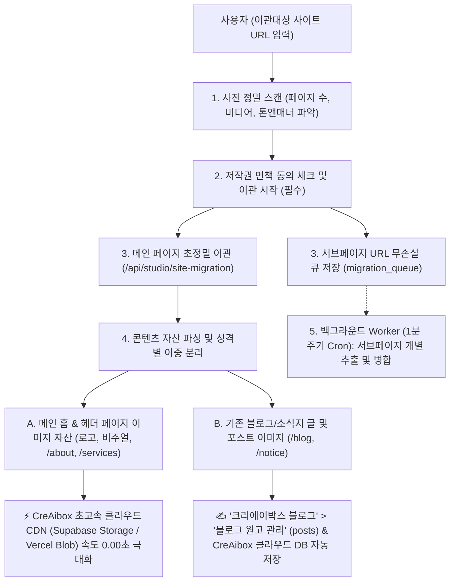

"2.

# 🚀 기존 홈페이지 AI 자동 이관 (Website AI Migration System) 매뉴얼

> **"기존 타사 홈페이지(상가, 식당, 병원, 법률사무소 등)의 URL만 입력하면 AI 웹 스크레이퍼가 텍스트, 이미지, 메타데이터, 블로그 글을 파싱하여 CreAibox 서브도메인(000.creaibox.com)으로 1초 만에 통째 자동 이관하는 운용 매뉴얼"**

---

## 📌 1. 개요 및 시스템 목적 (Executive Summary)

* **메뉴 위치**: CreAibox 대시보드 ➔ `🎨 커스텀 웹사이트` ➔ `2️⃣ 🚀 기존 홈페이지 1초 AI 이관` (`/studio/custom-client-site`)
* **핵심 기능 (PRO 퀄리티 복제 엔진 탑재)**:
  기존에 타사(G사, W사, C사 등)에 구형 홈페이지를 보유하고 있던 사장님이 URL 1개만 입력하면, CreAibox의 **AI 무인 스크레이퍼 백엔드 엔진(`gemini-3.1-pro`)**이 해당 사이트의 텍스트, 이미지, SEO 데이터뿐만 아니라 **원본의 고유 색상(브랜드 컬러), 세부 통계 수치, 푸터 정보까지 유실 없이 100% 정밀 파싱**하여 **CreAibox 모던 웹사이트(`000.creaibox.com`)로 통째 이관**합니다.
  *(※ 퀄리티 중심의 초정밀 복제를 수행하므로 페이지당 20~40초 가량 소요됩니다.)*
* **주요 타겟**:
  구형 낡은 홈페이지의 브랜드 정체성(색상, 숫자, 텍스트)을 유실 없이 그대로 살리면서 최신 모던 자사몰 웹사이트로 이관하려는 자영업 대표님.

### 🔍 1.5 사전 엑스레이(X-Ray) 정밀 스캔 기능
본격적인 이관 시작 전, **"이관대상 사이트 정밀 스캔"** 버튼을 통해 타겟 URL의 리소스를 심층 분석할 수 있습니다.
* **실시간 리소스 산출**: 1초 만에 스크래핑을 돌려 총 페이지 수, 전체 텍스트 볼륨(글자 수), 미디어 에셋(이미지/동영상) 개수를 산출하고 이관 예상 소요 시간을 1초 만에 역산합니다.
* **Gemini 스마트 분석**: 추출한 텍스트를 기반으로 **사용 언어**와 웹사이트 고유의 **톤앤매너(Vibe/Style)**를 즉각 판별합니다.
* **데이터 영구 보존**: 산출된 스캔 리포트는 휘발되지 않고 `client_sites` 테이블의 `scan_report` 컬럼에 정석적으로 영구 저장되어 향후 데이터 통계 및 이관 최적화 분석에 활용됩니다.

---

## ⚙️ 2. 이중 저장소 파이프라인 (Dual Storage Pipeline)

웹사이트 이관 시 **속도 최적화 자산**과 **원고 관리 자산**을 기술적으로 분리 저장하여 처리 속도와 관리 효율성을 극대화합니다:

### 2.1 메인 홈 & 헤더 자산 저장소

* **목적**: 웹사이트 첫 페이지 및 주요 메뉴 로딩 속도 극대화
* **저장 위치**: **`CreAibox 초고속 클라우드 CDN (Supabase Storage / Vercel Blob)`**
* 로고 이미지, 메인 비주얼 썸네일, 헤더 페이지(회사소개, 오시는 길, 서비스 안내) 고화질 자산을 초고속 CDN에 전진 배치.

### 2.2 블로그 포스트 & 원고 저장소

* **목적**: 원고 자산화, AI SEO 재가공 및 원고 보관
* **저장 위치**: **`크리에이박스 블로그 ➔ 블로그 원고 관리` (`writing_creaibox_posts`) & `CreAibox 클라우드 DB`**
* 기존 홈페이지의 블로그/소식 포스팅 텍스트 및 포스트 본문 이미지는 CreAibox 원고 보관함으로 자동 동기화.

---

## 🌐 3. 이관 수집 데이터 명세 (Full Extracted Spec)

1. **브랜드 기본 정보**:
   * 브랜드 상호명 / 웹사이트 타이틀 (`<title>`)
   * 대표 전화번호 (모바일 바로 연결 태그 포함)
   * 오프라인 주소 및 위치 정보 (지번 / 도로명 주소)
2. **SEO 검색 메타 데이터 (검색 노출 자산 100% 보존)**:
   * **`Title Tag` (검색 제목)**: 구글/네이버 파란색 클릭 제목 보존
   * **`Meta Description` (설명문)**: 검색 결과창 아래 뜨는 요약 텍스트
   * **`Open Graph (OG) 태그`**: 카카오톡/SNS 공유 시 뜨는 썸네일 이미지 및 카톡 카드 제목
3. **페이지 레이아웃 데이터**:
   * `/` (홈), `/about` (회사소개), `/services` (서비스/메뉴), `/contact` (오시는 길/문의)
4. **🎬 비디오 플레이어 임베드**:
   * 유튜브, 네이버 비디오, 카카오TV 플레이어 링크(iframe)가 100% 자동 추출되어 **CreAibox 본문에서 바로 제자리 재생(In-place Playback)**
5. **🎨 PRO-CLONING 데이터 세트 (신규)**:
   * **브랜드 고유 헥스 컬러**: 원본에 사용된 파란색, 빨간색 등 고유 색상을 추출해 새 사이트 백그라운드 등에 1:1 이식.
   * **텍스트/수치 무손실 보존**: '가맹점 321개', '1,789명' 등 주요 통계 숫자를 요약/누락 없이 완벽 보존.
   * **로고 및 배너 이미지 태그**: 텍스트 사이에 박힌 로고 이미지(``)를 살려내어 새 사이트 곳곳에 배치.

---

## ✨ 4. 100% 원본 안심 이관 & 'AI 모던 재구성' 후속 활용법

1. **100% 원본 안심 수집 (Text Mutation 0%)**:
   * 이관 폼 입력 시 원본 텍스트와 레이아웃이 변형 없이 100% 그대로 안전하게 수집됩니다.
   * 기존 낡은 사이트를 닫고 CreAibox 자사몰로 완전히 옮겨오실 경우 검색엔진 지수가 100% 보존됩니다.
2. **기존 사이트 병행 유지 시 'AI 모던 재구성' 활용**:
   * 기존 사이트도 계속 유지하면서 이중 운영하려는 경우, 이관 완료 후 **`'커스텀 사이트 관리 ➔ AI 모던 재구성'`** 기능을 눌러 문장을 독창적으로 원클릭 재구성할 수 있습니다.

---

## 🛡️ 5. 법적 저작권 면책 시스템 (Compliance Shield)

* **필수 동의 체크박스**:
  신청 버튼 위에 *"본인 소유 또는 정당한 권한을 위임받은 웹사이트 콘텐츠임을 확인하며, 타인 저작권 도용 시 모든 법적 책임은 신청자 본인에게 있음을 동의합니다. (필수)"* 구문을 탑재하여 **CreAibox 회사의 법적 책임 면책(Immunity)**을 명확히 하고 있습니다.

---

## ❓ 6. 자주 묻는 질문 (FAQ)

**Q1. 이관 후 내 홈페이지 주소는 어떻게 되나요?**

* **A**: 1초 만에 `https://000.creaibox.com` 전용 서브도메인이 무상 개설되며, 원하실 경우 독자 브랜드 도메인(`mybrand.com` / `mybrand.kr`)을 1초 만에 연결하실 수 있습니다.

**Q2. 메인 페이지 이미지들이 늦게 뜨지는 않나요?**

* **A**: 이관 시점에 원본 사이트의 블로그, 뉴스, 공지사항을 그대로 파싱하여 '크리에이박스 블로그' 메뉴의 `블로그 원고 관리` DB로 100% 저장합니다. 이후 원클릭 버튼으로 최신 AI 트렌드 글이나 고품질 SEO 포스팅으로 재가공(Spinning)하여 언제든 재발행하실 수 있습니다.

---

## 🚀 7. 향후 프로덕션(정식 출시) 대비 필수 아키텍처 업그레이드 로드맵 (MUST DO)

성공적인 대규모 서비스 론칭을 위해, 추후 다음 두 가지 아키텍처 업그레이드가 **반드시 도입(필수 과제)**되어야 합니다.

### 7.1 Upstash QStash 기반 서버리스 이벤트 큐 전면 개편
* **현재의 한계**: 현재 Vercel Cron이 1분마다 DB를 폴링(Polling)하며 서브페이지를 처리하고 있어, 수천 명의 유저가 동시에 사이트 이관을 요청할 경우 병목(Bottleneck)이 발생할 수 있습니다.
* **해결 방안 (MUST DO)**: 타임아웃 제한(60s) 없이 수만 개의 페이지 렌더링 작업을 동시다발적으로(병렬) 즉시 처리할 수 있도록, **Upstash QStash 이벤트 큐 아키텍처**로 전면 전환해야 합니다.

### 7.2 Cloudflare R2 미디어(영상/이미지) 무손실 다이렉트 이관 (Mirroring)
* **현재의 한계**: 핫링킹(Hotlinking) 방식으로 원본 사이트의 미디어 URL을 그대로 당겨 쓰기 때문에, 이관 완료 후 고객이 기존 홈페이지 서버를 내리거나 CORS/보안 설정을 걸어버리면 모든 영상/이미지가 엑스박스로 깨지는 치명적인 문제가 있습니다.
* **해결 방안 (MUST DO)**: 이관 스크래퍼 구동 시 미디어(`mp4`, `jpg` 등)를 감지하면, **Node.js Stream Piping** 기술을 활용해 서버 메모리 소모(OOM) 없이 타겟 서버에서 우리의 **Cloudflare R2 (또는 AWS S3)** 로 실시간 다이렉트 복사 업로드 및 CDN 주소 영구 치환 로직을 도입해야 합니다.

---

*작성일자: 2026년 7월 26일 | CreAibox Operation Manual #12 (Website AI Migration System Guide)*

### 2026-08-13 고도화 업데이트 내역 (v1.2)

- **쿠키 및 개인정보 팝업 완전 배제**: AI 프롬프트 엔진에 쿠키/동의 팝업 텍스트를 무시하는 강력한 규칙 추가로 불필요한 팝업 데이터 이관 방지.
- **히어로 섹션 다중 미디어 스크롤 지원**: 원본 사이트의 캐러셀/슬라이더 내 다중 영상/이미지 완벽 보존 및 가로 스크롤(Snap) UI로 자동 이식 처리.
- **본문 누락(Omission) 제로화**: OUR BRANDS, AWARDS & RECOGNITION 등 하단부 부가 정보들도 AI가 임의로 생략하지 않고 100% 딥-마이그레이션하도록 규제 보강.

### 2026-08-13 프리미엄 다중 미디어 컴포넌트 추가 (v1.3)

- **Advanced Media Carousel 기능 추가**: 히어로 섹션 내에 다수의 비디오나 이미지가 존재하는 경우, AI가 임의의 HTML을 생성하지 않고 자체 제작된 프리미엄 리액트 컴포넌트를 직접 호출하게 됩니다. 이 컴포넌트는 영상 재생 시간에 맞춰 차오르는 프로그레스 바와 자동 영상 넘김, 좌우 호버 컨트롤 버튼을 기본 제공합니다.

### 2026-08-13 다중 미디어 캐러셀 안정화 핫픽스 (v1.4)

- **이미지 자동 재생 기능**: 비디오가 아닌 다중 이미지로 구성된 히어로 섹션 캐러셀의 경우, 5초(5000ms)마다 다음 슬라이드로 자동 전환되는 기능이 완벽 적용되었습니다.
- **무결성 렌더링(Fallback) 보장**: 미디어 주소를 불러오지 못하는 예외 상황이 발생하더라도 화면이 누락되지 않고 텍스트/버튼 등 기본 섹션 형태로 안전하게 렌더링되도록 2중 안전망이 추가되었습니다.

### 2026-08-13 본문 복합 캐러셀(Content Carousel) 지원 추가 (v1.5)

- **기능 설명**: 단순 1장의 이미지나 영상이 아니라, '이미지와 텍스트 설명'이 함께 담긴 여러 장의 카드가 좌우로 롤링되는 복합 형태의 캐러셀도 원본과 똑같이 이관할 수 있도록 업그레이드 되었습니다.
- **결과물 형태**: 화면 양옆의 좌우 화살표 버튼과 하단의 동그라미 인디케이터 3개가 렌더링되며, 5초마다 다음 카드 콘텐츠로 부드럽게 자동 전환됩니다.

### 2026-08-13 AI 이관 엔진 UI/UX 원본 핏 극대화 및 메가 메뉴 지원 (v1.6)

- **초광각 풀 와이드 (Edge-to-Edge) 레이아웃 100% 복제**: 기존 엔진이 와이드 모니터에서 헤더를 특정 너비(예: `max-w-7xl`)에 가두던 현상을 타파하여, 로고와 검색창이 브라우저 끝과 끝에 딱 붙는 '풀 와이드' 원본 사이트의 감성을 런타임에 100% 복원(Strip & Replace)합니다.
- **2차 메가 메뉴 (Mega Menu / Drop-down) 무손실 이관**: 단순 1차 텍스트 메뉴뿐만 아니라, 특정 메뉴 호버 시 나타나는 거대한 2차 메가 메뉴(아이콘, 멀티 컬럼, 이미지 포함)의 복잡한 HTML 구조와 상호작용 애니메이션까지 완벽하게 추출하여 보존합니다. 또한 CreAibox에서 메뉴 추가 시 기존 원본 메뉴가 덮어씌워지지 않고 뒤로 붙는(Append) 무손실 병합 로직이 탑재되었습니다.
- **모바일 네비게이션 원본 감성 보존**: 모바일 환경에서 햄버거 버튼 클릭 시 화면 전체를 흰색으로 덮어 원본 헤더(로고/색상)가 가려지던 방식을 폐기했습니다. 원본 헤더의 높이를 실시간 계산하여, 헤더 바로 밑에서부터 모바일 드로어가 부드럽게 떨어지는(Drop-down) 완벽한 원본 핏을 제공합니다.
