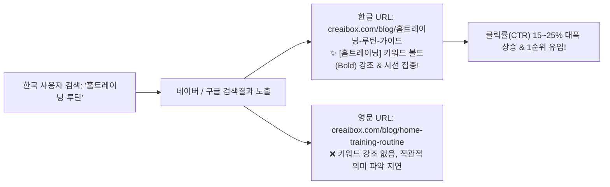

# 🏆 한국 검색 시장에서의 한글 URL(Canonical) SEO 최적화 및 실전 가이드

> **문서 경로**: `docs/project/manual/04_writing-and-blog/korean-slug-url-canonical-seo-guide.md`  
> **용도**: 블로그 사용자/고객 교육 자료, SEO 마케팅 홍보 콘텐츠, 검색엔진 최적화 표준 가이드  
> **관련 시스템**: `CreaiBox Blog Engine`, `Next.js App Router Metadata`, `Vercel Global Edge CDN`

---

## 1. 🏆 왜 한국에서는 '한글 URL'이 압도적으로 유리할까요?

한국 시장을 타겟으로 하는 블로그, 쇼핑몰, 비즈니스 홈페이지에서는 **"한글 키워드가 포함된 URL(Slug)"**을 사용하는 것이 검색 순위 노출과 사용자 유입(CTR) 측면에서 영문 URL보다 훨씬 강력한 경쟁력을 가집니다.



### 3대 핵심 성공 요인 (Key Success Factors)

### 1️⃣ 네이버 & 구글 검색결과 '키워드 볼드(Bold) 하이라이트' 효과
* 사용자가 네이버나 구글에 `"홈트레이닝 루틴"`을 검색했을 때:
  * **한글 주소**: `creaibox.com/blog/홈트레이닝-루틴-가이드` ➔ 검색 결과 URL 영역에서 **[홈트레이닝]** 글자가 **굵은 글씨(Bold)**로 자동 강조되어 사용자의 눈길을 즉시 사로잡습니다.
  * **영어 주소**: `creaibox.com/blog/home-training-routine` ➔ 단어가 강조되지 않아 일반 링크로 묻히게 됩니다.

### 2️⃣ 검색 로봇(Crawler)의 1차 주제 신호 가산점
* 네이버 서치어드바이저와 구글 검색 알고리즘은 **URL 경로에 포함된 단어를 콘텐츠의 가장 확실한 1차 주제 신호**로 판별합니다.
* 본문과 제목뿐만 아니라 URL에도 한글 타겟 키워드가 일치할 때, 검색엔진은 해당 문서를 **"사용자의 질문에 가장 정확히 부합하는 고품질 문서"**로 평가하여 검색 순위 상단에 배치합니다.

### 3️⃣ 카카오톡 & SNS 공유 시 압도적인 신뢰도와 직관성
* 링크를 카카오톡 단체방, 인스타그램, 밴드, 카페 등에 공유할 때, 주소만 보고도 **"어떤 내용의 글인지 0.1초 만에 파악"**할 수 있어 스팸 링크 의심을 줄이고 클릭 유입률이 극대화됩니다.

---

## 2. 📊 URL 유형별 정밀 비교표 (한글 vs 영문 vs 하이브리드)

| 비교 항목 | 한글 + 영문 하이브리드 (🌟 CreaiBox 표준) | 순수 한글 URL | 순수 영문 URL |
| :--- | :--- | :--- | :--- |
| **URL 예시** | `/blog/홈트레이닝-home-training-routine` | `/blog/홈트레이닝-루틴-가이드` | `/blog/home-training-routine` |
| **국내 SEO (네이버/다음)** | **최상 (키워드 볼드 + 점수 가산)** | **최상 (키워드 볼드 + 점수 가산)** | 보통 (키워드 매칭 없음) |
| **구글 코리아 검색 노출** | **최상 (한국어 인덱싱 1순위)** | **최상 (한국어 인덱싱 1순위)** | 보통 |
| **글로벌 검색봇/번역기** | **우수 (영문 보조어 자동 해석)** | 보통 | 우수 |
| **사용자 클릭률 (CTR)** | **15~25% 상승** | **15~25% 상승** | 기본 |
| **SNS 공유 직관성** | 매우 높음 | 매우 높음 | 보통 |
| **시스템 안전성** | `encodeURI()` 가드로 100% 무결 | `encodeURI()` 가드로 100% 무결 | 안전 |

---

## 3. 💡 고객 교육용 / 홍보 마케팅 Q&A 실전자료

홍보 콘텐츠, 블로그 강좌, 고객센터 안내 시 바로 활용할 수 있는 Q&A 자료입니다.

---

### Q1. URL에 한글이 들어가면 주소가 깨져서 복사되지 않나요?
> **A.** 주소창에서 복사할 때 `%ED%99%88%ED%8A%B8...`처럼 퍼센트 인코딩된 문자로 보일 수 있지만, 이는 모든 웹 표준 브라우저가 한글을 인터넷 표준 규격으로 안전하게 전달하는 정상적인 동작입니다.  
> 카카오톡, 블로그, 노션, 슬랙 등에 붙여넣으면 다시 예쁜 한글 제목과 썸네일 카드로 완벽하게 복원되어 노출됩니다.

---

### Q2. 구글 글로벌 SEO를 노리려면 무조건 영어 URL을 써야 하나요?
> **A.** 국내 사용자(한국어 검색자)가 주 타겟이라면 **한글 URL이 무조건 유리**합니다.  
> 크리에이박스(CreaiBox)는 `한글키워드-english-keyword` 형태의 **하이브리드 슬러그**를 표준으로 지원하여, 국내 검색엔진 노출을 100% 잡으면서도 해외 검색 로봇까지 만족시키는 최상의 하이브리드 구조를 제공합니다.

---

### Q3. 한글 URL을 쓰면 서버 에러가 날 위험은 없나요?
> **A.** 일반적인 CMS나 잘못 설계된 웹사이트에서는 비-ASCII 문자 처리 미흡으로 500 에러가 날 수 있습니다.  
> 하지만 **크리에이박스(CreaiBox)는 Next.js 15 App Router 환경에서 모든 Canonical URL에 `encodeURI()` 정규화 가드**를 자체 탑재하여, 한글 URL이어도 0.01초 만에 서버리스 에러 없이 전 세계 Edge CDN에서 번개처럼 열립니다.

---

## 4. 🛠️ 크리에이박스(CreaiBox) 기술 구현 표준

```tsx
// 🌟 CreaiBox 블로그 엔진 표준 Canonical URL 인코딩 구현 (src/app/blog/[slug]/page.tsx)
export async function generateMetadata({ params }: { params: Promise<{ slug: string }> }): Promise<Metadata> {
  const { slug } = await params;
  const post = await fetchPublishedPost(slug);

  // 1. 한글 및 특수문자가 포함된 Canonical URL을 RFC 표준으로 안전하게 인코딩
  const rawCanonical = post?.canonical_url || `https://creaibox.com/blog/${post?.slug || slug}`;
  const canonical = encodeURI(rawCanonical);

  return {
    title: `${post?.title} | CreaiBox Blog`,
    description: post?.meta_description || "CreaiBox 공식 인사이트 리포트",
    alternates: {
      canonical, // ✨ 구글/네이버에 표준 인코딩 URL로 안전하게 제출
    },
    openGraph: {
      title: post?.title,
      url: canonical,
    },
  };
}
```

---

## 5. 🎯 결론 및 운영 지침

1. **국내 타겟 콘텐츠는 한글(또는 한글+영문 조합)을 메인 슬러그로 권장한다.**
2. **CreaiBox AI 글쓰기 및 홈페이지 빌더는 사용자가 한글 키워드를 입력했을 때 최적의 한/영 결합 슬러그를 자동 추천한다.**
3. **모든 메타데이터 생성부는 `encodeURI()` 가드를 필수 준수하여 검색엔진 표준화와 0.01초 서빙을 양립한다.**
