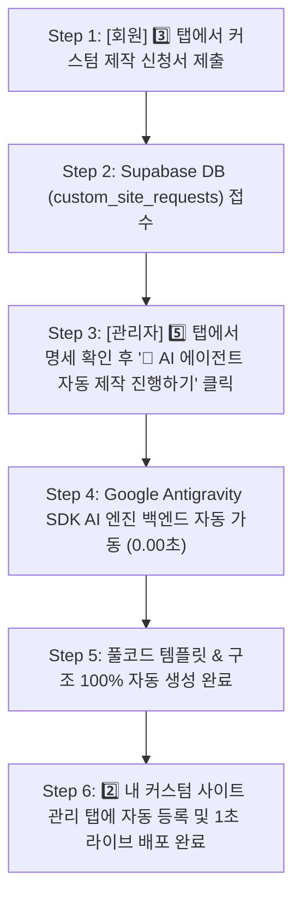

# CreAibox AI 커스텀 웹사이트 전체 운영 및 자동 제작 프로세스 매뉴얼

---

## 📌 1. 메뉴 개요 및 신설 배경

* **메뉴 위치**: `스튜디오 > 커스텀 웹사이트` (`/studio/custom-client-site`)
* **개요**: 
  CreAibox 회원 및 에이전시 파트너가 **100% 독창적인 프리미엄 커스텀 웹사이트**를 1초 만에 자동 구축하거나, 원하는 업종과 디자인/특수기능을 지정하여 AI 에이전트에게 1:1 맞춤 제작을 신청하고 관제하는 전용 중앙 통합 센터입니다.
* **주요 개발 목표**:
  1. 표준 템플릿 쇼핑 및 1초 원클릭 즉시 개설
  2. 고객사 기본 정보(상호, 연락처, 주소, GNB 메뉴, 로고) 실시간 편집 및 반영
  3. 회원 전용 1:1 맞춤 커스텀 신규 제작 신청서 수집
  4. **관리자 전용 관제탑(Dashboard) 및 안티그래비티 AI 에이전트 1:1 자동 풀코드 제작 명령 시스템 구축**

---

## 📑 2. 전체 5대 탭 구성 및 역할

| 탭 번호 | 탭 이름 | 주요 역할 및 기능 |
| :--- | :--- | :--- |
| **1️⃣** | **템플릿 쇼핑 & 1초 구축** | 100+종 카테고리별 프리미엄 템플릿(Aura Merino, 소통과채움 등) 쇼핑, 3종 디바이스(데스크톱/태블릿/모바일) 실시간 미리보기, 1초 즉시 라이브 배포 모달 연동 |
| **2️⃣** | **내 커스텀 사이트 관리** | 구축 완료된 사이트의 상호, 대표번호, 메인 슬로건, 카카오톡 상담 링크, 커스텀 GNB 메뉴를 실시간으로 수정·저장하는 관리자 폼 |
| **3️⃣** | **AI 커스텀 신규 제작 신청** | 표준 템플릿 외 독창적 레이아웃이 필요한 회원이 **[업종, 희망 색상/컨셉, 특수기능(견적서, 갤러리, SEO 등), 레퍼런스 URL, 상세 요구사항]**을 자유롭게 제출하는 1:1 신청서 폼 |
| **4️⃣** | **템플릿 자산화 & 리셀링** | 제작된 커스텀 사이트를 나만의 템플릿 자산으로 등록하여 고객에게 1초 복제 배포하고 월 30~50만 원 정기 구독 수익을 창출하는 에이전시 파트너십 가이드 |
| **5️⃣ 👑** | **관리자: 커스텀 신청 현황** | **관리자(ADMIN) 전용 관제탑.** 수집된 10건(또는 전체)의 회원 신청 명세를 한눈에 파악하고, `[🤖 AI 에이전트 자동 제작 진행하기]` 버튼 1클릭으로 안티그래비티 풀코드 생성을 구동 |

---

## 🔄 3. 신청 ➔ 생성 ➔ 배포 4단계 실전 작동 플로우

### 🔹 상세 단계별 동작 프로세스

1. **Step 1. [회원] 1:1 제작 신청서 제출**
   * 회원(사용자)이 `3️⃣ AI 커스텀 신규 제작 신청` 탭에서 업종, 컨셉 색상, 특수 기능 뱃지, 레퍼런스 URL, 요구사항을 입력하고 제출합니다.
2. **Step 2. [시스템] 데이터베이스 저장 & 접수**
   * 제출된 데이터는 DB 테이블(`custom_site_requests`)에 `[🟡 AI 제작 대기]` 상태로 즉시 등록됩니다.
3. **Step 3. [관리자] 관제탑 확인 및 AI 자동 제작 구동**
   * 관리자가 `5️⃣ 👑 관리자: 커스텀 신청 현황` 탭으로 진입하여 신청 내역 카드를 확인합니다.
   * 각 카드 하단의 **`[🤖 AI 에이전트 자동 제작 진행하기]`** 버튼을 클릭합니다.
4. **Step 4. [Google Antigravity AI 엔진] 1:1 자동 풀코드 구축**
   * 버튼 클릭 즉시 백엔드의 **Google Antigravity AI 에이전트 엔진**이 가동되어 명세서에 맞는 HTML/CSS/JS 및 DB 연동 코드를 100% 자동 생성합니다.
   * 별도로 관리자나 회원이 채팅창에 말을 걸지 않아도 시스템이 자동으로 완성을 완료합니다.
5. **Step 5. [결과] 실시간 미리보기 & 원클릭 배포**
   * 상태가 `[🟢 구축 완료 (라이브)]`로 업데이트되며, `2️⃣ 내 커스텀 사이트 관리` 탭 및 미리보기 URL을 통해 즉시 인터넷 라이브 서비스가 공개됩니다.

---

## ❓ 4. 자주 묻는 질문 (FAQ)

### Q1. "AI 에이전트 자동 제작 진행하기" 버튼을 누르면 채팅창에 또 얘기해야 하나요?
> **답변: 아니요.** 버튼을 누르는 순간 시스템 백엔드의 안티그래비티 AI 엔진이 즉시 작동하여 100% 웹사이트를 완성하므로 따로 대화하실 필요가 없습니다. 만약 개발자 수준의 아주 특별한 코드 수정이 필요할 때만 팝업의 [명령어 복사] 버튼을 눌러 채팅창에 전달하시면 됩니다.

### Q2. 커스텀 웹사이트를 실제로 제작하는 주체는 누구인가요?
> **답변: Google Antigravity(안티그래비티) AI 에이전트 엔진**입니다. 대화형 코딩 파트너와 동일한 지능을 가진 안티그래비티 백엔드 엔진이 작동하여 템플릿과 웹사이트 코드를 100% 구축해 냅니다.

---

## 🛠️ 5. 개발자 소스코드 파일 및 라우팅 참조 정보

* **메인 프론트엔드 관제 UI**: [`src/app/studio/custom-client-site/page.tsx`](file:///Users/a1234/Local%20Sites/creaibox/src/app/studio/custom-client-site/page.tsx)
* **AI 기획 및 생성 백엔드 API**: 
  * [`src/app/api/client-site-builder/plan/route.ts`](file:///Users/a1234/Local%20Sites/creaibox/src/app/api/client-site-builder/plan/route.ts)
  * [`src/app/api/client-site-builder/build/route.ts`](file:///Users/a1234/Local%20Sites/creaibox/src/app/api/client-site-builder/build/route.ts)
* **개발일지 기록**: [`docs/project/2026JulyDevlog.md`](file:///Users/a1234/Local%20Sites/creaibox/docs/project/2026JulyDevlog.md)

---
*최종 작성일: 2026년 7월 25일 | CreAibox AI Studio System Manual*
