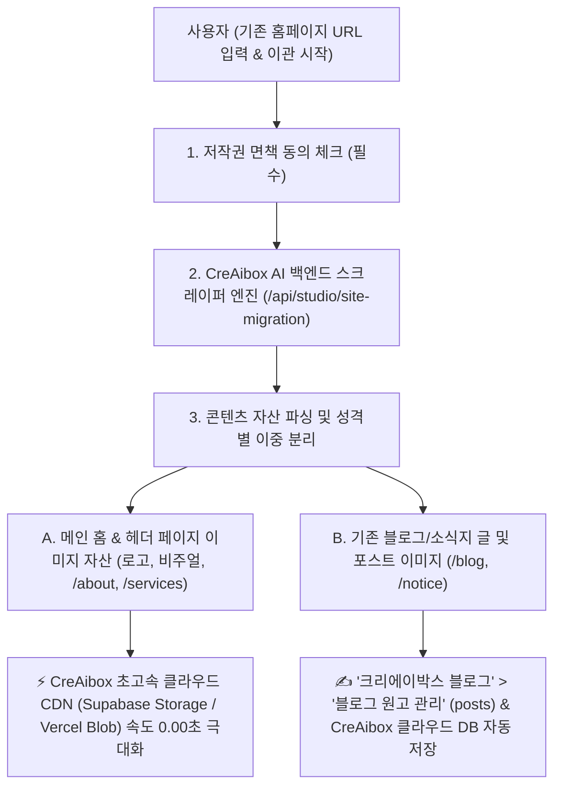

# 🚀 기존 홈페이지 1초 AI 자동 이관 (Website AI Migration System) 매뉴얼

> **"기존 타사 홈페이지(상가, 식당, 병원, 법률사무소 등)의 URL만 입력하면 AI 웹 스크레이퍼가 텍스트, 이미지, 메타데이터, 블로그 글을 파싱하여 CreAibox 서브도메인(000.creaibox.com)으로 1초 만에 통째 자동 이관하는 운용 매뉴얼"**

---

## 📌 1. 개요 및 시스템 목적 (Executive Summary)

* **메뉴 위치**: CreAibox 대시보드 ➔ `🎨 커스텀 웹사이트` ➔ `2️⃣ 🚀 기존 홈페이지 1초 AI 이관` (`/studio/custom-client-site`)
* **핵심 기능**:
  기존에 타사(G사, W사, C사 등)에 구형 홈페이지를 보유하고 있던 사장님이 URL 1개만 입력하면, CreAibox의 **AI 무인 스크레이퍼 백엔드 엔진**이 해당 사이트의 브랜드명, 텍스트, 이미지, 전화번호, 주소, SEO 메타데이터, 블로그 포스팅을 파싱하여 **CreAibox 모던 웹사이트(`000.creaibox.com`)로 1초 만에 통째 이관**합니다.
* **주요 타겟**:
  구형 낡은 홈페이지를 최신 모던 자사몰 웹사이트로 손실 없이 1초 이관하려는 상가, 병원, 법률사무소, 식당, 학원 및 자영업 대표님.

---

## ⚙️ 2. 이중 저장소 파이프라인 (Dual Storage Pipeline)

웹사이트 이관 시 **속도 최적화 자산**과 **원고 관리 자산**을 기술적으로 분리 저장하여 처리 속도와 관리 효율성을 극대화합니다:

### 2.1 메인 홈 & 헤더 자산 저장소
* **목적**: 웹사이트 첫 페이지 및 주요 메뉴 로딩 속도 극대화
* **저장 위치**: **`CreAibox 초고속 클라우드 CDN (Supabase Storage / Vercel Blob)`**
* 로고 이미지, 메인 비주얼 썸네일, 헤더 페이지(회사소개, 오시는 길, 서비스 안내) 고화질 자산을 초고속 CDN에 전진 배치.

### 2.2 블로그 포스트 & 원고 저장소
* **목적**: 원고 자산화, AI SEO 재가공 및 원고 보관
* **저장 위치**: **`크리에이박스 블로그 ➔ 블로그 원고 관리` (`writing_creaibox_posts`) & `CreAibox 클라우드 DB`**
* 기존 홈페이지의 블로그/소식 포스팅 텍스트 및 포스트 본문 이미지는 CreAibox 원고 보관함으로 자동 동기화.

---

## 🌐 3. 이관 수집 데이터 명세 (Full Extracted Spec)

1. **브랜드 기본 정보**:
   * 브랜드 상호명 / 웹사이트 타이틀 (`<title>`)
   * 대표 전화번호 (모바일 바로 연결 태그 포함)
   * 오프라인 주소 및 위치 정보 (지번 / 도로명 주소)
2. **SEO 검색 메타 데이터 (검색 노출 자산 100% 보존)**:
   * **`Title Tag` (검색 제목)**: 구글/네이버 파란색 클릭 제목 보존
   * **`Meta Description` (설명문)**: 검색 결과창 아래 뜨는 요약 텍스트
   * **`Open Graph (OG) 태그`**: 카카오톡/SNS 공유 시 뜨는 썸네일 이미지 및 카톡 카드 제목
3. **페이지 레이아웃 데이터**:
   * `/` (홈), `/about` (회사소개), `/services` (서비스/메뉴), `/contact` (오시는 길/문의)
4. **🎬 비디오 플레이어 임베드**:
   * 유튜브, 네이버 비디오, 카카오TV 플레이어 링크(iframe)가 100% 자동 추출되어 **CreAibox 본문에서 바로 제자리 재생(In-place Playback)**

---

## ✨ 4. 100% 원본 안심 이관 & 'AI 모던 재구성' 후속 활용법

1. **100% 원본 안심 수집 (Text Mutation 0%)**:
   * 이관 폼 입력 시 원본 텍스트와 레이아웃이 변형 없이 100% 그대로 안전하게 수집됩니다.
   * 기존 낡은 사이트를 닫고 CreAibox 자사몰로 완전히 옮겨오실 경우 검색엔진 지수가 100% 보존됩니다.
2. **기존 사이트 병행 유지 시 'AI 모던 재구성' 활용**:
   * 기존 사이트도 계속 유지하면서 이중 운영하려는 경우, 이관 완료 후 **`'커스텀 사이트 관리 ➔ AI 모던 재구성'`** 기능을 눌러 문장을 독창적으로 원클릭 재구성할 수 있습니다.

---

## 🛡️ 5. 법적 저작권 면책 시스템 (Compliance Shield)

* **필수 동의 체크박스**:
  신청 버튼 위에 *"본인 소유 또는 정당한 권한을 위임받은 웹사이트 콘텐츠임을 확인하며, 타인 저작권 도용 시 모든 법적 책임은 신청자 본인에게 있음을 동의합니다. (필수)"* 구문을 탑재하여 **CreAibox 회사의 법적 책임 면책(Immunity)**을 명확히 하고 있습니다.

---

## ❓ 6. 자주 묻는 질문 (FAQ)

**Q1. 이관 후 내 홈페이지 주소는 어떻게 되나요?**
* **A**: 1초 만에 `https://000.creaibox.com` 전용 서브도메인이 무상 개설되며, 원하실 경우 독자 브랜드 도메인(`mybrand.com` / `mybrand.kr`)을 1초 만에 연결하실 수 있습니다.

**Q2. 메인 페이지 이미지들이 늦게 뜨지는 않나요?**
* **A**: 메인 홈과 헤더 페이지의 핵심 자산은 **`CreAibox 초고속 클라우드 CDN`**에 자동 탑재되므로 0.00초급 초고속 로딩 속도가 보장됩니다.

**Q3. 기존 사이트 블로그 글들은 어디로 들어오나요?**
* **A**: 이관된 블로그 포스트와 이미지들은 **`크리에이박스 블로그 ➔ 블로그 원고 관리`**함으로 자동 동기화되어 언제든지 편집하거나 AI 재발행하실 수 있습니다.

---

*작성일자: 2026년 7월 26일 | CreAibox Operation Manual #12 (Website AI Migration System Guide)*
