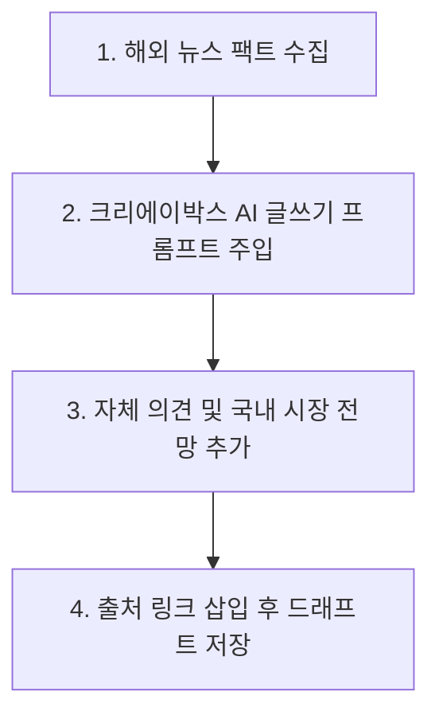

# 해외 최신 뉴스 활용 및 기사 작성 가이드

이 문서는 해외 IT 및 AI 전문 미디어의 최신 뉴스를 활용하여 크리에이박스(creaibox.com) 블로그 및 뉴스 서비스에 기사를 작성할 때, 저작권을 완벽히 보호하고 검색 노출(SEO) 성능을 극상시키기 위해 작성되었습니다.

---

## 1. 해외 IT & AI 뉴스 미디어 바로가기

기획 및 사실 수집에 적극적으로 권장되는 대표적인 해외 영어 뉴스 미디어 리스트입니다.

| 뉴스 미디어명 | 바로가기 링크 | 특징 및 주력 콘텐츠 |
| :--- | :--- | :--- |
| **TechCrunch** | [techcrunch.com](https://techcrunch.com) | 글로벌 IT 기업 트렌드, 최신 스타트업 투자 및 비즈니스 뉴스 신속 제공 |
| **VentureBeat** | [venturebeat.com](https://venturebeat.com) | 실무용 생성형 AI 솔루션 및 기업형 AI 적용 현황 심층 보도 |
| **The Verge** | [theverge.com](https://theverge.com) | 디지털 문화 트렌드, 새로운 테크 기기 및 빅테크 독점 인터뷰 제공 |
| **TLDR AI** | [tldr.tech/ai](https://tldr.tech/ai) | 매일 발표되는 인공지능 관련 오픈소스 제품과 주요 논문 요약 뉴스레터 |
| **MIT Technology Review** | [technologyreview.com](https://www.technologyreview.com) | 최첨단 양자 컴퓨팅, 생명공학, LLM 모델 벤치마크 학술 분석 |

---

## 2. 저작권 분쟁 예방을 위한 2차 가공 요령

해외 뉴스 기사를 단순히 파파고, 구글 번역기, DeepL 등을 통해 **한글로 단순 직역하여 기사화하는 것은 명백한 저작권법 침해(복제권 및 2차적저작물작성권 위반)에 해당**합니다. 저작권은 국경과 언어에 관계없이 원작자에게 귀속되므로 다음 지침에 맞춰 안전하게 가공해야 합니다.

### 2.1 단순 번역과 안전한 재작성(Rewriting)의 차이

* **위험한 방식 (단순 번역)**:
  * 원 기사의 단락 구조, 서술어, 수식어를 그대로 한국어로 변환해 나열하는 방식.
  * 단순히 문단 순서만 약간 바꾸고 번역체 투를 유지하여 기사화하는 방식.
* **안전한 방식 (재작성 및 사실 재구성)**:
  * 원문 기사에서 **수치, 출시 사실, 기능 사양 등의 핵심 팩트(Fact) 정보만 수집**합니다. (사실 자체에는 저작권이 부여되지 않음)
  * 수집한 팩트를 중심으로 문장을 아예 **바닥에서부터 새롭게 작성(Clean-room rewriting)**합니다.
  * 기사 말미에 해당 뉴스가 국내외 비즈니스 및 소상공인, 크리에이터들에게 미칠 파급력이나 자체 해석(Commentary)을 **최소 2~3개 단락 추가**하여 독자적인 창작물로 격상시킵니다.

---

## 3. 크리에이박스 AI 글쓰기 에디터 활용 프로세스

크리에이박스 대시보드 내에 마련된 AI 스튜디오 기능을 결합하여 고품질의 재가공 기사를 초고속으로 발행하는 4단계 프로세스입니다.

1. **원문 핵심 요약 획득**:
   * 해외 기사 원문을 복사하여 번역 엔진이나 메모장에 넣고 핵심 팩트 3~4가지를 간략히 정리합니다.
2. **AI 글쓰기 에디터 프롬프트 작성**:
   * 크리에이박스 AI 포스팅 글쓰기 프롬프트에 다음과 같이 지시를 내립니다:
     > *"아래 팩트 정보를 바탕으로 블로그 독자들을 위한 매끄럽고 친절한 구어체 정보성 기사를 새로 작성해 줘. 번역체 느낌을 완전히 없애고 한국 IT 업계 관점에서 새롭게 재구성해 줘."*
3. **독자적인 시각 첨가**:
   * AI가 제안해 준 원고 뼈대 속에 크리에이박스만의 관점이나 독자 혜택 정보를 수작업으로 퇴고해 넣습니다.
4. **저작권 명시 및 링크 삽입**:
   * 기사 하단부에 인용 출처(Source URL)를 명확히 밝히고 기사를 작성합니다.

---

## 4. 구글 및 네이버 검색 노출(SEO) 극대화 지침

해외 소스를 가공해 기사를 발행할 때 검색 봇에게 좋은 평가를 받기 위해 준수해야 할 기술적 요소입니다.

### 4.1 본문 내 출처 명시 (E-E-A-T 확보)
* 검색엔진(구글 등)은 독자적인 신뢰성 지표로 **E-E-A-T(경험, 전문성, 권위성, 신뢰성)**를 측정합니다.
* 기사 본문에 출처를 투명하게 표기할 때 신뢰도가 급격히 상승합니다.
* **작성 표준 예시**:
  > 본 포스팅은 테크크런치([TechCrunch](https://techcrunch.com))의 최신 인공지능 상용화 분석 보도를 바탕으로 국내 IT 소상공인 실정에 맞게 재구성되었습니다.

### 4.2 캐노니컬 URL(Canonical URL) 설정
* 크리에이박스 글쓰기 에디터에 작성할 때, 본인이 새로 작성한 글의 최종 공식 주소(예: `https://creaibox.com/blog/ai-news-topic`)를 대표 캐노니컬 주소로 명세해 중복 문서 필터링에 걸리지 않도록 방어합니다.
