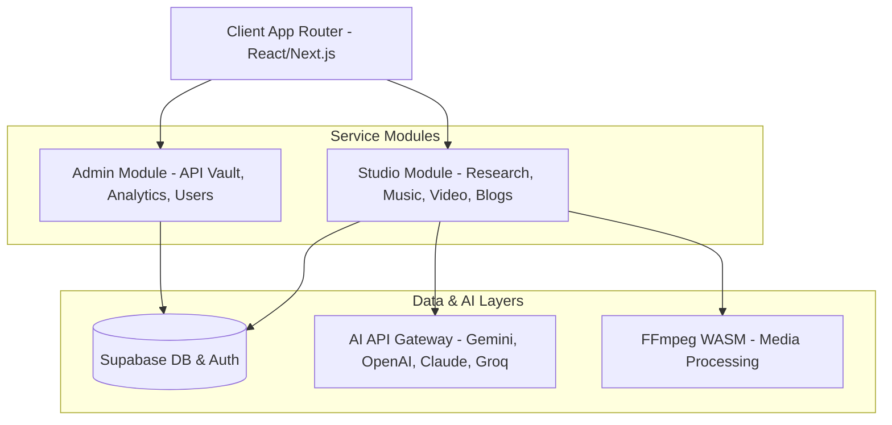

# 프로젝트 개요 (Project Overview)

`CreAibox`는 크리에이터를 위한 AI 기반의 콘텐츠 제작 및 자동화 워크스페이스입니다. 텍스트(블로그), 음악(SUNO/가사), 비디오(편집기), 키워드 연구, 유튜브 최적화 등 콘텐츠 창작의 전 과정을 하나의 일관된 대시보드 안에서 AI 어시스턴트와 공동 작업할 수 있도록 지원합니다.

## 1. 프로젝트 목적 및 타겟
* **대상 사용자**: 개인 크리에이터, 디지털 마케터, 블로거, 유튜브 영상 제작자.
* **해결하는 문제**: 
  - 여러 AI 도구(OpenAI, Claude, Gemini, Groq)에 개별적으로 로그인하여 결제 및 관리하는 번거로움 해결.
  - 텍스트 생성에서부터 썸네일 제작, 비디오 렌더링, SEO 메타데이터 추출까지 이어지는 분절된 작업 프로세스를 통합.
  - 공용 API 키 풀(API Vault)을 제공하여 크리에이터의 유료 API 사용량 한계 극복 및 백업 전략 제공.

## 2. 핵심 서비스 아키텍처

## 3. 리포지토리 구성
프로젝트는 Next.js App Router 아키텍처를 기반으로 작성되었습니다.
* **`src/app/`**: Next.js 페이지 라우팅 및 백엔드 API 엔드포인트 구현.
* **`src/components/`**: 
  - `ui/`: Radix UI 기반의 커스텀 UI 원자(Atom) 컴포넌트 (Shadcn UI 스타일).
  - `studio/`: 비디오 에디터, 뮤직 스튜디오, 비주얼라이저 등 핵심 크리에이터용 복합 컴포넌트.
  - `writing/`: 네이버 블로그, 워드프레스, 크리에이박스용 마크업 및 최적화 에디터 컴포넌트.
  - `layout/`: LNB/GNB 레이아웃 컴포넌트.
* **`src/lib/`**:
  - `ai/`: 다중 AI 모델 서비스 제공자 관리 레지스트리 (`provider-registry.ts`).
  - `stores/`: Zustand 기반 클라이언트 상태 저장소 (블로그 원고 정보, UI 토글 상태 등).
  - `queries/`: TanStack Query (React Query) 기반 DB 동기화/캐싱 로직.
* **`src/utils/`**: Supabase 브라우저 및 서버 인스턴스 초기화 헬퍼.
* **`docs/`**: 프로젝트 아키텍처 및 코딩 가이드라인 문서 저장소.
