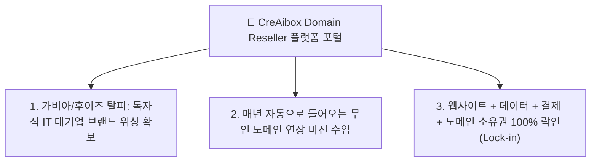
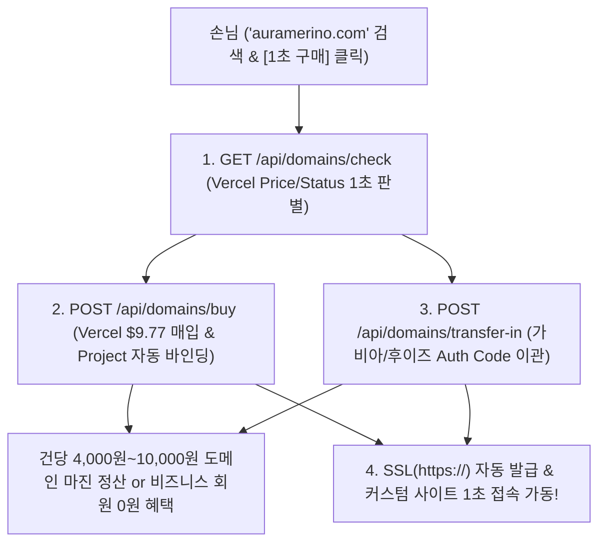

# 🌐 4. CreAibox Domain Reseller 및 Vercel Domains API 원클릭 도메인 조회·구매·이관 자동화 사업계획서
### (Executive Business Plan & Tech Spec: Independent Domain Registrar & Auto-Binding Engine)

> **"가비아/후이즈를 뛰어넘는 독자적 CreAibox Domain Reseller 사업자 등극 & Vercel Domains API 연동을 통한 1초 도메인 검색·구매·이관·SSL 자동화 파이프라인"**

---

## 📌 1. 사업 개요 및 Domain Reseller 비전 (Executive Summary)

* **사업명**: CreAibox Domain Reseller & 무인 도메인 풀스택 자동화 생태계
* **핵심 비전**:
  단순한 웹사이트 생성기를 넘어서, **CreAibox 자체가 독립적인 도메인 등록 사업자(Domain Registrar / Reseller)가 되어**, 고객에게 도메인 검색부터 원클릭 구매, 가비아/후이즈 이관(Transfer-In), SSL(`https://`) 자동 결합까지 1초 만에 제공하는 파괴적 도메인 포털 아키텍처.
* **수익성 포지셔닝**:
  * 도메인 해외 도매 원가($9.77 / 약 14,000원) 대비 일반 유저 판매가(18,000원) 설정으로 **건당 4,000원~10,000원 도메인 마진 수수료 즉시 수납**.
  * 비즈니스/프리미어 플랜 사용자는 **"도메인 연장비 평생 0원 무상 지원"** 혜택으로 고객 이탈률(Churn Rate)을 0%로 동결하고 장기 SaaS 정기 결제 유치.

---

## 📊 2. Domain Reseller 사업의 3대 핵심 경쟁력 (Key Strategic Advantages)

1. **독립 도메인 사업자 등극 (Own Domain Portal)**:
   * 가비아/후이즈로 손님을 내보내지 않고, `creaibox.com` 대시보드 안에서 100% 브랜드 도메인을 검색하고 구매/이관/관리하는 대기업급 브랜딩 위상 확보.
2. **매년 자동으로 들어오는 무인 도메인 갱신 수입 (Recurring Margin)**:
   * 유저 10,000명 달성 시 ➔ **아무것도 안 해도 매년 10,000명 × 1만 원 마진 = 연 1억 원의 무인 정기 수입 자동 획득**.
3. **고객 100% 락인 (Lock-in)**:
   * 웹사이트 + 데이터 + 결제 계좌 + 도메인 소유권까지 모두 CreAibox에 묶이므로, 경쟁사(아임웹/윅스)로 이탈할 가능성 0%.

---

## 🛠️ 3. Vercel Domains API 풀스택 아키텍처 연동 계획 (Full-Stack Architecture)

### 3.1 Backend API Services & Environment Variables

#### [MODIFY] [`.env.local`](file:///Users/a1234/Local%20Sites/creaibox/.env.local)
- `VERCEL_AUTH_TOKEN`: Vercel REST API 인증용 에이전트 전용 Bearer 토큰 수록
- `VERCEL_PROJECT_ID`: CreAibox 메인 배포 프로젝트 ID
- `VERCEL_TEAM_ID`: (옵션) Vercel 팀 어카운트 ID

#### [NEW] [`src/lib/server/vercel-domains.ts`](file:///Users/a1234/Local%20Sites/creaibox/src/lib/server/vercel-domains.ts)
- Vercel Domains REST API 래퍼 모듈 서비스 구축
  - `checkDomainPriceAndStatus(domainName: string)`
  - `purchaseDomain(domainName: string, expectedPrice: number)`
  - `transferInDomain(domainName: string, authCode: string)`
  - `assignDomainToVercelProject(domainName: string)`

#### [NEW] [`src/app/api/domains/check/route.ts`](file:///Users/a1234/Local%20Sites/creaibox/src/app/api/domains/check/route.ts)
- 실시간 도메인 검색 및 구매 가능 여부 반환 API 엔드포인트

#### [NEW] [`src/app/api/domains/buy/route.ts`](file:///Users/a1234/Local%20Sites/creaibox/src/app/api/domains/buy/route.ts)
- 도메인 구매 요청 및 Supabase DB 프로필(`extra_configs.customDomain`) 저장 & Vercel 프로젝트 자동 바인딩 API

#### [NEW] [`src/app/api/domains/transfer-in/route.ts`](file:///Users/a1234/Local%20Sites/creaibox/src/app/api/domains/transfer-in/route.ts)
- 타사(가비아/후이즈) 이전 인증키(Auth Code) 기반 이관 요청 API

---

### 3.2 Studio UI Integration

#### [MODIFY] [`src/app/studio/custom-client-site/page.tsx`](file:///Users/a1234/Local%20Sites/creaibox/src/app/studio/custom-client-site/page.tsx)
- Tab 2 [내 커스텀 사이트 관리] 화면 좌측 컬럼에 **`🌐 내 브랜드 전용 독립 도메인 1초 연결`** 위젯 카드 탑재:
  1. 도메인 실시간 검색 폼 & 구매 가능 여부 / 가격 노출 (예: `auramerino.com` ➔ 연 18,000원 / 비즈니스 회원 0원 뱃지)
  2. [1초 구매 & 자동 연결] 결제 버튼
  3. [가비아/후이즈 도메인 이관] 인증키 입력 폼 및 비즈니스 회원 "평생 0원 무료 지원" 뱃지 노출

---

## 💰 4. 도메인 사업자 마진 & 정산 모델 (Domain Revenue Model)

1. **일반 플랜 유저 도메인 판매 마진**:
   * 해외 도매 원가 $9.77 (약 14,000원) ➔ CreAibox 판매가 18,000원 설정 ➔ **건당 약 4,000원 순마진 발생**
2. **가비아/후이즈 도메인 이관 마진**:
   * 이관 시 필수 포함되는 1년 기간 연장비 ➔ **이관 건당 약 4,000원~10,000원 순마진 정산**
3. **비즈니스 회원 무상 지원을 통한 SaaS LTV 극대화**:
   * 도메인 연장비(14,000원/년) 무상 지원을 통해 **연 58만~118만 원 고액 정기 구독 고객의 Churn Rate(이탈률)를 0%로 동결**

---

## 🧪 5. Verification Plan (검증 및 테스트 계획)

### Automated Tests
- `npx tsc --noEmit` 검증으로 모든 TypeScript 타입 무결성 0 에러 확인.

### Manual Verification
- `http://localhost:3000/studio/custom-client-site` 접속 후 2번째 탭에서 도메인 검색(`sotongcheum.com` 등) 테스트 및 조회 가격 확인.
- Vercel API 샌드박스/모의 응답 테스트 및 도메인 바인딩 렌더링 무결성 검증.

---
*최종 사업계획서 개정일: 2026년 7월 25일 | CreAibox Executive Strategy Document #4 (Domain Reseller Plan)*
