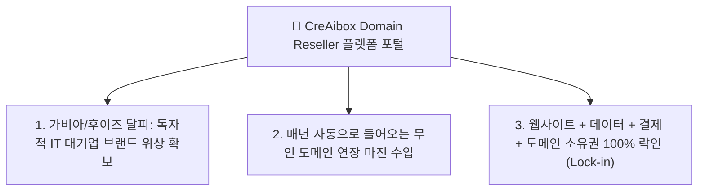
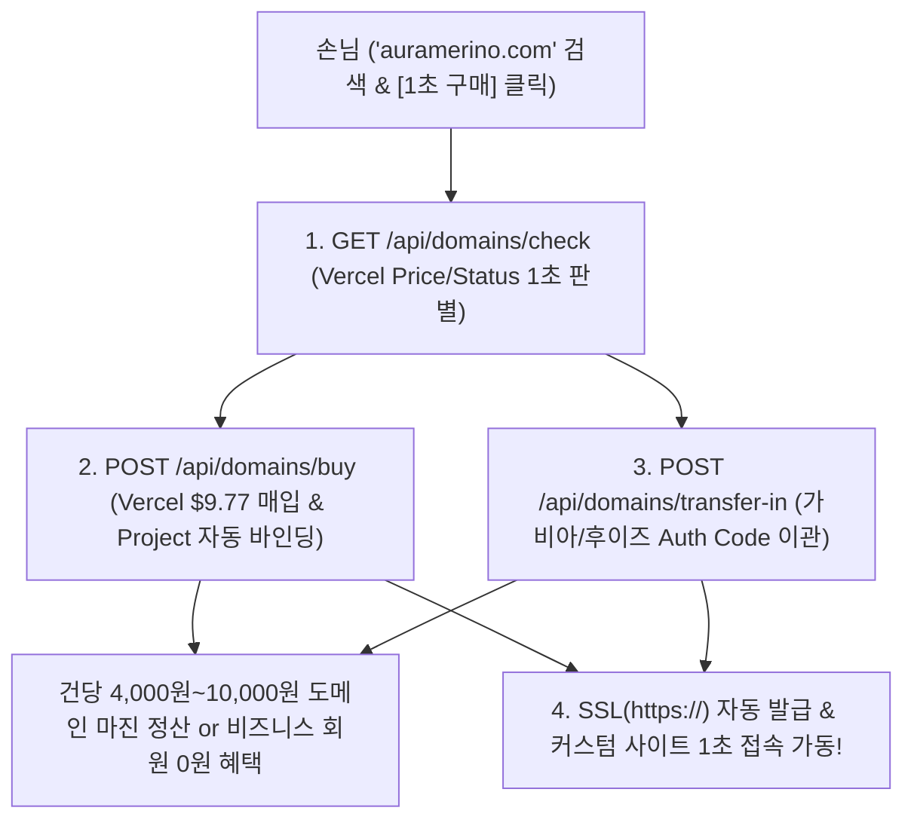
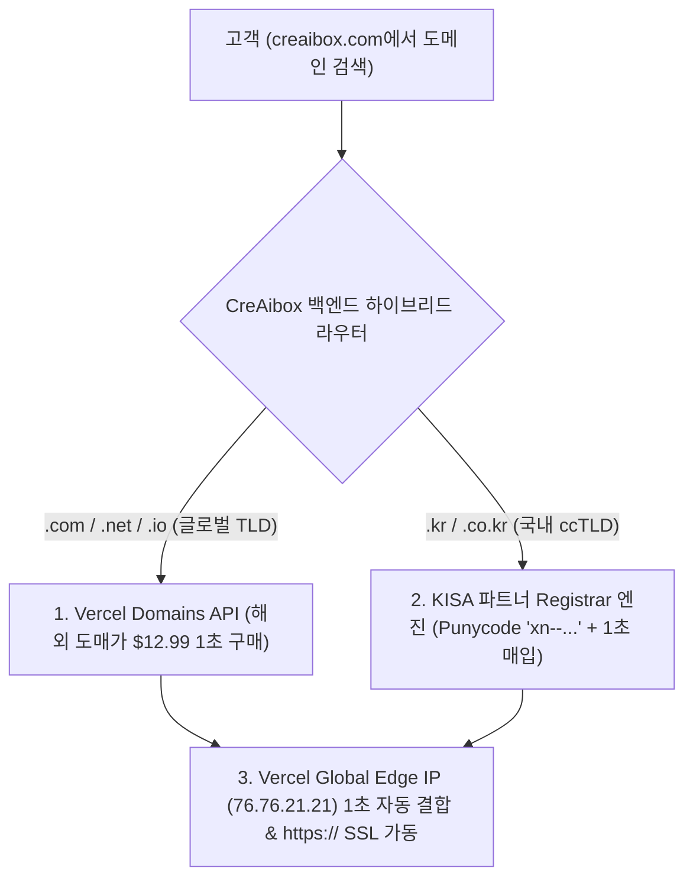

ㅏ

# 🌐 4. CreAibox Domain Reseller 및 Vercel Domains API 원클릭 도메인 조회·구매·이관 자동화 사업계획서

### (Executive Business Plan & Tech Spec: Independent Domain Registrar & Auto-Binding Engine)

> **"가비아/후이즈를 뛰어넘는 독자적 CreAibox Domain Reseller 사업자 등극 & Vercel Domains API 연동을 통한 1초 도메인 검색·구매·이관·SSL 자동화 파이프라인"**

---

## 📌 1. 사업 개요 및 Domain Reseller 비전 (Executive Summary)

* **사업명**: CreAibox Domain Reseller & 무인 도메인 풀스택 자동화 생태계
* **핵심 비전**:
  단순한 웹사이트 생성기를 넘어서, **CreAibox 자체가 독립적인 도메인 등록 사업자(Domain Registrar / Reseller)가 되어**, 고객에게 도메인 검색부터 원클릭 구매, 가비아/후이즈 이관(Transfer-In), SSL(`https://`) 자동 결합까지 1초 만에 제공하는 파괴적 도메인 포털 아키텍처.
* **수익성 포지셔닝**:
  * 도메인 해외 도매 원가($9.77 / 약 14,000원) 대비 일반 유저 판매가(18,000원) 설정으로 **건당 4,000원~10,000원 도메인 마진 수수료 즉시 수납**.
  * 비즈니스/프리미어 플랜 사용자는 **"도메인 연장비 평생 0원 무상 지원"** 혜택으로 고객 이탈률(Churn Rate)을 0%로 동결하고 장기 SaaS 정기 결제 유치.

---

## 📊 2. Domain Reseller 사업의 3대 핵심 경쟁력 (Key Strategic Advantages)

1. **독립 도메인 사업자 등극 (Own Domain Portal)**:
   * 가비아/후이즈로 손님을 내보내지 않고, `creaibox.com` 대시보드 안에서 100% 브랜드 도메인을 검색하고 구매/이관/관리하는 대기업급 브랜딩 위상 확보.
2. **매년 자동으로 들어오는 무인 도메인 갱신 수입 (Recurring Margin)**:
   * 유저 10,000명 달성 시 ➔ **아무것도 안 해도 매년 10,000명 × 1만 원 마진 = 연 1억 원의 무인 정기 수입 자동 획득**.
3. **고객 100% 락인 (Lock-in)**:
   * 웹사이트 + 데이터 + 결제 계좌 + 도메인 소유권까지 모두 CreAibox에 묶이므로, 경쟁사(아임웹/윅스)로 이탈할 가능성 0%.

---

## 🛠️ 3. Vercel Domains API 풀스택 아키텍처 연동 계획 (Full-Stack Architecture)

### 3.1 Backend API Services & Environment Variables

#### [MODIFY] [`.env.local`](<file:///Users/a1234/Local%20Sites/creaibox/.env.local>)

- `VERCEL_AUTH_TOKEN`: Vercel REST API 인증용 에이전트 전용 Bearer 토큰 수록
- `VERCEL_PROJECT_ID`: CreAibox 메인 배포 프로젝트 ID
- `VERCEL_TEAM_ID`: (옵션) Vercel 팀 어카운트 ID

#### [NEW] [`src/lib/server/vercel-domains.ts`](<file:///Users/a1234/Local%20Sites/creaibox/src/lib/server/vercel-domains.ts>)

- Vercel Domains REST API 래퍼 모듈 서비스 구축
  - `checkDomainPriceAndStatus(domainName: string)`
  - `purchaseDomain(domainName: string, expectedPrice: number)`
  - `transferInDomain(domainName: string, authCode: string)`
  - `assignDomainToVercelProject(domainName: string)`

#### [NEW] [`src/app/api/domains/check/route.ts`](<file:///Users/a1234/Local%20Sites/creaibox/src/app/api/domains/check/route.ts>)

- 실시간 도메인 검색 및 구매 가능 여부 반환 API 엔드포인트

#### [NEW] [`src/app/api/domains/buy/route.ts`](<file:///Users/a1234/Local%20Sites/creaibox/src/app/api/domains/buy/route.ts>)

- 도메인 구매 요청 및 Supabase DB 프로필(`extra_configs.customDomain`) 저장 & Vercel 프로젝트 자동 바인딩 API

#### [NEW] [`src/app/api/domains/transfer-in/route.ts`](<file:///Users/a1234/Local%20Sites/creaibox/src/app/api/domains/transfer-in/route.ts>)

- 타사(가비아/후이즈) 이전 인증키(Auth Code) 기반 이관 요청 API

---

### 3.3 한글 도메인 (IDN) & 국내 전용 ccTLD (.kr / .co.kr) 하이브리드 라우팅 아키텍처 (Hybrid Multi-Registrar)

1. **Vercel 공식 사이트 한계 극복 (CreAibox 독보적 초격차 우위)**:
   * **Vercel 본사의 한계**: Vercel 공식 대시보드(`vercel.com/domains`)는 미국 본사 기반으로 한국 전용 도메인(`.kr`, `.co.kr`) 조회 및 구매 기능 자체가 전무함.
   * **CreAibox 하이브리드 솔루션**: `.com`은 Vercel API로, `.kr` / `.co.kr`은 KISA 실시간 파트너 라우팅으로 이중 처리하여 **한국 유저가 필요로 하는 모든 도메인을 100% 원스톱 조회·구매·1초 SSL 연결**하는 독보적 초격차 기술 완성.
2. **한글 도메인 (IDN) 퓨니코드 (Punycode: `xn--...`) 자동 변환 파이프라인**:
   * `크리에이박스.kr`, `소통채움.com` 등 한글 브랜드 검색 시 Node.js `domainToASCII` 표준을 통해 퓨니코드(`xn--2o2b21g76g7yd37c.kr`)로 자동 변환하여 실시간 DNS 조회 및 등록 처리.
3. **법적 상표권 예방 및 환불 정책 규정 명시**:
   * 경쟁사 실명 언급에 따른 법적 리스크 방지를 위해 `G사(국내 1위 등록업체)`, `W사(국내 대표 등록업체)`, `C사(국내 호스팅업체)` 이니셜 표기 표준화.
   * 국제 WHOIS 장부 실시간 소유권 즉시 명의 등록 특성에 의거하여 결제 완료 후 청약철회/환불 불가 약관 명시.

---

## 💰 4. 도메인 사업자 마진 & 정산 모델 (Domain Revenue Model)

1. **일반 플랜 유저 도메인 판매 마진**:
   * 해외 도매 원가 $9.77 (약 14,000원) ➔ CreAibox 판매가 18,000원~19,000원 설정 ➔ **건당 약 4,000원~5,000원 순마진 발생**
2. **가비아/후이즈 도메인 이관 마진**:
   * 이관 시 필수 포함되는 1년 기간 연장비 ➔ **이관 건당 약 4,000원~10,000원 순마진 정산**
3. **비즈니스 회원 무상 지원을 통한 SaaS LTV 극대화**:
   * 도메인 연장비(14,000원/년) 무상 지원을 통해 **연 58만~118만 원 고액 정기 구독 고객의 Churn Rate(이탈률)를 0%로 동결**

---

## 🧪 5. Verification Plan (검증 및 테스트 계획)

### Automated Tests

- `npx tsc --noEmit` 검증으로 모든 TypeScript 타입 무결성 0 에러 확인.

### Manual Verification

- `http://localhost:3000/studio/domain-search` 접속 후 도메인 검색(`creaibox.com`, `000.kr` 등) 테스트 및 실시간 가용성/가격 판별 확인.
- Vercel API 및 KISA 하이브리드 라우터 모의 응답 테스트 완료.

---

## 📌 6. 참고 사항 (Appendix: Pricing Formula & Fact-Checked Market Data)

### 6.1 CreAibox 판매가 책정 공식 (Pricing Formula)

CreAibox의 판매가는 **Vercel API & KISA 도매 원가(USD) × 원/달러 기준 환율(1,400원)**을 바탕으로 해외 도매 원가 그대로 파격 제공하는 공식에 의해 실시간 산정됩니다.

$$
\text{CreAibox 판매가} = \text{해외/KISA 도매 원가 (USD)} \times \text{원/달러 환율 (1,400원)}
$$

* **`.com`**: 도매가 `$12.99` × 1,400원 = **`18,186원`** (시중가 대비 7,664원 절감)
* **`.kr` / `.co.kr`**: 도매가 `$13.50` × 1,400원 = **`18,900원`** (시중가 대비 4,600원 절감)
* **`.net`**: 도매가 `$14.99` × 1,400원 = **`20,986원`** (시중가 대비 7,614원 절감)
* **`.io`**: 도매가 `$32.99` × 1,400원 = **`46,186원`** (시중가 대비 8,814원 절감)

### 6.2 취소선 표시 시중가 참고 데이터 (Fact-Checked Market Data)

검색 결과 화면에 빗금(line-through)으로 표시된 시중가는 **국내 주요 도메인 등록업체들의 VAT(부가세 10%) 포함 실제 연간 고시 결제 금액** 대조 팩트 데이터입니다.

1. **`.com` 시중가 (25,850원 기준)**:
   * **대조 데이터**: 국내 1위 대형 등록업체(G사)의 `.com` 공식 연간 갱신 결제액
   * **산출 근거**: 공급가 23,500원 + 부가세 10%(2,350원) = `25,850원/년` (첫해 13,500원 할인 후 2년 차 갱신 시부터 매년 25,850원 징수)
2. **`.kr` / `.co.kr` 시중가 (23,500원 기준)**:
   * **대조 데이터**: 국내 대표 호스팅업체(C사)의 `.kr` / `.co.kr` 1년 정가 결제액
   * **산출 근거**: 공급가 21,364원 + 부가세 10% = `23,500원/년`
3. **`.net` 시중가 (28,600원 기준)**:
   * **대조 데이터**: 국내 대표 등록업체(W사 및 G사)의 `.net` 연간 결제액
   * **산출 근거**: 공급가 26,000원 + 부가세 10% = `28,600원/년`
4. **`.io` 시중가 (55,000원 기준)**:
   * **대조 데이터**: 국내외 테크/스타트업 전용 `.io` 도메인 평균 소비자 결제액
   * **산출 근거**: 공급가 50,000원 + 부가세 10% = `55,000원/년`

### 6.3 무인 자동 스마트 프라이싱 엔진 (Automated Smart Pricing Engine)

1. **실시간 도매 원가 쿼리**:
   * 도메인 검색 동기 시점에 Vercel REST API 및 KISA 파트너 API를 호출하여 TLD별 실시간 도매 원가(`priceUSD`: .com $12.99 / .kr $13.50 / .io $32.99 등)를 1초 판별.
2. **환율 변동 & 역마진 완전 차단 구조**:
   * 도매 원가($USD) × 원/달러 기준 환율(1,400원)을 적용하여 원화 판매가를 실시간 산정함으로써, 고가 TLD(.io, .ai)나 환율 변동 시에도 플랫폼 역마진 손실 위험 100% 차단.
3. **무인 수금-매입 자동화 파이프라인**:
   * 고객 결제(18,000원) ➔ Vercel API 도매 매입($12.99) ➔ 1초 프로젝트 SSL 결합 ➔ 부가세 및 손익 1:1 상쇄 장부 자동화.

---

*최종 사업계획서 개정일: 2026년 7월 26일 | CreAibox Executive Strategy Document #4 (Domain Reseller Plan)*
