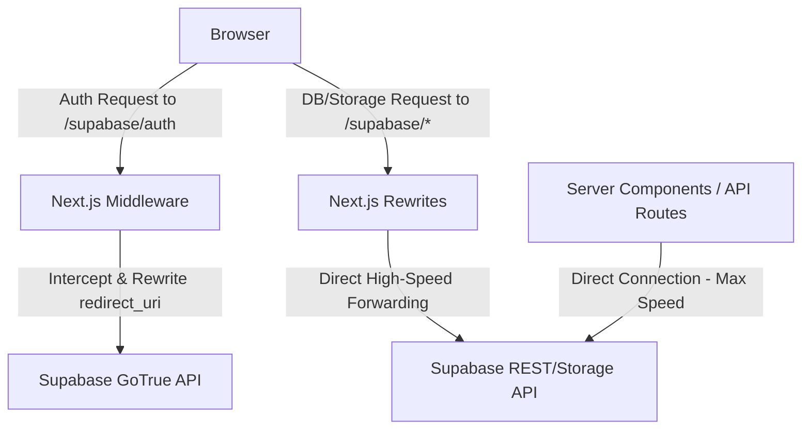

# Supabase Custom Domain Proxy Guide (Vercel Hybrid Proxy)

This document explains the architecture, implementation, and external configuration for the **Vercel Hybrid Proxy** setup. This architecture maps Supabase authentication and API requests to your own brand domain (`creaibox.com`) for free without requiring a Supabase Pro Plan or changing your DNS nameservers.

---

## Architecture Overview

To achieve perfect branding on the Google/Kakao OAuth consent screens (showing **"Logging in to creaibox.com"** instead of `supabase.co`) at **$0 cost**, the project implements a **Vercel Hybrid Proxy**:



### Why We Chose This Over Cloudflare Workers
1. **Zero DNS / Nameserver Changes**: Since the domain `creaibox.com` was purchased and is managed on Vercel, using Cloudflare would require transferring nameservers. This hybrid proxy runs 100% inside Vercel.
2. **Zero Extra Latency for Server Queries**: All server-side queries (Server Components, Server Actions, API Routes) continue to talk **directly** to the Supabase endpoint (`https://dkblalbnykgpksurdace.supabase.co`).
3. **No Storage/Payload Bottlenecks**: Only the lightweight OAuth authentication endpoint is intercepted by the Next.js Middleware. Large file uploads and heavy database queries bypass the middleware and are routed at the infrastructure level via `next.config.ts` rewrites.

---

## Implementation Details

The hybrid proxy is fully implemented in the codebase across three files:

### 1. Route Forwarding ([next.config.ts](file:///Users/a1234/Local%20Sites/creaibox/next.config.ts))
Rewrites all `/supabase/:path*` requests to the actual Supabase project endpoint at the infrastructure routing layer:
```typescript
async rewrites() {
  return [
    {
      source: "/supabase/:path*",
      destination: "https://dkblalbnykgpksurdace.supabase.co/:path*",
    },
  ];
}
```

### 2. Redirect Interception ([src/middleware.ts](file:///Users/a1234/Local%20Sites/creaibox/src/middleware.ts))
Intercepts the OAuth initialization redirect (302) and rewrites the `redirect_uri` parameter from `supabase.co` to `creaibox.com/supabase`:
```typescript
if (request.nextUrl.pathname.startsWith("/supabase/auth/v1/authorize")) {
  const supabaseHost = "dkblalbnykgpksurdace.supabase.co";
  const requestHeaders = new Headers(request.headers);
  requestHeaders.set("x-forwarded-host", request.headers.get("host") || "");
  requestHeaders.set("host", supabaseHost);

  const realPath = request.nextUrl.pathname.replace(/^\/supabase/, "");
  const targetUrl = new URL(realPath + request.nextUrl.search, `https://${supabaseHost}`);

  const proxyResponse = await fetch(targetUrl.toString(), {
    method: request.method,
    headers: requestHeaders,
    redirect: "manual",
  });

  if (proxyResponse.status === 302) {
    const location = proxyResponse.headers.get("location");
    if (location && location.includes(supabaseHost)) {
      const currentHost = request.headers.get("host") || "";
      const newLocation = location.replace(supabaseHost, `${currentHost}/supabase`);
      
      const responseHeaders = new Headers(proxyResponse.headers);
      responseHeaders.set("location", newLocation);

      return new NextResponse(null, { status: 302, headers: responseHeaders });
    }
  }
  return proxyResponse;
}
```

### 3. Dynamic Client Targeting ([src/utils/supabase/client.ts](file:///Users/a1234/Local%20Sites/creaibox/src/utils/supabase/client.ts))
Automatically detects the environment. The browser client targets the local `/supabase` proxy path, while Server Components continue to connect directly to the high-speed Supabase URL:
```typescript
const url = typeof window !== 'undefined'
  ? window.location.origin + '/supabase'
  : process.env.NEXT_PUBLIC_SUPABASE_URL!;
```

---

## Required External Configurations

To complete the setup, you must register the new callback URLs in your developer consoles.

### 1. Google Cloud Console (OAuth 2.0)
1. Go to [Google Cloud Console](https://console.cloud.google.com/) -> **APIs & Services** -> **Credentials**.
2. Edit your OAuth 2.0 Client ID.
3. In **Authorized redirect URIs**, add both local and production proxied callback URLs:
   * **Local Development**: `http://localhost:3000/supabase/auth/v1/callback`
   * **Production**: `https://creaibox.com/supabase/auth/v1/callback`
4. Save the changes.

### 2. Kakao Developers Console
1. Go to [Kakao Developers](https://developers.kakao.com/) -> **My Application** -> **Product Settings** -> **Kakao Login**.
2. In the **Redirect URI** section, register:
   * **Local Development**: `http://localhost:3000/supabase/auth/v1/callback`
   * **Production**: `https://creaibox.com/supabase/auth/v1/callback`
3. Save the changes.

### 3. Supabase Dashboard
1. Go to the [Supabase Dashboard](https://supabase.com/dashboard/) -> **Authentication** -> **URL Configuration**.
2. Set **Site URL** to your primary site (e.g., `https://creaibox.com` or `http://localhost:3000` during local testing).
3. Under **Redirect URLs**, add:
   * `https://creaibox.com/**`
   * `http://localhost:3000/**` (for local development)

---

## Environmental Variables (No Changes Needed)

Because of the **Dynamic Client Targeting** implementation, you **do not** need to change the environment variables. 

Keep them pointing directly to the Supabase endpoint in both your local `.env.local` and your Vercel Dashboard:
```env
NEXT_PUBLIC_SUPABASE_URL=https://dkblalbnykgpksurdace.supabase.co
```
This ensures maximum performance and zero configuration overhead during deployments.
