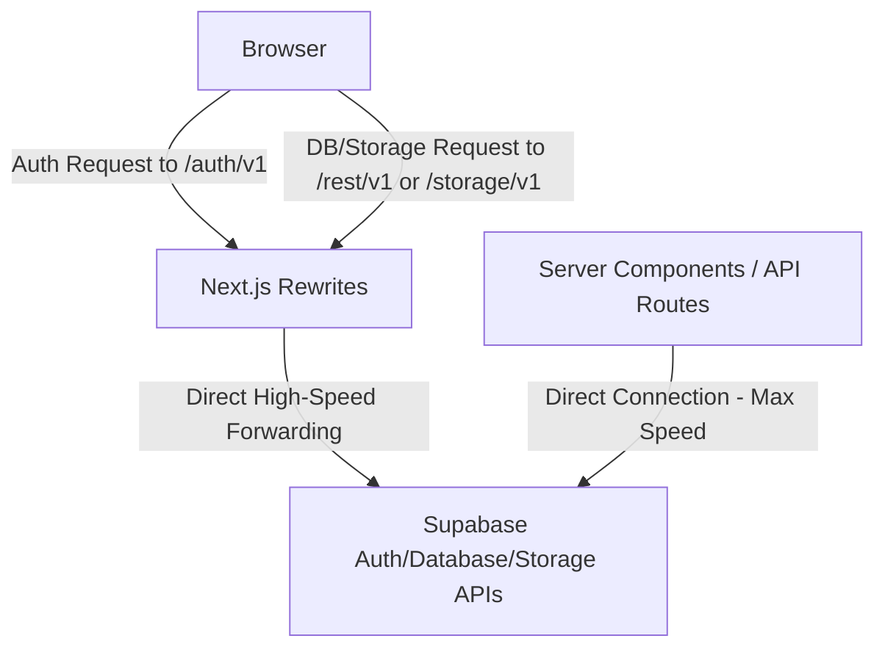

# Supabase Custom Domain Proxy Guide (Vercel Standard Proxy)

This document explains the architecture, implementation, and external configuration for the **Vercel Standard Proxy** setup. This architecture maps Supabase authentication, database, and storage requests directly to your own brand domain (`creaibox.com`) for free, mirroring Supabase's native custom domain feature without requiring a Supabase Pro Plan or changing your DNS nameservers.

---

## Architecture Overview

To achieve perfect branding on the Google/Kakao OAuth consent screens (showing **"Logging in to creaibox.com"** instead of `supabase.co`) at **$0 cost**, the project implements a **Vercel Standard Proxy**:



### Why This is the Ultimate Solution
1. **Zero DNS / Nameserver Changes**: Runs 100% inside Vercel without transferring your domain nameservers away from Vercel.
2. **Standard Host Header Consistency**: By mapping standard endpoints (`/auth/v1`, `/rest/v1`, `/storage/v1`) directly on the root of your domain (without path prefixes like `/supabase`), Vercel automatically forwards the correct, standard `X-Forwarded-Host` header (`creaibox.com` or `localhost:3000`). This ensures that Google/Kakao token exchanges succeed with zero errors.
3. **Zero Middleware Overhead**: Eliminates the need to intercept and modify redirects in Next.js Middleware. Vercel's infrastructure-level rewrites handle everything at maximum speed with zero CPU overhead.
4. **Zero Extra Latency for Server Queries**: All server-side queries (Server Components, Server Actions, API Routes) continue to talk **directly** to the Supabase endpoint (`https://dkblalbnykgpksurdace.supabase.co`).

---

## Implementation Details

The proxy is fully implemented in the codebase across two files:

### 1. Route Forwarding ([next.config.ts](file:///Users/a1234/Local%20Sites/creaibox/next.config.ts))
Maps the standard Supabase endpoints directly at the infrastructure routing layer:
```typescript
async rewrites() {
  return [
    {
      source: "/auth/v1/:path*",
      destination: "https://dkblalbnykgpksurdace.supabase.co/auth/v1/:path*",
    },
    {
      source: "/rest/v1/:path*",
      destination: "https://dkblalbnykgpksurdace.supabase.co/rest/v1/:path*",
    },
    {
      source: "/storage/v1/:path*",
      destination: "https://dkblalbnykgpksurdace.supabase.co/storage/v1/:path*",
    },
  ];
}
```

### 2. Dynamic Client Targeting ([src/utils/supabase/client.ts](file:///Users/a1234/Local%20Sites/creaibox/src/utils/supabase/client.ts))
Automatically detects the environment. The browser client targets the standard paths on the current origin, while Server Components connect directly to the high-speed Supabase URL:
```typescript
const url = typeof window !== 'undefined'
  ? window.location.origin
  : process.env.NEXT_PUBLIC_SUPABASE_URL!;
```

---

## Required External Configurations

To complete the setup, you must register the new callback URLs in your developer consoles.

### 1. Google Cloud Console (OAuth 2.0)
1. Go to [Google Cloud Console](https://console.cloud.google.com/) -> **APIs & Services** -> **Credentials**.
2. Edit your OAuth 2.0 Client ID.
3. In **Authorized redirect URIs**, add both local and production callback URLs:
   * **Local Development**: `http://localhost:3000/auth/v1/callback`
   * **Production**: `https://creaibox.com/auth/v1/callback`
4. Save the changes.

### 2. Kakao Developers Console
1. Go to [Kakao Developers](https://developers.kakao.com/) -> **My Application** -> **Product Settings** -> **Kakao Login** -> **플랫폼 키**.
2. Under your **REST API Key** details, register both callback URLs:
   * **Local Development**: `http://localhost:3000/auth/v1/callback`
   * **Production**: `https://creaibox.com/auth/v1/callback`
3. Save the changes.

### 3. Supabase Dashboard
1. Go to the [Supabase Dashboard](https://supabase.com/dashboard/) -> **Authentication** -> **URL Configuration**.
2. Set **Site URL** to your primary site (e.g., `https://creaibox.com` or `http://localhost:3000` during local testing).
3. Under **Redirect URLs**, add:
   * `https://creaibox.com/**`
   * `http://localhost:3000/**` (for local development)

---

## Environmental Variables (No Changes Needed)

Keep them pointing directly to the Supabase endpoint in both your local `.env.local` and your Vercel Dashboard:
```env
NEXT_PUBLIC_SUPABASE_URL=https://dkblalbnykgpksurdace.supabase.co
```
This ensures maximum performance and zero configuration overhead during deployments.
