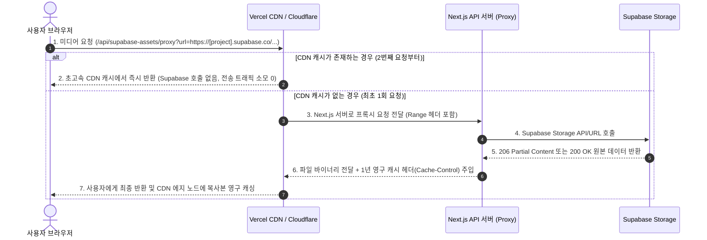

# Supabase Storage CDN Caching Proxy Architecture

이 문서는 CreAibox 서비스에서 Supabase Storage를 타겟 스토리지로 사용할 때 발생하는 Egress 대역폭 요금 폭탄을 방지하고, 글로벌 에지 캐싱 및 스트리밍을 구현하기 위해 설계된 **"Supabase Storage + Next.js 캐싱 프록시"** 아키텍처 명세서입니다.

---

## 1. 개요 및 설계 목적

Supabase Storage는 대용량 미디어를 손쉽게 관리할 수 있는 버킷 솔루션을 제공하지만, 외부 비로그인 방문자 대상의 무료 공유 파일이나 대형 미디어를 직접 주소(Public URL)로 서빙할 경우 다음과 같은 치명적인 문제가 발생할 수 있습니다.

1. **대역폭(Egress) 송신 비용 폭탄**: Supabase 무료 요금제는 Egress 한도가 매우 낮고, 상용 전환 시 월별 대역폭 요금이 무섭게 누적될 수 있습니다.
2. **미디어 재생기 Seeking(탐색) 지원의 한계**: 단순 이미지 외에 오디오/비디오 스트리밍을 제공할 때 브라우저의 Range 요청을 안전하게 중계하지 않으면 타임라인 스크롤 시 재생이 끊어지는 현상이 발생합니다.

이를 해결하기 위해 **Next.js API 프록시 서버를 게이트웨이로 두고, 그 앞단에 글로벌 에지 CDN 캐시(Vercel CDN 또는 Cloudflare)를 주입하는 전용 캐싱 파이프라인**을 구축하였습니다.

---

## 2. 데이터 흐름도



---

## 3. 핵심 구현 및 명세

### 3.1 전용 프록시 API 라우트
* **파일 경로**: [src/app/api/supabase-assets/proxy/route.ts](file:///Users/a1234/Local%20Sites/creaibox/src/app/api/supabase-assets/proxy/route.ts)
* **주요 작동 메커니즘**:
  * **HTTP 영구 캐싱 전략**: 구글 드라이브 캐싱과 매치되도록 응답 헤더에 `Cache-Control: public, max-age=31536000, immutable` (1년 영구 캐시)를 주입합니다. 이를 통해 Supabase 스토리지 Egress 비용을 전면 0원화합니다.
  * **스트리밍 미디어 Range 헤더 중계**: 오디오 및 비디오 플레이어의 타임라인 이동(Seeking)이 완벽하게 지원되도록 `Accept-Ranges`, `Content-Length`, `Content-Range` 및 `206 Partial Content` 상태 코드를 Supabase 저장소로부터 안전하게 포워딩하여 브라우저에 중계 전달합니다.

---

## 4. 실무 사용 가이드

Supabase Storage에 저장된 이미지나 미디어를 페이지 내에 출력할 때 다음 규칙을 적용하여 호출합니다.

### 4.1 호출 주소 변경
* **기존 직접 주소**: 
  `https://[project-ref].supabase.co/storage/v1/object/public/theme-templates/travel/sunset.jpg`
* **프록시 적용 주소**: 
  `/api/supabase-assets/proxy?url=https://[project-ref].supabase.co/storage/v1/object/public/theme-templates/travel/sunset.jpg`

```typescript
// React Component 적용 예시
const imageSrc = `/api/supabase-assets/proxy?url=${encodeURIComponent(supabaseUrl)}`;
return ;
```

---

## 5. 하이브리드 저장소 분할 전략 및 아키텍처 결정 사항 (중요)

CreAibox의 확장 가능한 자산 서빙을 위해 관리자와 가입 사용자의 유즈케이스에 맞춰 저장소 역할을 다음과 같이 이중 분담(하이브리드)합니다.

### 5.1 역할 분담 구조
* **마스터 테마 디자인 이미지 (관리자용)**: 
  - **저장소**: **Google Drive** (`creaibox-homepage-thema-images` 폴더)
  - **이유**: 대용량 에셋의 비용 효율적 무료 아카이빙(20TB 용량 프리), 로컬 동기화 탐색기를 활용한 대량 드래그 앤 드롭 관리 편의성 극대화.
* **고객 개별 커스텀 이미지 (가입자 빌더 편집용)**:
  - **저장소**: **Supabase Storage** (`user-sites` 또는 `user-custom-assets` 버킷)
  - **이유**: 사용자별 RLS(Row Level Security) 정책을 통한 완전한 파일 액세스 권한 격리 및 보안 확보, 웹 브라우저에서 인라인 업로드 시 초고속 응답 속도 및 쾌적한 UX 구현.

### 5.2 Egress 트래픽 방어 프로토콜
두 저장소에 대한 조회 경로 모두 Next.js 캐싱 프록시 서버(`api/free-assets/proxy` 및 `api/supabase-assets/proxy`)를 통해 에지 CDN(Vercel CDN / Cloudflare)에 1년 영구 캐싱되도록 강제함으로써, 대용량 트래픽이 집중되더라도 양쪽 저장소의 Egress 전송 요금을 모두 0원에 가깝게 완벽하게 실시간 방어합니다.

