# 유튜브 급상승 영상 AI 데이터 분석 리포트 가이드

본 문서는 크리에이박스(CreAibox) 플랫폼의 유튜브 급상승 인기 비디오 메타데이터를 활용한 **시청자 반응률 분석 및 Gemini AI 트렌드 분석 보고서(AI 데이터 분석 리포트) 시스템**의 아키텍처, 2중 캐싱 기전, API 연동 세부 스펙을 상세히 다룹니다.

---

## 1. 시스템 아키텍처 개요

AI 데이터 분석 리포트 시스템은 사용자가 급상승 영상 목록 카드에서 `AI 데이터 분석 리포트` 버튼을 클릭할 때 작동하며, 유튜브 Live API 할당량을 소모하지 않고 **백엔드의 2중 캐시 엔진과 어드민 Gemini 모델의 결합**을 통해 크리에이터용 바이럴 인사이트를 0.01초 내로 제공합니다.

### 1.1 서비스 통신 시퀀스 (Communication Flow)

```mermaid
sequenceDiagram
    autonumber
    actor Creator as 크리에이터 (브라우저)
    participant Client as RisingVideos / Modal (프론트)
    participant API as analyze API Route (백엔드)
    participant Mem as In-Memory Cache (서버 메모리)
    participant DB as Supabase DB (youtube_video_analysis)
    participant AI as Gemini AI Engine (공용 API Key)

    Creator->>Client: "AI 데이터 분석 리포트" 클릭
    Client->>API: POST /api/youtube/analyze { videoId, metadata }
    
    rect rgb(20, 20, 30)
        note right of API: 1차 메모리 캐시 탐색 (TTL 24h)
        API->>Mem: get(cleanVideoId)
        alt Memory Cache Hit (최고속 10ms)
            Mem-->>API: 분석 리포트 반환
            API-->>Client: { cached: true, content, source: "memory" }
        else Memory Cache Miss
            API->>DB: 2차 DB 캐시 테이블 조회
            alt DB Cache Hit (0.1초 내외)
                DB-->>API: cachedRow.analysis_content
                API->>Mem: 메모리 동기화 적재
                API-->>Client: { cached: true, content, source: "db" }
            else DB Cache Miss (최초 분석)
                API->>AI: Gemini Pro API 호출 (관리자 공용 키)
                AI-->>API: 바이럴 리포트 텍스트 생성 완료
                API->>Mem: 메모리 캐시 강제 적재 (Upsert)
                API->>DB: Supabase 캐시 테이블 Upsert 기록
                API-->>Client: { cached: false, content }
            end
        end
    end
    
    Client-->>Creator: 반응률 그래프 및 AI 마크다운 리포트 시각화
```

---

## 2. 핵심 분석 지표 및 공식

AI 리포트 모달은 비디오의 누적 조회수를 기준으로 **단순 절대치 비교를 넘어 시청자 참여 정밀도**를 백분율 스케일로 연산하여 시인성 높은 프로그레스 바로 제공합니다.

### 2.1 조회수 대비 좋아요 비율 (Like-to-View Ratio)
* **연산 공식**: `(statistics.likeCount / statistics.viewCount) * 100`
* **반응도 평가지표**:
  * **8.0% 이상**: **`초바이럴 (탁월)`** (시청자가 수동적으로 보기만 한 것이 아니라 능동적으로 긍정을 표시한 매우 드문 흥행군)
  * **5.0% ~ 8.0%**: **`우수 반응 (성공적)`** (콘텐츠 흡입력이 높아 시청 만족도가 높은 상태)
  * **2.0% ~ 5.0%**: **`보통 (안정적)`** (유튜브 카테고리 내의 표준적인 반응률 범주)
  * **2.0% 미만**: **`낮음 (개선 필요)`** (조회수 유입 대비 시청 만족도나 후킹 요소 보완이 필요한 상태)

### 2.2 조회수 대비 댓글 소통 비율 (Comment-to-View Ratio)
* **연산 공식**: `(statistics.commentCount / statistics.viewCount) * 100`
* **소통도 평가지표**:
  * **0.5% 이상**: **`극도로 활발`** (본문 질문, 논쟁, 의견 공유 등 2차 참여가 활성화된 영상)
  * **0.2% ~ 0.5%**: **`활발한 소통`** (댓글 반응군이 원활하게 소통하고 있는 상태)
  * **0.2% 미만**: **`일반 소통`** (단순 시청 위주의 일반적인 소통 강도)

---

## 3. Gemini AI 생성 가이드라인

최초 수집(Cache Miss) 시 백엔드는 크리에이박스 관리자 API 금고(`admin_api_vault`)에서 복호화해 낸 시스템 전용 공용 Gemini API 키를 로테이션하여 사용합니다.

### 3.1 AI 프롬프트 분석 3대 영역
Gemini 모델(`gemini-3.1-flash-lite`)에 주입되는 전문 분석 프롬프트는 아래 3대 요소를 마크다운 소제목 서식으로 도출하도록 지시합니다:

1. **시청자를 매료한 핵심 바이럴 요인 (Viral Code)**:
   * 어떤 대중 심리, 제목 및 썸네일 어그로 공식, 실시간 트렌드 타겟팅을 통과했는지 수석 기획자 어조로 고찰합니다.
2. **타겟 키워드 및 태그의 알고리즘 유효성 (Keyword & Tag Engine)**:
   * 영상 제목의 키워드 형태와 해시태그 목록이 추천/검색 알고리즘 연관 가치에 어떠한 도움을 주었는지 기술적 효용을 짚어냅니다.
3. **내 채널을 위한 크리에이박스 변형 기획안 (Remix Blueprint)**:
   * 일반 1인 크리에이터가 이 대박 기획(구성 앵글, 초반 3초 후킹 장치, 화면 연출)을 무단 표절하지 않고 독창적으로 모방/변형하여 자신의 채널에 접목할 수 있는 **Remix 기획 시나리오 예시**를 가이드라인으로 제공합니다.

---

## 4. 2중 캐시 엔진 (Dual Caching Layer)

네트워크 단절이나 데이터베이스 세팅 미비, 권한 예외 등에도 유연하게 대처하고 쿼터 및 속도 손실을 완전히 막기 위해 백엔드에 2중 캐시를 이식했습니다.

* **1차: In-Memory Cache (서버 프로세스 전용)**:
  * 서버의 가상 메모리 내에 글로벌 `Map` 인스턴스로 관리되며, 검색 및 데이터 반환에 **0.001초(1ms ~ 15ms)** 대기 시간을 보장하여 브라우저 로딩 체감을 제거합니다.
  * 서버 핫 리로드(Hot Reload) 시 리셋되며, 운영 상태에서는 24시간(`TTL`) 보존됩니다.
* **2차: Supabase DB Cache (영구 적재)**:
  * `youtube_video_analysis` 테이블에 `video_id`를 기본키(PK)로 저장하여, 다수의 무인 자동화 스케줄러나 다중 분산 사용자가 접근할 때도 중복 호출을 막고 영구적으로 텍스트를 보존합니다.

---

## 5. 관리 및 모니터링 가이드

개발자 혹은 관리자가 실시간 캐시 작동 여부 및 DB 싱크 정합성을 추적할 수 있도록 브라우저 콘솔 및 API 응답 구조에 모니터링 플래그를 통합했습니다.

* **브라우저 콘솔 (Console) 모니터링**:
  * F12 개발자 도구 콘솔 창에서 데이터 분석 모달 실행 시 아래 로그가 출력됩니다:
    * `[AI Analysis Feed] ⚡ Memory Cache Hit` (서버 메모리 즉시 반환 상태)
    * `[AI Analysis Feed] DB Cache Hit` ( Supabase DB 캐시 스캔 후 반환 상태)
    * `[AI Analysis Feed] 🤖 Cache Miss (Gemini API Call)` (API 최초 생성 구동 상태)
* **DB 인서트 오류 모니터링**:
  * 테이블 쓰기 장애 시 클라이언트 API 응답 객체에 `dbErrorMsg` 프로퍼티를 얹어주어 콘솔에 경고(`[AI Analysis Cache Warning]`)를 즉각 노출해 주므로 백서버 터미널을 열어보지 않고도 브라우저 상에서 즉각 RLS 오류 유무를 디버깅할 수 있습니다.
